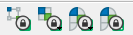
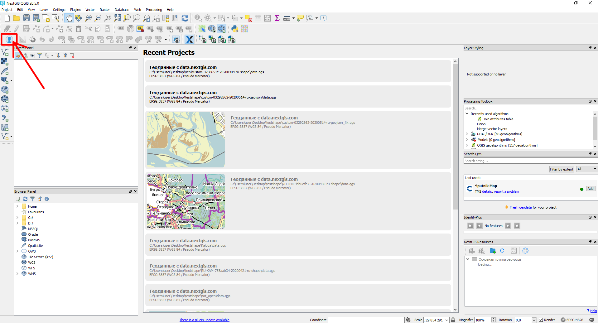
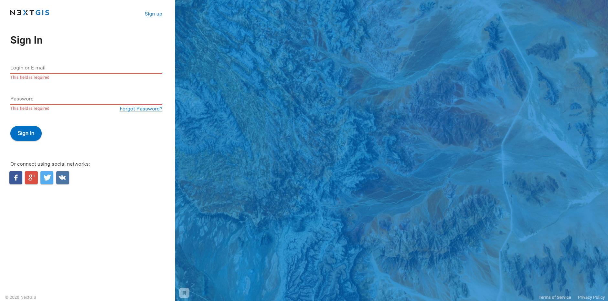
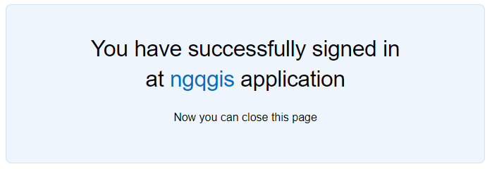
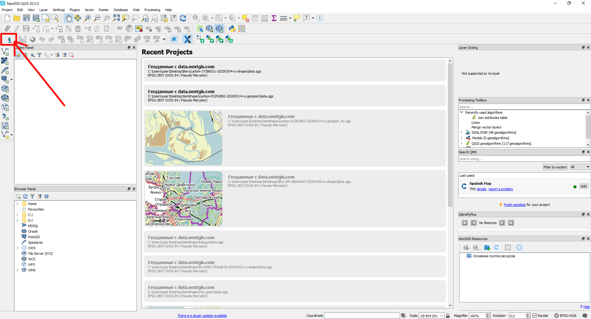

.. sectionauthor:: Роман Гайнуллов <roman.gainullov@nextgis.ru>

.. _ngqgis_auth:

Authorization
==========

To unlock additional functionality of benefits NextGIS QGIS (switch to Pro-version NextGIS QGIS), 
you must be on a `Mini or Premium <https://nextgis.com/pricing-base/>`_ plan and login.

By default, locked tools are shown like this: |blocked_tools|.

To activate the Pro-version of NextGIS QGIS you need to login with NextGIS Account Toolbar button |not_auth| 
on the toolbar (see in :numref:`acc_toolbar_deactive`).

.. |not_auth| image:: _static/auth/not_auth.png

   NextGIS QGIS interface. NextGIS Account Toolbar deactivated
   
Authorization is done via a web browser which will redirect to https://my.nextgis.com. 
On this page you need to enter your NextGIS ID or register (see in :numref:`auth_page`). 
If you have forgotten your account information, 
you can `recover <https://docs.nextgis.com/docs_ngcom/source/faq_webgis.html#i-forgot-my-account-password-nextgis-id-what-to-do>`_ your account using the same page.

   
   NextGIS ID login page
   
After entering the login and password, you will receive a message about successful authorization in NextGIS QGIS (see in :numref:`suscess_auth`), 
and access to the Pro-functions will be unlocked |ublocked_tools|.

.. |ublocked_tools| image:: _static/auth/ublocked_tools.png

NextGIS Account Toolbar button will change to  |auth| which indicates a successfully authorized user (see in :numref:`acc_toolbar_active`).

.. |auth| image:: _static/auth/auth.png

   
   Successful authorization in NextGIS QGIS

   
   NextGIS QGIS interface. NextGIS Account Toolbar activated
