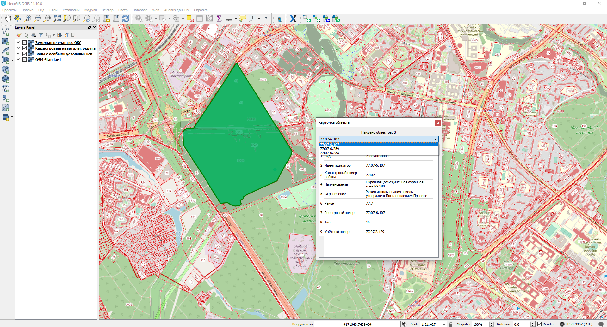

.. sectionauthor:: Роман Гайнуллов <roman.gainullov@nextgis.ru>

.. _NGQ Rosreestr Tools:

NGQ Rosreestr Tools
===================

.. important::
   На `специальной <https://nextgis.ru/blog/rr-tools-event/>`_ странице вы можете ознакомиться с онлайн-записью и материалами вебинара, посвященного работе данного модуля.

Модуль **NGQ Rosreestr Tools** предназначен для работы с кадастровыми данными и сервисами Росреестра (ЕГРН, ПКК). 

.. note::
   Данный инструмент доступен только для пользователей `плана Premium <https://nextgis.ru/nextgis-com/plans>`_ и NextGIS Web `для своего сервера <https://nextgis.ru/pricing/>`_. 
   Данный инструмент присутствует только в ПО `NextGIS QGIS <https://nextgis.ru/nextgis-qgis/>`_.

.. warning::

   NextGIS не несет ответственности за работоспособность сервисов Росреестра. Периодическая недоступность сервисов Росреестра - регулярное явление и может повлиять на работу некоторых функций модуля.

Модуль реализует следующие возможности:

* Отображение кадастровых участков, кварталов, районов, округов в виде единого растрового слоя;
* Отображение карточки объекта (участка, квартала, зоны, района, округа) при клике мышью;
* Подсветка объекта по которому отображается карточка;
* Поиск объекта по номеру и позиционирование на нем;
* Импорт данных из выписок ЕГРН (КПТ, КВЗУ, полный список);
* Сохранение объектов во временный слой при поиске и идентификации.

Для установки или обновления модуля необходимо выбрать в меню Модули ‣ Управление модулями.
Введите часть или все его название в панель Поиск (см. :numref:`list_modules`).

.. figure:: _static/list_modules.png
   :name: list_modules
   :align: center
   :width: 16cm
   
   Список установленных и доступных к загрузке модулей

Выберите в списке нужный модуль и выберите Установить модуль.

Для того, чтобы активировать возможности расширения, необходимо авторизоваться в **NextGIS Account Toolbar**, также ваш пользователь должен быть на плане Премиум (https://nextgis.ru/pricing-base).
Панель **NextGIS Account Toolbar** для неавторизованных пользователей выглядит так |not_auth|. При нажатии на иконку вам будет предложено авторизоваться в системе через браузер.

.. |not_auth| image:: _static/not_auth.png

В случае успешной авторизации иконка на панели NextGIS Account Toolbar сменится на другую |auth_icon|.

.. |auth_icon| image:: _static/auth_icon.png

После установки расширения появляется набор иконок на панели инструментов (заблокированная для неавторизованных пользователей).

Подключение кадастрового слоя
-----------------------------

Вторая иконка модуля **NGQ Rosreestr Tools** |icon_add_layers| позволяет добавлять различные слои данных Росреестра (см. :numref:`add_layers_pkk`) из публичной кадастровой карты (далее - ПКК):

.. |icon_add_layers| image:: _static/icon_add_layers.png

* слой кадастровых кварталов, округа
* слой земельных участков, ОКС (Объекты капитального строительства)
* слой зон с особыми условиями использования

.. figure:: _static/add_layers_pkk.png
   :name: add_layers_pkk
   :align: center
   
   Добавление слоёв из ПКК

.. figure:: _static/pkk_on_map.png
   :name: pkk_on_map
   :align: center
   :width: 16cm
   
   Слой кадастровых кварталов на карте

Идентификация кварталов и участков
----------------------------------

Третья иконка |identificaion_oicon| позволяет по клику на объект идентифицировать (см. :numref:`identificaion_objects`) атрибутивную информацию по:

* кадастровым кварталам
* земельным участкам
* объектам капитального строительства (ОКС)
* кадастровым округам
* зонам с особыми условиями использования территорий (ЗОУИТ)

.. |identificaion_oicon| image:: _static/identificaion_oicon.png

.. figure:: _static/identificaion_objects.png
   :name: identificaion_objects
   :align: center
   
   Идентификация объектов Росреестра
   

   
   Отображение карточки найденного объекта (ОКС) и подсветка его контура

Если в искомой точке слоя находится несколько объектов (ЗОУИТ например), то можно выбрать нужный из выпадающего списка. При идентификации объект можно сохранить в пользовательский векторный слой, а также создать специальный слой со структурой идентифицируемого объекта. Аналогично при поиске объектов: найденные объекты можно добавлять в пользовательские или специальные векторные слои (см. :numref:`ngq_identification`, :numref:`ngq_temp_layer`).

.. figure:: _static/ngq_identification.png
   :name: ngq_identification
   :align: center
   :width: 16cm
   
   Доступные опции при идентификации объекта
   
   
.. figure:: _static/ngq_temp_layer.png
   :name: ngq_temp_layer
   :align: center
   :width: 16cm
   
   Добавление объекта во временный пользовательский слой
   
Также можно скопировать запись (строку), значение отдельного атрибута или всю карточку.  

Поиск по кадастровому номеру
----------------------------

Иконка панели поиска |search_icon| позволяет находить объекты из базы данных Росреестра (см. :numref:`search_object`) по кадастровому номеру.

.. |search_icon| image:: _static/search_icon.png

.. figure:: _static/search_object.png
   :name: search_object
   :align: center
   :width: 16cm
   
   Отображение карточки найденного объекта и подсветка его контура

Процесс поиска объекта по кадастровому номеру можно посмотреть на этом `видео <https://youtu.be/ig6jreu-I9E>`_.

Импорт данных
-------------

Поддерживаемые на данный момент форматы данных ЕГРН (список расширяется):

* КПТ: `extract_cadastral_plan_territory_v01 <https://rosreestr.gov.ru/upload/Doc/10-upr/extract_cadastral_plan_territory_v01.rar>`_ 
* КПТ: `KPT_v10 <https://rosreestr.gov.ru/upload/Doc/10-upr/KPT_v10.zip>`_
* КВЗУ: `KVZU_v07 <https://rosreestr.gov.ru/upload/Doc/10-upr/KVZU_v07.zip>`_
* ОКС: `KVOKS_v03 <https://rosreestr.gov.ru/upload/Doc/10-upr/KVOKS_v03.zip>`_ 
* Выписка о характеристиках и права на земельный участок: `extract_base_params_land <https://rosreestr.gov.ru/upload/Doc/10-upr/extract_base_params_land_v01.rar>`_ 
* Выписка о земельном участке: `extract_about_property_land <https://rosreestr.gov.ru/upload/Doc/10-upr/extract_about_property_land_v01.rar>`_ 
* Выписка о ЗОУИТ: `extract_about_zone <https://rosreestr.gov.ru/upload/Doc/10-upr/extract_about_zones_v01.rar>`_ 
* Местоположения ЗОУИТ: `TerritoryToGKN <https://rosreestr.gov.ru/upload/Doc/10-upr/TerritoryToGKN_v01.rar>`_
* Решение о ЗОУИТ: `ZoneToGKN <https://rosreestr.gov.ru/upload/Doc/10-upr/ZoneToGKN_v05.rar>`_

Функция импорта выписок из ЕГРН (XML файлы) обозначена следующей иконкой |import_icon| и называется “Импорт данных ЕГРН”. При запуске этого инструмента открывается окно следующего вида (см. :numref:`import-egrn`):

.. |import_icon| image:: _static/import_icon.png

.. figure:: _static/import-egrn.png
   :name: import-egrn
   :align: center
   
   Интерфейс инструмента “Импорт данных ЕГРН”
   
В этом интерфейсе предлагается:

* Определить путь до файла XML (или ZIP-архива со вложенными XML-файлами);
* Формат выходных данных из списка (ESRI Shapefile, GPKG, MapInfo File, GeoJSON);
* Задать имя выходного набора;
* Выбрать опцию добавления импортированных файлов в проект;
* Не трансформировать координаты;
* Не добавлять объекты без геометрий.

Реализована возможность пакетного ввода данных путем обработки ZIP-архива с вложенными в него XML-файлами. При выборе ZIP-архива будут обработаны все XML-документы внутри него, включая те, что находятся во вложенных ZIP-архивах. При пакетной конвертации доступна опция объединения выписок по типам и слоям, и, соответственно, автоматического добавления сшитых слоёв в проект со стилизацией - можно  получить в NGQGIS сшитый слой из сотен выписок. Документы с кириллическими именами не допускаются и будут проигнорированы.

Данные Росреестра, как правило, имеют многослойную структуру. В связи с этим при их импорте в форматы .shp, .tab 
и .geojson программе необходимо создать не один набор выходных данных, а несколько. Имена для этих наборов 
будут выбраны автоматически - названия исходных слоёв будут добавлены к имени выходного файла, заданного пользователем. 
Например, если пользователь выбрал формат ESRI Shapefile и указал выходной путь “C:/imported/kpt_12_22.shp”, 
будут созданы файлы “C:/imported/kpt_12_22_parcels.shp”, “C:/imported/kpt_12_22_subparcels.shp” и так далее.

Поле пути для выходных данных можно оставить пустым - тогда импорт будет произведен в директорию исходного XML-документа.
При обработке ZIP-арихва будут созданы директории для каждого обнаруженного XML-документа, при пустом поле - в одной директории с архивом, при выборе имени файла - в его родительской директории.

В процессе импорта могут быть применены следующие настройки:

* **Добавить результат в проект**. Результаты импорта данных будут добавлены в проект в виде отдельных векторных слоев.
* **Не трансформировать координаты**. При выборе данной опции координаты останутся в исходном виде и не будут трансформированы в WGS 84.
* **Не добавлять объекты без геометрий**. Если в исходном наборе данных не будет записей о геометрии объекта, то он не будет обработан и не попадет в конечный результат.

Строка состояния в нижней части интерфейса будет информировать вас о ходе импорта. 
В случае успешного выполнения задачи вы увидите сообщение “Импорт данных окончен” 

.. figure:: _static/import_proc1.png
   :name: import_proc1
   :align: center

   
.. figure:: _static/import_proc2.png
   :name: import_proc2
   :align: center
   
   Процесс импорта
   
Если в процессе были получены ошибки, вы будете уведомлены о них в этой же строке состояния. 
Вы также можете получить следующее сообщение: “Импорт данных окончен. Важно: система координат не была опознана, 
данные сохранены в исходных координатах без метаданных.” Это значит, что система координат в исходных данных Росреестра 
не была опознана программным обеспечением: скорее всего, параметров целевой системы координат нет в базе данных. 
База данных систем координат постоянно пополняется.

Работа с модулем Rosreestr Tools на своем сервере
---------------------------------------------------

Некоторые функции NGQ Rosreestr Tools требуют наличия активного соединения с серверами NextGIS и без него не работают. 
Для организации подобного взаимодействия необходимо сообщить глобальным сервисам NextGIS о NextGIS Web на своем сервере 
(по умолчанию они о его существовании не знают). 

Технически, необходимо:

1. Создать глобальный аккаунт `my.nextgis.com <https://my.nextgis.ru>`_ если его еще нет.
2. Сообщить через `систему поддержки <https://nextgis.ru/terms-support>`_ о создании аккаунта, запросить перевод на Premium.
3. Дождаться уведомления о переводе на Premium.
4. Скопировать `ключ доступа <https://docs.nextgis.ru/docs_ngid/source/ngidop.html#nextgis-id-on-premise>`_ из NGID (система управления пользователями, размещающаяся на вашем сервере) и добавить его в `настройки <https://my.nextgis.com/myngidonpremises>`_ NextGIS ID on-premise.

После этого запросы из NGQ Rosreestr Tools с рабочих мест внутри корпоративной сети к глобальным сервисам NextGIS должны заработать.

.. note::
   Необходимо разрешить в локальной сети организации доступ к серверу по адресу https://geoservices.nextgis.com
   
   
   
Подключение кадастровых сервисов для NextGIS Web on-premise для работы на веб-карте
----------------------------------------------------------------------------------

Чтобы подключить функциональность кадастровых сервисов для работы на веб-картах в NextGIS Web, воспользуйтесь `этой <https://docs.nextgis.ru/docs_ngweb/source/admin_tasks.html#nextgis-web-on-premise>`_ инструкцией.
