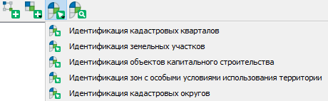

.. sectionauthor:: Роман Гайнуллов <roman.gainullov@nextgis.ru>

.. _NGQ Rosreestr Tools:

NGQ Rosreestr Tools
===================

Расширение **NGQ Rosreestr Tools** предназначен для работы с каластровыми данными Росреестра (ЕГРН, ПКК). Плагин реализует следующие возможности:

* Отображение кадастровых участков, кварталов, районов, округов в виде единого растрового слоя;
* Отображение карточки объекта (участка, квартала, зоны, района, округа) при клике мышью;
* Подсветка объекта по которому отображается карточка;
* Поиск объекта по номеру и позиционирование на нем;
* Импорт данных из стандартных выписок ЕГРН (КПТ, КВЗУ).

Для установки или обновления плагина необходимо выбрать в меню Модули ‣ Управление модулями.
Введите часть или все его название в панель Поиск (см. :numref:`list_modules`).

.. figure:: _static/list_modules.png
   :name: list_modules
   :align: center
   :width: 16cm
   
   Список установленных и доступных к загрузке модулей

Выберите в списке нужный плагин и выберите Установить модуль.

Для того, чтобы активировать возможности расширения, необходимо авторизоваться в **NextGIS Account Toolbar**, также ваш пользователь должен быть на плане Премиум (http://nextgis.ru/nextgis-com/plans).
Панель **NextGIS Account Toolbar** для неавторизованных пользователей выглядит так |not_auth|. При нажатии на иконку вам будет предложено авторизоваться в системе через браузер.

.. |not_auth| image:: _static/not_auth.png

В случае успешной авторизации иконка на панели NextGIS Account Toolbar сменится на другую |auth_icon|.

.. |auth_icon| image:: _static/auth_icon.png

После установки расширения появляется набор иконок на панели инструментов (заблокированная для неавторизованных пользователей).

Импорт данных
-------------

Функция импорта выписок из ЕГРН (XML файлы) обозначена следующей иконкой |import_icon| и называется “Импорт данных ЕГРН”. При запуске этого инструмента открывается окно следующего вида (см. :numref:`import_egrn`):

.. |import_icon| image:: _static/import_icon.png

.. figure:: _static/import_egrn.png
   :name: import_egrn
   :align: center
   
   Интерфейс инструмента “Импорт данных ЕГРН”
   
В этом интерфейсе вам необходимо определить путь до файла XMLM, определить формат выходных данных 
(из списке ESRI Shapefile, GPKG, MapInfo File, GeoJSON), задать имя выходного набора и выбрать опцию добавления 
импортированных файлов в проект.

Данные Росреестра, как правило, имеют многослойную структуру. В связи с этим при их импорте в форматы .shp, .tab 
и .geojson программе необходимо создать не один набор выходных данных, а несколько. Имена для этих наборов 
будут выбраны автоматически - названия исходных слоёв будут добавлены к имени выходного файла, заданного пользователем. 
Например, если пользователь выбрал формат ESRI Shapefile и указал выходной путь “C:/imported/kpt_12_22.shp”, 
будут созданы файлы “C:/imported/kpt_12_22_parcels.shp”, “C:/imported/kpt_12_22_subparcels.shp” и так далее.

Строка состояния в нижней части интерфейса будет информировать вас о ходе импорта. 
В случае успешного выполнения задачи вы увидите сообщение “Импорт данных окончен” 

.. figure:: _static/import_proc1.png
   :name: import_proc1
   :align: center

   
.. figure:: _static/import_proc2.png
   :name: import_proc2
   :align: center
   
   Процесс импорта
   
Если в процессе были получены ошибки, вы будете уведомлены о них в этой же строке состояния. 
Вы также можете получить следующее сообщение: “Импорт данных окончен. Важно: система координат не была опознана, 
данные сохранены в исходных координатах без метаданных.” Это значит, что система координат в исходных данных Росреестра 
не была опознана программным обеспечением: скорее всего, параметров целевой системы координат нет в базе данных. 
База данных систем координат постоянно пополняется.

.. figure:: _static/imported_layers.png
   :name: iimported_layers
   :align: center
   :width: 16cm
   
   Импортированные слои на карте

Подключение кадастрового слоя
-----------------------------

(в процессе)

Идентификация кварталов и участков
----------------------------------

Третья иконка |identificaion_oicon| позволяет по клику на объект идентифицировать атрибутивную информацию по кадастровым кварталам и земельным участкам, а также по объектам капитального строительства и кадастровым округам (см. :numref:`identificaion_objects`).

.. |identificaion_oicon| image:: _static/identificaion_oicon.png

   
   Идентификация объектов Росреестра
   
.. figure:: _static/object_on_map.png
   :name: object_on_map
   :align: center
   :width: 16cm
   
   Отображение карточки найденного объекта и подстветка его контура

Поиск по кадастровому номеру
----------------------------

Иконка панели поиска |search_icon| позволяет находить объекты из базы данных Росреестра (см. :numref:`search_object`) по различным параметрам (например, по кадастровому номеру).

.. |search_icon| image:: _static/search_icon.png

.. figure:: _static/search_object.png
   :name: search_object
   :align: center
   :width: 16cm
   
   Отображение карточки найденного объекта и подстветка его контура
