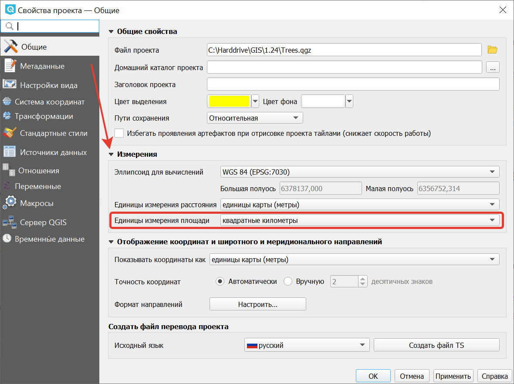
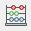

.. _ngqgis_editing_calculate:

Подсчёт длин и площадей геометрии
============================

В NextGIS QGIS можно подсчитать длины и площади объектов геометрии разными способами. Наиболее простой и часто используемый из них - добавление атрибутов геометрии.

.. _ngqgis_editing_ellipsoid:

Интерактивное определение площади
---------------------------------

Для того, чтобы настроить единицы измерений, перейдите в ``Проект ‣ Свойства проекта ‣ Общие``. В разделе "Измерения" нужно выставить "Эллипсоид для вычислений" в значение WGS 84, затем указать в поле ``единицы измерения расстояния`` - метры, ``единицы измерения площади`` - квадратные километры (см. :ref:`project_settings`).  

 
   Настройка эллипсоида  

Чтобы определить площадь объекта, нужно щелкнуть по нему Инструментом идентификации |button_identify_features|. В открывшемся диалоге "Результат определения" в дереве атрибутов раскрыть пункт "Выведенные". Там будет указана площадь в квадратных километрах, подсчитанная на эллипсоиде WGS 1984.

.. |button_identify_features| image:: _static/button_identify_features.png

   
   Площадь объекта в окне результатов определения

.. _ngqgis_area_addcolumn:

Добавление атрибутов геометрии
----------------------------------

Операция запускается из панели Инструменты анализа (раздел «Вектор - Геометрия») или через пункт меню Вектор ‣ Обработка геометрии ‣ Добавить атрибуты геометрии.

Алгоритм вычисляет геометрические свойства объектов векторного слоя. В результате генерируется новый векторный слой с тем же содержимым, что и исходный, но с дополнительными атрибутами в таблице, содержащими геометрические измерения. По умолчанию, длины и площади будут рассчитаны в единицах координат слоя. `Подробнее <https://docs.nextgis.ru/docs_ngqgis/source/vector_op.html#ngq-vector-op-addgeometrycolums>`_.

.. _ngqgis_editing_field_calc:

Расчет площади при помощи калькулятора полей
---------------------

Этот инструмент добавляет к векторному слою новый атрибут, и заполняет его значениями расчитаными по формуле. Запускается из таблицы атрибутов слоя |button_calculator|.
В окне задайте название добавляемого атрибута, его тип данных, и формулу. Просмотрите список функций - при нажатии по ним открывается описание.

   
.. _ngqgis_editing_area_calc:

В квадратных метрах 
^^^^^^^^^^^^^^^^^^^^^^^^
Эта операция добавляет в слой атрибут с расчитаной площадью.

Для того, чтобы настроить единицы измерений, перейдите в ``Проект ‣ Свойства проекта ‣ Общие``. В разделе "Измерения" нужно выставить "Эллипсоид для вычислений" в значение WGS 84, затем указать в поле ``единицы измерения расстояния`` указать метры, ``единицы измерения площади`` - квадратные километры (см. :ref:`project_settings`).   
3. Выделить слой, зайти в калькулятор полей, создать новое поле ``square``, тип ``real``, размер ``20``, точность ``10``. 
4. Ввести выражение для расчета:
   
   * Выражение для квадратных метров: $area.
   * Выражение для квадратных километров: $area / 1000000.
   * Выражение для целого значения гектаров: round( $area / 10000 ).

 
   Создание поля с площадью в гектарах через калькулятор полей 

5. После завершения работы калькулятора полей в таблице атрибутов будет видна площадь. 

Можно создать виртуальное поле - тогда в NextGIS QGIS при создании новой геометрии значение этого поля будет считаться на лету. 

.. note:: 
   В настройках подписей можно генерировать подпись выражением на лету, 
   однако в NextGIS QGIS 17.12 площади считаются только в единицах измерения слоя, а не проекта. 
 
Если правильная площадь не получилась, то используйте следующий метод. Он более низкоуровневый.

.. _ngqgis_editing_UTM_calc:

В других единицах измерения через UTM
^^^^^^^^^^^^^^^^^^^^^^^^^^^^^^^^^^^^^^^

Эта операция добавляет в слой атрибут с расчитаной площадью

1. Определить зону UTM. Для Московской области это 37N. Вы можете воспользоваться `этой веб-картой <https://demo.nextgis.ru/resource/6399>`_.
2. Сохранить слой в ESRI Shapefile или GeoJSON в систему координат, которая называется "WGS 84 / UTM {ваша зона}". Для Московской области - выберите WGS 84 / UTM 37N. Далее - так же как в прошлом методе, только используйте фунции без знака $
3. Выделить слой, зайти в калькулятор полей, создать новое поле ``square``, тип ``real``, размер ``20``, точность ``10``. 
4. Ввести выражение для расчета:
   
   * Выражение для квадратных метров: area($geometry).
   * Выражение для квадратных километров: area($geometry)/1000000.
   * Выражение для целого значения гектаров: round(area($geometry)/10000).

 
   Создание поля с площадью в гектарах через калькулятор полей

Функция $area возвращает площадь с учётом элипсоида и единиц измерения выбранных в настройках проекта, а area - возвращает площадь в единицах измерения слоя, то есть если слой в EPSG:4326, то получится площадь в квадратных градусах, а в EPSG:32637 - в настоящих метрах, а в EPSG:3857 - тоже в метрах, но не совпадающих с настоящими.

5. После завершения работы калькулятора полей в таблице атрибутов будет видна площадь. 
