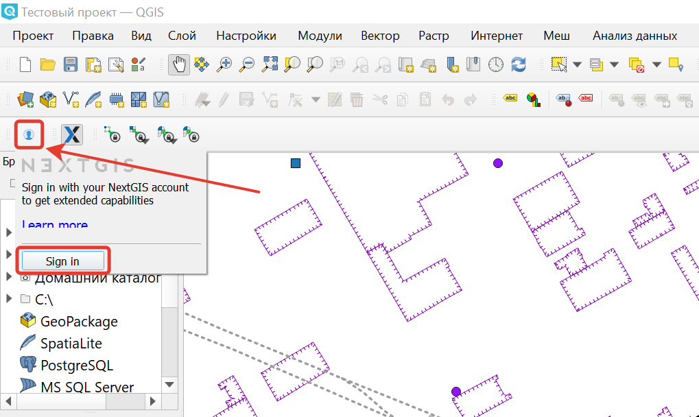
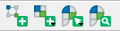
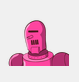
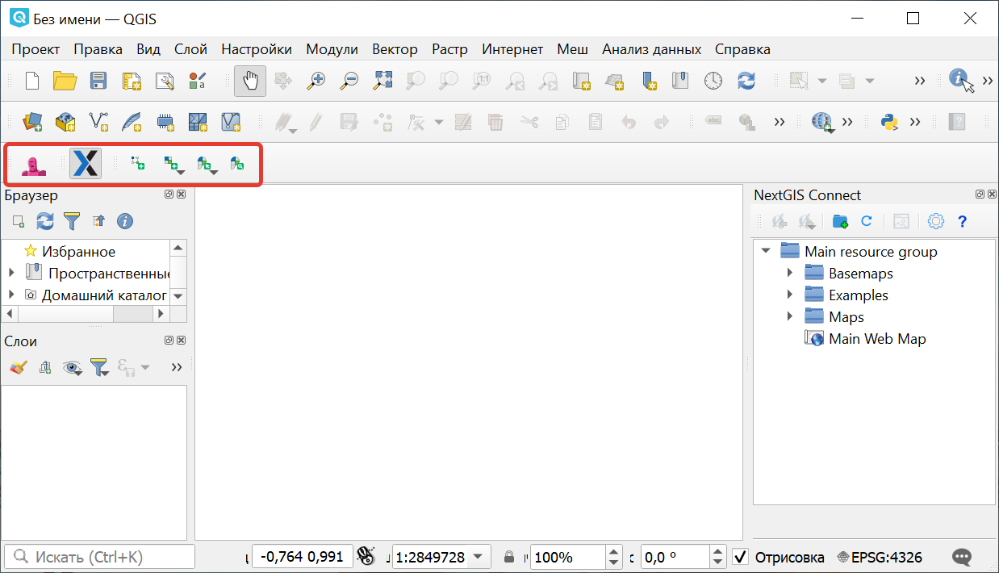
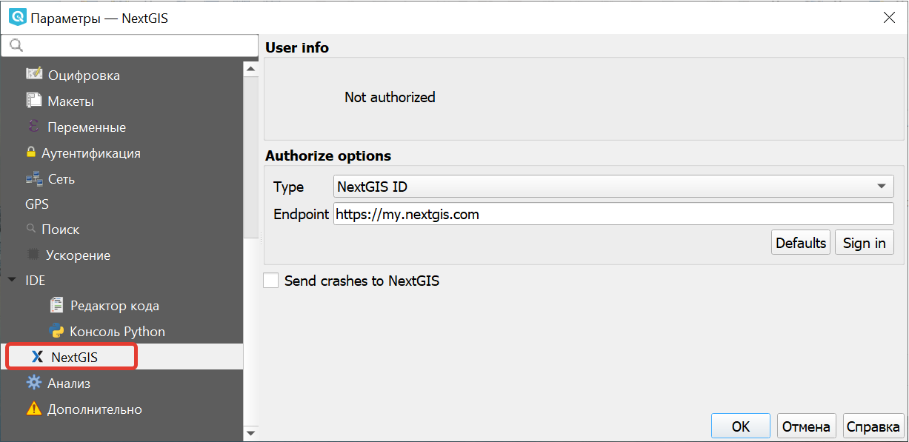

.. sectionauthor:: Роман Гайнуллов <roman.gainullov@nextgis.ru>

.. _ngqgis_auth:

Авторизация
==========

Через облачный сервер NextGIS ID (my.nextgis.com)
-------------------------------------------------

Чтобы открыть дополнительные функциональные преимущества :program:`NextGIS QGIS` (перейти на Pro-версии NextGIS QGIS), 
необходимо приобрести план `Mini или Premium <http://nextgis.ru/nextgis-com/plans>`_ и авторизоваться в программе.

По умолчанию заблокированные инструменты показываются так: |blocked_tools|.

.. |blocked_tools| image:: _static/auth_ngqgis/blocked_tools.png

Для активации возможностей Pro-версии NextGIS QGIS необходимо авторизоваться в системе при помощи кнопки |not_auth|
NextGIS Account Toolbar на панели инструментов (см. :numref:`acc_toolbar_deactive`). Во всплывающем меню выберите "Sing in".

.. |not_auth| image:: _static/auth_ngqgis/not_auth.png

   Общий вид NextGIS QGIS. NextGIS Account Toolbar деактивирован
   
   
Авторизация происходит через веб-браузер с переадресацией на страницу https://my.nextgis.com/. 
На странице необходимо ввести данные вашего аккаунта NextGIS ID или пройти регистрацию (см. :numref:`auth_page`). 
Если вы забыли данные вашего аккаунта, то `восстановите <https://docs.nextgis.ru/docs_ngcom/source/faq_webgis.html#ngcom-change-passwords-webgis>`_ к нему доступ.

.. figure:: _static/auth_ngqgis/auth_page.png
   :name: auth_page
   :align: center
   :width: 25cm
   
   Страница авторизации NextGIS ID

После корректного указания пары логин/пароль вы получите сообщение об успешной авторизации в NextGIS QGIS (см. :numref:`suscess_auth`), 
и доступ к Pro-функциям будет разблокирован |ublocked_tools|.

Кнопка NextGIS Account Toolbar при этом изменится на  |auth|, что говорит об успешно авторизованном пользователе (см. :numref:`acc_toolbar_active`).

.. figure:: _static/auth_ngqgis/suscess_auth.png
   :name: suscess_auth
   :align: center
   :width: 20cm
   
   Успешная авторизация в NextGIS QGIS

   
   Общий вид NextGIS QGIS. NextGIS Account Toolbar активирован
   
   
Через собственный сервер (NGIDOP)
---------------------------------

.. note:: 
   Необходимо, чтобы на рабочих местах, где установлен NextGIS QGIS с модулем `Rosreestr Tools <https://docs.nextgis.ru/docs_ngqgis/source/NGQ_Rosreestr_Tools.html>`_
   открывался адрес с доменным именем geoservices.nextgis.com.
   Дополнительно вы также можете прописать разрешение на доступ к этому серверу (geoservices.nextgis.com) на сервере, где развернут NextGIS Web.

Для авторизации в NextGIS QGIS через свой сервер, необходимо указать соответствующий Endpoint в настройках авторизации (Главное меню -> Настройки -> Параметры -> NextGIS) (см. :numref:`ngqis_ngidop_auth`). 

   
   Добавление собственного сервера авторизации
   
Доступны три типа авторизации: с использованием NextGIS ID, Keycloak и детальных пользовательских настроек.

