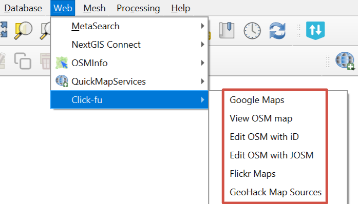

Click-Fu
========

Send click coordinates to various geoservices to open their maps in a browser at the chosen location. Supports Google Maps, OSM, Flickr Maps, GeoHack Map Sources.

After the installation you can find the plugin in the Web menu.

1. In the plugin menu select the service where you want to open your area of interest.

   Selecting map service

2. Click on a point on the map in QGIS. 

Your browser will open the selected service displaying the coordinates of the point.

See how the plugin works in our video:

.. raw:: html

   <iframe width="560" height="315" src="https://www.youtube.com/embed/H_mDkoCsQ-Y?si=HkkjNGAdwD4FtzGJ" title="YouTube video player" frameborder="0" allow="accelerometer; autoplay; clipboard-write; encrypted-media; gyroscope; picture-in-picture; web-share" referrerpolicy="strict-origin-when-cross-origin" allowfullscreen></iframe>

Watch on `youtube <https://youtu.be/H_mDkoCsQ-Y?si=TispKDxEygvfTfZb>`_.
