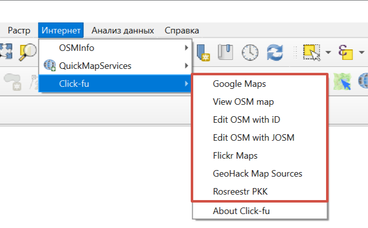

Click-Fu
========

Модуль в один клик позволяет переключаться с карты в QGIS на известные картографические веб-сервисы. Поддерживаются Google Maps, OSM, Flickr Maps, GeoHack Map Sources.

После установки модуль появится в меню "Интернет".

1. Выберите в меню модуля сервис, в котором хотите открыть выбранную область.

   Выбор картографического веб-сервиса

2. Кликните по интересующему месту на карте в QGIS. 

Ваш браузер сразу откроет этот сервис в координатах клика.

Посмотрите, как работает этот модуль, в видео:

.. raw:: html

   <iframe width="560" height="315" src="https://rutube.ru/play/embed/4b538bc721ea554eeb5a27db722eeb8d/" frameBorder="0" allow="clipboard-write; autoplay" webkitAllowFullScreen mozallowfullscreen allowFullScreen></iframe>

Смотреть на `youtube <https://youtu.be/CAa0QHQPS_4>`_, `rutube <https://rutube.ru/video/4b538bc721ea554eeb5a27db722eeb8d/>`_.
