.. _NextGIS DevTools:

QGIS DevTools — debugging QGIS plugins
======================================

.. note:: Qt6 compatible

Preface
--------

Developing QGIS plugins is a powerful way to extend the functionality of one of the world’s leading open-source GIS platforms.
But despite the flexibility of Python and QGIS’s API, one thing has long been missing from the developer experience: an efficient, modern debugging workflow.

For many plugin developers, the standard method of debugging involves printing to the console or using workarounds to attach debuggers manually.
This process is slow and often frustrating, especially when dealing with complex logic or UI interactions.

That’s why we built a tool to bridge the gap. **QGIS DevTools** is a QGIS plugin that enables smooth integration with Visual Studio Code, one of the most widely used and feature-rich development environments.
With this plugin, developers can set breakpoints, inspect variables, and step through code directly from Visual Studio Code.
Thanks to its modular architecture, the plugin can be extended to support other IDEs like PyCharm or Eclipse in the future, as well as additional development scenarios beyond debugging.

In this article, we’ll introduce the plugin and show how it can streamline and modernize your QGIS plugin development workflow.

Setting up QGIS
---------------

Installing dependencies
~~~~~~~~~~~~~~~~~~~~~~~

DevTools uses debugpy as the underlying library, so you need to install it first. If you are Windows user, we recommend to use OSGeo4W installation of QGIS for plugin development. 

You can add debugpy installation to your build in Libs category.

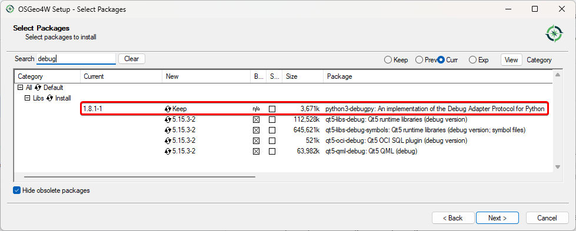

If you are a Linux user, you can install python3-debugpy using your OS package manager. For example:

.. code-block:: bash
    
    apt get install python3-debugpy

If you want to use flatpak for Linux:

.. code-block:: bash
    
    flatpak run --devel --command=pip3 org.qgis.qgis install --user debugpy

For MacOS:

.. code-block:: bash
    
    /Applications/QGIS.app/Contents/MacOS/bin/python3 -m pip install debugpy

Installing QGIS DevTools
~~~~~~~~~~~~~~~~~~~~~~~~

After that you could install QGIS DevTools from standard plugins repository (Plugins — Manage and install plugins — All — QGIS DevTools)

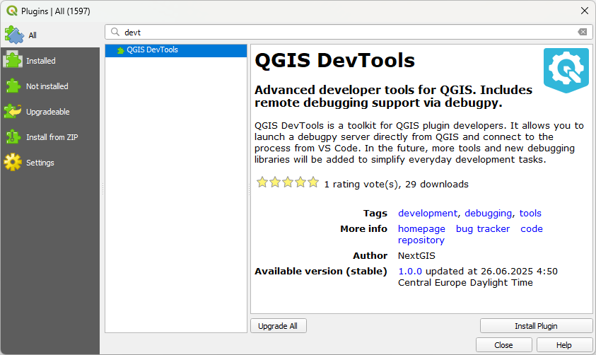

Installed plugin management is available via small bug icon |installed_icon| in the right bottom part of the QGIS interface.

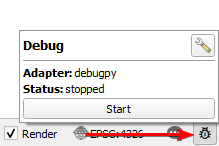

Plugin settings are also available in menu Plugins — QGIS DevTools.

QGIS DevTools settings
~~~~~~~~~~~~~~~~~~~~~~~

In settings you could select debug adapter (currently supports only debugpy for Visual Studio Code and Visual Studio, more to come),
set if you want to enable debugger on QGIS startup and show notification on debugger start.

Enabling the debugger leads to activating the local server app.
In the Adapter settings block you could set up hostname and port(s) for this server.
Selecting range instead of single value for Port would allow you to run several QGIS instances with active debuggers simultaneously.

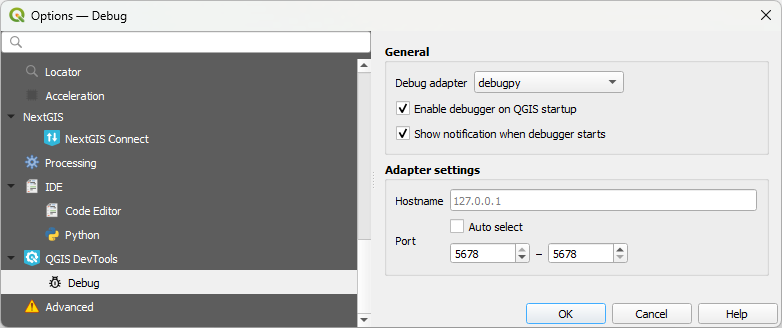

Setting up VS Code
------------------

Installing Python debugger extension
~~~~~~~~~~~~~~~~~~~~~~~~~~~~~~~~~~~~

**Python debugger** extension for VS Code is needed. Go to Extensions tab (Ctrl+Shift+X), search for Python debugger and install it.
Then restart VS Code.

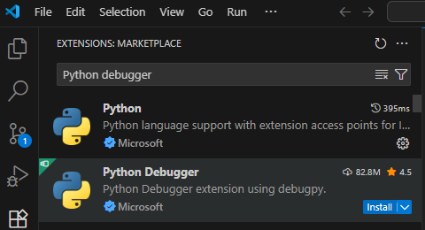

Opening plugin code and setting up debugger
~~~~~~~~~~~~~~~~~~~~~~~~~~~~~~~~~~~~~~~~~~~

For example we will debug the OSMInfo QGIS plugin, which could be installed from the standard plugins repository. You could try the same path, or use your own plugin.

To copy the plugin's location, it is convenient to simply right click on the Installed version number in the plugins manager and press the Copy link button.

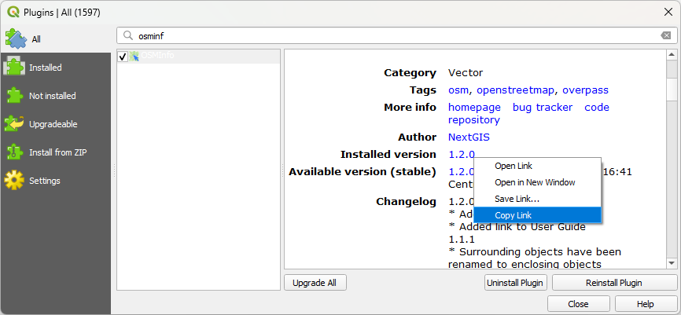

Open the whole plugin directory in VS Code using File — Open Folder and paste copied path, then open folder.

Next step is to create an empty **.vscode/launch.json** file in plugins directory root.

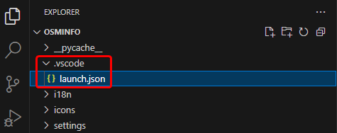

Return back to QGIS and press the Start button in the DevTools panel.

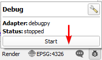

After that you will see the standard QGIS blue notification about started session, with Copy launch.json template button.

Press it, and paste copied template to **.vscode/launch.json** file created before.

.. todo:: _static/devtools/launch_pasted.png
   :name: start_notification
   :align: center
   :width: 16cm

If the code file is stored in a separate directory, not in the one it's run from, you need to configure a path for it.

In pasted code, in configurations/pathMappings/remoteRoot element replace <YOUR_PLUGIN_NAME> text to plugin’s directory name, in example case **osminfo**.

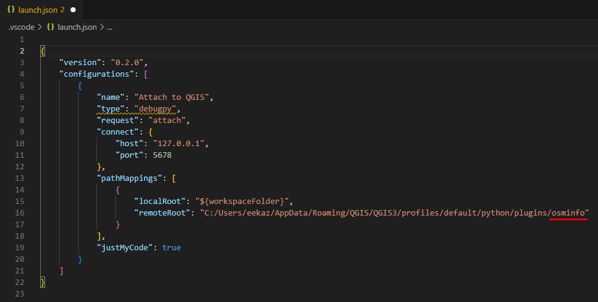

After that switch to the Run & Debug tab (Ctrl + Shift + D) and run **Attach to QGIS**.

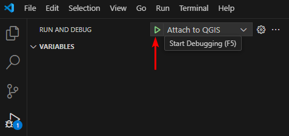

Debug session is active now. On VS Code side you should see a panel with debugging commands:

On QGIS side you should see, that DevTools icon changed it’s color to green, and status changed to “client connected”.

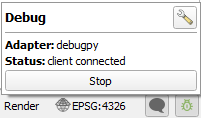

We are ready for debugging now.

Debugging process
------------------

All VS Code debug workflows are now available, you could find detailed information here: https://code.visualstudio.com/docs/python/debugging 

Let’s try some simple things. Open osminfotool.py file, find row 97 and add breakpoint to it by pushing the red circle left to row number.

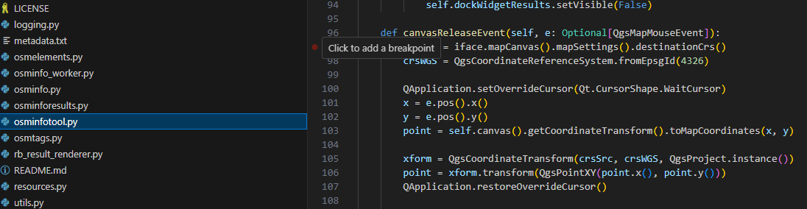

We asked the debugger to stop when reaching this row of code.
In the plugin's code this place is about actions after clicking on map.
Switch to QGIS, select OSMInfo tool and click to any location on the map.
Interface freezes — it is correct behaviour, the debugger stopped the process.

In VS Code you can see that the breakpoint was reached.
In the variables panel you could explore all currently available variables used in the plugin.
You could also use all these variables in Debug console, for example ask for mouse click coordinate with

.. code-block:: bash
    
    e.pos().x()

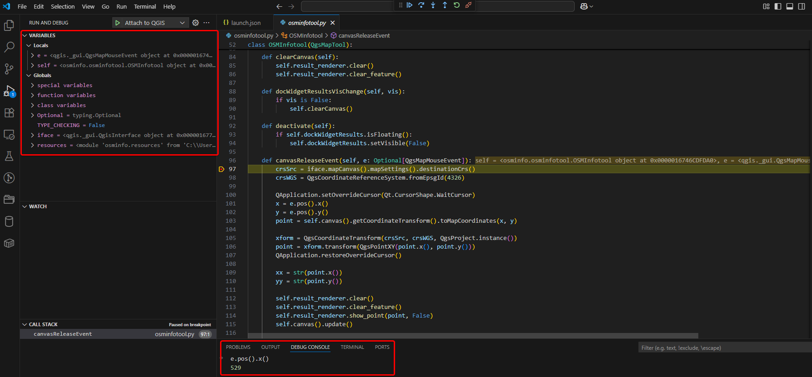

After that, using debug panel |debug_panel_2| you could move to the next code row or next breakpoint. These tools make the process of understanding what happens in the plugin much easier. Happy debugging!

Conclusion
------------

We hope that QGIS DevTools will make the lives of plugin developers easier.
Based on community requests, we plan to expand the list of supported IDEs and development support mechanisms in general.
Feel free to share your thoughts and feedback!
