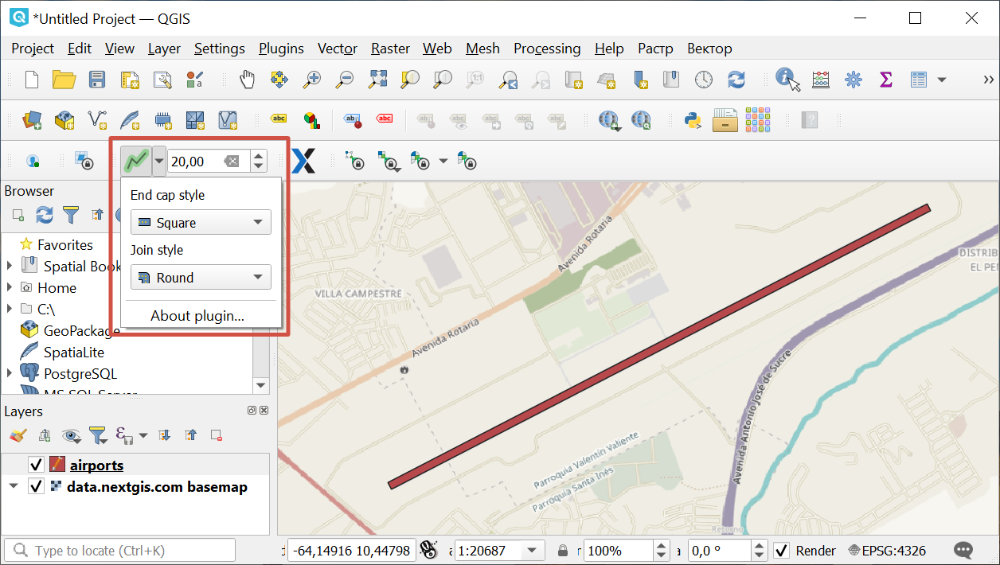

.. sectionauthor:: Юлия Григоренко <grigorenko.j@gmail.com>

.. _digitizr:

Digitizr
========

This plugin allows you to digitize a line and have a buffer around it immediately at set width stored in a polygonal layer.

1. Install plugin
2. Select a polygon layer and enter edit mode.
3. Activate the plugin from the toolbar (|button_digitizr| button)

4. To create a line left-click on map on at least two points.
5. To complete the line right-click on the last point. The line is automatically transformed into a polygon.

   
   Digitizr plugin settings

In the drop-down plugin menu you can select the style of caps and joins. 

In the field to the right of the button you can change the buffer width. 
