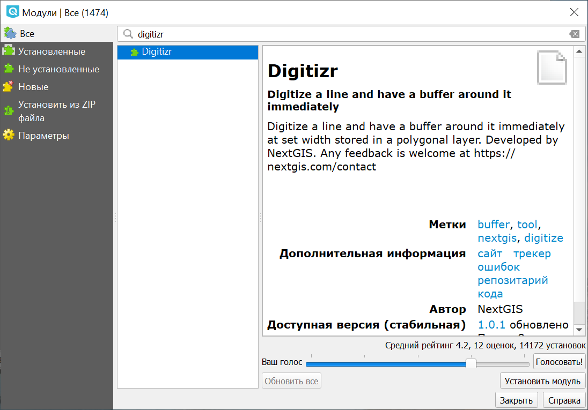
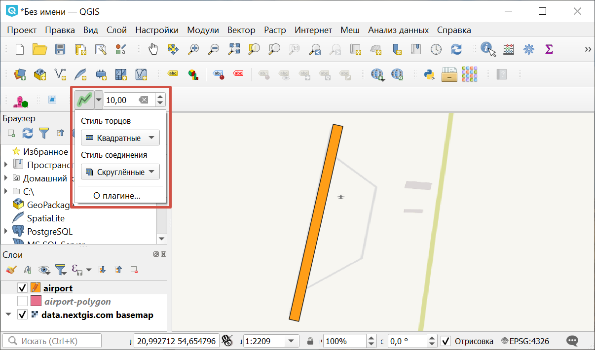

.. sectionauthor:: Юлия Григоренко <grigorenko.j@gmail.com>

.. _digitizr:

Digitizr
========

Этот модуль позволяет создавать линии заданной ширины, которые сохраняются как полигоны.

1. Установите модуль

   
   Установка модуля Digitizr

2. Выделите полигональный слой и включите редактирование.
3. Активируйте модуль на панели инструментов (кнопка |button_digitizr|).

.. |button_digitizr| image:: _static/button_digitizr.png

4. Прочертите линию, кликая левой кнопкой мыши в ее узлах.
5. Для завершения линии кликните в последней точке правой кнопкой. Линия превратится в полигон.

   
   Настройки модуля Digitizr

Вызвав выпадающее меню модуля, можно выбрать стиль торцов и соединений. 

Cправа от кнопки модуля расположено окошечко настройки размера буфера (толщины линии-полигона). 

