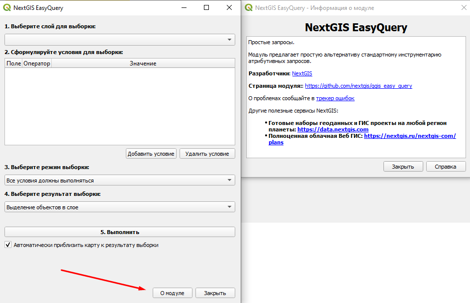
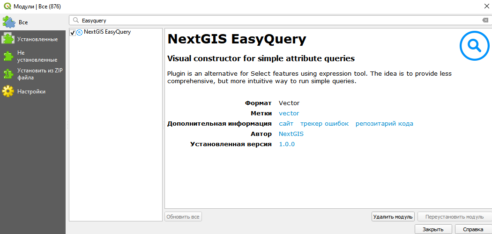
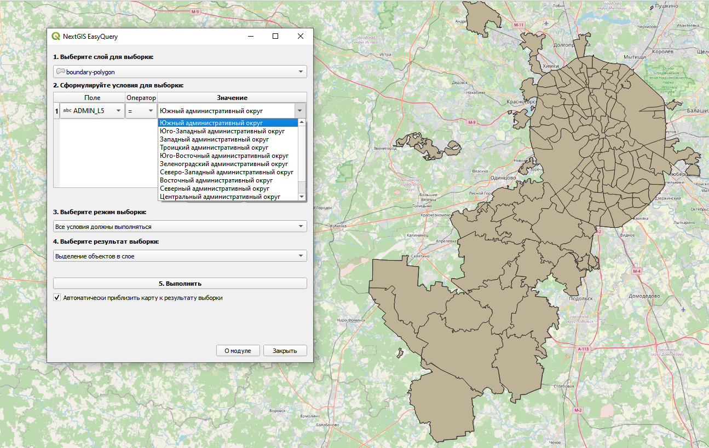
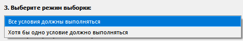
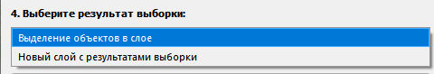
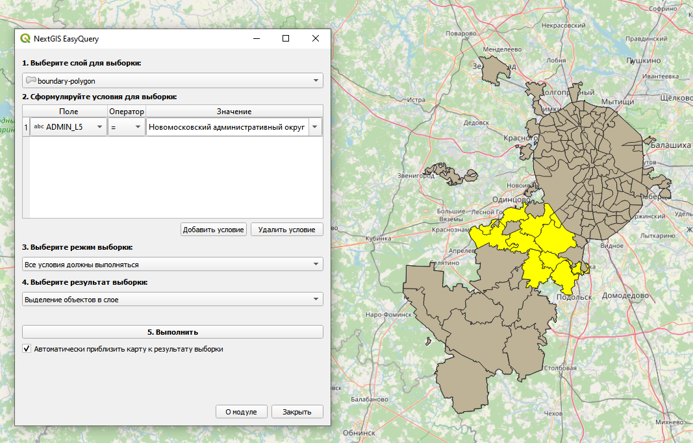
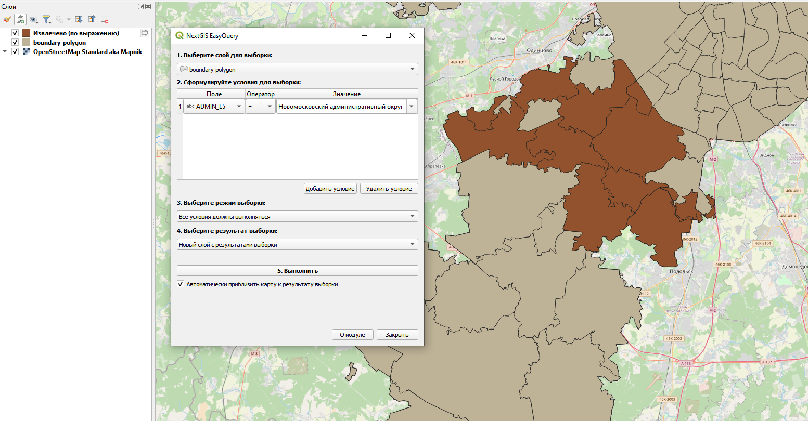

.. sectionauthor:: Роман Гайнуллов <roman.gainullov@nextgis.ru>

.. _NextGIS_EasyQuery:

NextGIS EasyQuery
=================

Плагин NextGIS EasyQuery предназначен для быстрого поиска и фильтрации объектов векторных слоев.
Он является упрощенным и интуитивно понятным визуальным конструктором запросов, с помощью которого вы можете:

- Выбрать нужный векторный слой
- Задать простое условие для фильтрации объектов по атрибутивным данным
- Определить режим выборки
- Сохранить результат выборки в отдельный временный слой или выделить его в текущем векторном слое

Дополнительную информацию можно прочитать в разделе "О модуле"

   
   Информация о модуле

.. _ng_easyq_install:

Установка
---------

Для установки или обновления модуля необходимо найти его в меню Модули ‣ Управление модулями.
Введите часть или все его название в панель Поиск (см. :numref:`setup`).

   
   Список установленных и доступных к загрузке модулей

Выберите в списке NextGIS EasyQuery и выберите Установить модуль.

После установки расширения на панели инструментов появляется иконка |easyquery_icon|. 

.. _ng_easyq_use:

Использование
-------------

1. Нажмите на иконку установленного плагина. Также открыть модуль можно через верхнее меню Вектор ‣ NextGIS EasyQuery
2. Выберите векторный слой, к объектам которого необходимо выполнить запрос. Слои в списке берутся из проекта, поэтому данные необходимо заранее добавить в QGIS.
3. Добавьте нужное вам условие - выберите поле для выборки, оператор и искомое значение. Условий может быть несколько, вы можете их добавлять и удалять.

   
   Добавление условия для выборки через плагин NextGIS EasyQuery
   
4. Установите режим выборки. Если вы задали несколько условий, то можете указать - должно выполниться хотя бы одно из них или все сразу.

   
   Выбор режима для выборки

.. important::
	Для числовых типов полей из списка будут предложены значения, соответствующие **процентным интервалам** 25, 50 и 75 %, а не все имеющиеся значения в текущем поле таблицы.

5. Выберите тип желаемого результата. Объекты могут быть как выделены в текущем слое, так и в сохранены в специальный временный слой.

   
   Выбор типа получаемого результата
   
6. По желанию установите флаг, чтобы результат выборки автоматически был приближен на карте.
7. Запустите выборку

   
   Результат выборки с выделением объектов в текущем слое

   
   Результат выборки с созданием нового временного слоя
