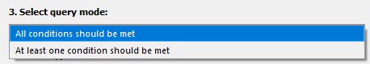

.. sectionauthor:: Roman Gainullov <roman.gainullov@nextgis.ru>

.. _NextGIS EasyQuery:

NextGIS EasyQuery
=================

The NextGIS EasyQuery plugin is designed for quick search and filtering of objects in vector layers.
It is a simplified and intuitive visual query builder with which you can:

- Select the desired vector layer
- Configure simple conditions for filtering objects by attribute data
- Define query mode
- Save the selection result to a separate temporary layer or select it in the current vector layer

More information can be found in the "About".

   
   Plugin info
   
   
Unstallation
------------

To install or update this plugin, you need to find it in the menu Plugins ‣ Manage and install plugins.
Enter part or all of its name in the Search bar (см. :numref:`setup-en`).

   
   List of installed and available plugins

Select **NextGIS EasyQuery** from the list and select Install Module.

After installing the extension, an icon appears on the toolbar |easyquery_icon-en|. 

Usage
-----

1. Click on the icon of the installed plugin. You can also open the module through the top menu Vector ‣ NextGIS EasyQuery
2. Select the vector layer whose features you want to query. The layers in the list are taken from the project, so the data needs to be added to QGIS beforehand.
3. Add the condition you need - choose the field to select, the operator and the value you are looking for. There can be several conditions, you can add and remove them.

   
   Adding a condition for query via the NextGIS EasyQuery plugin

4. Set the query mode. If you set several conditions, you can specify whether at least one of them or all of them must be fulfilled at once.

   
   Query mode selection
   
5. Select the type of result you want. Objects can be either selected in the current layer or saved to a special temporary layer.

   
   Result type selection
   
6. Optionally, set the checkbox so that the query result is automatically zoomed in on the map.
7. Start execution

   
   Query result with the selection of objects in the current layer

   
   Query result with the creation of a new temporary layer
