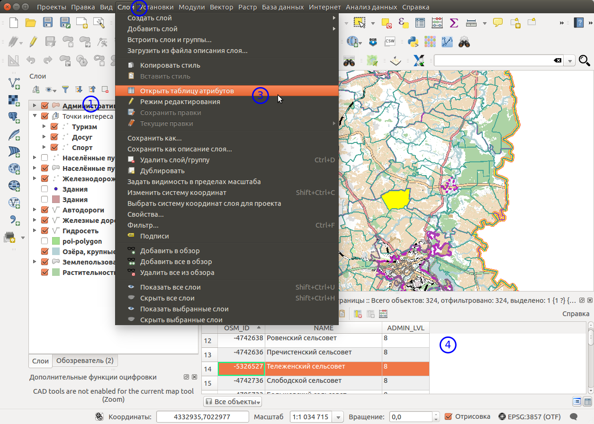
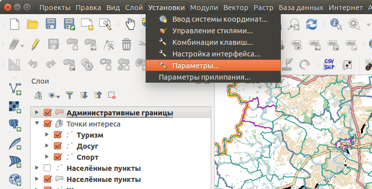
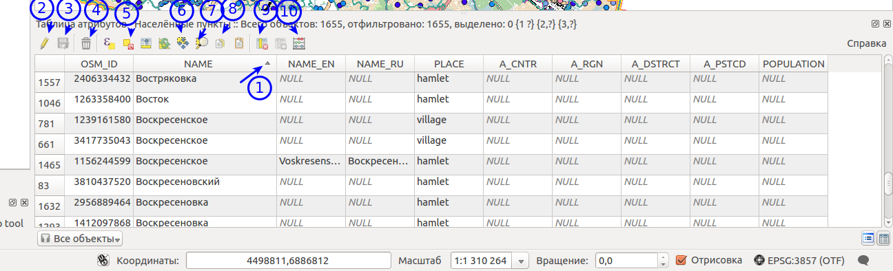
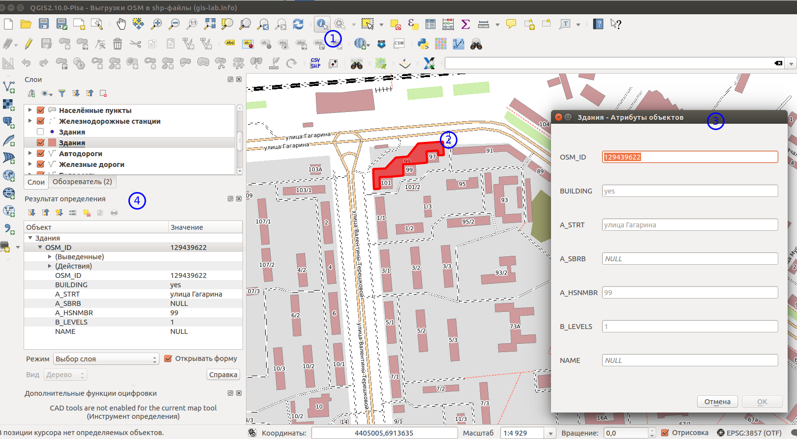
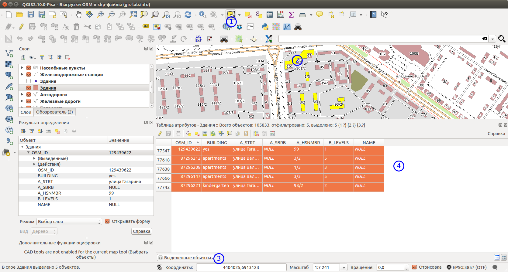
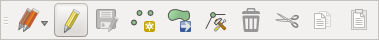
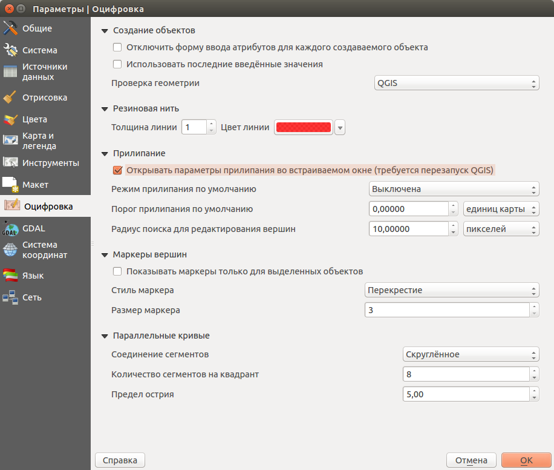

.. sectionauthor:: Дмитрий Барышников <dmitry.baryshnikov@nextgis.ru>

.. _ngqgis_editing:

Редактирование
==============

Работа с таблицей атрибутов
-----------------------------

У векторных слоёв имеются атрибуты, которые описывают свойства слоя. Их используют 
для настройки отображения данных. Атрибуты векторных объектов хранятся в таблице. 

   Меню "Открыть таблицу атрибутов". 

1. Выбрать слой.
2. В меню выберите пункт Слой.
3. Выбрать пункт Открыть таблицу атрибутов.
4. Таблица атрибутов.

Каждый столбец таблицы называется полем, каждая строка — записью. Каждая запись таблицы 
атрибутов соответсвует одному объекту в векторном слое. Столбцы - это атрибуты слоя. 
Aтрибутивные записи объекта слоя связаны с геометрией объекта. Геометрия объекта 
отображается на карте. 

Можно настроить, чтобы таблица атрибутов открывалась в отдельном окне, а можно - 
чтобы она всегда была внутри основного окна программы.

.. figure:: _static/UIAttributeTable3.png
   :name: ngqgis_UIAttributeTable3
   :align: center
   :width: 15cm

   Настройка таблицы атрибутов.

1. Выбрать вкладку Источники данных.
2. Установка флажка в пункте Таблица атрибутов - Открывать таблицу атрибутов во встраеваемом окне.

Можно настроить, чтобы объекты из одного слоя, но с разными атрибутами рисовались 
с разным оформлением. См. :ref:`ngq_vector_styles`.

В таблице атрибутов чаще всего используются следующие кнопки:

   Кнопки в таблице атрибутов.

1.  Cортировка по полю.
2.  Включить режим редактирования слоя. Теперь в слое можно править значения как 
    в электронной таблице, так и править геометрию.
3.  Сохранить правки в этом слое (отдельно от сохранения всего проекта).
4.  Удалить выделенные обьекты.
5.  Снять выделение с объектов.
6.  Переместить карту на выделеный объект или несколько объектов.
7.  Изменить масштаб карты на выделенный объект или несколько выделенных объектов.
8.  Копировать-вставить выделенные объекты (вместе с геометрией).
9.  Удалить или добавить атрибут (столбец).
10. Запуск калькулятора полей. Добавляется новый столбец со значениями по форулам, 
    как в Excel.

.. figure:: _static/UIAttributeTableSearch.png
   :name: ngqgis_UIAttributeTableSearch
   :align: center
   :width: 15cm

   Пример использования выражения для поиска обьектов в слое по значениям.

1. Кнопка выбора меню.
2. Поле вводе имени.   

Идентификация
--------------------

В NextGIS QGIS есть возможность, нажимая на объекты векторных слоёв на карте мышкой,
просматривать их атрибуты. Это называется "Идентификация".

   
   Работа инструмента идентификации.

1. Выберите инструмент идентификации (1). 
2. Щёлкните на каком-нибудь объекте на карте (2). 
3. На экран выведутся его атритуты (3). 
4. В панели инструментов "Результат определения" (4) можно настроить, что именно 
   будет показываться на экране при нажатии: будет ли открываться отдельное окно 
   или нет.

   
   Выделение нескольких объектов. В таблице атрибутов - режим "Выделенные объекты".

1. Кнопка панели инструментов для выделения объектов.
2. Выделенные объекты.
3. Кнопка выбора меню Выделенные объекты.
4. Выделенные объекты в таблице атрибутов.
   
Рядом есть жёлтая иконка - выделения объектов (1). Она выделяет объекты в том слое, 
который выбран в меню слоёв. Выделенные объекты подсвечиваются в таблице атрибутов, 
их можно скопировать или удалить. 
Выделять можно по клику или обводя область рамкой. Может быть выделено несколько 
объектов по очереди с нажатой клавишей Ctrl. Правее - кнопка "Снять выделение".

При идентификации, если включён режим "Открывать форму", то при нажатии на несколько 
объектов по очереди, выделение может не сниматься. Это не является ошибкой: где-то 
на дисплее остаются открытые окна идентификации, вот они и остаются красными. 

Рисование
--------------

.. todo::
   Поставить гиперссылку на раздел про создание нового слоя.

Рисование так же может называться оцифровка.
Рисовать объекты можно в векторных слоях. Однако библиотека GDAL не поддерживают 
редактирование некоторых форматов данных, например GeoJSON и CSV. В числе поддерживаемых 
форматов - ESRI Shapefile, PostGIS. 
Для рисования включите панель инструментов "Оцифровка".

 
   Панель инструментов "Оцифровка".   
 
.. todo::
   Поставить гиперссылку на раздел про включение панели.

По умолчанию, NextGIS QGIS подгружает слои, делая их доступными только для чтения: 
это защита от непреднамеренного редактирования слоя, что случается, например, при 
неловком движении манипулятором мышь. Однако, можно установить редактирование любого 
слоя при условии, если на это имеется соответствующее разрешение, и основной источник 
данных имеет возможность записи (т.е. эти файлы доступны не только для чтения). 
Редактирование слоев наиболее универсально, если используются источники данных, 
основанных на PostgreSQL/PostGIS.

Все возможности редактирования векторных слоев разделены между панелями:

1. Панель инструментов "Оцифровка". 
2. Панель инструментов "Дополнительные функции оцифровки".

В NextGIS QGIS имеется понятие "Режим редактирования слоя". Слои можно переключать 
в режим редактирования, если это позволяет формат данных. При выходе из режима 
редактирования, правки сохраняются в файл слоя или в базу данных. Для начала рисования 
выделите слой в списке слоёв и нажмите кнопку с карандашом на панели редактирования. 
Она залипнет, что означает, для этого слоя включён режим редактирования.
Любое редактирование начинается с выбора функции mActionToggleEditing Режим редактирования. 
Эта опция доступна из контекстного меню после щелчка правой кнопки мыши по легенде слоя.

Чтобы начать или закончить редактирование также можно использовать кнопку mActionToggleEditing 
Режим редактирования на панели инструментов по оцифровке. После того, как слой стал 
доступным для редактирования, над каждой вершиной появятся специальные маркеры и 
станут доступными к использованию кнопки с дополнительными функциями из панели инструментов.

.. note::
    Регулярное сохранение.
    Не забывайте нажимать mActionFileSave Сохранить изменения регулярно. Это позволит 
    не только сохранить последние изменения, но и удостовериться, что источники 
    данных могут принять все сделанные изменения.

Добавление объектов
^^^^^^^^^^^^^^^^^^^^^^^^^^^^
 
Можно использовать кнопки на панели инструментов: 

* mActionCapturePoint Создать точку, 
* mActionCaptureLine Создать линию, 
* mActionCapturePolygon Создать полигон, 

чтобы переключить NextGIS QGIS в режим редактирования.

Для каждого объекта сначала идет оцифровка формы, а затем добавляются атрибуты. 
Чтобы начать оцифровку и создать первую точку нового объекта, надо нажать левой 
кнопкой мыши в области карты.

Для продолжения линий и полигонов надо продолжать нажимать на левую кнопку мыши 
для создания каждого дополнительного узла. Чтобы закончить редактирование объекта, 
просто щелкните правой кнопки мыши в любом месте карты, что подтвердит окончание
редактирования данного объекта.

В процессе редактирования будет появляться окно атрибутов, позволяя тем самым вводить 
информацию для нового объекта. Figure_edit_2 показывает ввод атрибутов для вымышленной 
реки Аляски. В вкладке Оцифровка из меню Установки ‣ Параметры можно также активировать 
функцию checkbox Не показывать всплывающее окно ввода атрибутов для каждого создаваемого 
объекта checkbox Использовать последние введённые значения.

Figure Edit 2:

../../../_images/editDigitizing.png
Enter Attribute Values Dialog after digitizing a new vector feature nix

С помощью опции mActionMoveFeature Переместить объект на панели инструментов можно 
двигать созданные объекты.

Типы значений атрибутов.

При редактировании shape-файла типы атрибутов проверяются во время ввода. Поэтому 
невозможно ввести числовое значение в текстовое поле диалога Атрибуты или наоборот. 
Если это сделать все же необходимо, то следует отредактировать атрибуты на следующем 
шаге в диалоге Таблица атрибутов.

Как для слоев данных PostgreSQL/PostGIS, так и для слоев, состоящих из shape-файлов, 
mActionNodeTool Редактирование узлов предоставляет возможности изменения узлов объектов, 
аналогичные имеющимся в программах CAD. Можно выделить сразу множество вершин и 
перемещать, добавлять или удалять их все вместе. Инструмент редактирования узлов 
работает с включенной функцией перепроецирования «на лету», а также поддерживает 
топологическое редактирование объектов. Этот инструмент, в отличие от остальных 
инструментов NextGIS QGIS, довольно «настойчивый»: так, когда некоторая операция 
выполнена, инструмент продолжает оставаться активным, а объект выделенным. Если 
инструмент редактирования узлов не может обнаружить объекты, на дисплей выдается 
предупреждение.

Важно правильно установить Установки ‣ mActionOptions Параметры ‣ Оцифровка ‣ Радиус поиска selectnumber, значение должно быть больше нуля. 
В противном случае QGIS не распознает редактируемую вершину.

Маркеры вершин.

Данная версия NextGIS QGIS поддерживает три типа маркировки вершин:

1. Полупрозрачный круг. 
2. Перекрестие. 
3. «Без маркера». 

Чтобы изменить стиль маркировки, выберите mActionOptions Параметры из меню Установки 
и на вкладке Оцифровка выберите подходящий тип маркировки вершины.

Основные операции.

Включите инструмент mActionNodeTool Редактирование узлов и выделите объект простым 
нажатием на него. На месте каждой вершины этого объекта появятся красные рамки.

Выделение вершин.

Выделение узла происходит простым нажатием по нему кнопкой мыши, при этом цвет рамки 
изменится на синий. Чтобы выделить несколько узлов одновременно, надо удерживать 
клавишу Shift. Нажатие на Ctrl используется для инвертирования выделения узлов 
(выделенные узлы становятся невыделенными и наоборот). Также несколько узлов одновременно 
можно выделить, если нажать кнопкой мыши где-нибудь в стороне от объекта и очертить 
прямоугольную область вокруг интересующего множества вершин. Или просто нажать на 
отрезок линии и оба смежных узла будут выделены.

Добавление узлов.

Добавить узлы также просто. Двойной щелчок мыши рядом с отрезком линии добавит 
новую вершину рядом с положением курсора. Обратите внимание, что вершина появится 
на ребре объекта, а не точно в месте курсора, но при необходимости ее можно переместить.

Удаление узлов.

После выделения вершин для их удаления надо нажать клавишу Delete, вершины будут 
удалены. Обратите внимание, что, согласно стандарту NextGIS QGIS, необходимое количество 
узлов для каждого типа объекта все же останется. Чтобы полностью удалить объект, 
надо использовать другой инструмент, а именно mActionDeleteSelected Удалить выделенное.

Перемещение узлов.

Выделите все вершины, которые собираетесь перемещать. Все выделенные вершины будут 
перенесены в направлении курсора. Если активна функция прилипания, все вершины могут 
перескочить на ближайшие узлы или линии.

При отпускании кнопки мыши все изменения будут сохранены и появятся в диалоге отмены. 
Запомните, что все операции поддерживают топологическое редактирование, когда оно 
включено. Перепроецирование «на лету» также поддерживается. Кроме того, инструмент 
редактирования показывает всплывающие подсказки при наведении указателя мыши на узел.

.. todo::
   Поставить гиперссылку на раздел про ввод координат с клавиатуры.

Сохранение отредактированных слоев
^^^^^^^^^^^^^^^^^^^^^^^^^^^^^^^^^^^^^^^^^^

Когда слой находится в режиме редактирования, любые изменения сохраняются только 
в памяти NextGIS QGIS. Изменения не сохраняются непосредственно на диск. Если необходимо 
сохранить изменения в текущем слое и при этом продолжать его редактирование, то 
нужно нажать на кнопку mActionFileSave Сохранить изменения. Если выключить режим 
редактирования, нажав на mActionToggleEditing Режим редактирования (или просто 
выйти из QGIS), то появится запрос программы, хотите вы сохранить изменения или нет.

Если изменения не могут быть сохранены (например, диск полон или атрибуты имеют 
неверное значение), NextGIS QGIS сохранит их в своей памяти. Это позволит откорректировать 
изменения и попробовать еще раз сохранить изменения на диск.

.. note::
    Целостность данных. Создание резервной копии данных перед началом редактирования — 
    это всегда хорошая идея. Несмотря на то, что авторы NextGIS QGIS сделали все 
    возможное для сохранения ваших данных, они по-прежнему не дают никаких гарантий 
    в этом отношении.

.. todo::
   Дополнительные функции оцифровки

Дополнительные возможности редактирования векторного слоя:

1. Отменить.
2. Вернуть.

Инструменты Отменить и Вернуть позволяют отменить либо вернуть последний или какой-
либо конкретный шаг при редактировании векторных данных. При этом состояние всех 
объектов и их атрибутов возвращается на шаг назад. 

3. Упростить объект.

Инструмент Упростить объект позволяет уменьшить количество вершин объекта, при этом, 
геометрия объекта не изменяется. Необходимо выделить объект, после чего он будет 
подсвечен красным и появится ползунок. При движении ползунка красная опоясывающая 
линия меняет свою форму, показывая тем самым, как именно объект будет упрощен. Если 
нажать кнопку [OK], новая упрощенная геометрия будет сохранена. Если объект не может 
быть упрощен (например, мультиполигоны), появится всплывающее окно предупреждения.

4. Добавить кольцо.

Можно создать кольцевой полигон, используя функцию Добавить кольцо на панели инструментов. 
Внутри существующего полигона можно оцифровать последующий полигон, который превратиться 
в "отверстие", таким образом, только оставшаяся область между границами внешнего и
внутреннего полигона и будет кольцевым полигоном.

5. Добавить часть.

Можно использовать Добавить часть для добавления новых полигонов к мультиполигональным
объектам. Новая полигональная часть должна быть создана за границами мультиполигона.

6. Удалить кольцо.

Инструмент Удалить кольцо позволяет удалять кольцевые полигоны внутри существующей 
площади. Этот инструмент работает только с полигональными слоями. Никакик изменений 
не произойдет, если инструмент применяется на внешнем контуре полигона. Инструмент 
может применяться как для полигональных объектов, так и на мультиполигональных. 
Перед тем, как выделить вершины кольца, настройте порог прилипания для вершин.

7. Удалить часть.

Инструмент Удалить часть позволяет удалять части мультиполигональных объектов (например, 
удалить полигон мультиполигонального объекта). Инструмент не сможет удалить последнюю
часть объекта. Она останется нетронутой. Инструмент работает со всеми типами геометрии: 
точками, линиями, полигонами. Перед тем, как выделить вершины части, необходимо 
настроить порог прилипания для вершин.

8. Корректировать объекты.

Можно корректировать форму линий и полигонов, используя инструмент Корректировать 
объекты. Он удаляет часть линии или полигона между первым и последним пересечением 
с исходной линией. При работе с полигонами это может иногда привести к непредсказуемым 
результатам. Этот инструмент наиболее пригоден для корректировки небольших частей 
полигонов. Редактирование нескольких полигональных объектов одновременно невозможно, 
так как при этом будут создаваться полигоны с ошибочной геометрией.
Пример редактирования границы полигона при помощи следующего инструмента. Сначала 
необходимо поставить точку внутри полигона, рядом с местом, где необходимо добавить 
новую вершину. Затем провести линию через контур и добавить новые вершины. 
Для завершения операции поместите указатель внутри контура и нажмите правую клавишу 
мыши. Инструмент автоматически добавит новые вершины в местах пересечения контура. 
Аналогичным образом можно "вырезать" часть полигона. В этом случаем начинать и заканчивать 
построение необходимо вне контура.

Примечание. 
Инструмент корректировки объектов может изменять начало кольца полигона или
замкнутой линии. Так, точка, представленная "дважды", больше не будет таковой. Это 
не должно быть проблемой при использовании большинства приложений, но, тем не менее, 
это необходимо иметь в виду.

9. Параллельная кривая.

Инструмент Параллельная кривая предназначен для параллельного переноса линий и колец 
полигона. Инструмент может применяться к редактируемому слою (в этом случае изменяются 
объекты) или же к фоновым слоям (в этом случае создаются копии линий/колец и добавляются 
в редактируемый слой). Таким образом, он идеально подходит для создания линейных 
слоёв с фиксированным шагом. 
Размер смещения отображается в нижней левой части строки состояния.

10. Разбить объекты.

Используя инструмент Разбить объекты на панели инструментов, можно разбить объект, 
просто нарисовав линию через него.

11. Объединить выбраные объекты.

Этот инструмент позволяет объединять объекты, которые имеют общие границы и атрибуты.

12. Объединить атрибуты выбранных объектов.

Этот инструмент позволяет объединять атрибуты нескольких объектов без их объединения 
в один объект.

.. todo::
   Картинки про рисование

Прилипание
--------------

Порог прилипания — это расстояние, используемое NextGIS QGIS для поиска ближайшего 
узла и/или сегмента, к которому надо присоединиться при создании нового узла или 
передвижении уже существующего. Если превысить порог прилипания, то при нажатии 
кнопки мыши узел будет создан «в стороне», вместо того, чтобы быть привязанным к 
уже существующему узлу и/или сегменту. 

Общая для всего проекта величина порога прилипания устанавливается в Установки ‣ mActionOptions Параметры (для Mac: QGIS ‣ mActionOptions Настройки, для Linux: Редактирование ‣ mActionOptions Параметры). 

На вкладке Оцифровка можно установить режим прилипания по умолчанию: 

1. К вершинам. 
2. К сегментам. 
3. К вершинам и сегментам. 

Также можно определить значения по умолчанию для единиц измерения порога прилипания 
и радиуса поиска для редактирования вершин. Эти величины могут быть установлены 
как в единицах карты, так и в пикселах. 
Преимущество использования пикселов в качестве единиц заключается в том, что при 
зуммировании порог прилипания не будет изменяться. В нашем небольшом проекте оцифровки 
(по рабочему набору данных Alaska) мы установили в качестве единицы порога прилипания фут. 
Ваши результаты могут отличаться, но величины, близкие к 300 футов, дают приемлемые 
результаты при работе в масштабе 1:10000.

Величина порога прилипания для отдельного слоя устанавливается в Установки ‣ (или Файл) Параметры прилипания... для включения и настройки режима и порога прилипания для каждого слоя (см. figure_edit_1).

Обратите внимание, что величина порога прилипания для отдельного слоя имеет преимущество 
над общим порогом прилипания, установленным на вкладке Оцифровка. Таким образом, 
если надо отредактировать один слой и прилепить его вершины к другому слою, необходимо 
активировать прилипание «прилипание к» для слоя, затем снизить общий порог прилипания 
для проекта до меньшего значения. Кроме того, прилипание невозможно для слоя, не 
активизированного в диалоговом окне параметров прилипания, независимо от параметров 
общего прилипания. Поэтому необходимо убедиться, что у слоя, к которому необходимо 
применить прилипание, стоит флажок.

 
   Окно Параметры. Оцифровка. Прилипание.

Копирование объектов
-------------------------------------

Выделенные объекты можно удалять, копировать и вставлять из слоя в слой одного 
проекта NextGIS QGIS при условии, что для них включен mActionToggleEditing Режим 
редактирования.

Объекты также можно вставить во внешние приложения в виде текста: объекты отражаются 
в формате CSV, где их геометрия передается форматом OGC Well-Known Text (WKT).

Однако в настоящей версии NextGIS QGIS текстовые объекты из внешних приложений не 
могут быть добавлены в слой NextGIS QGIS. Когда же может пригодиться функция копирования 
и вставки? Оказывается, возможно редактирование нескольких слоев одновременно и 
копирование/вставка объектов между ними.

Что случится, если исходный и целевой слой имеют разную структуру (названия полей 
и их типы отличаются)? NextGIS QGIS заполнит совпадающие поля и проигнорирует остальные. 
Если результат копирования атрибутов в целевой слой не имеет значения, то становится 
неважно, в каком виде они там будут представлены. Если в целевом слое необходимо 
сохранить все с точностью — объекты и их атрибуты, необходимо убедиться, что структуры 
исходного и целевого слоя совпадают.

.. note::
    Соответствие вставляемых объектов.
    Если исходный и целевой слой находятся в одинаковой проекции, тогда геометрия 
    вставленных объектов будет идентична исходному слою. Однако если целевой слой 
    находится в проекции, отличной от исходной, тогда NextGIS QGIS не гарантирует 
    идентичность геометрии. Это происходит по причине незначительных ошибок округления, 
    неизбежных при переходе от одной проекции к другой.

