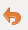
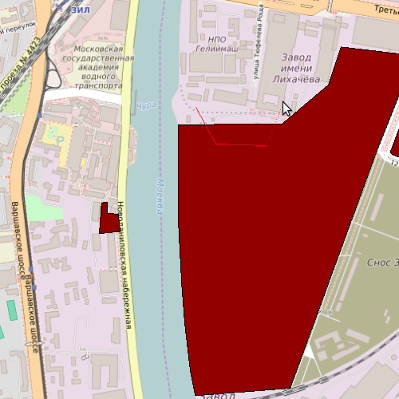
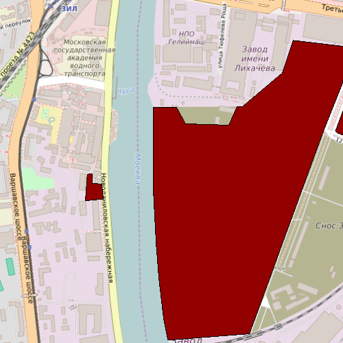
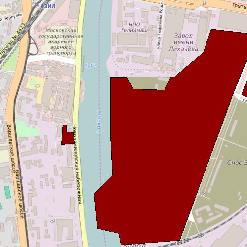
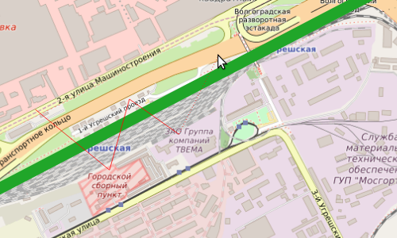
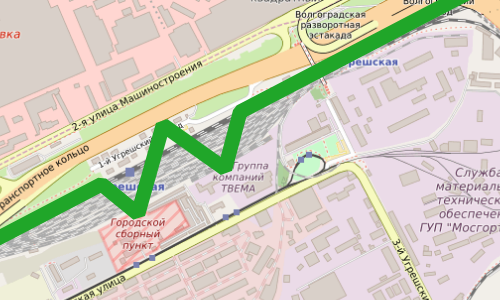

.. sectionauthor:: Дмитрий Барышников <dmitry.baryshnikov@nextgis.ru>

.. _ngqgis_editing:

Редактирование
==============

Работа с таблицей атрибутов
-----------------------------

У векторных слоёв имеются атрибуты, которые описывают свойства объектов слоя. Их используют 
для настройки отображения данных. Атрибуты векторных объектов хранятся в таблице. 

.. figure:: _static/UIAttributeTable1.png
   :name: ngqgis_UIAttributeTable1
   :align: center
   :width: 16cm

   Меню "Открыть таблицу атрибутов".
   
   Цифрами обозначено: 1. Выбрать слой. 2. В меню выберите пункт Слой. 3. Выбрать 
   пункт Открыть таблицу атрибутов. 4. Таблица атрибутов.

Каждый столбец таблицы атрибутов называется полем, каждая строка — записью. Каждая запись таблицы 
атрибутов соответствует одному объекту в векторном слое. Столбцы - это атрибуты слоя. 
Aтрибутивные записи объекта слоя связаны с геометрией объекта. Геометрия объекта 
отображается на карте. 

Можно настроить, чтобы таблица атрибутов открывалась в отдельном окне, а можно - 
чтобы она всегда была внутри основного окна программы.

.. figure:: _static/UIAttributeTable3.png
   :name: ngqgis_UIAttributeTable3
   :align: center
   :width: 16cm

   Настройка таблицы атрибутов. 
   
   Цифрами обозначено: 1. Выбрать вкладку Источники данных. 2. Установка флажка 
   в пункте Таблица атрибутов - Открывать таблицу атрибутов во встраеваемом окне.

Можно настроить, чтобы объекты из одного слоя, но с разными атрибутами отображались 
с разным оформлением. См. :ref:`ngq_vector_styles`.

В таблице атрибутов чаще всего используются следующие кнопки:

.. figure:: _static/UIAttributeTable4.png
   :name: ngqgis_UIAttributeTable4
   :align: center
   :width: 16cm

   Кнопки в таблице атрибутов.
   
   Цифрами обозначено: 1. Cортировка по полю. 2. Включить режим редактирования слоя. 
   Теперь в слое можно править значения как в электронной таблице, так и править геометрию.
   3. Сохранить правки в этом слое (отдельно от сохранения всего проекта). 4. Удалить выделенные обьекты.
   5. Снять выделение с объектов. 6. Переместить карту на выделеный объект или несколько объектов.
   7. Изменить масштаб карты на выделенный объект или несколько выделенных объектов.
   8. Копировать-вставить выделенные объекты (вместе с геометрией). 9. Удалить или добавить атрибут (столбец).
   10. Запуск калькулятора полей. Добавляется новый столбец со значениями по формулам, 
   как в Excel.

.. figure:: _static/UIAttributeTableSearch.png
   :name: ngqgis_UIAttributeTableSearch
   :align: center
   :width: 15cm

   Пример использования выражения для поиска обьектов в слое по значениям.
   
   Цифрами обозначено: 1. Кнопка выбора меню. 2. Поле ввода имени.   

.. _ngqgis_editing_identify:

Идентификация
--------------------

В :program:`NextGIS QGIS` есть возможность, нажимая на объекты векторных слоёв на карте мышью,
просматривать их атрибуты. Это называется "Идентификация".

.. figure:: _static/UIIdentify.png
   :name: ngqgis_UIIdentify
   :align: center
   :width: 16cm
   
   Работа инструмента идентификации.
   
   Выберите инструмент идентификации (1). 
   Щёлкните на каком-нибудь объекте на карте (2). На экран выведутся его атритуты (3). 
   В панели инструментов "Результат определения" (4) можно настроить, что именно 
   будет показываться на экране при нажатии: будет ли открываться отдельное окно 
   или нет.

.. figure:: _static/UISelect.png
   :name: ngqgis_UISelect
   :align: center
   :width: 16cm
   
   Выделение нескольких объектов.  В таблице атрибутов - режим "Выделенные объекты".
   
   Цифрами обозначено: 1. Кнопка панели инструментов для выделения объектов 2. Выделенные объекты. 
   3. Кнопка выбора меню Выделенные объекты. 4. Выделенные объекты в таблице атрибутов.
   
Рядом есть жёлтая иконка - выделения объектов (1). Она выделяет объекты в том слое, 
который выбран в меню слоёв. Выделенные объекты подсвечиваются в таблице атрибутов, 
их можно скопировать или удалить. 
Выделять объекты можно по клику или обводя область рамкой. Может быть выделено несколько 
объектов по очереди с нажатой клавишей ``Ctrl``. Правее имеется кнопка "Снять выделение".

.. note::
   При идентификации, если включён режим "Открывать форму", то при нажатии на несколько 
   объектов по очереди, выделение может не сниматься. Это не является ошибкой: где-то 
   на дисплее остаются открытые окна идентификации, поэтому они и остаются красными. 

Фильтры (отбор значений)
------------------------------------

Имеется два способа отфильтровать таблицу по значениям. 

1. Контекстное меню слоя ‣ Фильтр.
2. Таблица атрибутов слоя ‣ Кнопка "Фильтр" ‣ Выражение. 

На экран выведется диалоговое окно, в которое нужно будет ввести выражение. Те записи, 
для которых это выражение будет истинно, будут показываться в таблице, остальные - 
скроются из таблицы, но останутся в файле.

Примеры выражений:

.. code-block:: sql

   "leaf_length" < 10
   "temp" > 5 AND "temp" < 10

Операции, запускаемые через меню "Вектор", будут выполняться только для тех записей, 
которые отображаются в таблице.

Эти два способа фильтрации работают на разном уровне. 
Первый вариант выполняется библиотекой GDAL на уровне провайдера. Он не видит виртуальных 
полей и недоступен для некоторых типов данных, например :term:`CSV`. При работе с :term:`WFS`, :term:`PostGIS`, 
:term:`ESRI Shapefile` и другими базами данных он должен выполняться быстрее.
Второй вариант выполняется на уровне NextGIS QGIS. Он видит виртуальные поля, и ему доступны 
все функции, которые видны в калькуляторе полей. Например можно выводить на экран 
только водоёмы с площадью больше определённого предела. 

Диалект SQL используемый в первом способе описан в документации GDAL: http://www.gdal.org/ogr_sql.html

В добавление к арифметическим и другим функциям, в фильтре слоя доступны логические операторы. Это  =, !=, <>, <, >, <=, >=, LIKE и ILIKE, BETWEEN и IN. != то же самое что <>, сравнение строк регистронезависимо, операторы <, >, <= , >=, LIKE, ILIKE  зависят от регистра.
Аргумент оператора LIKE - это шаблон, с которым сравнивается строка. Символ % обозначает совпадение с любым количеством символов, символ _ обозначает совпедение с одним символом.

Подсчёт длин и площадей геометрии
------------------------------------

Определение площади фигуры в квадратных километрах
^^^^^^^^^^^^^^^^^^^^^^^^^^^^^^^^^^^^^^^^^^^^^^^^^^^^^^^^^^^^^^^^^^^^^

Для вычисления площади фигуры в квадратных километрах необходимо выполнить ряд шагов:

1. В свойствах проекта "Общие" выставить "Эллипсоид для вычислений" в значение WGS1984, 
   в поле ``единицы для измерения длин`` указать метры, ``единицы для измерения площадей`` - 
   квадратные километры (см. :ref:`project_settings`).
2. Инструментом идентификации щёлкнуть на площадной объект. В открывшемся диалоге "Результат определения" 
   в дереве атрибутов раскрыть пункт "Выведенные". Там будет указана площадь в квадратных километрах, 
   подсчитанная на эллипсоиде WGS 1984.

Определение площади фигуры в гектарах, квадратных метрах и других единицах измерения
^^^^^^^^^^^^^^^^^^^^^^^^^^^^^^^^^^^^^^^^^^^^^^^^^^^^^^^^^^^^^^^^^^^^^^^^^^^^^^^^^^^^^^^^^^^^^^^^^^^^^^^^^^^

.. note:: 
   В версии NextGIS QGIS 17.12 площади на лету считаются только в квадратных километрах, 
   считать в гектарах можно только через калькулятор полей.

1. Определить зону UTM. Для Московской области это 37N. Вы можете воспользоваться веб-картой: http://datahub.nextgis.com/resource/51/display
2. Сохранить слой в ESRI Shapefile или GeoJSON в WGS 84 / UTM 37N .
3. Выделить слой, зайти в калькулятор полей, создать новое поле ``square``, тип ``real``, размер ``20``, точность ``10``. 
4. Ввести выражение для расчета:
   
   * Выражение для квадратных метров: $area.
   * Выражение для квадратных километров: $area / 1000000.
   * Выражение для целого значения гектаров: round( $area / 10000 ).

.. figure:: _static/field_calculator_square.png
   :name: field_calculator_square
   :align: center
   :width: 10cm
 
   Создание поля с площадью в гектарах через калькулятор полей.  

5. После завершения работы калькулятора полей в таблице атрибутов будет видна площадь. 

Можно создать виртуальное поле - тогда в NextGIS QGIS при создании новой геометрии значение этого поля будет считаться на лету. 

.. note:: 
   В настройках подписей можно генерировать подпись выражением на лету, 
   однако в NextGIS QGIS 17.12 площади считаются только в единицах измерения слоя, а не проекта. 

Редактирование геометрий
--------------------------

Для того что бы редактировать геометрии или создавать новые, необходимо името векторный слой. 
О создании векторного слоя см. подразд. :ref:`ngq_create_new_layer`. 

Редактирование геометрий так же может называться оцифровкой. Все возможности редактирования 
векторных слоев разделены между панелями:

1. Панель инструментов "Оцифровка". 
2. Панель инструментов "Дополнительные функции оцифровки".

Для рисования включите панель инструментов "Оцифровка".

.. figure:: _static/drawing_tools.png
   :name: ngqgis_drawing_tools
   :align: center
   :width: 10cm
 
   Панель инструментов "Оцифровка".   
 
.. todo::
   Поставить гиперссылку на раздел про включение панели.

По умолчанию, NextGIS QGIS подгружает слои, делая их доступными только для чтения. 
Это защита от непреднамеренного редактирования слоя, что случается, например, при 
неловком движении манипулятором мышь. Любой слой можно переключить в режим редактирования 
(если источник данных поддерживает запись, и есть разрешение на запись).
При выходе из режима редактирования правки сохраняются в файл слоя или в базу данных. 
Для начала редактирования выделите слой в списке слоёв и нажмите кнопку с карандашом на 
панели редактирования. Любое редактирование начинается с выбора функции "Режим редактирования". 

Для того, чтобы начать или закончить редактирование также можно использовать кнопку 
"Режим редактирования" на панели инструментов "Оцифровка". После того, как слой стал 
доступным для редактирования, над каждой вершиной появятся специальные маркеры и 
станут доступными к использованию кнопки с дополнительными функциями из панели инструментов.

.. note::
   **Регулярное сохранение**
   
   Не забывайте нажимать Сохранить изменения регулярно. Это позволит 
   не только сохранить последние изменения, но и удостовериться, что источники 
   данных могут принять все сделанные изменения.

Добавление объектов
^^^^^^^^^^^^^^^^^^^^^^^^^^^^
 
Для добавления объектов можно использовать кнопки на панели инструментов: 

* Создать точку, 
* Создать линию, 
* Создать полигон, 

чтобы переключить NextGIS QGIS в режим редактирования.

Для каждого объекта сначала идет оцифровка формы, а затем добавляются атрибуты. 
Чтобы начать оцифровку и создать первую точку нового объекта, надо нажать левой 
кнопкой мыши в области карты.

Для продолжения линий и полигонов надо продолжать нажимать на левую кнопку мыши 
для создания каждого дополнительного узла. Чтобы закончить редактирование объекта, 
щелкните правой кнопки мыши в любом месте карты, что подтвердит окончание
редактирования данного объекта. При этом, появится окно атрибутов для ввода 
информации для нового объекта. Во вкладке "Оцифровка" из меню ``Установки ‣ Параметры`` можно 
также активировать функцию "Не показывать всплывающее окно ввода атрибутов для каждого 
создаваемого объекта Использовать последние введённые значения".

С помощью опции ``Переместить объект`` на панели инструментов можно 
двигать созданные объекты.

**Типы значений атрибутов**

При редактировании :term:`ESRI Shapefile` типы атрибутов проверяются во время ввода. Поэтому 
невозможно ввести числовое значение в текстовое поле диалога "Атрибуты" или наоборот. 
Если это сделать все же необходимо, то следует отредактировать атрибуты на следующем 
шаге в диалоге "Таблица атрибутов".

Как для слоев данных :term:`PostGIS`, так и для слоев, состоящих из ESRI Shapefile, 
``Редактирование узлов`` предоставляет возможности изменения узлов объектов, 
аналогичные имеющимся в программах :abbr:`CAD (Computer-Aided Design)`. 
Можно выделить сразу множество вершин и 
перемещать, добавлять или удалять их все вместе. Инструмент редактирования узлов 
работает с включенной функцией перепроецирования "на лету", а также поддерживает 
топологическое редактирование объектов. Этот инструмент, в отличие от остальных 
инструментов NextGIS QGIS, довольно "настойчивый": так, когда некоторая операция 
выполнена, инструмент продолжает оставаться активным, а объект выделенным. Если 
инструмент редактирования узлов не может обнаружить объекты, на дисплей выдается 
предупреждение.

.. note::
   Если включено перепроецирование "на лету", и система координат карты отличается от
   системы координат слоя, то функции прилипания могут работать неккоректно из-за отличия
   в величине "близости" для различных систем координат. 

Важно правильно установить ``Установки ‣ Параметры ‣ Оцифровка ‣ Радиус поиска selectnumber``, 
значение должно быть больше нуля. В противном случае NextGIS QGIS не распознает редактируемую вершину.

**Маркеры вершин**

Данная версия NextGIS QGIS поддерживает три типа маркировки вершин:

1. Полупрозрачный круг. 
2. Перекрестие. 
3. Без маркера. 

Чтобы изменить стиль маркировки, выберите "Параметры" из меню "Установки" 
и на вкладке "Оцифровка" и далее выберите подходящий тип маркировки вершины.

**Основные операции**

Включите инструмент "Редактирование узлов" и выделите объект простым 
нажатием на него. На месте каждой вершины этого объекта появятся красные рамки.

**Выделение вершин**

Выделение узла происходит простым нажатием по нему кнопкой мыши, при этом цвет рамки 
изменится на синий. Чтобы выделить несколько узлов одновременно, надо удерживать 
клавишу ``Shift``. Нажатие на ``Ctrl`` используется для инвертирования выделения узлов 
(выделенные узлы становятся невыделенными и наоборот). Также несколько узлов одновременно 
можно выделить, если нажать кнопкой мыши где-нибудь в стороне от объекта и очертить 
прямоугольную область вокруг интересующего множества вершин. Или просто нажать на 
отрезок линии и оба смежных узла будут выделены.

**Добавление узлов**

Добавить узлы также просто. Двойной щелчок мыши рядом с отрезком линии добавит 
новую вершину рядом с положением курсора. 

.. note:: 
   Обратите внимание, что вершина появится 
   на ребре объекта, а не точно в месте курсора, но при необходимости ее можно переместить.

**Удаление узлов**

После выделения вершин для их удаления надо нажать клавишу ``Delete``, вершины будут 
удалены. 

.. note::
   Обратите внимание, что, согласно стандарту NextGIS QGIS, необходимое количество 
   узлов для каждого типа объекта все же останется. Чтобы полностью удалить объект, 
   надо использовать другой инструмент, а именно "Удалить выделенное".

**Перемещение узлов**

Выделите все вершины, которые собираетесь перемещать. Все выделенные вершины будут 
перенесены в направлении курсора. Если активна функция прилипания, все вершины могут 
перескочить на ближайшие узлы или линии.

При отпускании кнопки мыши все изменения будут сохранены и появятся в диалоге отмены. 
Запомните, что все операции поддерживают топологическое редактирование, когда оно 
включено. Перепроецирование "на лету" также поддерживается. Кроме того, инструмент 
редактирования показывает всплывающие подсказки при наведении указателя мыши на узел.

.. todo::
   Поставить гиперссылку на раздел про ввод координат с клавиатуры.

Сохранение отредактированных слоев
^^^^^^^^^^^^^^^^^^^^^^^^^^^^^^^^^^^^^^^^^^

Когда слой находится в режиме редактирования, любые изменения сохраняются только 
в памяти NextGIS QGIS. Изменения не сохраняются непосредственно на диск. Если необходимо 
сохранить изменения в текущем слое и при этом продолжать его редактирование, то 
нужно нажать на кнопку "Сохранить изменения". Если выключить режим 
редактирования, нажав на "Режим редактирования" (или просто 
выйти из NextGIS QGIS), то появится запрос программы, на сохранение изменений.

Если изменения не могут быть сохранены (например, диск полон или атрибуты имеют 
неверное значение), NextGIS QGIS сохранит их в своей памяти. Это позволит откорректировать 
изменения и попробовать еще раз сохранить изменения на диск.

.. tip::
   Целостность данных. Создание резервной копии данных перед началом редактирования — 
   это всегда хорошая идея. Несмотря на то, что авторы NextGIS QGIS сделали все 
   возможное для сохранения ваших данных, они по-прежнему не дают никаких гарантий 
   в этом отношении.

.. todo::
   Дополнительные функции оцифровки

Дополнительные возможности редактирования векторного слоя:

1. Отменить:

   
2. Вернуть:

.. figure:: _static/drawing_tools_btn_redo.png

Инструменты ``Отменить`` и ``Вернуть`` позволяют отменить либо вернуть 
последний или какой-либо конкретный шаг при редактировании векторных данных. При этом 
состояние всех объектов и их атрибутов возвращается на шаг назад. 

3. Повернуть объект:

.. figure:: _static/drawing_tools_btn_rotate.png

Выделите объект и нажмите кнопку поворота. Объект можно будет вращать мышью. После 
вращения его геометрия пересчитается с учётом искажения проекции. Можно вращать группу объектов.
С нажатой клавишей ``Ctrl`` можно перетащить точку центра поворота (отображается красным плюсом).

4. Упростить объект:

.. figure:: _static/drawing_tools_btn_simplify.png

Инструмент ``Упростить объект`` позволяет уменьшить количество вершин объекта, при этом, 
геометрия объекта не изменяется. Необходимо выделить объект, после чего он будет 
подсвечен красным и появится окно. При движении значений красная опоясывающая 
линия меняет свою форму, показывая тем самым, как именно объект будет упрощен. Если 
нажать кнопку "OK", новая упрощенная геометрия будет сохранена. Если объект не может 
быть упрощен (например, мультиполигоны), появится всплывающее окно предупреждения.

5. Добавить кольцо:

.. figure:: _static/drawing_tools_btn_addring.png

Можно создать кольцевой полигон (с дыркой посредине), используя функцию Добавить кольцо на панели инструментов. 
Внутри существующего полигона можно оцифровать последующий полигон, который превратиться 
в "отверстие", таким образом, только оставшаяся область между границами внешнего и
внутреннего полигона и будет кольцевым полигоном.

6. Добавить часть:

.. figure:: _static/drawing_tools_btn_addpart.png

Можно использовать "Добавить часть" для добавления новых полигонов к мультиполигональным
объектам. Новая полигональная часть должна быть создана за границами мультиполигона.

7. Удалить кольцо:

.. figure:: _static/drawing_tools_btn_DeleteRing.png

Инструмент "Удалить кольцо" удаляет дырки внутри полигона. Им нужно нажимать на дырку.
Этот инструмент работает только с полигональными слоями. Никакик изменений 
не произойдет, если инструмент применяется на внешнем контуре полигона. Инструмент 
может применяться как для полигональных объектов, так и на мультиполигональных. 
Перед тем, как выделить вершины кольца, настройте порог прилипания для вершин.

8. Удалить часть:

.. figure:: _static/drawing_tools_btn_DeletePart.png

Инструмент "Удалить часть" позволяет удалять части мультиполигональных объектов (например, 
удалить полигон мультиполигонального объекта). Инструмент не сможет удалить последнюю
часть объекта. Она останется нетронутой. Инструмент работает со всеми типами геометрии: 
точками, линиями, полигонами. Перед тем, как выделить вершины части, необходимо 
настроить порог прилипания для вершин.

9. Корректировать форму:

.. figure:: _static/drawing_tools_btn_Reshape.png

Инструмент работает для линий и полигонов. Им рисуется ломаная линия, в конце нужно 
нажать правую кнопку мыши. Если начать линию снаружи полигона, провести её внутри полигона, 
и закончить за границей, то из полигона вырежется и удалится кусок. Если начать линию 
изнутри полигона, вывести за границу и закончить внутри полигона, то у полигона появится вырост.

   Линия проведена снаружи полигона.

   Из полигона вырезается кусок.

   Линия проведена изнутри полигона.

   К полигону добавляется вырост.
   

   Инструмент корректирования формы применяется к линии.

   Изменена форма линии.
   

Редактирование нескольких полигональных объектов одновременно невозможно, 
так как при этом будут создаваться полигоны с ошибочной геометрией.

.. note::
   Инструмент корректировки объектов может изменять начало кольца полигона или
   замкнутой линии. Так, точка, представленная "дважды", больше не будет таковой. Это 
   не должно быть проблемой при использовании большинства приложений, но, тем не менее, 
   это необходимо иметь в виду.

10. Параллельная кривая.

.. figure:: _static/drawing_tools_btn_OffsetCurve.png

Инструмент "Параллельная кривая" предназначен для параллельного переноса линий и колец 
полигона. Инструмент может применяться к редактируемому слою (в этом случае изменяются 
объекты) или же к фоновым слоям (в этом случае создаются копии линий/колец и добавляются 
в редактируемый слой). Таким образом, он идеально подходит для создания линейных 
слоёв с фиксированным шагом. 
Размер смещения отображается в нижней левой части строки состояния.

11. Разбить объекты.

.. figure:: _static/drawing_tools_btn_splitFeatures.png

Используя инструмент "Разбить объекты" на панели инструментов, можно разрезать объект 
пополам, нарисовав линию через него.
 
12. Разбить части.

.. figure:: _static/drawing_tools_btn_splitParts.png

13. Объединить выбраные объекты.

.. figure:: _static/drawing_tools_btn_mergeFeatures.png

Этот инструмент позволяет объединять объекты, которые имеют общие границы и атрибуты.

14. Объединить атрибуты выбранных объектов.

Этот инструмент позволяет объединять атрибуты нескольких объектов без их объединения 
в один объект.

.. figure:: _static/drawing_tools_btn_mergeAtributes.png

.. todo::
   Картинки про рисование

Прилипание
--------------

Порог прилипания — это расстояние, используемое NextGIS QGIS, для поиска ближайшего 
узла и/или сегмента, к которому надо присоединиться при создании нового узла или 
передвижении уже существующего. Если превысить порог прилипания, то при нажатии 
кнопки мыши узел будет создан "в стороне", вместо того, чтобы быть привязанным к 
уже существующему узлу и/или сегменту. 

Общая для всего проекта величина порога прилипания устанавливается в ``Установки ‣ Параметры``. 

На вкладке Оцифровка можно установить режим прилипания по умолчанию: 

1. К вершинам. 
2. К сегментам. 
3. К вершинам и сегментам. 

Также можно определить значения по умолчанию для единиц измерения порога прилипания 
и радиуса поиска для редактирования вершин. Эти величины могут быть установлены 
как в единицах карты, так и в пикселах. 
Преимущество использования пикселов в качестве единиц заключается в том, что при 
зуммировании порог прилипания не будет изменяться.

Величина порога прилипания для отдельного слоя устанавливается в ``Установки ‣ Параметры прилипания...`` 
для включения и настройки режима и порога прилипания для каждого слоя (см. :numref:`ngqgis_adhesion`).

Обратите внимание, что величина порога прилипания для отдельного слоя имеет преимущество 
над общим порогом прилипания, установленным на вкладке "Оцифровка". Таким образом, 
если надо отредактировать один слой и прилепить его вершины к другому слою, необходимо 
активировать прилипание "прилипание к" для слоя, затем снизить общий порог прилипания 
для проекта до меньшего значения. Кроме того, прилипание невозможно для слоя, не 
активизированного в диалоговом окне параметров прилипания, независимо от параметров 
общего прилипания. Поэтому необходимо убедиться, что у слоя, к которому необходимо 
применить прилипание, стоит флажок.

.. figure:: _static/adhesion.png
   :name: ngqgis_adhesion
   :align: center
   :width: 16cm
 
   Окно Параметры прилипания.

Копирование объектов
-------------------------------------

Выделенные объекты можно удалять, копировать и вставлять из слоя в слой одного 
проекта NextGIS QGIS при условии, что для них включен "Режим 
редактирования".

Объекты также можно вставить во внешние приложения в виде текста: объекты отражаются 
в формате :abbr:`CSV (Comma-Separated Values)`, где их геометрия передается форматом :abbr:`WKT (Well-Known Text)`.

Что случится, если исходный и целевой слой имеют разную структуру (названия полей 
и их типы отличаются)? NextGIS QGIS заполнит совпадающие поля и проигнорирует остальные. 
Если результат копирования атрибутов в целевой слой не имеет значения, то становится 
неважно, в каком виде они там будут представлены. Если в целевом слое необходимо 
сохранить все с точностью — объекты и их атрибуты, необходимо убедиться, что структуры 
исходного и целевого слоя совпадают.

.. note::
   **Соответствие вставляемых объектов**
   
   Если исходный и целевой слой находятся в одинаковой проекции, тогда геометрия 
   вставленных объектов будет идентична исходному слою. Однако если целевой слой 
   находится в проекции, отличной от исходной, тогда NextGIS QGIS не гарантирует 
   идентичность геометрии. Это происходит по причине незначительных ошибок округления, 
   неизбежных при переходе от одной проекции к другой.

Пространственное связывание 
--------------------------------------------------------------------------

Пространственное связывание осуществляется присоединение атрибутов по месторасположению.
Этот инструмент принимает 2 слоя, и создаёт новый слой.  Таким образом можно рассчитать:

* Количество автобусных остановок в каждом районе Минска.
* Сумму населения во всех городах, для каждого района Московской области.
* Средний охват ствола ели в сантиметрах в каждом лесном квартале заповедника.

Запуск осуществляется через processing: 
``Общие инструменты для работы с векторами ‣ Объединение атрибутов по районам``.
Инструменту объединения нужно задать 2 слоя. Первый (целевой) - тот, в который 
добавятся атрибуты из пересекающихся объектов второго слоя. 
Рассчёт числовых значений (среднее, медиана) может работать некорректно, если в 
списке зачений встречаются NULL. Попробуйте преобразовать такие значения в 0, используя калькулятор полей.
