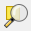
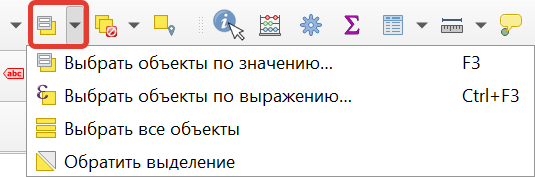
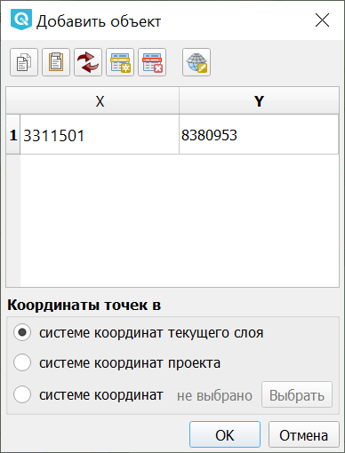

.. sectionauthor:: Дмитрий Барышников <dmitry.baryshnikov@nextgis.ru>

.. _ngqgis_editing:

Редактирование
==============

.. _ngqgis_editing_attr_table:

Работа с таблицей атрибутов
-----------------------------

У векторных слоёв имеются атрибуты, которые описывают свойства объектов слоя. Их используют 
для настройки отображения данных. Атрибуты векторных объектов хранятся в таблице. Для того, чтобы просмотреть её, выделите нужный слой, затем в главной панели в меню **Слой** выберите **Таблица атрибутов**.

   Открытие таблицы атрибутов

Второй вариант - в контекстном меню слоя выберите **Открыть таблицу атрибутов**.

   
   Таблица атрибутов к выбранному слою

Каждый столбец таблицы атрибутов называется полем, каждая строка — записью. Каждая запись таблицы 
атрибутов соответствует одному объекту в векторном слое. Столбцы - это атрибуты слоя. 
Aтрибутивные записи объекта слоя связаны с геометрией объекта. Геометрия объекта 
отображается на карте. 

Таблицу атрибутов может также демонстрироваться в виде формы, тогда слева будет список всех объектов слоя, а справа - атрибуты выбранного объекта.

   
   Таблица атрибутов в виде формы

Можно настроить, чтобы таблица атрибутов открывалась в отдельном окне, а можно - 
чтобы она всегда была внутри основного окна программы. Для этого в меню "Параметры" нужно выбрать вкладку "Источники данных" и установить флажок **Открывать таблицу атрибутов в закрепленном окне**.

   Настройка таблицы атрибутов

Можно настроить, чтобы объекты из одного слоя, но с разными атрибутами отображались 
с разным оформлением. См. :ref:`ngq_vector_styles`.

Если к атрибуту подключен справочник, то при редактировании записи значение этого атрибута выбирается из списка в выпадающем меню.

В таблице атрибутов чаще всего используются следующие кнопки:

1. Сортировка по полю (треугольник, появляющийся при наведении на заголовок столбца, указан стрелочкой на :numref:`ngqgis_UIAttributeTable4`).

   Кнопки в таблице атрибутов. Стрелкой показана сортировка по полю

2. |button_edit| Включить режим редактирования слоя. Теперь в слое можно править значения как в электронной таблице, так и править геометрию.
3. |button_save| Сохранить правки в этом слое (отдельно от сохранения всего проекта). 
4. |button_delete_feature| Удалить выделенные обьекты.
5. |button_deselect| Снять выделение с объектов. 
6. |button_pan_map| Переместить карту на выделеный объект или несколько объектов.
7. |button_zoom| Изменить масштаб карты на выделенный объект или несколько выделенных объектов.
8. |button_cut_copy_paste| Вырезать-копировать-вставить выделенные объекты (вместе с геометрией). 
9. |button_attr_add_delete| Удалить или добавить атрибут (столбец).
10. |button_calculator| Запуск калькулятора полей. Добавляется новый столбец со значениями по формулам, как в Excel.

.. |button_delete_feature| image:: _static/button_delete_feature.png

.. |button_deselect| image:: _static/button_deselect.png

.. |button_calculator| image:: _static/button_calculator.png

   Пример использования выражения для поиска обьектов в слое по значениям.
   
   Цифрами обозначено: 1. Кнопка выбора меню. 2. Поле ввода имени.   

.. _ngqgis_editing_identify:

Идентификация
--------------------

В :program:`NextGIS QGIS` есть возможность, нажимая на объекты векторных слоёв на карте мышью,
просматривать их атрибуты. Это называется "Идентификация".

   
   Работа инструмента идентификации
   
   Выберите инструмент идентификации (1). 
   Щёлкните на каком-нибудь объекте на карте (2). На экран выведутся его атритуты (3). 
   В панели инструментов "Результат определения" (4) можно настроить, что именно 
   будет показываться на экране при нажатии: будет ли открываться отдельное окно 
   или нет.
   
Инструмент идентификации можно использовать для интерактивного вычисления площадей и длин объектов, `подробнее <https://docs.nextgis.ru/docs_ngqgis/source/area.html>`_.

.. note::
   При идентификации, если включён режим "Открывать форму", то при нажатии на несколько 
   объектов по очереди, выделение может не сниматься. Это не является ошибкой: где-то 
   на дисплее остаются открытые окна идентификации, поэтому они и остаются красными. 

.. _ngqgis_select_feature:

Выбор объектов
------------------------------------

Выделять объекты можно многими способами.

* Выбирать в таблице атрибутов. Там можно быстро отсортировать объекты по полю, и выделить только нужные объекты
* Выбирать мышкой на карте.
* Выбирать выражением QGIS. В выражениях доступны так же переменные расчитываемые QGIS, такие как площадь в квадратных метрах.
* Фильтровать на стороне провайдера выражением. Провайдер данных выполнит написаный вами SQL-запрос по атрибутам, и вернёт только соответствующие объекты. Это намного быстрее чем фильтровать выражением, но сложнее работать с геометрией. 
* Выбирать пространственным запросом через плагин. Используется если нужно выделить объекты в одном слое, пересекающиеся с другим слоем.

.. _ngqgis_select_attr_table:

Выделение объектов в таблице атрибутов
^^^^^^^^^^^^^^^^^^^^^^^^^^^^^^^^^^^^^^^
   

   
   Выделение нескольких объектов.  В таблице атрибутов - режим "Выделенные объекты".
   
   Цифрами обозначено: 1. Кнопка панели инструментов для выделения объектов 2. Выделенные объекты. 
   3. Кнопка выбора режима Выделенные объекты. 4. Выделенные объекты в таблице атрибутов.
   
Рядом есть жёлтая иконка выделения объектов |button_select|. Она выделяет объекты в том слое, 
который выбран в меню слоёв. Выделенные объекты подсвечиваются в таблице атрибутов, 
их можно скопировать или удалить. 

.. _ngqgis_select_on_map:

Выделение объектов на карте
^^^^^^^^^^^^^^^^^^^^^^^^^^^

  
.. figure:: _static/UISelectButtons.png
   :name: ngqgis_UISelectButtons
   :align: center
   
   Инструменты выделения в панели инструментов
   
Для выделения векторных объектов выберите слой, и нажмите кнопку |button_select| **Выбрать объекты**. Выделять объекты можно по клику или обводя область рамкой. Рамка может быть прямоугольной, полигональной, произвольной или круглой формы.

   
   Варианты формы выделения

Может быть выделено несколько объектов по очереди с нажатой клавишей ``Ctrl``. Правее имеется кнопка **Снять выделение**.

   
   Снятие выделения

Рядом есть кнопка с меню, в котором есть опции "Выбор по значению", "Выбор по выражению", "Выбрать все объекты" и "Обратить выделение".

   
   Дополнительные опции выбора объектов

.. _ngqgis_select_by_expression:

Выделение объектов по выражению
^^^^^^^^^^^^^^^^^^^^^^^^^^^^^^^^^

Выберите инструмент |button_select_expression| Выбор объекта по выражению" в выпадающем меню панели инструментов "Панель выбора объектов" или в панели инструментов таблицы атрибутов.

Разверните группу "Поля и значения".

Двойным кликом добавьте нужное поле.

В открывшейся справа панели нажмите "Уникальные". В появившемся списке значений поля выберите нужное и двойным кликом добавьте его. 

Составьте выражение, например: ``"fid" = 42``, ``"HIST_CAT"  =  'museum'``

Нажмите **Выбрать объекты**. Все объекты, удовлетворяющие запросу, будут выделены.

   
   Выбор объектов с помощью выражения

.. _ngqgis_filter_table:

Фильтры (отбор значений)
------------------------------------

Имеется два способа отфильтровать таблицу по значениям. 

1. Контекстное меню слоя ‣ Фильтр.
2. Таблица атрибутов слоя ‣ Кнопка "Фильтр" ‣ Выражение. 

.. figure:: _static/UIFilterOpen.png
   :name: ngqgis_filter_open
   :align: center
   :width: 10cm
   
   Вызов окна фильтра

На экран выведется диалоговое окно, в которое нужно будет ввести выражение. Те записи, 
для которых это выражение будет истинно, будут показываться в таблице, остальные - 
скроются из таблицы, но останутся в файле.

Примеры выражений:

.. code-block:: sql

   "leaf_length" < 10
   "temp" > 5 AND "temp" < 10

Операции, запускаемые через меню "Вектор", будут выполняться только для тех записей, 
которые отображаются в таблице.

Эти два способа фильтрации работают на разном уровне. 
Первый вариант выполняется библиотекой GDAL на уровне провайдера. Он не видит виртуальных 
полей и недоступен для некоторых типов данных, например :term:`CSV`. При работе с :term:`WFS`, :term:`PostGIS`, 
:term:`ESRI Shapefile` и другими базами данных он должен выполняться быстрее.
Второй вариант выполняется на уровне NextGIS QGIS. Он видит виртуальные поля, и ему доступны 
все функции, которые видны в калькуляторе полей. Например можно выводить на экран 
только водоёмы с площадью больше определённого предела. 

Диалект SQL используемый в первом способе описан в документации GDAL: https://gdal.org/user/ogr_sql_dialect.html.

В добавление к арифметическим и другим функциям, в фильтре слоя доступны логические операторы. Это  =, !=, <>, <, >, <=, >=, LIKE и ILIKE, BETWEEN и IN. != то же самое что <>, сравнение строк регистронезависимо, операторы <, >, <= , >=, LIKE, ILIKE  зависят от регистра.

Оператор LIKE принимает строку - шаблон, с которым сравнивается атрибут. Символ ``%`` обозначает совпадение с любым количеством символов, символ ``_`` обозначает совпедение с одним символом.

.. code-block:: sql

   "NAME" LIKE 'Москов%'
   
Оператор IN принимает список значений, и выдаёт True, если атрибут совпадает с одним из участников списка.

.. code-block:: sql

   "HIGHWAY" IN ('primary','secondary')

Оператор BETWEEN выдаёт True, если атрибут находится между двумя значениями. Его синтаксис ``"field_name BETWEEN value1 AND value2"`` эквивалентен ``"field_name >= value1 AND field_name <= value2"``.

Оператор IS NULL выдаёт True, если атрибут пустой, IS NOT NULL выдаёт True, если атрибут не пустой.

При выполнении фильтра в таблице, генерируется запрос такого вида: ``"guid" ILIKE '{59BB1DC1-D72E-4CF5-9162-5194EEAB1958}'``, то есть в строку поиска нужно вставлять искомую строку "как есть", без кавычек.

.. _ngqgis_expressions:

Построение выражений
-----------------------------------

Выражения в QGIS - мощный способ для 

* изменения значений атрибутов
* изменения геометрий
* динамического изменения стилей
* динамического изменения текстов, положения, цветов и оформления подписей
* выборки, фильтрации, удаления объектов
* создания и расчёта значений полей

Эти операции можно выполнять как с записью данных на диск, так и с вычислением каждый раз "на лету".

Ввод выражений происходит в диалоге "Построитель выражения". Он запускается из разных частей QGIS:

* Кнопка ε |button_select_expression| в панели выбора объектов
* Инструмент |button_select_expression|"Выделить объекты, удовлетворяющие условию" в панели инструментов таблицы атрибутов
* Калькулятор полей |button_calculator|
* Переопределение значений в диалогах настройки стиля
* Генератор геометрии
* Некоторые инструменты анализа данных.

.. _ngqgis_expressions_lang:

Язык выражений в калькуляторе полей QGIS
^^^^^^^^^^^^^^^^^^^^^^^^^^^^^^^^^^^^^^^^^^^

``"FIELDNAME"`` - названия других полей записываются в двойных кавычках

``'улица'`` - строковые константы записываются в одинарных кавычках

Для составления выражения в списке вам доступны функции, другие поля этого же объекта, и системные константы (со знаком $)

Список некоторых часто используемых функций. Полный список привести в документации невозможно, если вы хотите ознакомиться подробнее - прочтите описания всех функций в окне калькулятора полей. Часто оказывается что одну задачу можно сделать несколькими способами. Например, если вам нужно получить площадь буфера вокруг каждой точки - можно расчитать её в калькуляторе полей, а можно сгенерировать новый слой с буфером, и расчитать площадь его объектов. 

Преобразования

* to_int, to_string, to_real, to_date, to_datetime, to_time - конвертирует значение в конкретный тип данных. Некоторые функции QGIS требуют полей заданного типа, например раскраска по значениям работает только с числами, не со строками.
* to_decimal, to_dms - конвертирует координаты из градусов-минут-секунд в десятичные градусы и обратно: ``to_decimal('6°21'16.445') → 6.3545680555``, 
``to_dms(6.1545681, 'x', 3) → 6°9′16.445″``

Условные операторы

* if(condition,result_when_true,result_when_false) - Проверяет условие и возвращает результат в зависимости от результата проверки.
* CASE - Возвращает результат одного из нескольких условий
* coalesce - Принимает несколько условий, возвращает первое из них которое IS NOT NULL.
* nullif - Заменяет конкретное значение на NULL (эквивалентно Replace)

Геометрия

* $geometry - возвращает геометрию текущего объекта
* geometry(feature) - возвращает геометрию объекта по id
* $area, $lenght, $perimeter - возвращает измерения текущего объекта с учётом настроек эллипсоида и единиц измерения в проекте
* area($geometry), lenght($geometry), perimeter($geometry) - измерения текущего объекта в единицах измерения его слоя
* geom_to_wkb($geometry), geom_to_wkt($geometry), x(geometry), y(geometry) - конвертация геометрии в строковое представление, получение числовых координат одной точки
* point_n(geometry,index) - возвращает геометрию точки из линии/полигона по номеру

.. _ngqgis_editing_field_calc:

Калькулятор полей
^^^^^^^^^^^^^^^^^^^^^^

Этот инструмент добавляет к векторному слою новый атрибут, и заполняет его значениями расчитаными по формуле. Запускайте калькулятор полей из таблицы атрибутов слоя.
В окне задайте название добавляемого атрибута, его тип данных, и формулу. Просмотрите список функций - при нажатии по ним открывается описание.

Калькулятор полей можно использовать для подсчета длин и площадей объектов, `подробнее <https://docs.nextgis.ru/docs_ngqgis/source/area.html>`_.
   

.. _ngqgis_editing_geometry:

Редактирование геометрий
--------------------------

Для того что бы редактировать геометрии или создавать новые, необходимо иметь векторный слой. 
О создании векторного слоя см. подраздел :ref:`ngq_create_new_layer`. 

Редактирование геометрий так же может называться **оцифровкой**. Все возможности редактирования 
векторных слоев разделены между панелями:

1. "Инструменты оцифровки". 
2. "Дополнительные инструменты оцифровки".

 
   Панель "Инструмены оцифровки"  
   

   
   Панель "Дополнительные инструменты оцифровки"

Для рисования включите панель инструментов "Инструменты оцифровки". См. подраздел :ref:`ngq_label_toolbars` про включение панелей.

По умолчанию, NextGIS QGIS подгружает слои, делая их доступными только для чтения. 
Это защита от непреднамеренного редактирования слоя, что случается, например, при 
неловком движении манипулятором мыши. Любой слой можно переключить в режим редактирования 
(если источник данных поддерживает запись и есть разрешение на запись).
При выходе из режима редактирования правки сохраняются в файл слоя или в базу данных. 
Для начала редактирования выделите слой в списке слоёв и нажмите кнопку с карандашом на 
панели редактирования. Любое редактирование начинается с выбора функции |button_edit| **Режим редактирования**. 

Для того, чтобы начать или закончить редактирование также можно использовать кнопку 
**Режим редактирования** на панели Инструментов оцифровки. После того, как слой стал 
доступным для редактирования, над каждой вершиной появятся специальные маркеры и 
станут доступными к использованию кнопки с дополнительными функциями из панели инструментов.

.. note::
   **Регулярное сохранение**
   
   Не забывайте нажимать |button_save_layer_edits| **Сохранить изменения** регулярно. Это позволит 
   не только сохранить последние изменения, но и удостовериться, что источники 
   данных могут принять все сделанные изменения.

.. _ngqgis_editing_geometry_add:

Добавление объектов
^^^^^^^^^^^^^^^^^^^^^^^^^^^^
 
Для добавления объектов можно использовать кнопки на панели инструментов: 

* Создать точку, 
* Создать линию, 
* |button_add_polygon| Создать полигон, 

чтобы переключить NextGIS QGIS в режим редактирования.

Для каждого объекта сначала идет оцифровка формы, а затем добавляются атрибуты. 
Чтобы начать оцифровку и создать первую точку нового объекта, надо нажать левой 
кнопкой мыши в области карты.

Для продолжения линий и полигонов надо продолжать нажимать на левую кнопку мыши 
для создания каждого дополнительного узла. Чтобы закончить редактирование объекта, 
щелкните правой кнопки мыши в любом месте карты, что подтвердит окончание
редактирования данного объекта. При этом, появится окно атрибутов для ввода 
информации для нового объекта. Во вкладке "Оцифровка" из меню ``Параметры`` можно 
также активировать функции "Отключить форму ввода атрибутов для каждого 
создаваемого объекта" и "Использовать последние введённые значения".

Двигать созданные объекты можно с помощью опции |button_move_feature| **Переместить объект**  на панели инструментов "Дополнительные инструменты оцифровки".

**Типы значений атрибутов**

При редактировании :term:`ESRI Shapefile` типы атрибутов проверяются во время ввода. Поэтому 
невозможно ввести числовое значение в текстовое поле диалога "Атрибуты" или наоборот. 
Если это сделать все же необходимо, то следует отредактировать атрибуты на следующем 
шаге в диалоге "Таблица атрибутов".

.. _ngqgis_editing_geometry_vertex:

Редактирование узлов
^^^^^^^^^^^^^^^^^^^^^

Как для слоев данных :term:`PostGIS`, так и для слоев, состоящих из ESRI Shapefile, 
|button_vertex_tool| **Редактирование узлов** предоставляет возможности изменения узлов объектов, 
аналогичные имеющимся в программах :abbr:`CAD (Computer-Aided Design)`. 
Можно выделить сразу множество вершин и 
перемещать, добавлять или удалять их все вместе. Инструмент редактирования узлов также поддерживает 
топологическое редактирование объектов. Этот инструмент, в отличие от остальных 
инструментов NextGIS QGIS, довольно "настойчивый": так, когда некоторая операция 
выполнена, инструмент продолжает оставаться активным, а объект выделенным. Если 
инструмент редактирования узлов не может обнаружить объекты, на дисплей выдается 
предупреждение.

Важно правильно установить ``Настройки ‣ Параметры ‣ Оцифровка ‣ Радиус поиска для редактирования вершин``, 
значение должно быть больше нуля. В противном случае NextGIS QGIS не распознает редактируемую вершину.

**Маркеры вершин**

Данная версия NextGIS QGIS поддерживает три типа маркировки вершин:

1. Полупрозрачный круг. 
2. Перекрестие. 
3. Без маркера. 

Чтобы изменить стиль маркировки, зайдите в меню "Параметры" 
и на вкладке "Оцифровка" выберите подходящий тип маркировки вершины.

**Выделение вершин**

Включите инструмент |button_vertex_tool| "Редактирование узлов" и выделите объект простым 
нажатием на него. На месте каждой вершины этого объекта появятся красные рамки.

Чтобы выделить несколько узлов одновременно, надо удерживать 
клавишу ``Shift``. Нажатие на ``Ctrl`` используется для инвертирования выделения узлов 
(выделенные узлы становятся невыделенными и наоборот). Также несколько узлов одновременно 
можно выделить, если нажать кнопкой мыши где-нибудь в стороне от объекта и очертить 
прямоугольную область вокруг интересующего множества вершин. Или просто нажать на 
отрезок линии и оба смежных узла будут выделены.

**Добавление узлов**

Добавить узлы также просто. Двойной щелчок мыши рядом с отрезком линии добавит 
новую вершину рядом с положением курсора. 

.. note:: 
   Обратите внимание, что вершина появится 
   на ребре объекта, а не точно в месте курсора, но при необходимости ее можно переместить.

**Удаление узлов**

После выделения вершин для их удаления надо нажать клавишу ``Delete``, вершины будут 
удалены. 

.. note::
   Обратите внимание, что, согласно стандарту NextGIS QGIS, необходимое количество 
   узлов для каждого типа объекта все же останется. Чтобы полностью удалить объект, 
   надо использовать другой инструмент, а именно |button_delete_feature| "Удалить выделенное".

.. |button_delete_feature| image:: _static/button_delete_feature.png

**Перемещение узлов**

Выделите все вершины, которые собираетесь перемещать. Все выделенные вершины будут 
перенесены в направлении курсора. Если активна функция прилипания, все вершины могут 
перескочить на ближайшие узлы или линии.

При отпускании кнопки мыши все изменения будут сохранены и появятся в диалоге отмены. 
Запомните, что все операции поддерживают топологическое редактирование, когда оно 
включено. Кроме того, инструмент 
редактирования показывает всплывающие подсказки при наведении указателя мыши на узел.

.. todo::
   Поставить гиперссылку на раздел про ввод координат с клавиатуры.

.. _ngqgis_editing_geometry_save:

Сохранение отредактированных слоев
^^^^^^^^^^^^^^^^^^^^^^^^^^^^^^^^^^^^^^^^^^

Когда слой находится в режиме редактирования, любые изменения сохраняются только 
в памяти NextGIS QGIS. Изменения не сохраняются непосредственно на диск. Если необходимо 
сохранить изменения в текущем слое и при этом продолжать его редактирование, то 
нужно нажать на кнопку |button_save_layer_edits| **Сохранить изменения**. Если выключить режим 
редактирования, нажав на |button_edit| **Режим редактирования** (или просто 
выйти из NextGIS QGIS), то появится запрос программы на сохранение изменений.

   
   Запрос на сохранение изменений при выходе из режима редактирования

Если изменения не могут быть сохранены (например, диск полон или атрибуты имеют 
неверное значение), NextGIS QGIS сохранит их в своей памяти. Это позволит откорректировать 
изменения и попробовать еще раз сохранить изменения на диск.

Выпадающее меню |button_current_edits| **Текущие изменения** позволяет выбрать: сохранить изменения для всех слоёв или только для выделеных. Также с его помощью можно откатить измерения и отменить их.

   
   Меню "Текущие изменения"

.. tip::
   Целостность данных. Создание резервной копии данных перед началом редактирования — 
   это всегда хорошая идея. Несмотря на то, что авторы NextGIS QGIS сделали все 
   возможное для сохранения ваших данных, они по-прежнему не дают никаких гарантий 
   в этом отношении.

.. _ngqgis_advanced_digitizing:

Дополнительные возможности редактирования векторного слоя
^^^^^^^^^^^^^^^^^^^^^^^^^^^^^^^^^^^^^^^^^^^^^^^^^^^^^^^^^^^^^

1.  |drawing_tools_btn_undo| Отменить

.. |drawing_tools_btn_undo| image:: _static/drawing_tools_btn_undo.png

2. |drawing_tools_btn_redo| Вернуть 

.. |drawing_tools_btn_redo| image:: _static/drawing_tools_btn_redo.png

Инструменты **Отменить** и **Вернуть** позволяют отменить либо вернуть 
последний или какой-либо конкретный шаг при редактировании векторных данных. При этом 
состояние всех объектов и их атрибутов возвращается на шаг назад. 

3. |drawing_tools_btn_rotate| Повернуть объект

.. |drawing_tools_btn_rotate| image:: _static/drawing_tools_btn_rotate.png

Выделите объект и нажмите кнопку поворота. Объект можно будет вращать мышью. После 
вращения его геометрия пересчитается с учётом искажения проекции. Можно вращать группу объектов.
С нажатой клавишей ``Ctrl`` можно перетащить точку центра поворота (отображается красным плюсом).

4. |drawing_tools_btn_simplify| Упростить объект

.. |drawing_tools_btn_simplify| image:: _static/drawing_tools_btn_simplify.png

Инструмент **Упростить объект** позволяет уменьшить количество вершин объекта, при этом, 
геометрия объекта не изменяется. Необходимо выделить объект, после чего он будет 
подсвечен красным и появится окно. При движении значений красная опоясывающая 
линия меняет свою форму, показывая тем самым, как именно объект будет упрощен. Если 
нажать кнопку **OK**, новая упрощенная геометрия будет сохранена. Если объект не может 
быть упрощен (например, мультиполигоны), появится всплывающее окно предупреждения.

5. |drawing_tools_btn_addring| Добавить кольцо:

.. |drawing_tools_btn_addring| image:: _static/drawing_tools_btn_addring.png

Можно создать кольцевой полигон (с дыркой посредине), используя функцию Добавить кольцо на панели инструментов. 
Внутри существующего полигона можно оцифровать последующий полигон, который превратиться 
в "отверстие", таким образом, только оставшаяся область между границами внешнего и
внутреннего полигона и будет кольцевым полигоном.

6. |drawing_tools_btn_addpart| Добавить часть

.. |drawing_tools_btn_addpart| image:: _static/drawing_tools_btn_addpart.png

Можно использовать **Добавить часть** для добавления новых полигонов к мультиполигональным
объектам. Новая полигональная часть должна быть создана за границами мультиполигона.

7. |button_fill_ring| Заполнить кольцо

.. |button_fill_ring| image:: _static/button_fill_ring.png

Нарисуйте полигон над уже существующим полигоном. Появится новый объект, а в существующем полигоне на его месте будет дырка.

8. |drawing_tools_btn_DeleteRing| Удалить кольцо

.. |drawing_tools_btn_DeleteRing| image:: _static/drawing_tools_btn_DeleteRing.png

Инструмент **Удалить кольцо** удаляет дырки внутри полигона. Им нужно нажимать на дырку.
Этот инструмент работает только с полигональными слоями. Никакик изменений 
не произойдет, если инструмент применяется на внешнем контуре полигона. Инструмент 
может применяться как для полигональных объектов, так и на мультиполигональных. 
Перед тем, как выделить вершины кольца, настройте порог прилипания для вершин.

9. |drawing_tools_btn_DeletePart| Удалить часть

.. |drawing_tools_btn_DeletePart| image:: _static/drawing_tools_btn_DeletePart.png

Инструмент **Удалить часть** позволяет удалять части мультиполигональных объектов (например, 
удалить полигон мультиполигонального объекта). Инструмент не сможет удалить последнюю
часть объекта. Она останется нетронутой. Инструмент работает со всеми типами геометрии: 
точками, линиями, полигонами. Перед тем, как выделить вершины части, необходимо 
настроить порог прилипания для вершин.

10. |drawing_tools_btn_Reshape| Корректировать форму:

.. |drawing_tools_btn_Reshape| image:: _static/drawing_tools_btn_Reshape.png

Инструмент работает для линий и полигонов. Им рисуется ломаная линия, в конце нужно 
нажать правую кнопку мыши. Если начать линию снаружи полигона, провести её внутри полигона, 
и закончить за границей, то из полигона вырежется и удалится кусок. Если начать линию 
изнутри полигона, вывести за границу и закончить внутри полигона, то у полигона появится вырост.

.. figure:: _static/drawing_tools_btn_ReshapeDraw1.png

   Линия проведена снаружи полигона.

.. figure:: _static/drawing_tools_btn_ReshapeDraw2.png

   Из полигона вырезается кусок.

.. figure:: _static/drawing_tools_btn_ReshapeDraw3.png

   Линия проведена изнутри полигона.

.. figure:: _static/drawing_tools_btn_ReshapeDraw4.png

   К полигону добавляется вырост.
   
.. figure:: _static/drawing_tools_btn_ReshapeDraw5.png

   Инструмент корректирования формы применяется к линии.

.. figure:: _static/drawing_tools_btn_ReshapeDraw6.png

   Изменена форма линии.
   

Редактирование нескольких полигональных объектов одновременно невозможно, 
так как при этом будут создаваться полигоны с ошибочной геометрией.

.. note::
   Инструмент корректировки объектов может изменять начало кольца полигона или
   замкнутой линии. Так, точка, представленная "дважды", больше не будет таковой. Это 
   не должно быть проблемой при использовании большинства приложений, но, тем не менее, 
   это необходимо иметь в виду.

11. |drawing_tools_btn_OffsetCurve| Параллельная кривая

.. |drawing_tools_btn_OffsetCurve| image:: _static/drawing_tools_btn_OffsetCurve.png

Инструмент **Параллельная кривая** предназначен для параллельного переноса линий и колец 
полигона. Инструмент может применяться к редактируемому слою (в этом случае изменяются 
объекты) или же к фоновым слоям (в этом случае создаются копии линий/колец и добавляются 
в редактируемый слой). Таким образом, он идеально подходит для создания линейных 
слоёв с фиксированным шагом. 
Размер смещения отображается в нижней левой части строки состояния.

12. |drawing_tools_btn_splitFeatures| Разделить объекты

.. |drawing_tools_btn_splitFeatures| image:: _static/drawing_tools_btn_splitFeatures.png
   :width: 7mm

Инструмент **Разделить объекты** разрезает объект на фичи.  Получается два объекта с одинаковыми атрибутами.

.. figure:: _static/drawing_tools_btn_plitFeatures1.png
   :width: 20cm

   Исходный объект

.. figure:: _static/drawing_tools_btn_plitFeatures2.png
   :width: 20cm

   Разрезаный объект, получаются две фичи с одинаковыми атрибутами.
 
13. |drawing_tools_btn_splitParts| Разделить части.

.. |drawing_tools_btn_splitParts| image:: _static/drawing_tools_btn_splitParts.png
   :width: 7mm

Инструмент **Разделить части** работает только для слоёв с мультигеометриями, разрезает объект 
на части. Получается один мультиполигональный объект из двух частей.

.. figure:: _static/drawing_tools_btn_splitParts1.png
   :width: 20cm

   Исходный объект

.. figure:: _static/drawing_tools_btn_splitParts2.png
   :width: 20cm

   Разрезаный объект, в таблице атрибутов видно, что объект остаётся один.
 

14. |drawing_tools_btn_mergeFeatures| Объединить выбраные объекты

.. |drawing_tools_btn_mergeFeatures| image:: _static/drawing_tools_btn_mergeFeatures.png

Этот инструмент позволяет объединять объекты, которые имеют общие границы и атрибуты.

15. |button_merge_attributes| Объединить атрибуты выбранных объектов

Этот инструмент позволяет объединять атрибуты нескольких объектов без их объединения 
в один объект.

16. Оцифровать с кривой

Позволяет рисовать кривые в слоях, геометрия которых это допускает. Кривая задается тремя точками: началом, концом и точкой арки.

17. |button_trim_extend| Отсечь / вытянуть

18. Обратить направление линии

19. |button_rotate_point_symbols| Повернуть значки

20. |button_enable_advanced_dig_tools| Включить дополнительные функции оцифровки. Активна, если выбрано действие "Добавить объект".

Вызывает дополнительную панель оцифровки.

Панель содержит несколько полей, рядом с каждым из которых находятся замочки. Одинарный замок фиксирует параметр до следующего клика. Двойной замок фиксирует параметр на постоянной основе.

Чтобы зафиксировать текущее значение, нажмите Ctrl + букву, соответствующую полю.

Поля **X** и **Y** показывают координаты курсора. Если зафиксировать одну из координат, на карте появится пунктирная линия, вертикальная или горизонтальная соответственно, и точку можно будет будет поставить только на ней.

**d** - расстояние до следующей точки. Если оно зафиксировано, на карте вы увидите пунктирную окружность с центром в поставленной точке.

**a** - азимут, угол по отношению к предыдущему отрезку. Если азимут зафиксирован, на карте вы увидите пунктирную линию под заданным углом.

Также можно ввести и зафиксировать параметры  Z и M для слоёв, которые их поддерживают.

   Добавление линейного объекта: зафиксировано расстояние d и азимут a. В полях X и Y отображаются координаты точки, отмеченной на карте.

.. todo::
   Картинки про рисование

.. _ngqgis_editing_geometry_snap:

Прилипание
--------------

.. figure:: _static/snapping_map.png
   :name: ngqgis_snapping_map
   :align: center
   :width: 14cm
 
   Оцифровка с включёным прилипанием, фиолетовый курсор показывает что линия прилипает.

**Порог прилипания** — это расстояние, используемое NextGIS QGIS, для поиска ближайшего 
узла и/или сегмента, к которому надо присоединиться при создании нового узла или 
передвижении уже существующего. Если превысить порог прилипания, то при нажатии 
кнопки мыши узел будет создан "в стороне", вместо того, чтобы быть привязанным к 
уже существующему узлу и/или сегменту. 

**Режим** прилипания определяет, к какому типу объектов происходит присоединение (можно выбрать несколько):

1. К вершинам. 
2. К сегментам. 
3. К центроидам
4. К середине отрезка.
5. К конечным точкам линии.
6. К площади.

Также можно определить значения по умолчанию для **единиц измерения** порога прилипания 
и радиуса поиска для редактирования вершин. Эти величины могут быть установлены 
как в единицах карты, так и в пикселах. 
Преимущество использования пикселов в качестве единиц заключается в том, что при 
зуммировании порог прилипания не будет изменяться.

**Настройки прилипания по умолчанию** задаются в меню ``Параметры`` на вкладке ``Оцифровка``.

.. figure:: _static/Settings_Digitizing_ru.png
   :name: ngqgis_adhesion
   :align: center
   :width: 20cm
 
   Задание настроек по умолчанию для прилипания

Кроме того, параметры прилипания можно настроить для **проекта** в целом или для **отдельных его слоёв**. Для этого нужно перейти в ``Проект ‣ Параметры прилипания`` и в выпадающем меню выбрать, применить настройки *ко всем слоям* или *к текущему слою*.

   
   Выбор области применения настроек: ко всему проекту или отдельному слою

.. note::
   Обратите внимание, что величина порога прилипания для отдельного слоя имеет преимущество над общим порогом прилипания, установленным на вкладке "Оцифровка". 

Таким образом, если надо отредактировать один слой и прилепить его вершины к другому слою, необходимо 
активировать "прилипание к" для слоя, затем снизить общий порог прилипания 
для проекта до меньшего значения. 

Кроме того, прилипание невозможно для слоя, не 
активизированного в диалоговом окне параметров прилипания, независимо от параметров 
общего прилипания. Поэтому необходимо убедиться, что у слоя, к которому необходимо 
применить прилипание, стоит флажок.

.. note:: 
   Прилипание к сегментам работает, но как правило выдаёт точку, не находящуюся на сегменте. Это происходит из-за перепроецирования на лету, провисания линии и другой математики. Надёжнее будет, если вы будете прилипать только к вершинам (то есть получившиеся геометрии будут такими, как вы себе представляете). 
  

.. _ngqgis_editing_geometry_topo:

Топологическое редактирование
--------------------------------

Топологическое редактирование позволяет работать с объектами, имеющими общую границу. Если этот режим включен, вы можете двигать вершины или сегменты, изменяя одновременно геометрию соприкасающихся объектов. Топологическое редактирование может работать на нескольких слоях одновременно, при условии, что все они видимы и находятся в режиме редактирования.

Для активации этого режима перейдите в ``Проект ‣ Параметры прилипания`` (см. :numref:`snap_settings_project_pic`)  и нажмите кнопку **Топологическое редактирование**.

При рисовании новых полигонов они могут не накладываться на старые, а соприкасаться. Для активации этого режима перейдите в ``Проект ‣ Параметры прилипания`` и в выпадающем меню наложения выберите **Вычитать наложения на текущем слое**.

.. figure:: _static/overlap_settings_ru.png
   :name: overlap_settings_pic
   :align: center
   :width: 20cm
   
   Параметры прилипания. 1 - Включение топологического редактирования. 2 - Выбор режима обработки наложений.

.. figure:: _static/topological_editing_map.png
   :name: ngqgis_topological_editing_map
   :align: center
   :width: 16cm
 
   Топологическое редактирование. Полигон, примыкающий к Москве.
   
   
.. _ngqgis_editing_geometry_copy:

Копирование объектов
-------------------------------------

Выделенные объекты можно удалять, копировать и вставлять из слоя в слой одного 
проекта NextGIS QGIS при условии, что для них включен "Режим 
редактирования".

Объекты также можно вставить во внешние приложения в виде текста: объекты отражаются 
в формате :abbr:`CSV (Comma-Separated Values)`, где их геометрия передается форматом :abbr:`WKT (Well-Known Text)`.

Что случится, если исходный и целевой слой имеют разную структуру (названия полей 
и их типы отличаются)? NextGIS QGIS заполнит совпадающие поля и проигнорирует остальные. 
Если результат копирования атрибутов в целевой слой не имеет значения, то становится 
неважно, в каком виде они там будут представлены. Если в целевом слое необходимо 
сохранить все с точностью — объекты и их атрибуты, необходимо убедиться, что структуры 
исходного и целевого слоя совпадают.

.. note::
   **Соответствие вставляемых объектов**
   
   Если исходный и целевой слой находятся в одинаковой проекции, тогда геометрия 
   вставленных объектов будет идентична исходному слою. Однако если целевой слой 
   находится в проекции, отличной от исходной, тогда NextGIS QGIS не гарантирует 
   идентичность геометрии. Это происходит по причине незначительных ошибок округления, 
   неизбежных при переходе от одной проекции к другой.

.. _ngqgis_join_location:

Пространственное связывание 
--------------------------------------------------------------------------

Пространственное связывание осуществляет присоединение атрибутов по месторасположению.
Этот инструмент принимает 2 слоя, и создаёт новый слой.  Таким образом можно рассчитать:

* Количество автобусных остановок в каждом районе Минска.
* Сумму населения во всех городах, для каждого района Московской области.
* Средний охват ствола ели в сантиметрах в каждом лесном квартале заповедника.

Запуск осуществляется через processing: 
``Вектор ‣ Управление данными ‣ Объединение атрибутов по расположению``.

.. figure:: _static/vector_group_by_area_ru.png
   :name: vector_group_by_area_pic
   :align: center
   :width: 16cm
   
   Вызов инструмента "Объединение атрибутов по расположению"

Инструменту объединения нужно задать 2 слоя. Первый (целевой) - тот, в который 
добавятся атрибуты из пересекающихся объектов второго слоя. 
Рассчёт числовых значений (среднее, медиана) может работать некорректно, если в 
списке зачений встречаются NULL. Попробуйте преобразовать такие значения в 0, используя калькулятор полей.

.. _ngqgis_add_point_coord:

Добавление точек вводом координат
---------------------------------

Добавить точку можно путем ввода ее координат с помощью **расширения NumericalDigitize**.

Перед тем, как добавлять точку, убедитесь, что система координат проекта и точечного векторного слоя установлена правильно.

Перейдя в режим редактирования векторного слоя, нажмите кнопку |button_NumericalDigitize| Numerical Digitize на панели инструментов оцифровки.

В открывшемся окне введите координаты X (долгота) и Y (широта):

   
   Окно ввода координат
   
Нажмите **ОК**, откроется окно ввода атрибутов точки:

   
   Окно ввода аттрибутов

Введите необходимые атрибуты и нажимите **ОК**. Точка появится на карте.
