Формы полей
=============

Для удобства оцифровки QGIS позволяет настраивать форму ввода атрибутов.

Зайдите в Свойства слоя на вкладку Формы полей.

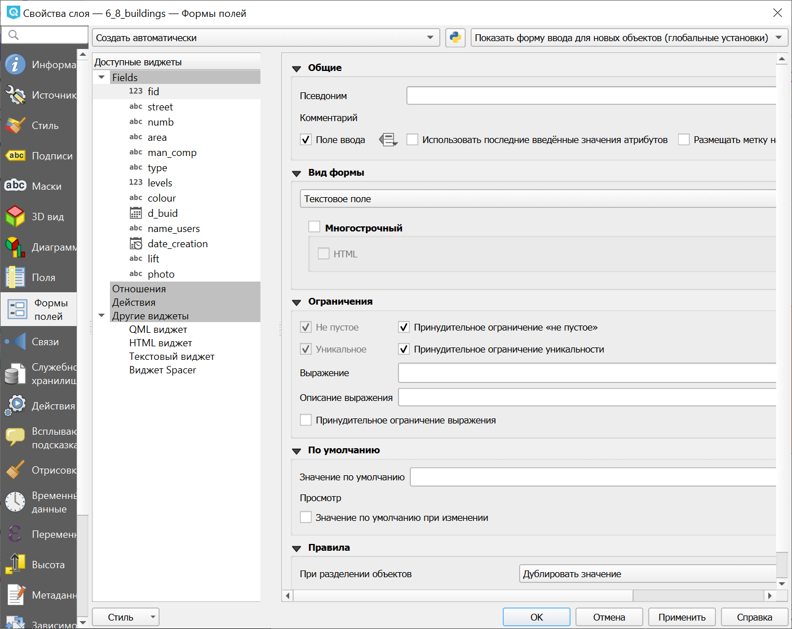

Есть три варианта работы с формами (выбираются в выпадающем меню наверху вкладки):

* Создать автоматически;
* Конструктор форм;
* Из файла.

При автоматическом создании настроенные элементы будут выстроены один за другим в окне формы.

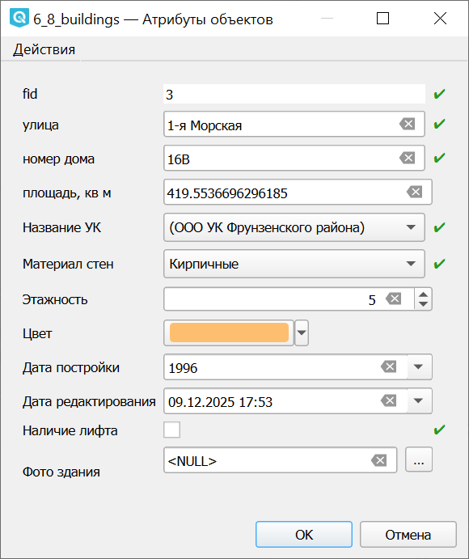

   Форма, автоматически созданная из настроенных полей

Конструктор позволяет распределять поля по вкладкам и выстраивать в нужном порядке, а также настраивать внешний вид формы.

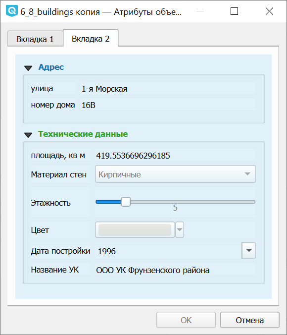

   Форма, созданная в конструкторе

На вкладке Формы полей слева расположен список доступных виджетов:

* Поля
* Отношения
* Действия
* Другие виджеты (QML, HTML, текстовый и Spacer)

Для каждого поля доступны следующие настройки:

Общие:

* **Псевдоним** - отображаемое в интерфейсе ввода название поля;
* Флажок **Поле ввода** - если его снять, значение поля нельзя будет редактировать через форму;
* Флажок **Использовать последние введённые значения атрибутов** - убыстряет процесс, если нужно вводить подряд несколько объектов, у которых значение одного из атрибутов совпадает - например, адреса по одной улице;
* Флажок **Размещать подпись над полем** (по умолчанию - слева от поля).

**Вид формы** - выбирается из выпадающего списка, `доступные варианты <https://docs.nextgis.ru/docs_ngqgis/source/fieldforms.html#widget-type>`_ и дальнейшие настройки зависят от типа данных.

Здесь можно выбрать вид **Скрытое поле**, тогда оно не будет показываться в форме ввода значений атрибутов. Это удобно, если поле `заполняется автоматически <https://docs.nextgis.ru/docs_ngqgis/source/fieldforms.html#widget-default>`_.

**Ограничения** - можно установить, что поле обязательно должно быть:

* непустым;
* уникальным (например, поле fid);
* соответствующим заданному выражению, например, ``not regexp_match(col0,'[^A-Za-z]')`` - только символы латинского алфавита.

Если ограничение установлено, то во время ввода значений при выполнении всех условий рядом с полем отображается зелёная галочка. Если условие не выполнено, рядом с полем отображается оранжевый крестик. Флажок **принудительное ограничение** не позволяет сохранить объект, не выполняющий условия. Без него пользователь будет предупреждён, но сможет сохранить изменения.

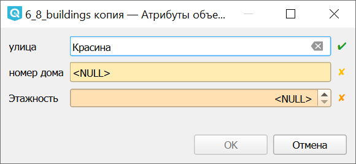

   Поля с ограничениями: выполненным, невыполненным, принудительным - не дающим сохранить объект

Также для поля можно задать `значение по умолчанию <https://docs.nextgis.ru/docs_ngqgis/source/fieldforms.html#widget-default>`_.

.. _widget_type:

Виды форм
-----------

Рассмотрим подробне настройки основых видов форм.

* Флажок
* Текстовое поле
* Карта значений
* Диапазон
* Цвет
* Дата/время
* Вложение
* Скрытое поле

.. _widget_checkbox:

Флажок
~~~~~~

Такое поле имеет два варианта значения: для включённого и отключённого флажка. При этом тип поля не обязан быть логическим, это может быть текстовое поле со значениями "есть" и "нет", "справа" и "слева" и т.п.

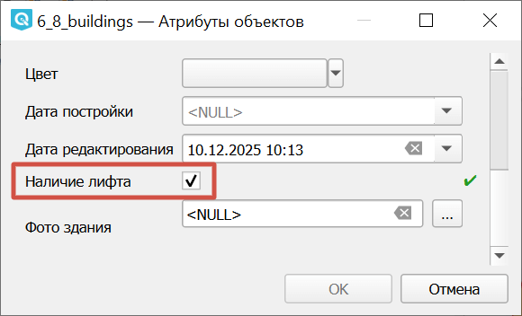

   Флажок в форме

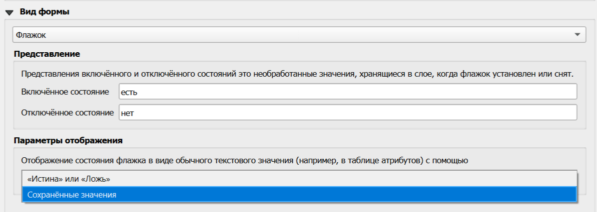

   Настройки флажка

При этом можно выбрать, как отображать значение поле в таблице атрибутов - использовать подставляемые значения или стандартные логические "истина" и "ложь".

.. _widget_textedit:

Текстовое поле
~~~~~~~~~~~~~~

Поле для ввода текста с клавиатуры. Возможные настройки:

* Многострочное - позволяет делать перенос строки внутри поля;
* HTML.

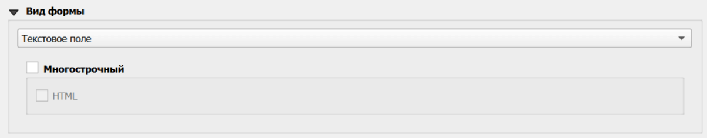

   Настройки текстового поля

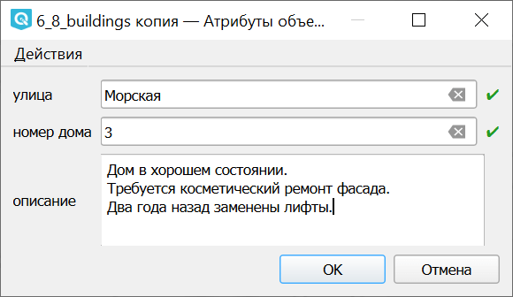

   Форма с текстовыми полями: однострочными и многострочным

.. _widget_valuemap:

Карта значений
~~~~~~~~~~~~~~

Можно предоставить пользователю возможность выбирать значение из выпадающего списка.

Список вариантов состоит из двух колонок, в первой - непосредственно то, что записывается в базу данных слоя, во второй - то, что пользователь видит в выпадающем списке. Колонки могут совпадать между собой, а могут различаться. Например, если поле должно содержать цифровой код или условное обозначение ограниченной длины, а пользователю удобнее ориентироваться по полному развёрнутому названию.

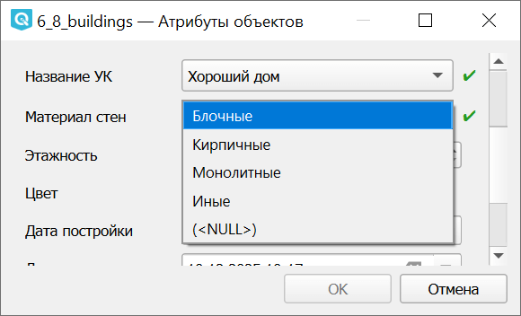

   Два поля с выпадающими списками в форме

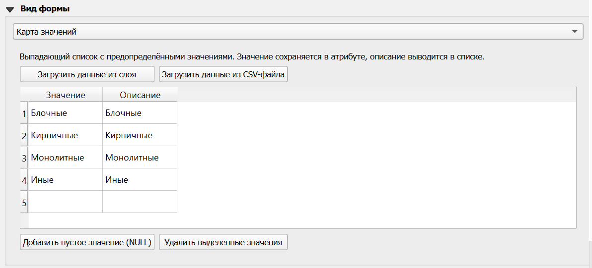

   Настройки карты значений

Список вариантов можно ввести вручную или загрузить из файла в формате CSV.

Для PostgreSQL для полей с типом array также можно установить вид формы **Список** - это будет список возможных значений в одну колонку.

.. seealso:: В Веб ГИС также можно `добавить к слою фиксированный список вариантов значений <https://docs.nextgis.ru/docs_ngweb/source/layers_settings.html#lookup-add-to-field>`_ при помощи ресурса `Справочник <https://docs.nextgis.ru/docs_ngweb/source/create_other.html#ngw-create-lookup-table>`_. 

.. _widget_range:

Диапазон
~~~~~~~~

Поле для ввода числовых значений из заданного диапазона. 

Может представлять собой:

* поле ввода со счётчиком;
* ползунок;
* "циферблат" - круглую ручку управления.

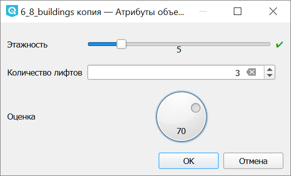

   Три варианта ввода диапазона

Настройки:

* Минимум;
* Максимум;
* Шаг;
* Разрешить значения NULL;
* Подпись единиц.

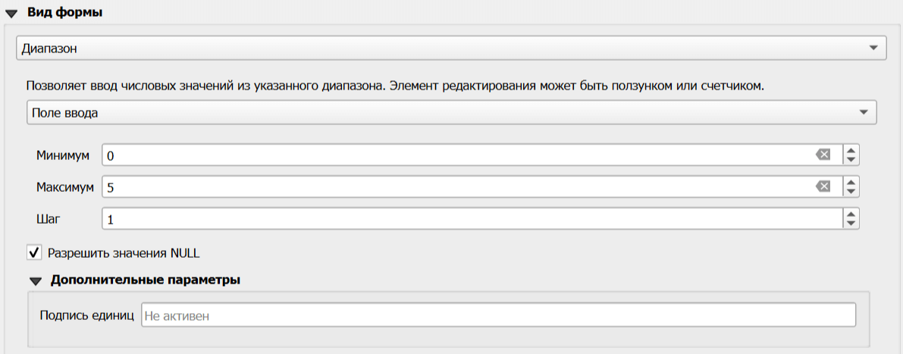

   Настройки диапазона

.. _widget_color:

Цвет
~~~~

В форму добавляется стандартный интерфейс выбора цвета QGIS в двух вариантах. Нажатие на стрелочку вызвает более компактный диалог, на кнопку - более развёрнутый. Выбранный цвет отображается на кнопке.

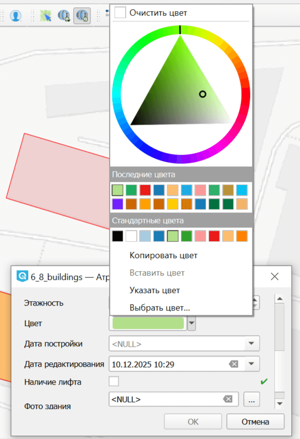

   Выбор цвета в компактном варианте диалога

.. _widget_datetime:

Дата/время
~~~~~~~~~~

Позволяет выбрать дату, используя интерфейс календаря.

Также можно настроить формат записи. По умолчанию выбран формат ISO Qt: yyyy-MM-dd для дат, либо yyyy-MM-ddTHH:mm:ss (например, 2017-07-24T15: 46: 29) или с суффиксом часового пояса (Z для UTC, в противном случае смещение как [+|-]HH:mm), где это уместно для комбинированных дат и времени.

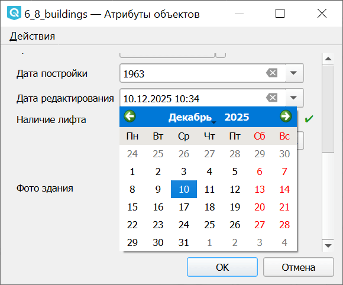

   Поля ввода даты/времени

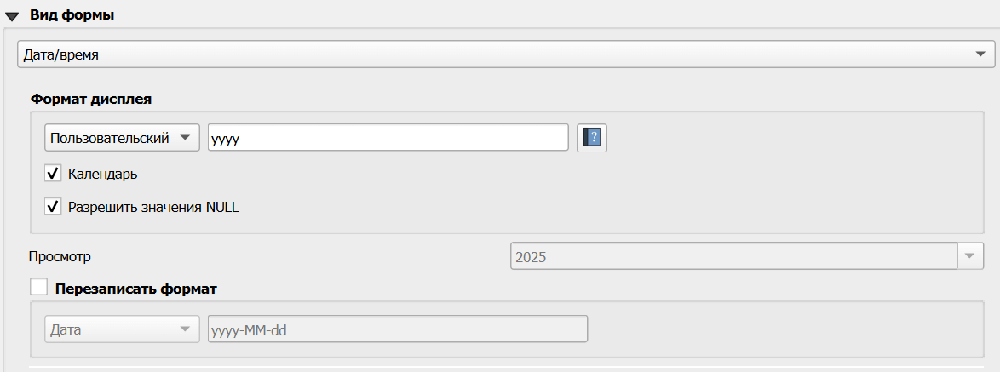

   Настройки поля ввода даты/времени

.. _widget_attach:

Вложение
~~~~~~~~

Тип хранилища:

* Выбрать существующий файл
* Простое копирование
* WebDAV хранилище
* AWS S3

Вариант "Выбрать существующий файл" позволяет просто добавить вложение с устройства. Можно задать **путь по умолчанию**. 

Настраивается:

* способ хранения пути к файлу: Абсолютный или относительный;
* режим хранения: расположение файлов или расположение каталогов.

* **встроенный просмотр вложений**. Он доступен для изображений, аудио, видео и веб-страниц. Размеры миниатюры настраиваются для всех этих типов, кроме аудио.

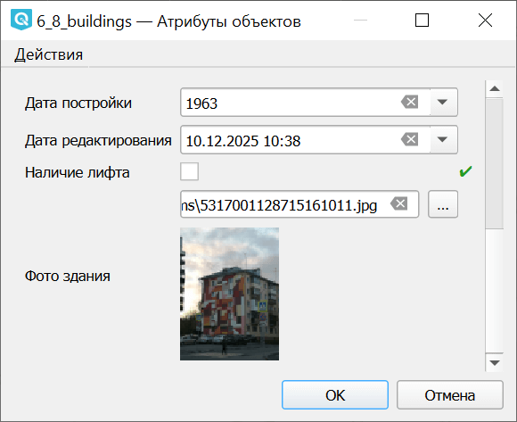

   Предпросмотр добавленного изображения в форме

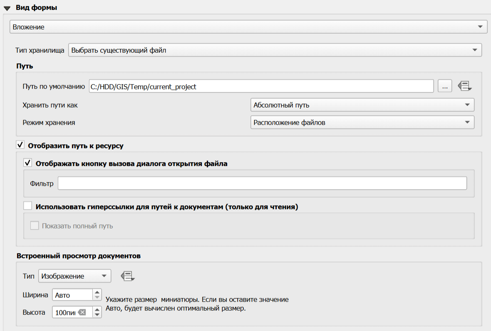

   Настройки поля вложения

.. _widget_hidden:

Скрытое поле
-------------

Среди атрибутов слоя могут быть служебные поля, которые пользователю не нужно заполнять вручную. Чтобы они не занимали места на форме, а также чтобы избежать поломки файла при случайном вводе ошибочного значения, эти поля можно скрыть. 

Для этого в разделе Вид формы выберите в выпадающем списке **Скрыто**.

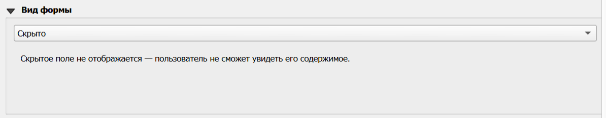

   Настройки скрытого поля

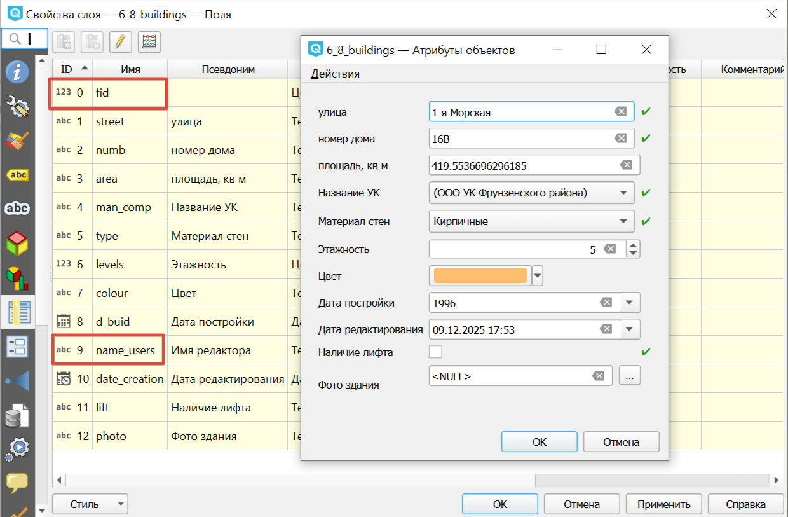

   Атрибуты слоя и форма: красным помечены скрытые поля

Характерный пример - поле ``fid`` в файле формата GeoPackage. Его изменение может нарушить структуру файла.

Если поле должно оставаться видимым, но не должно редактироваться, снимите флажок "Поле ввода" в разделе "Общие", а в разделе "Вид формы" оставьте подходящее значение, например, "Текстовое поле".

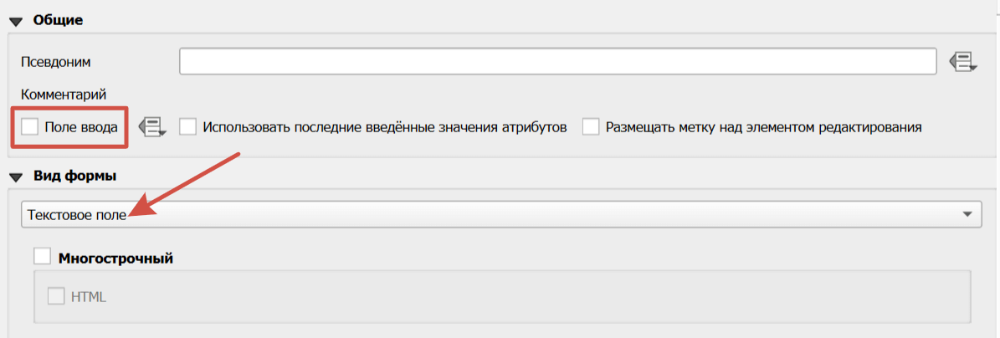

   Настройки поля, недоступного для редактирования через форму

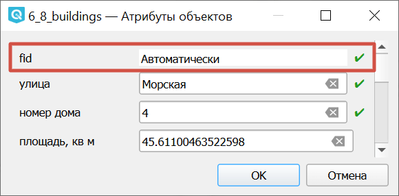

   Поле, видимое, но недоступное для редактирование в форме

Автоматически заполняться могут не только служебные поля, `подробнее <https://docs.nextgis.ru/docs_ngqgis/source/fieldforms.html#widget-default>`_.

.. _widget_default:

Значение по умолчанию
----------------------

Для поля можно установить значение по умолчанию:

* Фиксированное значение - стандартный вариант или пример для заполняющего;
* Переменная - например, @user_account_name, чтобы сохранить имя пользователя, вносящего изменения;
* Выражение - например, автоматически рассчитывающаяся площадь объекта ``area ($geometry)``.

Также в разделе "Общие" можно включить флажок "Использовать последние введённые значения атрибутов", тогда в форму автоматически будет подставляться предыдущее введённое значение.

Поля, заполняемые автоматически, можно убрать из пользовательского интерфейса формы ввода, `сделав их скрытыми <https://docs.nextgis.ru/docs_ngqgis/source/fieldforms.html#widget-hidden>`_. 
