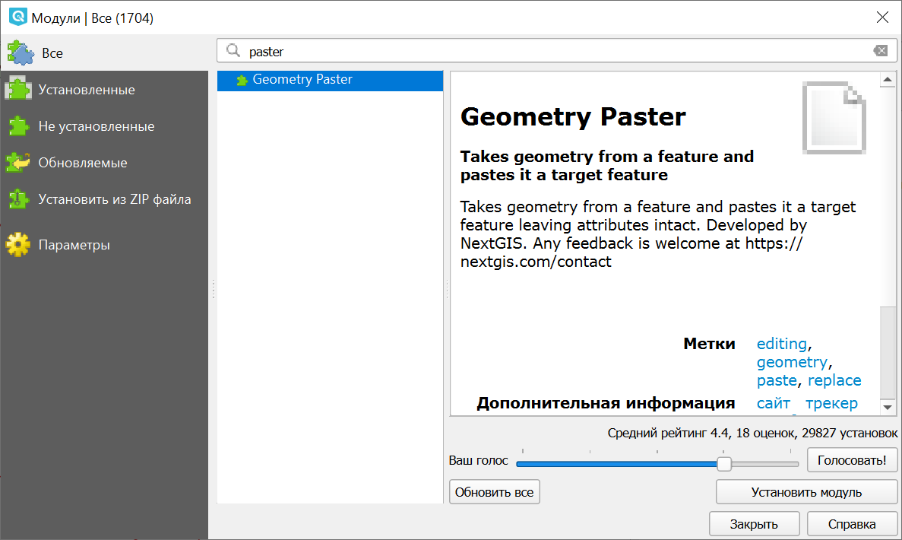
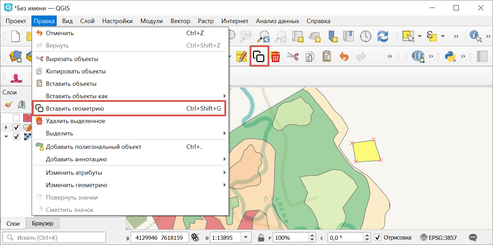

.. sectionauthor:: Юлия Григоренко <grigorenko.j@gmail.com>

.. _geom_paster:

Geometry Paster
=========================

Плагин позволяет скопировать геометрию одного объекта и назначить ее другому. При этом копируемый и целевой объект могут быть как в одном векторном слое, так и в разных.

Таким образом, создаётся «дубликат» объекта, но стиль и атрибуты сохраняются прежними.

1. Установите модуль 

   
   Установка модуля Geometry Paster

2. Скопируйте объект из слоя-источника.

3. Включите редактирование целевого слоя.

4. Выберите объект и в меню "Правка" выберите "Вставить геометрию". Также это можно сделать кнопкой |button_geom_paster| на панели инструментов.

   
   Вставка геометрии

Посмотрите, как работать с плагином, в нашем `видео <https://youtu.be/cWFpY7CjJUM>`_ (также `здесь <https://rutube.ru/video/b63080fd22045118d2a4b3b3eed37fec/?r=wd>`_).
