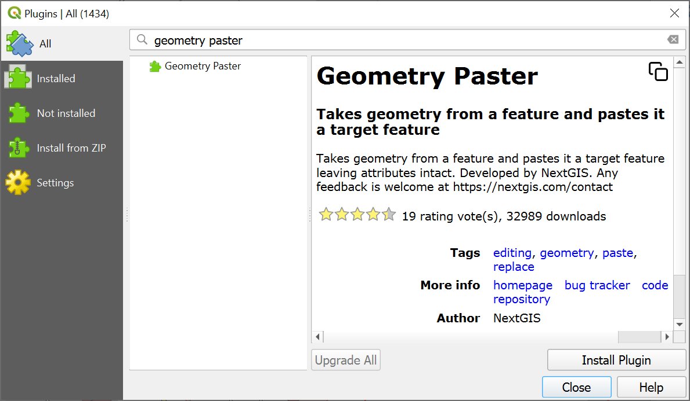
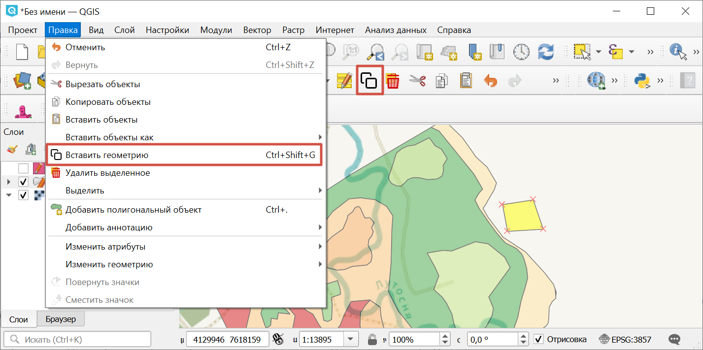

.. sectionauthor:: Yulia Grigorenko <yulia.grigorenko@nextgis.com>

.. _geom_paster:

Geometry Paster
=========================

With this plugin you can copy geometry from one feature and assign it to a different one. Source and target features can be in one layer or in different layers.

This way you get a "duplicate" of the feature keeping its style and attribute values intact.

1. Install plugin 

   
   Installation of Geometry Paster

2. Copy feature from the source layer.

3. Enable editing for the target layer.

4. Select the target feature and in the Edit menu select "Paste geometry". Alternatively you can press |button_geom_paster| button in the toolbar.

   
   Pasting geometry

On step 4 you can select multiple features. In that case the geometry is added to each of them.

Check out how the plugin works in our video:

.. raw:: html

   <iframe width="560" height="315" src="https://www.youtube.com/embed/NMs5hDf5ndE?si=gyySjUiQq1CBRKF6" title="YouTube video player" frameborder="0" allow="accelerometer; autoplay; clipboard-write; encrypted-media; gyroscope; picture-in-picture; web-share" referrerpolicy="strict-origin-when-cross-origin" allowfullscreen></iframe>

Watch on `youtube <https://youtu.be/NMs5hDf5ndE?si=20Rwhy-2fluYzafT>`_.
