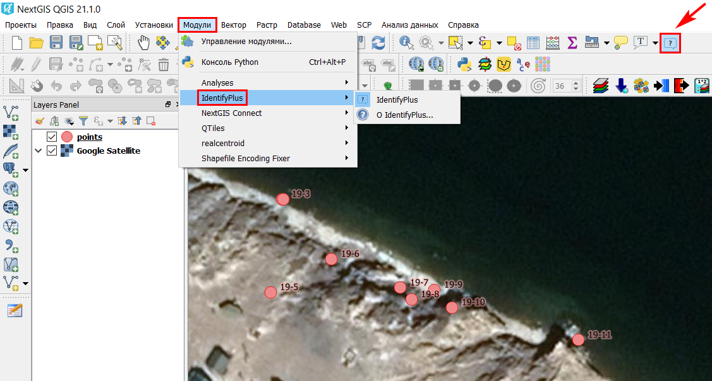
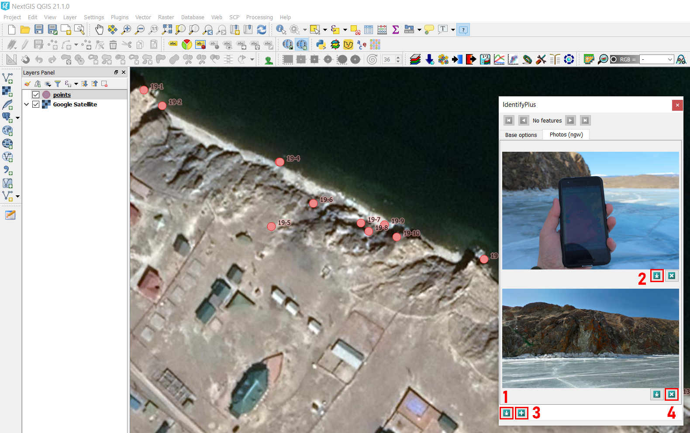

.. sectionauthor:: Петруненко Екатерина <ekaterina.petrunenko@nextgis.ru>

.. _ngqgis_identifyplus:

IdentifyPlus
==========

Plugin interacts with layers imported from Web GIS. IdentifyPlus allows viewing objects’ attributes, including attached files, e.g. photos.

After plugin installation it will appear in menu Plugins > IdentifyPlus. Plugin’s icon will also appear in the panel.

As a first step you should import target layer from Web GIS via NextGIS Connect plugin. Then, after activation of IdentifyPlus by clicking on the icon, it is possible to select any object from the imported layer. Pop-up window with two tabs, “Base options” and “Photos (ngw)”, emerges. In the first tab you can edit attributes. In the tab “Photos (ngw)” you can: 1) Download all attached images; 2) Select particular images for download; 3) Upload new images; 4) Select particular images for deletion.

Since plugin is synchronized with Web GIS automatically, all changes appear in cloud immediately.

