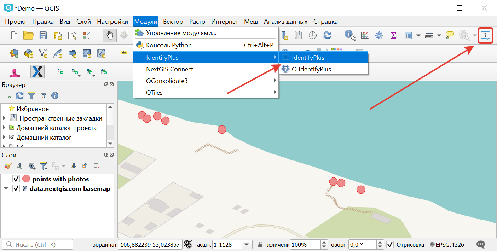
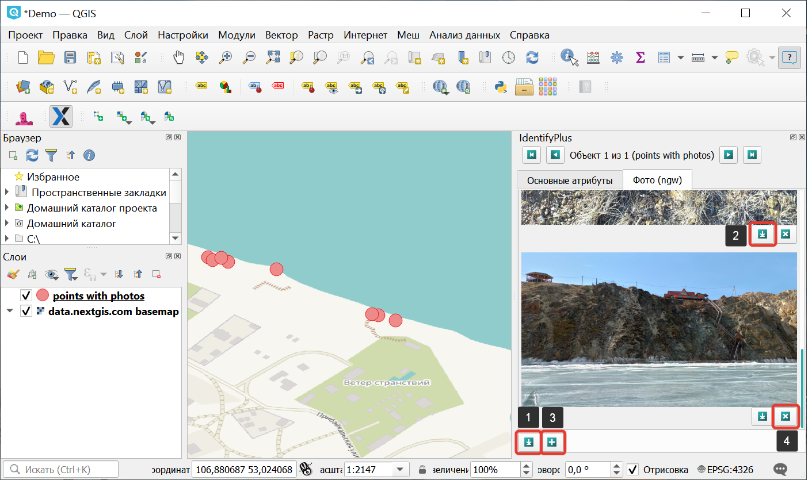

.. sectionauthor:: Екатерина Петруненко <ekaterina.petrunenko@nextgis.ru>

.. _identifyplus:
    
IdentifyPlus
===============

Инструмент предназначен для работы со слоями, импортированными из Веб ГИС. IdentifyPlus позволяет просматривать атрибуты объектов, в том числе прикрепленные вложения, например, фотографии.

После установки плагина появится пункт меню Модули > IdentifyPlus, а в панели инструментов появится значок для вызова данного плагина.

   
   Включение плагина Identify Plus

В начале работы необходимо с помощью модуля `NextGIS Connect <https://docs.nextgis.ru/docs_ngconnect/source/toc.html>`_ импортировать из Веб ГИС желаемый слой. Теперь, активировав IdentifyPlus нажатием на значок, можно курсором мыши выделить любой объект в импортированном слое. Появится отдельное окно идентификации с двумя вкладками: «Основные атрибуты» и «Фото (ngw)». 

В первой вкладке доступно редактирование значений атрибутов. 

   
   Инструменты вкладки Фото

Во вкладке «Фото (ngw)» можно: 1) Сохранять на компьютер пользователя все приложенные изображения; 2) Выборочно сохранять на компьютер пользователя приложенные изображения; 3) Подгружать (добавлять) новые изображения с компьютера пользователя; 4) Выборочно удалять изображения (см. :numref:`identifyplus_ations_pic`). 

Так как плагин автоматически синхронизируется с Веб ГИС, внесенные изменения сразу будут отображены и в облаке.
