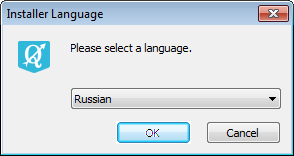
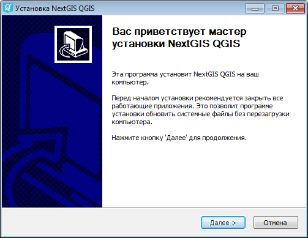
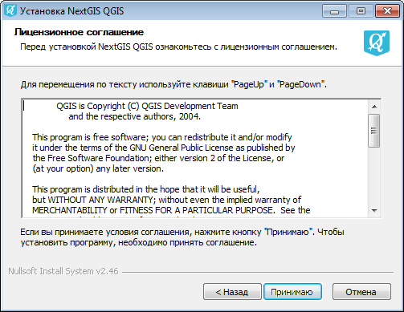
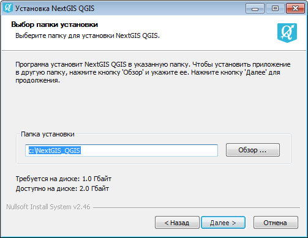
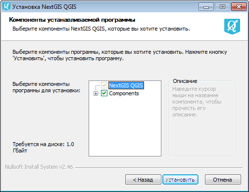

.. sectionauthor:: Артём Светлов <artem.svetlov@nextgis.ru>

.. _ngqgis_install:

Установка
==========

Последняя версия установщика под |win| ОС Windows может быть скачана по следующему адресу:

http://nextgis.ru/nextgis-qgis/.

Установщик представляет собой пошаговый мастер. На первой странице мастера (см. :numref:`ngqgis_installPage01`) необходимо выбрать язык установки: русский или английский.

   Первая страница мастера установки.

Вторая страница мастера (см. :numref:`ngqgis_installPage02`) содержит приглашение к началу установки.

   Вторая страница мастера установки.

На третьей странице мастера (см. :numref:`ngqgis_installPage03`) необходимо прочитать и принять лицензионное соглашение.

   Третья страница мастера установки.

На четвёртой странице (см. рис. :numref:`ngqgis_installPage04`) необходимо указать путь до папки установки. Рекомендуется оставить предложенный мастером путь.

   Четвёртая страница мастера установки.

На пятой странице (см. рис. :numref:`ngqgis_installPage05`) можно отключить некоторые компоненты, если они не нужны при работе.

   Пятая страница мастера установки.

На шестой странице (см. рис. :numref:`ngqgis_installPage06`) начнётся процесс установки файлов.

.. figure:: _static/installPage06.png
   :name: ngqgis_installPage06
   :align: center

   Шестая страница мастера установки.
