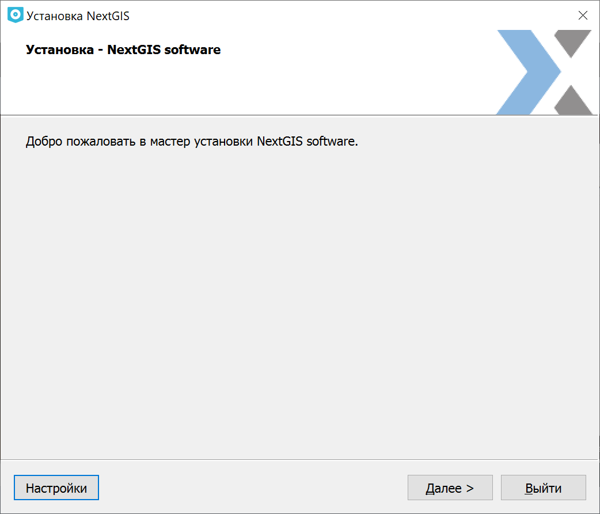
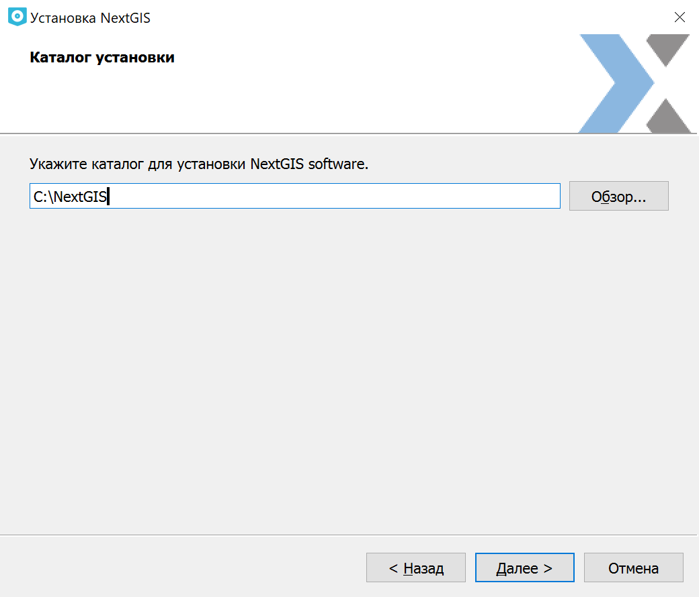
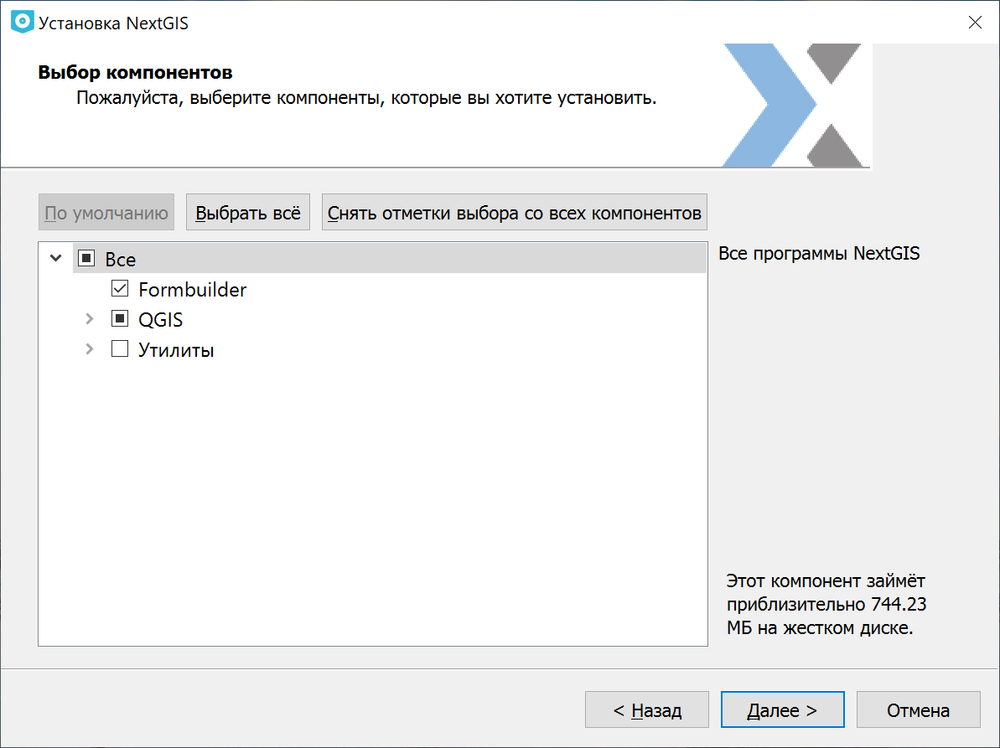
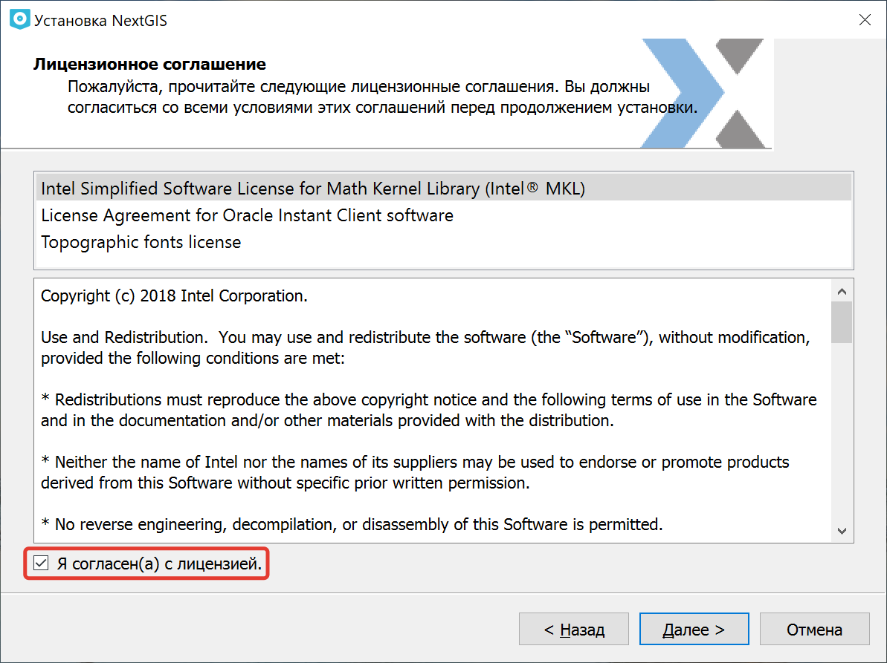
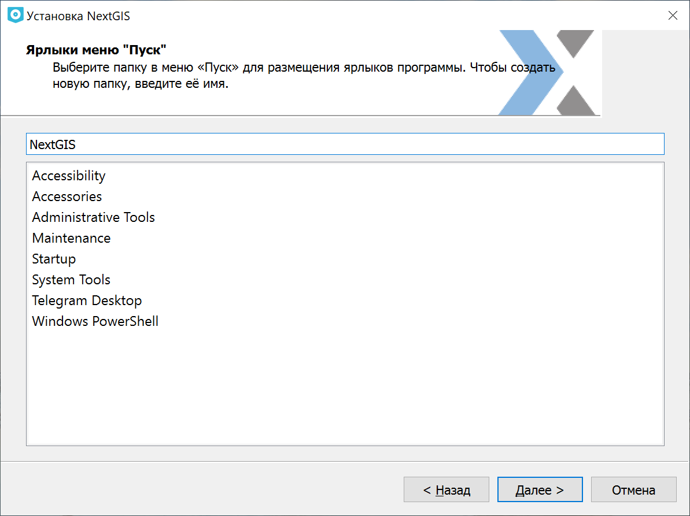

.. sectionauthor:: Артём Светлов <artem.svetlov@nextgis.ru>

Установка
==========

Для установки :program:`NextGIS QGIS` используется универсальный сетевой установщик. По `ссылке <http://nextgis.ru/nextgis-qgis/>`_ можно скачать установщик под вашу платформу.

.. note::
   Версия установщика без доступа к сети Интернет доступна только для пользователей планов `Mini и Premium <http://nextgis.ru/nextgis-com/plans>`_.

.. _ngqgis_install:

Процесс установки
------------------

Установщик представляет собой пошаговый мастер. Первая страница мастера (см. :numref:`ngqgis_installPage01`) содержит приглашение к началу установки.

   Начальная страница мастера установки

На второй странице (см. рис. :numref:`ngqgis_installPage02`) необходимо указать путь до папки установки. Рекомендуется оставить предложенный мастером путь.

   Выбор папки для установки

На третьей странице (см. рис. :numref:`ngqgis_installPage03`) можно отключить некоторые компоненты, если они не нужны при работе.

   Выбор компонентов для установки

На четвертой странице мастера (см. :numref:`ngqgis_installPage04`) необходимо прочитать и принять лицензионное соглашение.

   
   Страница лицензионного соглашения в мастере установки

На пятой странице (см. рис. :numref:`ngqgis_installPage05`) необходимо указать имя для папки в меню "Пуск".

   Выбор папки в меню "Пуск"

На шестой странице (см. рис. :numref:`ngqgis_installPage06`) мастер сообщит о готовности начать установку. 

.. figure:: _static/install_wizard_ready_ru.png
   :name: ngqgis_installPage06
   :align: center
   :width: 16cm

   Шестая страница мастера установки
   
После нажатия кнопки **Установить** начнётся процесс распаковки и установки файлов.
По окончании этого процесса появится финальное окно с сообщением об успешной установки программы.

.. _ngqgis_sys_req:

Системные требования
---------------------

Минимальные параметры ПК
^^^^^^^^^^^^^^^^^^^^^^^^

* ОС Windows 7 и выше, 64 бит
* процессор Intel Core i3 с тактовой частотой не менее 2 ГГц (2 ядра) или аналог
* оперативная память не менее 4 ГиБ
* соответствующая материнская плата для выбранных процессоров со встроенной видеокартой
* накопитель на жестких магнитных дисках емкостью не менее 40 ГБ
* манипулятор “мышь”
* клавиатура
* монитор LCD 14”, разрешение 1024х768

Рекомендуемые параметры ПК
^^^^^^^^^^^^^^^^^^^^^^^^^^

* ОС Windows 10 и выше, 64 бит
* процессор Intel Core i5 с тактовой частотой не менее 2.8 ГГц (4 ядра) или аналог
* оперативная память не менее 16 ГиБ
* соответствующая материнская плата для выбранных процессоров 
* дискретная видеокарта с объемом видео памяти не менее 4 ГиБ
* накопитель на жестких магнитных дисках или SSD емкостью не менее 500 ГБ
* манипулятор “мышь”
* клавиатура
* источник бесперебойного питания емкостью не менее 800 ВА
* монитор LCD 24”, разрешение 2560x1440
