Установка и обновление
=======================

Для установки :program:`NextGIS QGIS` используется универсальный сетевой установщик, который можно скачать `по ссылке <http://nextgis.ru/nextgis-qgis/>`_. В личном кабинете также доступен `оффлайн-инсталлятор <https://my.nextgis.com/software>`_.

.. _ngqgis_install:

Процесс установки
------------------

Установщик представляет собой пошаговый мастер. Первая страница мастера содержит приглашение к началу установки.

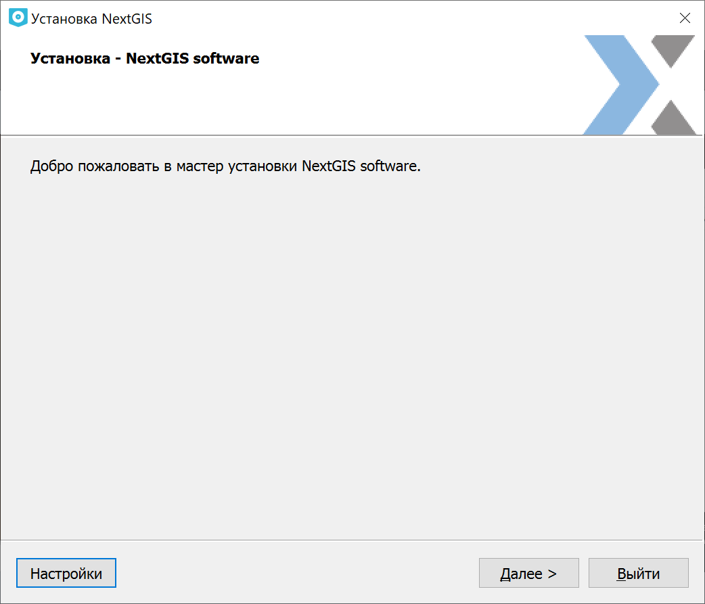

   Начальная страница мастера установки

На второй странице необходимо указать путь до папки установки. Рекомендуется оставить предложенный мастером путь.

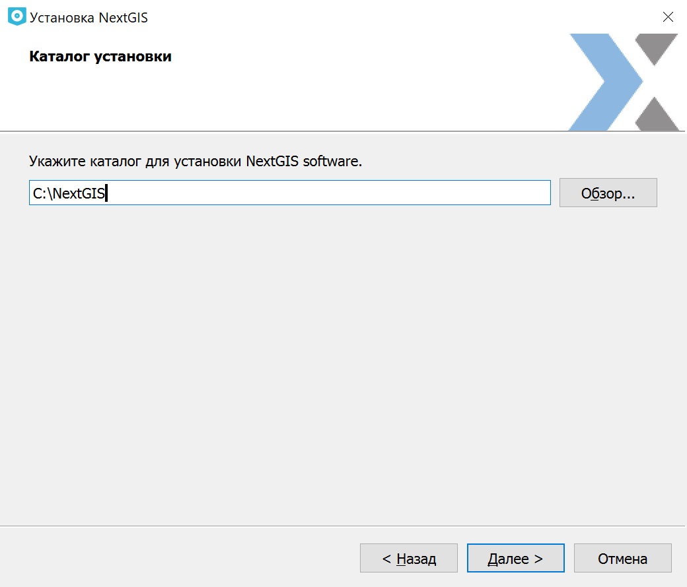

   Выбор папки для установки

На третьей странице можно отключить некоторые компоненты, если они не нужны при работе.

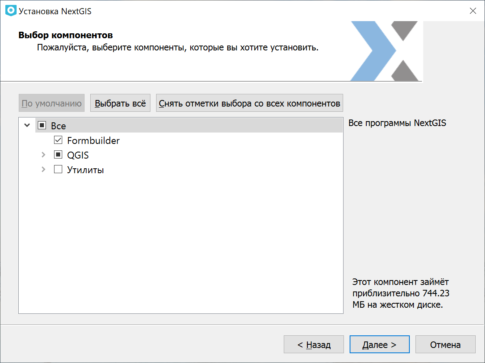

   Выбор компонентов для установки

На четвертой странице мастера необходимо прочитать и принять лицензионное соглашение.

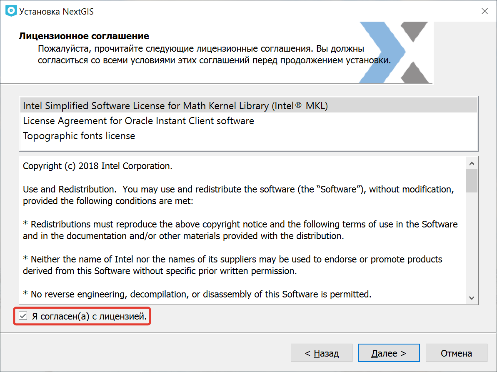
   
   Страница лицензионного соглашения в мастере установки

На пятой странице необходимо указать имя для папки в меню "Пуск".

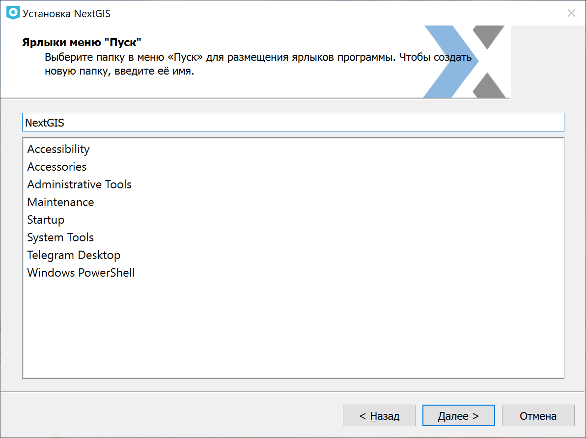

   Выбор папки в меню "Пуск"

На шестой странице мастер сообщит о готовности начать установку. 

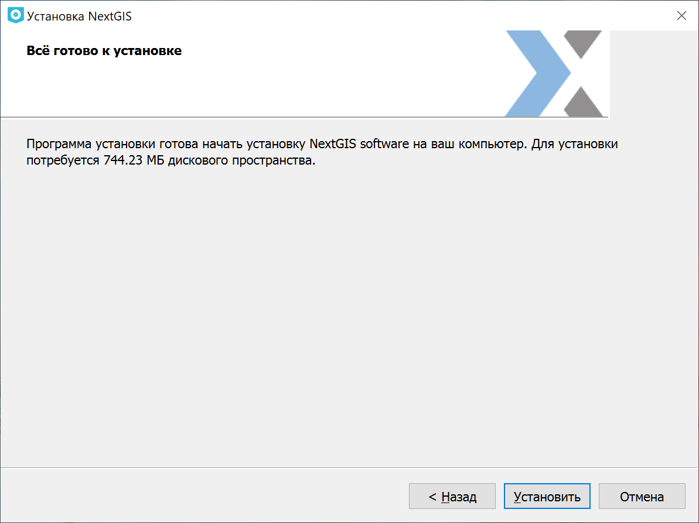

   Шестая страница мастера установки
   
После нажатия кнопки **Установить** начнётся процесс распаковки и установки файлов.
По окончании этого процесса появится финальное окно с сообщением об успешной установки программы.

.. _ngqgis_sys_req:

Системные требования
---------------------

Минимальные параметры ПК
^^^^^^^^^^^^^^^^^^^^^^^^

* ОС Windows 7 и выше, 64 бит
* процессор Intel Core i3 с тактовой частотой не менее 2 ГГц (2 ядра) или аналог
* оперативная память не менее 4 ГиБ
* соответствующая материнская плата для выбранных процессоров со встроенной видеокартой
* накопитель на жестких магнитных дисках емкостью не менее 40 ГБ
* манипулятор “мышь”
* клавиатура
* монитор LCD 14”, разрешение 1024х768

Рекомендуемые параметры ПК
^^^^^^^^^^^^^^^^^^^^^^^^^^

* ОС Windows 10 и выше, 64 бит
* процессор Intel Core i5 с тактовой частотой не менее 2.8 ГГц (4 ядра) или аналог
* оперативная память не менее 16 ГиБ
* соответствующая материнская плата для выбранных процессоров 
* дискретная видеокарта с объемом видео памяти не менее 4 ГиБ
* накопитель на жестких магнитных дисках или SSD емкостью не менее 500 ГБ
* манипулятор “мышь”
* клавиатура
* источник бесперебойного питания емкостью не менее 800 ВА
* монитор LCD 24”, разрешение 2560x1440

.. _ngqgis_update:

Обновление
------------

.. _ngqgis_update_check:

Как проверить текущую версию программы
^^^^^^^^^^^^^^^^^^^^^^^^^^^^^^^^^^^^^^^^^^^^^^^^^^

Запустите NextGIS QGIS и перейдите в ``Справка  ‣ О программе``.

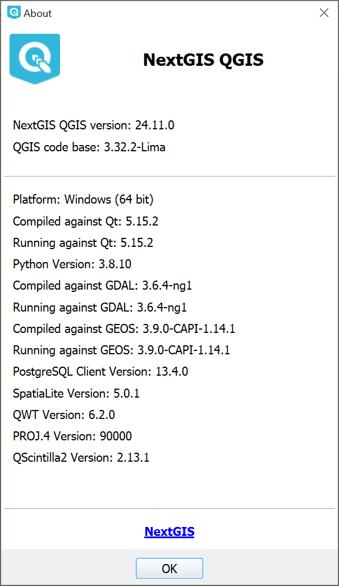

   Проверка установленной версии NextGIS QGIS

* Если ваша версия 24.\* и выше, перейдите к `проверке обновлений <https://docs.nextgis.ru/docs_ngqgis/source/install.html#ngqgis-upadate-24up>`_.
* Если ваша версия 23.\* и ниже, необходимо выполнить `полное удаление программы и повторную установку <https://docs.nextgis.ru/docs_ngqgis/source/install.html#ngqgis-update-23>`_ свежего дистрибутива.

.. _ngqgis_update_23:

Если у вас установлена версия 23 и ниже
^^^^^^^^^^^^^^^^^^^^^^^^^^^^^^^^^^^^^^^^^^^

Для полного удаления программы перейдите в ваш список установленных приложений и найдите NextGIS Maintenance Tool или Сервисный режим NextGIS.

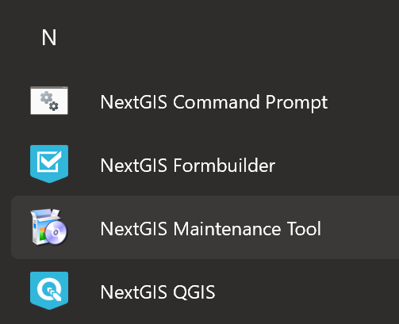

   Сервисный режим NextGIS в списке приложений

Выберите *Удаление всех компонентов* и нажмите **Далее**. 

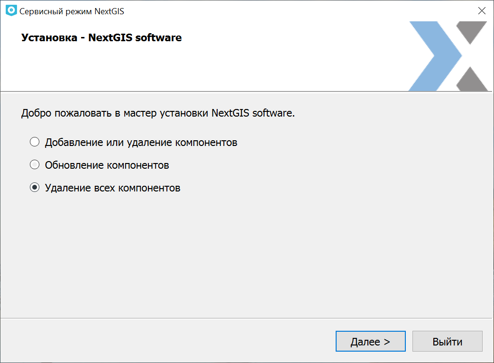

   Удаление старой версии

Для подтверждения удаления нажмите **Удалить**.

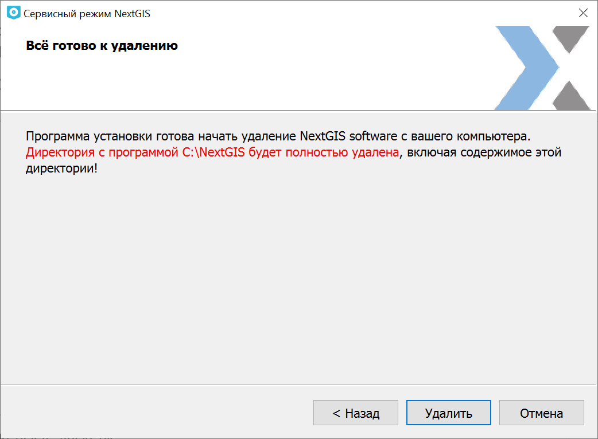

После завершения установки нажмите **Выйти**.

Загрузите актуальный дистрибутив в `личном кабинете <http://my.nextgis.com/software>`_ или на `nextgis.ru <https://nextgis.ru/nextgis-qgis/>`_ по кнопке **Скачать ознакомительную версию**.

Запустите скачанный дистрибутив и пройдите по `шагам установки <https://docs.nextgis.ru/docs_ngqgis/source/install.html#ngqgis-install>`_

.. _ngqgis_update_24up:

Если ваша версия 24.\* и выше
^^^^^^^^^^^^^^^^^^^^^^^^^^^^^^^^^^^^^^^^^^^^
Выполните проверку обновлений.
Для этого запустите NextGIS QGIS и перейдите в ``Справка - Проверить версию QGIS``.

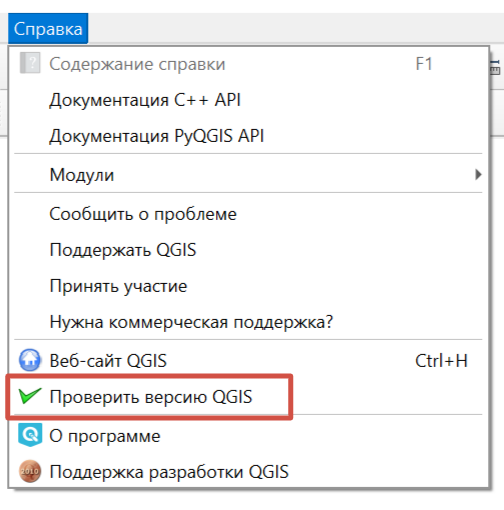

   Проверка версии QGIS из меню "Справка"

В программе появится уведомление о доступном обновлении. Нажмите **Обновить**. Если у вас последняя версия, появится сообщение "Нет доступных обновлений".

Откроется Сервисный режим NextGIS, нажмите **Далее**.

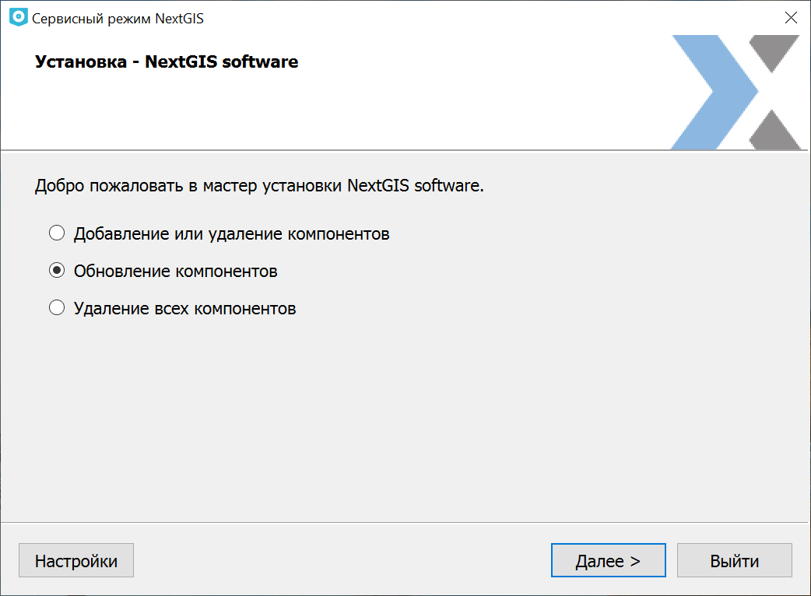

   Выбор обновления компонентов

Выполнится поиск и установка обновлений. 
После завершения установки нажмите **Выйти**.
