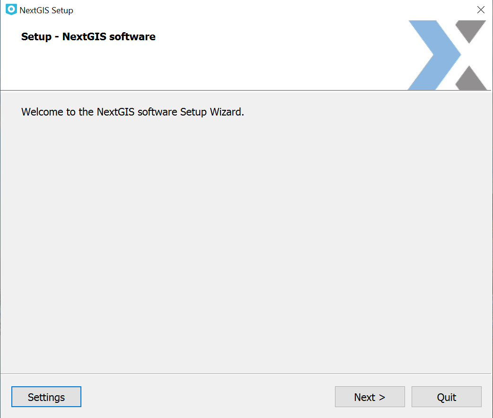
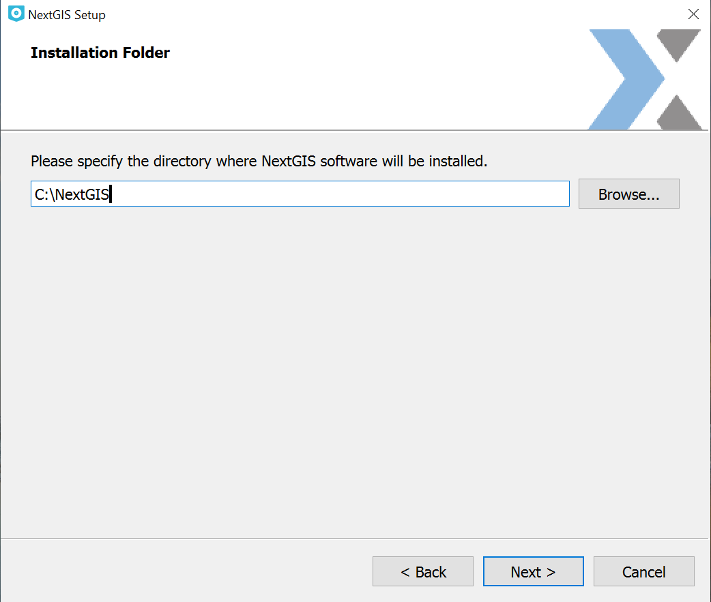
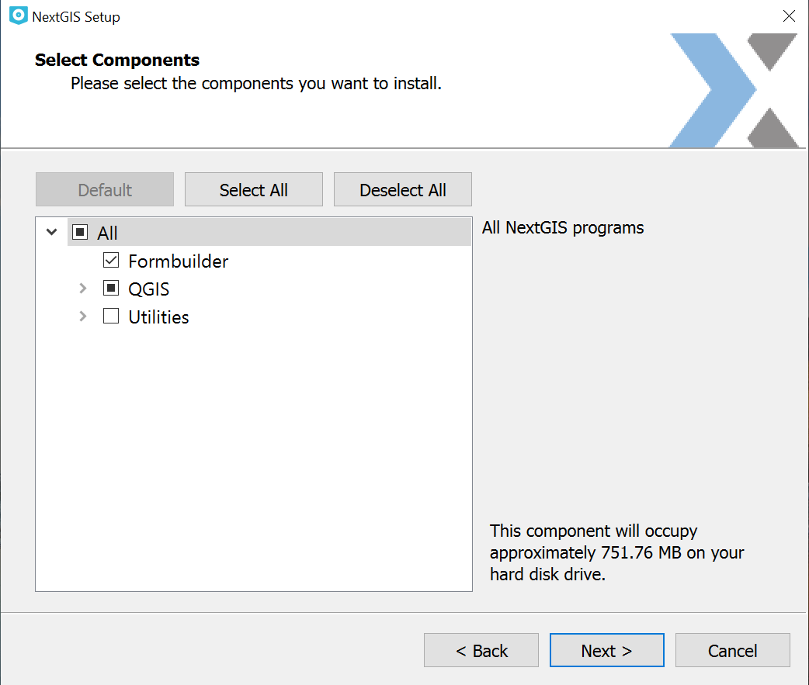
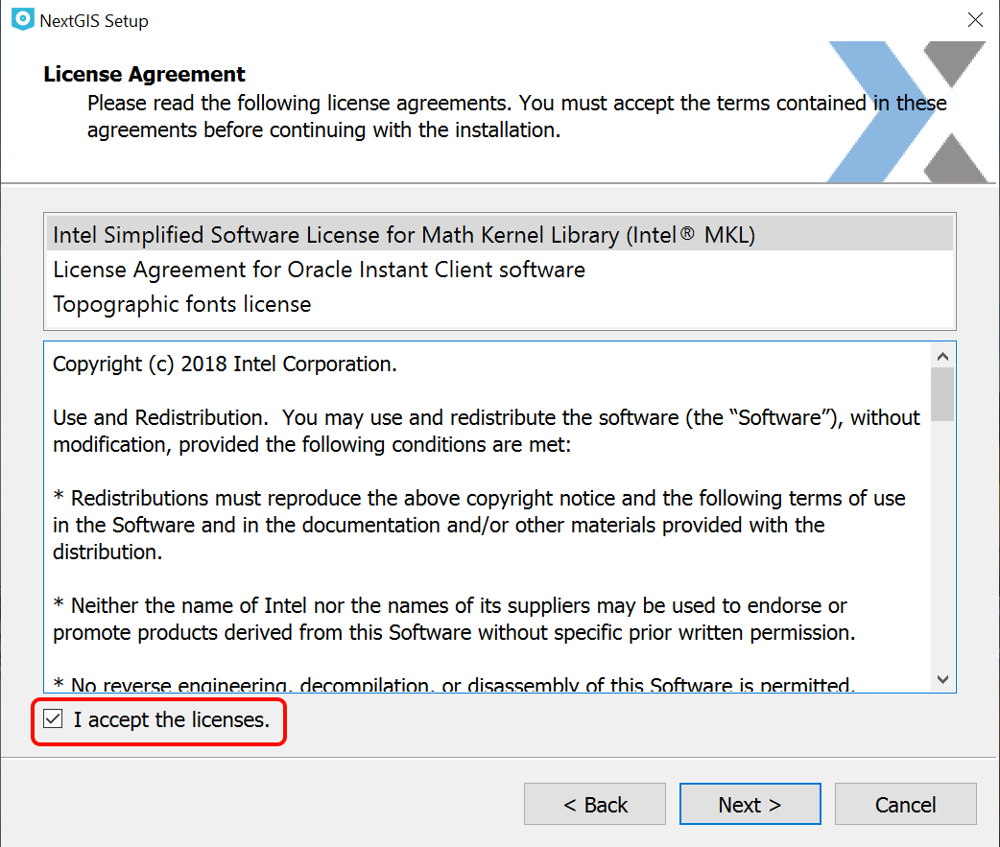
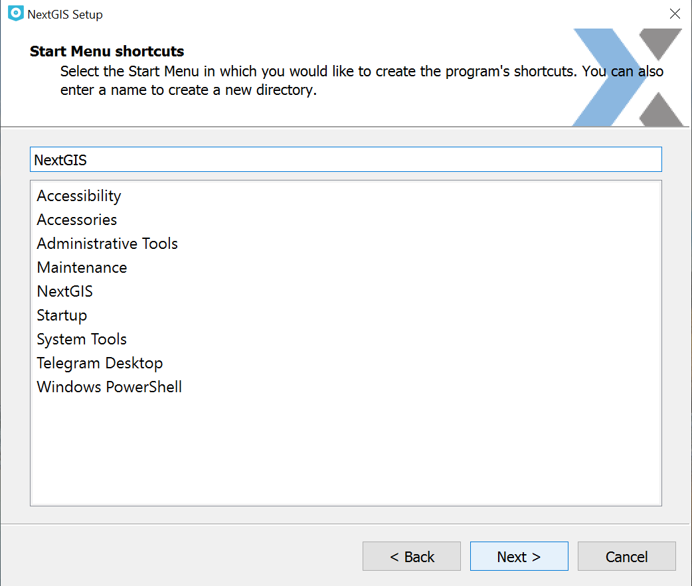
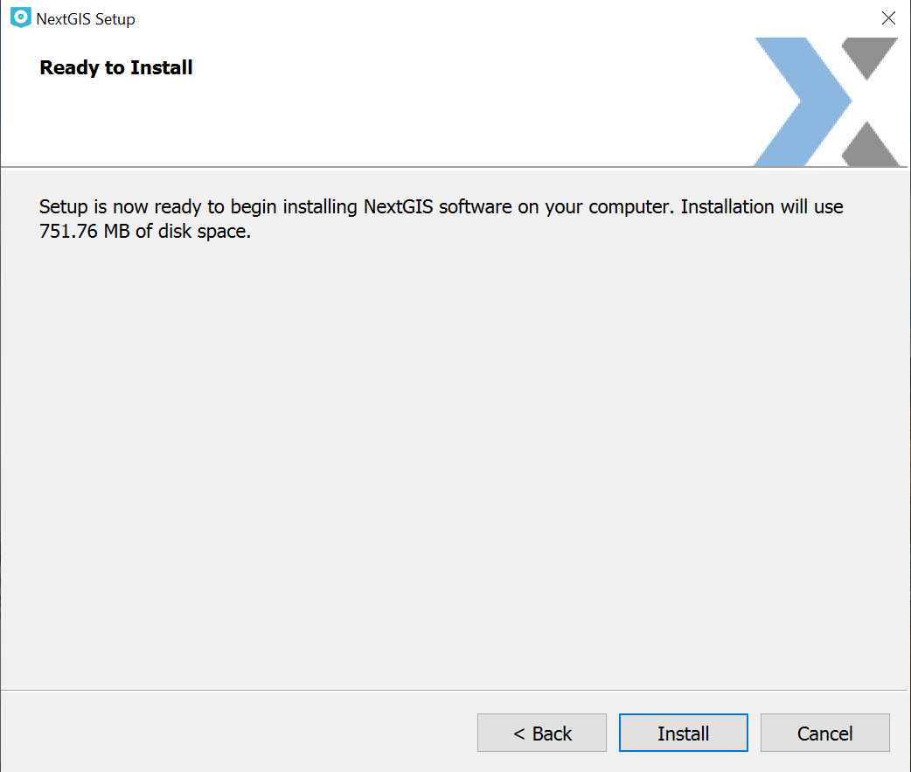

.. sectionauthor:: Артём Светлов <artem.svetlov@nextgis.ru>

Installation
==========

:program:`NextGIS QGIS` is installed with the aid of a universal installer. You can download installer for your OS using `this link. <http://nextgis.com/nextgis-qgis/>`_

.. note::
   Installer not requiring Internet connection is only available for users on `Mini and Premium <http://nextgis.com/nextgis-com/plans>`_ subscription plans.

Installation process
------------------

The installes is a step-by-step wizard. The first page (see :numref:`ngqgis_installPage01`) welcomes you to the installation process.

   Installation wizard initial page

On the next page (see :numref:`ngqgis_installPage02`) select the target folder for the program. We recommend using the default path suggested by the wizard.

   Selecting target folder

On the third page (see :numref:`ngqgis_installPage03`) you can unmark the components you don't need.

   Selecting components

On the fourth page (see :numref:`ngqgis_installPage04`) you need to read the License Agreements and agree to them.

   
   License Agreements page

On the fifth page (see :numref:`ngqgis_installPage05`) select a name for the Start menu folder.

   Folder for the Start menu

The sixth page (see :numref:`ngqgis_installPage06`) is the message that the installation process is ready to start. 

   Installation wizard: page 6
   
After you press **Install**, the wizard will start unpacking and installing files.
When this task is completed a final page will appear, announcing the successful installation of the programm.

System requirements
---------------------

Minimal PC parameters required
^^^^^^^^^^^^^^^^^^^^^^^^^^^^^^^^^^^^^^^^^^^^^^^^^^^^^

* OS Windows 7 or higher, 64 bit
* Mac OS X/OS X/macOS
* Intel Core i3 at least 2 MHz (2 cores) or an equivalent processor
* RAM 4 GB min
* motherboard fit for the selected processor with integrated graphics card
* HDD 40 GB min
* mouse
* keyboard
* LCD 17” with 1024x768 resolution

Recommended PC parameters
^^^^^^^^^^^^^^^^^^^^^^^^^^^^^^^^^^^^^^^^^^^^^^^^^^^^^

* OS Windows 10 or higher, 64 bit
* macOS Sierra or higher
* Intel Core i5 at least 2.8 MHz (4 cores) or an equivalent processor
* RAM 16 GB min
* motherboard fit for the selected processor 
* discrete graphics with video memory 4 GB min
* HDD or SSD 500 GB min
* mouse
* keyboard
* Uninterruptible power supply 800 VA min
* LCD 24”, with resolution 2560x1440
