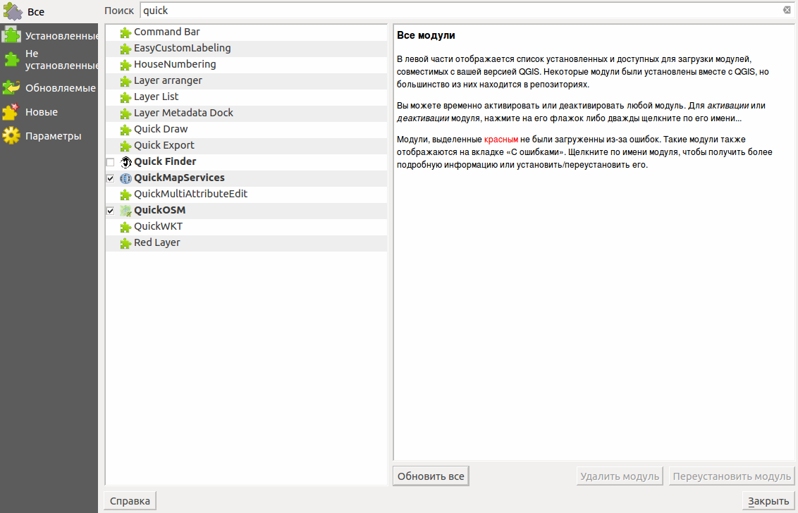

.. _ngqgis_plugins_install:

Установка модулей (плагинов)
=============================

Вам потребуется подключение к сети. 

Для установки и обновления плагинов необходимо нажать :menuselection:`Модули --> Управление модулями`.

Если вам надо установить плагин, введите часть его названия в панель Поиск. 

   
   Список установленных и доступных к загрузке модулей.

Выберите в списке нужный модуль и нажмите кнопку Установить модуль. 

Модули могут быть установленными, но не включёнными: если в списке у модуля не установлен 
флажок, то он не будет загружаться. Активируются модули автоматически с помощью 
установки флажка на соответствующем модуле.

Если вы ввели название модуля правильно, а модуля, который нужно установить, не нашли, 
то выполните следующие операции:

1. Проверьте вкладку Параметры: у репозиториев должна быть зелёная отметка. Если 
   отметка красная, значит проблемы либо в подключении к интернету, либо с сервером.
2. Попробуйте установить флажок для активации пункта Разрешить установку экспериментальных модулей.
3. Проверьте, нужный модуль может находиться в каком-то специальном репозитории, 
   спросите у того, кто вам про него сказал. 

