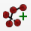
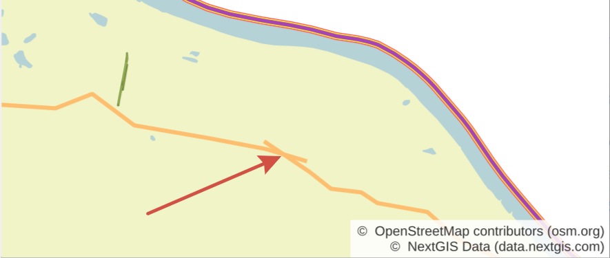
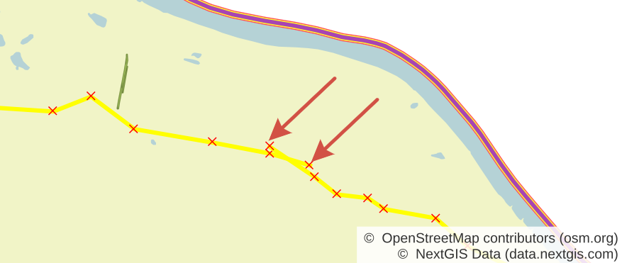
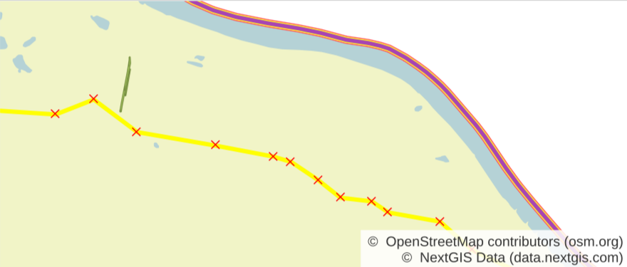
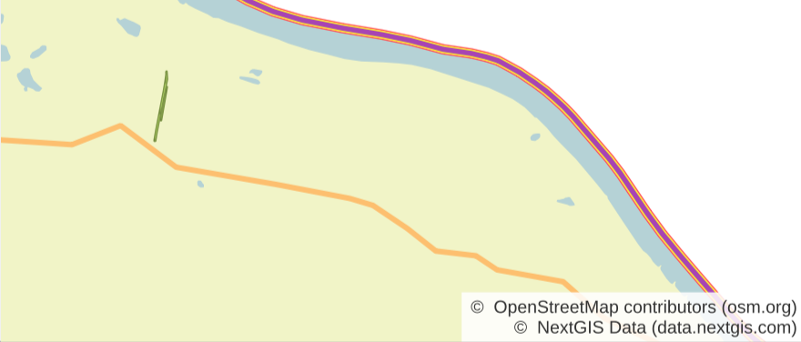

Join lines
===========

Позволяет объединить две линии в одну, отсекая лишние части. Отсечены будут короткие "хвосты" на стыке линий.

После установки кнопка модуля появится на панели инструментов.

Выделите обе линии, которые хотите объединить, затем нажмите на кнопку |button_join_lines|.

   Неаккуратное пересечение линий

   При выделении линий видны "хвосты"

   После обработки инструментом - две линии объединены, "хвосты" удалены

   Объединенная линия на карте
