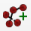
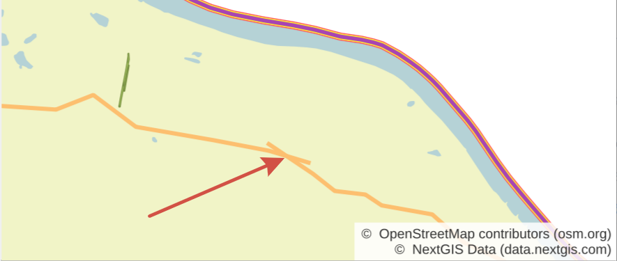
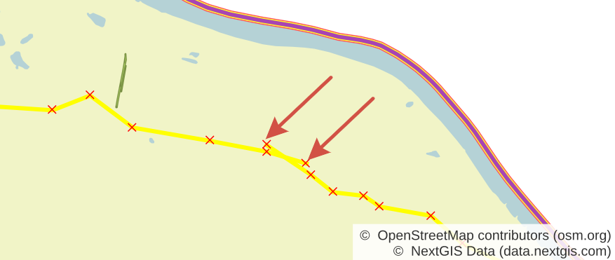
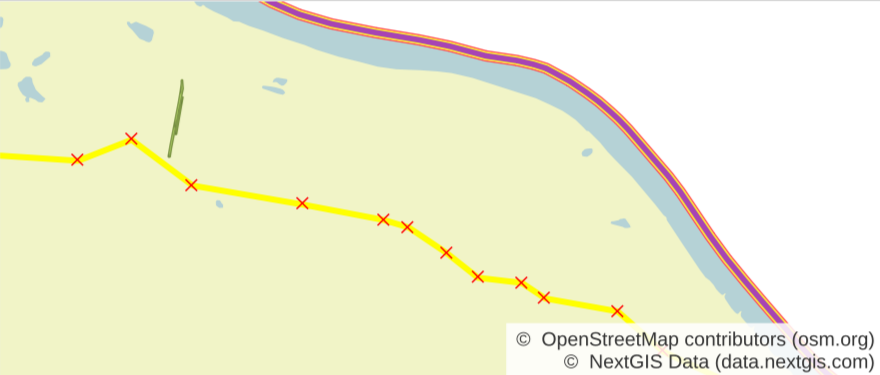
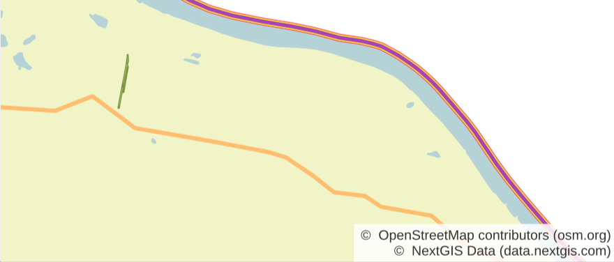

Join lines
===========

Permanently joins two intersecting or snapped lines. The little "extra" bits are cut off.

After installation the plugin will appear in the Vector toolbar:|button_join_lines|.

Select the two lines you want to join, then press |button_join_lines|.

   Messy line crossing

   The "extra" bits are visible when the lines are selected

   After processing - the lines are merged into one single line, the "extra" bits at the intersection are cut off

   Joined line on the map

See the plugin at work in our video:

.. raw:: html

   <iframe width="560" height="315" src="https://www.youtube.com/embed/KJqZnNwJisE?si=iuOlo0tbjRfdVJcE" title="YouTube video player" frameborder="0" allow="accelerometer; autoplay; clipboard-write; encrypted-media; gyroscope; picture-in-picture; web-share" referrerpolicy="strict-origin-when-cross-origin" allowfullscreen></iframe>

Watch on `youtube <https://youtu.be/KJqZnNwJisE?si=i23aoOFz7eiwTxTX>`_.
