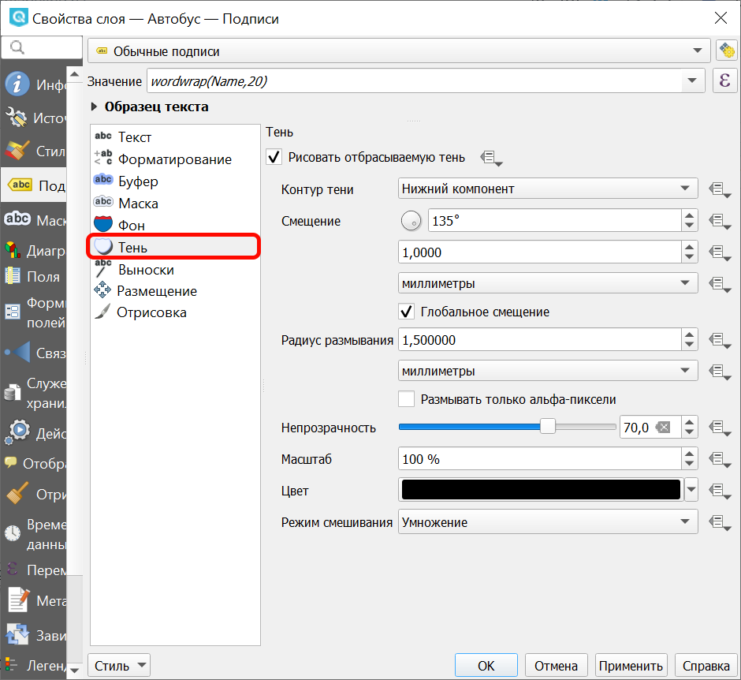
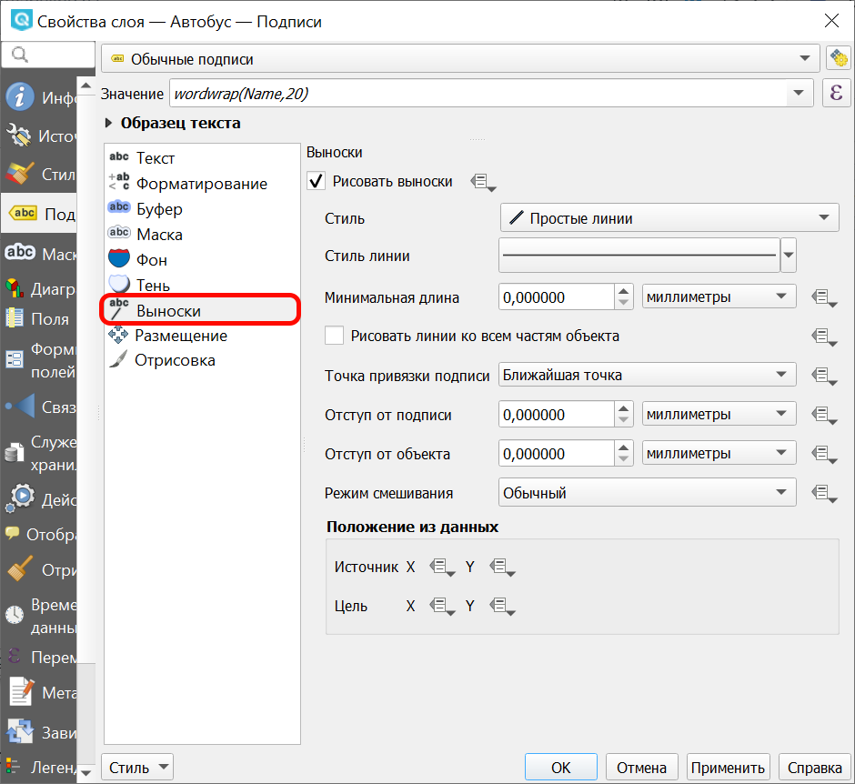

.. _ngq_labeling:

Настройка подписей
---------------------------------

Подписи можно выводить у объектов векторных слоёв. Текст подписи можно брать либо из атрибута, 
либо рассчитывать выражением из значений нескольких атрибутов. Остальные свойства 
подписи - цвет, размер, положение, поворот - тоже можно получать из атрибутов.

Для настройки стиля выделите нужный стиль в списке слоёв и откройте окно настройки 
стиля: ``Слой ‣ Свойства слоя ‣ вкладка Подписи``.

В открывшемся окне можно выбрать один из следующих вариантов:

* Без подписей
* Обычные подписи
* Подписи на основе правил
* Препятствие для подписей

При выборе **обычных подписей** далее в списке "Значение" выберите поле, из которого будет получаться надпись.

   
   Настройки обычных подписей

При создании **подписей на основе правил** нужно добавить правила, определяющие содержание и вид подписей.

   
   Создание правила

Настройка **препятствие для подписей** позволяет определить поведение подписей, перекрывающих объекты слоя.

   
   Настройка препятствия для подписей

Настройки подписей можно сохранить в файл стиля NextGIS QGIS (формат qml), вместе с оформлением.

Вкладка "Текст"
^^^^^^^^^^^^^^^^^^^^^^^^^^^^^^^

На вкладке "Текст" вы можете выбрать гарнитуру шрифта, размер букв, использовать изменение регистра символов, а также добавить HTML-форматирование.

   Окно свойств подписей, вкладка "Текст"

Вкладка "Форматирование"
^^^^^^^^^^^^^^^^^^^^^^^^^^^^^^^

На вкладке "Форматирование" можно настроить отступ между буквами и словами, включить кернинг, задать ориентацию текста (горизонтальную/вертикальную), количество знаков после запятой, выводимых из полей типа ``Real``, и выравнивание многострочных подписей.

   Окно свойств подписей, вкладка "Форматирование"

.. tip::
   Для переноса длинных подписей, рекомендуется в поле "Значение" ввести формулу 
   wordwrap("NAME",20) - подпись будет получаться из атрибута NAME, и делиться на части не менее 20 
   символов разделённые пробелами. Это более гибкий способ.

   Окно свойств подписей, настройка переноса текста

.. figure:: _static/labels_map_worldwrap.png
   :name: labels_map_worldwrap
   :align: center
   :width: 16cm

   Пример переноса текста

Вкладка "Буфер"
^^^^^^^^^^^^^^^^^^^^^^^^^^^^^^^

На вкладке "Буфер" можно настроить рисование закрашеной области вокруг букв. 
В этом режиме они будут видны на любом фоне. 

   Окно свойств подписей, вкладка "Буфер"

.. figure:: _static/labels_demo_buffer.png
   :name: labels_demo_buffer
   :align: center
   :width: 16cm

   Пример подписи без буфера и с буфером

Вкладка "Маска"
^^^^^^^^^^^^^^

В отличие от буфера, который добавляет одинаковую обводку по всему контуру надписи, маска позволяет более осуществить более тонкую настройку оформления.

   
   Окно свойств подписей, вкладка "Маска"

Вкладка "Фон"
^^^^^^^^^^^^^^^^^^^^^^^^^^^^^^^

На вкладке "Фон" можно настроить рисование прямоугольного (или другой фиксированной формы) фона под надписями. 
В этом режиме карта начинает выглядеть более угловато и старомодно.

   Окно свойств подписей, вкладка "Фон"

.. figure:: _static/labels_demo_background.png
   :name: labels_demo_background
   :align: center
   :width: 16cm

   Пример подписи без фона и с фоном

Вкладка "Тень"
^^^^^^^^^^^^^^^^^^^^^^^^^^^^^^^

На вкладке "Тень" можно настроить рисование тени под надписями. 
В этом режиме карта начинает выглядеть более сложно.

   Окно свойств подписей, вкладка "Тень"

.. figure:: _static/labels_demo_shadows.png
   :name: labels_demo_shadows
   :align: center
   :width: 16cm

   Пример подписи без тени и с тенью

Вкладка "Выноски"
^^^^^^^^^

На загруженных картах надпись может ставится за пределами или на некотором расстоянии от обозначаемого объекта и соединяться с ним при помощи линии.

   
   Окно свойств подписей, вкладка "Выноски"

Вкладка "Размещение"
^^^^^^^^^^^^^^^^^^^^^^^^^^^^^^^

На вкладке "Размещение" можно настроить алгоритм, по которому подписи раздвигаются, 
что бы не накладываться друг на друга. 

Так же имеется возможность передвигать вручную и поворачивать отдельные подписи. 

   Окно свойств подписей, вкладка "Размещение".

При создании карт значительное время занимает подбор расположения подписей на карте. 
Это влияет на читаемость карты, и необходимый размер или масштаб. NextGIS QGIS обладает 
большими возможностями по автоматическому раздвиганию подписей. В зависимости от настроек 
зритель может быстрее и точнее считывать карту. 

**Для точечных слоёв**

.. figure:: _static/labels_demo-1-cartografic.png
   :name: labels_demo-1-cartografic
   :align: center
   :width: 16cm

   Пример размещения точечных подписей в картографическом режиме. Для точечных подписей 
   это рекомендуемый алгоритм. Он делает как написано в учебниках: пытается сначала 
   поставить подпись в правую-верхнюю сторону от точки.   

.. figure:: _static/labels_demo-2-vokrug.png
   :name: labels_demo-2-vokrug
   :align: center
   :width: 16cm

   Пример размещения точечных подписей в режиме "Вокруг точки". Это старый алгоритм, 
   который был до картографического.

.. figure:: _static/labels_demo-3-center.png
   :name: labels_demo-3-center
   :align: center   
   :width: 16cm

   Пример размещения точечных подписей в режиме "На расстоянии от точки" без смещения. 
   Подписи закрывают точки. Видно, что шоссе проходят прямо через Бутурлино.

.. figure:: _static/labels_demo-4-right.png
   :name: labels_demo-4-right
   :align: center
   :width: 16cm

   Пример размещения точечных подписей в режиме "На расстоянии от точки" со смещением. 
   Все точки подписаны справа.

**Для линейных слоёв**

Можно выбрать расположение подписи относительно линии:

* Параллельно обобщенной линии, представляющей объект
* Вдоль кривых, повторяя контур линии, с приоритетом прямых участков
* Горизонтальное

Для первых двух из этих режимов можно выбрать разрешенные позиции подписи относительно линии. 

.. figure:: _static/labels_demo-11-poverh.png
   :name: labels_demo-11-poverh
   :align: center
   :width: 16cm

   Пример размещения линейных подписей в режиме "Поверх линий"

.. figure:: _static/labels_demo-12-upper.png
   :name: labels_demo-12-upper
   :align: center
   :width: 16cm

   Пример размещения линейных подписей в режиме "Над линиями". 
   Обратите внимание, что такие надписи не загораживают трамвайные линии на улицах.

.. figure:: _static/labels_demo-13-upper-lower.png
   :name: labels_demo-13-upper-lower
   :align: center
   :width: 16cm

   Пример размещения линейных подписей в режиме "Над линиями" и "Под линиями". 
   Так нарисовалось больше надписей. 

**Для полигональных слоёв**

   
   Доступные режимы размещения подписей для полигональных слоев

.. figure:: _static/labels_demo-21-s.png
   :name: labels_demo-21-s
   :align: center
   :width: 16cm

   Пример размещения линейных подписей в режиме "На расстоянии от центроида".

.. figure:: _static/labels_demo-22-c.png
   :name: labels_demo-22-c
   :align: center
   :width: 16cm

   Пример размещения линейных подписей в режиме "Вокруг центроида".

.. figure:: _static/labels_demo-23-per.png
   :name: labels_demo-23-per
   :align: center
   :width: 16cm

   Пример размещения линейных подписей в режиме "По периметру".

.. figure:: _static/labels_demo-24-hor.png
   :name: labels_demo-24-hor
   :align: center
   :width: 16cm

   Пример размещения линейных подписей в режиме "Горизонтальное".
   

.. figure:: _static/labels_demo-25-free.png
   :name: labels_demo-25-free
   :align: center
   :width: 16cm

   Пример размещения линейных подписей в режиме "Свободное".

Вкладка "Отрисовка"
^^^^^^^^^^^^^^^^^^^^^^^^^^^^^^^

На вкладке "Отрисовка" можно настроить алгоритм, по которому некоторые подписи скрываются, 
что бы не накладываться друг на друга.

   Окно свойств подписей, вкладка "Отрисовка"

Перемещение подписей
^^^^^^^^^^^^^^^^^^^^^^^^^^^^^^^^^^^^^^^^^^^^^^^^^^^^^^^^^^^^^

Если вам нужно управлять размещением подписей, то в NextGIS QGIS это можно делать 3 способами:

1. Простой способ: подобрать настройки в окне ``Свойства стиля ‣ Подписи ‣ Размещение``. 
   Имеется несколько разных алгоритмов, которые раздвигают подписи так, что бы они не загораживали друг друга.
2. Старый способ: сделать отдельный точечный или линейный слой. Указать ему прозрачные 
   цвета заливки и обводки, и выводить подписи из него. 
3. Рекомендуемый способ: Добавить в слой через "Калькулятор полей" 2 поля с названием lx, ly, 
   тип - дробный, размер 10, точность 8. В настройках подписей найти свойства X, Y, 
   связать их с этими атрибутами, в основном окне NextGIS QGIS включить "Панель подписей", 
   включить режим редактирования слоя, двигать отдельные подписи кнопкой "Переместить подпись".

