Свойства слоя
=============

К диалогу свойств слоя можно перейти несколькими способами:

1. Двойным кликом по слою (если это не изменено в настройках)
2. Из конктекстного меню слоя.
3. Выделить слой в панели слоёв и нажать в верхнем меню Слой --> Свойства слоя.

Диалог свойств слоя состоит из вкладок:

* `Информация <https://docs.nextgis.ru/docs_ngqgis/source/layer_prop.html#info>`_
* `Источник <https://docs.nextgis.ru/docs_ngqgis/source/layer_prop.html#source>`_
* Стиль - отличается для `векторных <https://docs.nextgis.ru/docs_ngqgis/source/styling.html>`_ и `растровых <https://docs.nextgis.ru/docs_ngqgis/source/ngq_raster_styles.html>`_ слоёв
* `Подписи <https://docs.nextgis.ru/docs_ngqgis/source/labeling.html>`_
* Маски
* `3D вид <https://docs.nextgis.ru/docs_ngqgis/source/layer_prop.html#3d-view>`_
* `Диаграммы <https://docs.nextgis.ru/docs_ngqgis/source/layer_prop.html#diagrams>`_
* `Поля <https://docs.nextgis.ru/docs_ngqgis/source/layer_prop.html#fields>`_
* `Формы полей <https://docs.nextgis.ru/docs_ngqgis/source/layer_prop.html#form>`_
* `Связи <https://docs.nextgis.ru/docs_ngqgis/source/layer_prop.html#joins>`_
* `Служебное хранилище <https://docs.nextgis.ru/docs_ngqgis/source/layer_prop.html#auxil>`_
* `Действия <https://docs.nextgis.ru/docs_ngqgis/source/layer_prop.html#actions>`_
* `Всплывающая подсказка <https://docs.nextgis.ru/docs_ngqgis/source/layer_prop.html#display>`_
* `Отрисовка <https://docs.nextgis.ru/docs_ngqgis/source/layer_prop.html#rendering>`_
* `Временные данные <https://docs.nextgis.ru/docs_ngqgis/source/layer_prop.html#temporal>`_ - данные о времени
* `Переменные <https://docs.nextgis.ru/docs_ngqgis/source/layer_prop.html#variables>`_
* `Высота <https://docs.nextgis.ru/docs_ngqgis/source/layer_prop.html#elevation>`_
* `Метаданные <https://docs.nextgis.ru/docs_ngqgis/source/layer_prop.html#metadata>`_
* `Зависимости <https://docs.nextgis.ru/docs_ngqgis/source/layer_prop.html#depend>`_
* `Легенда <https://docs.nextgis.ru/docs_ngqgis/source/layer_prop.html#legend>`_
* Сервер QGIS
* Оцифровка

.. _info:

Информация
----------

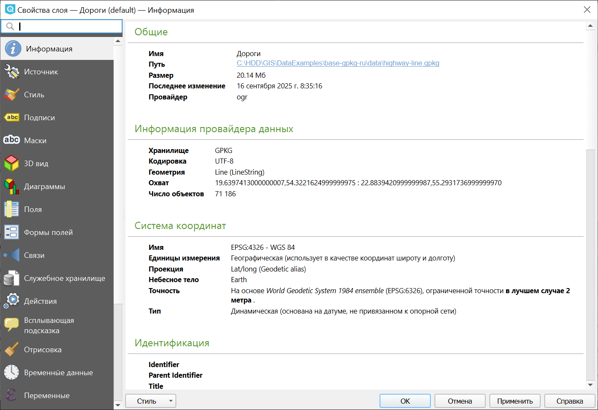

Здесь отображается основная информация о слое:

* Имя слоя
* Путь к файлу
* Размер
* Последнее изменение
* Провайдер (например, ogr)

Информация о провайдере (данных слоя):

* Хранилище (формат файла)
* Кодировка
* Геометрия
* Охват
* Число объектов

Данные о системе координат:

* Имя
* Единицы измерения
* Проекция
* Небесное тело
* Точность
* Тип

А также данные по следующим категориям:

* Идентификация
* Охват (пространственный и временной, если есть)
* Условия доступа
* Поля
* Контактные данные
* Ссылки
* История

Все пункты этого поля носят информационный характер. Чтобы изменить эти параметры, нужно перейти в соответствующую вкладку.

.. _source:

Источник
--------

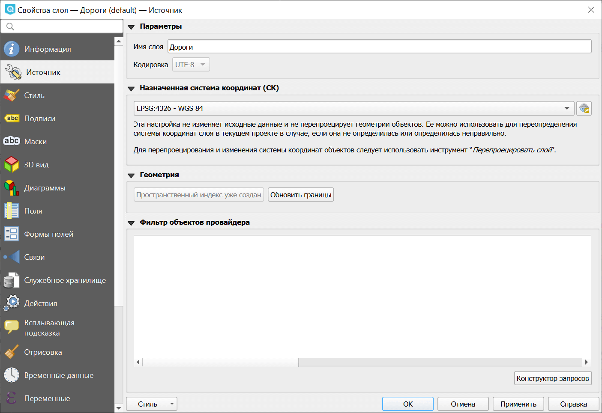

В этой вкладке можно:

* Изменить имя слоя;
* Назначить слою другую систему координат, если автоматически она определилась неверно;
* Создать пространственный индекс для ускорения поиска;
* Обновить границы слоя;
* Добавить фильтр объектов по запросу.

.. _3d_view:

3D вид
------

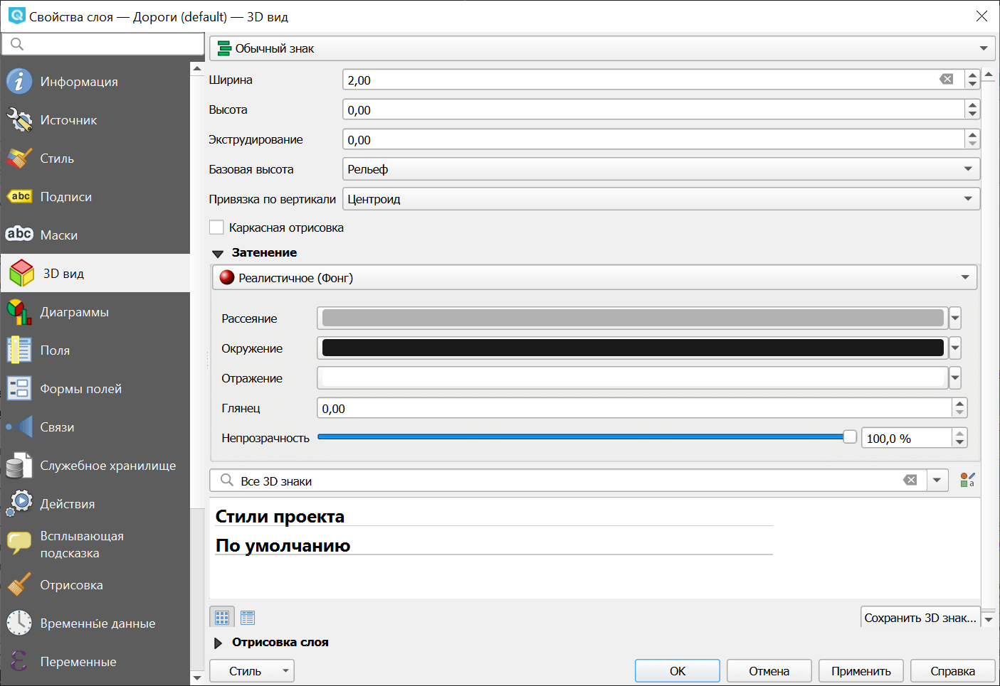

Задаёт стилизацию объектов с учётом рельефа.

.. _diagrams:

Диаграммы
---------

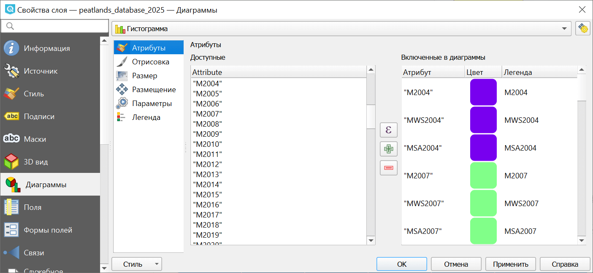

Позволяет добавить к объектам слоя диаграммы, визуализирующие значение атрибутов объекта.

Доступные типы диаграмм:

* |pie-chart| Круговая
* |text| Текстовая
* |histogram| Гистограмма
* |stacked-bar| Столбчатая

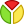

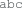

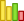

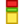

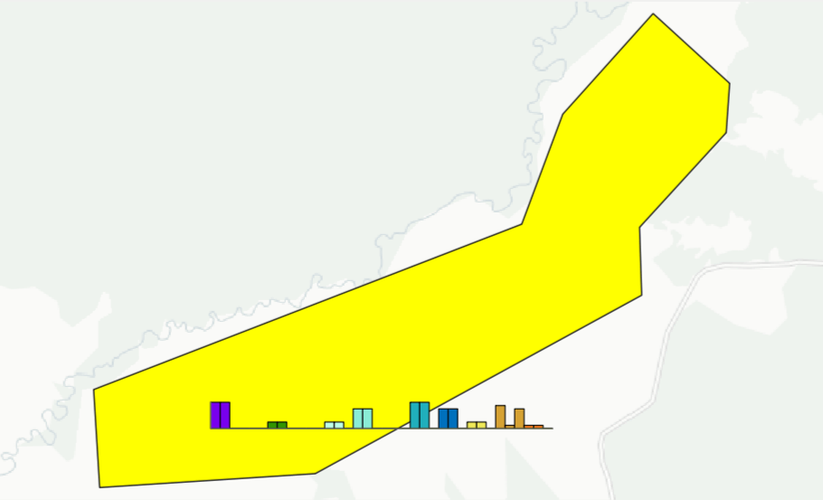

   Гистограмма объекта

Для диаграмм есть следующие разделы настроек:

* Атрибуты - значения каких атрибутов включаются в диаграмму;
* Отрисовка - внешний вид элементов диаграммы;
* Размер - каким образом значения атрибутов переводятся в размеры элементов диаграммы;
* Размещение относительно объекта и приоритет отрисовки;
* Параметры - направление столбцов для гистограммы и столбчатой диаграммы;
* Легенда диаграммы.

.. _fields:

Поля
----

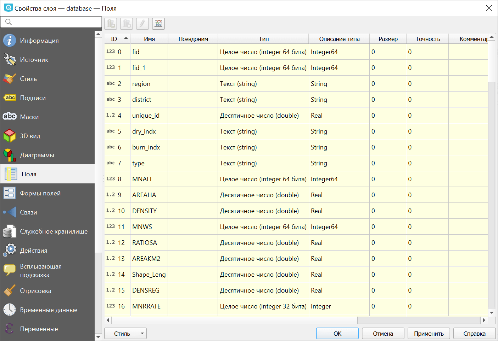

Содержит таблицу атрибутов слоя со следующими параметрами:

* ID
* Имя - уникальное имя поля
* Псевдоним - отображаемое название поля
* Тип
* Описание типа
* Размер
* Точность
* Комментарий
* Параметры: 

    * недоступно для поиска
    * не публиковать через WMS
    * не публиковать через WFS

Можно редактировать поля слоя, для этого нажмите на иконку карандаша.

Можно добавить новое поле, удалить поле, а также открыть калькулятор полей.

Также можно настроить форму отображения этих полей.

.. _form:

Формы полей
-----------

.. figure:: _static/layer_param_forms_ru.png
   :name: layer_param_forms_pic
   :align: center
   :width: 20cm

Форма создаётся автоматически для каждого слоя, однако можно также:

* Создать пользовательскую форму через конструктор форм;
* Загрузить готовую форму из файла.

Выберите нужный вариант в выпадающем меню наверху.

.. _joins:

Связи
-----

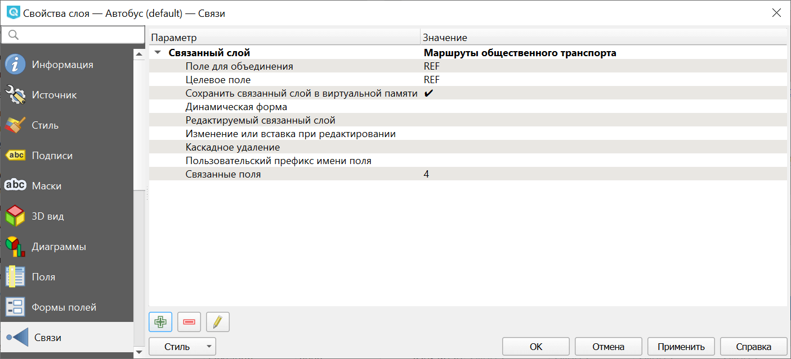

В слой можно дополнительно подтянуть информацию из другого слоя или таблицы. Чтобы добавить новую связь, нажмите на |symbologyAdd|.

.. |symbologyAdd| image:: _static/symbologyAdd.png
   :width: 6mm

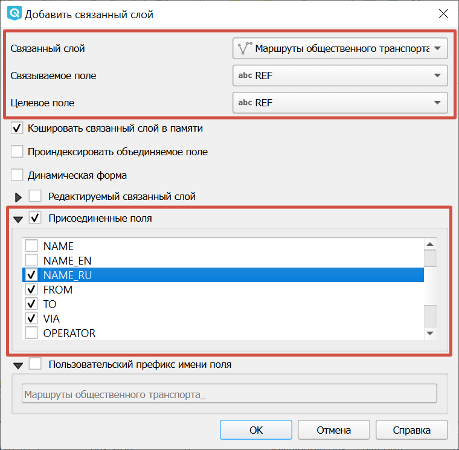

   Параметры добавляемой связи

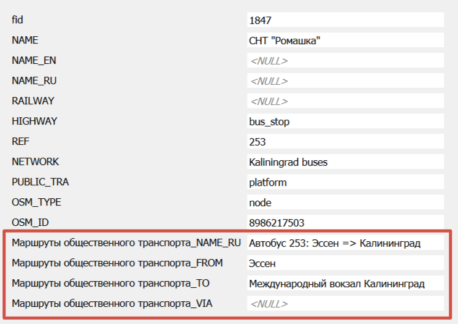

   Карточка объекта с присоединёнными полями

.. _auxil:

Служебное хранилище
-------------------

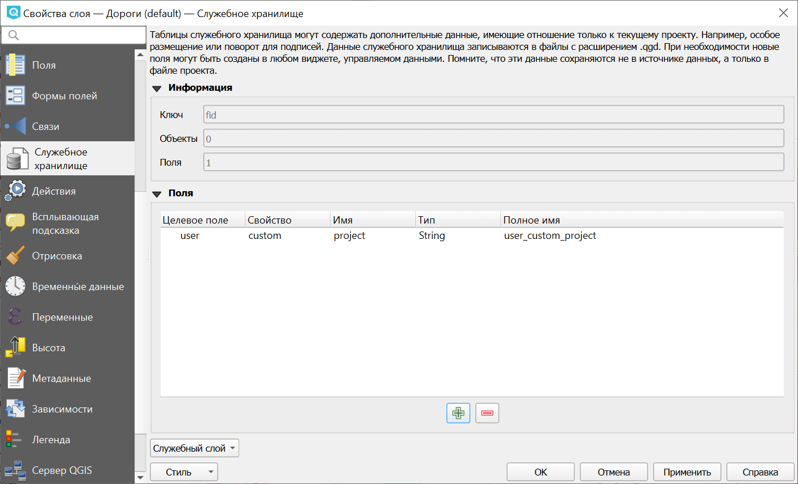

Таблицы служебного хранилища могут содержать дополнительные данные, имеющие отношение только к текущему проекту. Например, особое размещение или поворот для подписей. Данные служебного хранилища записываются в файлы с расширением .qgd. При необходимости новые поля могут быть созданы в любом виджете, управляемом данными. Помните, что эти данные сохраняются НЕ В источнике данных, а только в файле проекта.

.. _actions:

Действия
---------

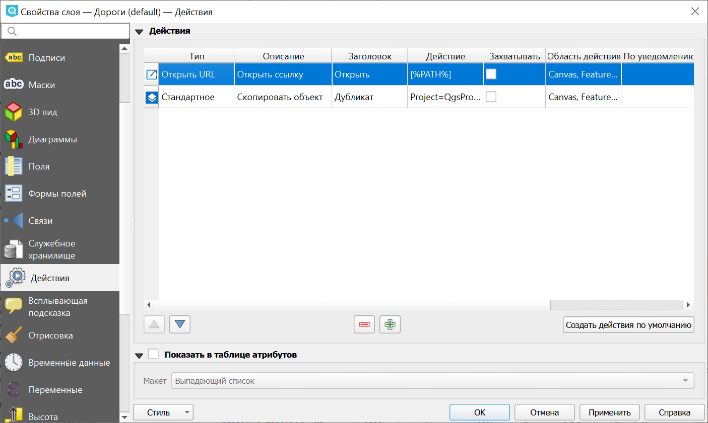

.. _display:

Всплывающая подсказка
---------------------

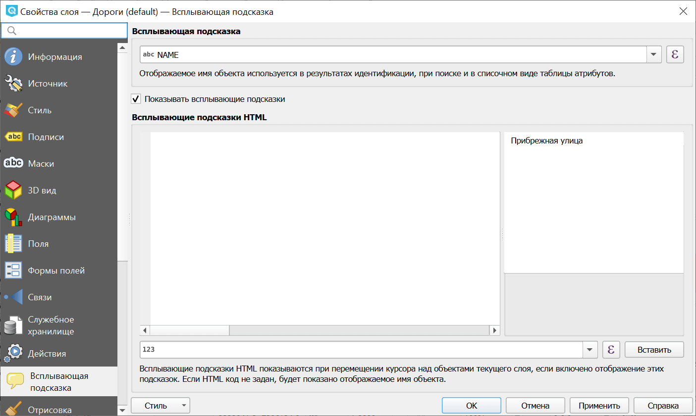

В этой вкладке можно настроить, какое из полей использовать в качестве отображаемого названия объекта.

Также можно настроить всплывающие подсказки. Поддерживается форматирование HTML.

.. _rendering:

Отрисовка
---------

Эти настройки определяют, как будут отрисовываться геометрии на карте.

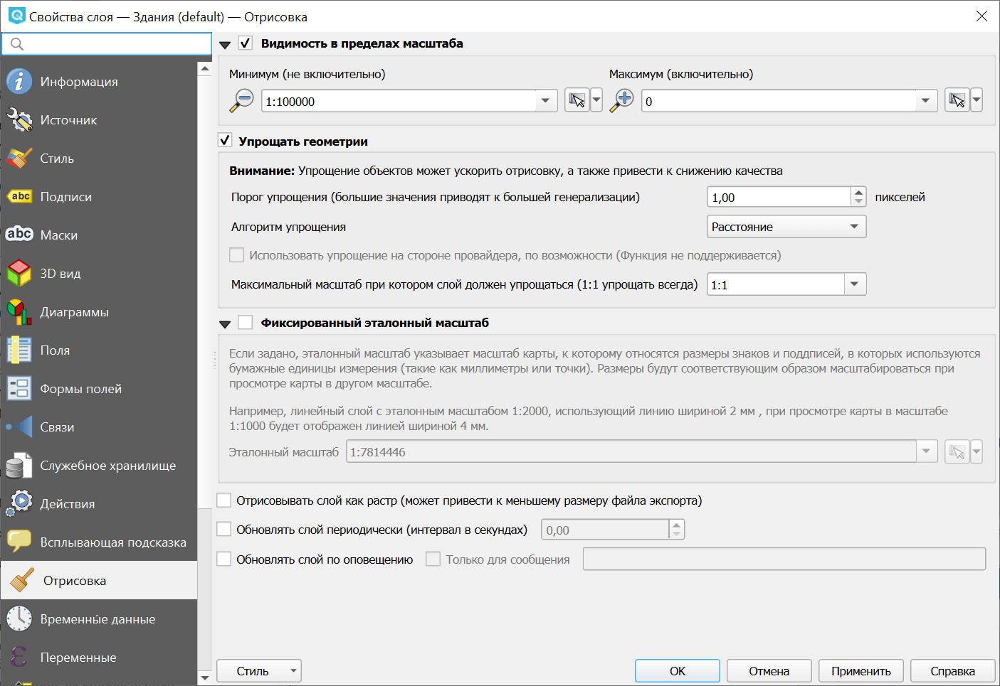

Видимость в пределах масштаба
~~~~~~~~~~~~~~~~~~~~~~~~~~~~~~~

Можно задать минимальный или максимальный масштаб, при котором объекты слоя будут отображаться. Это помогает не перегружать карту.

Упрощать геометрии
~~~~~~~~~~~~~~~~~~~

Упрощение геометрий ускоряет отрисовку, но приводит к снижению качества. Пригодится, если нужно быстро просматривать многочисленные или сложные по форме объекты.

Можно задать следующие параметры упрощения:

* Порог упрощения (чем выше значение, тем больше упрощение);
* Алгоритм упрощения (Расстояние / Прилипание к сетке / алгоритм Висвалингама);
* Максимальный масштаб, при котором слой должен быть упрощён (1:1 всегда упрощается).

Эталонный масштаб
~~~~~~~~~~~~~~~~~

Если задано, эталонный масштаб указывает масштаб карты, к которому относятся размеры символов и подписей, заданные в бумажных единицах измерения (таких как миллиметры или точки). Размеры будут соответствующим образом масштабироваться при просмотре карты в другом масштабе. Например, линейный слой с эталонным масштабом 1:2000, использующий линию шириной 2 мм, при просмотре карты в масштабе 1:1000 будет отображаться линией шириной 4 мм.

Также на этой вкладке можно включить следующие опции:

* Отрисовывать слой как растр;
* Обновлять слой периодически - задаётся интервал в секундах;
* Обновлять слой по оповещению (можно задать конкретное сообщение).

.. _temporal:

Временные данные
----------------

В этой вкладке настраивается отображение объектов, актуальных на определённый период времени (если такая информация есть в данных).

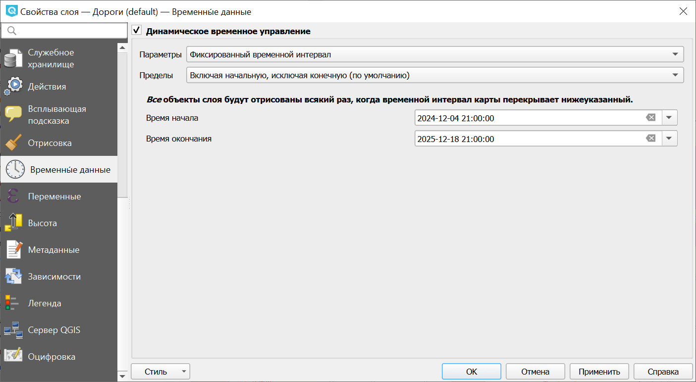

Активируйте **Динамическое временное управление**, чтобы настроить:

1. Параметры:

* Фиксированный временной интервал;
* Единое поле даты/времени;
* Раздельные поля для даты/времени начала и окончания;
* Раздельные поля для даты/времени начала и продолжительности события;
* Даты/время начала и окончания из выражения;
* Только перерисовать слой.

2. Предел. Начальная граница даты/времени включается в диапазон всегда. Можно выбрать, включать ли в него конечную границу даты/времени.

Ниже задаётся временная граница: время начала и время окончания.

.. _variables:

Переменные
----------

В этой вкладке можно изменить или задать переменные слоя. Они могут использоваться в выражениях.

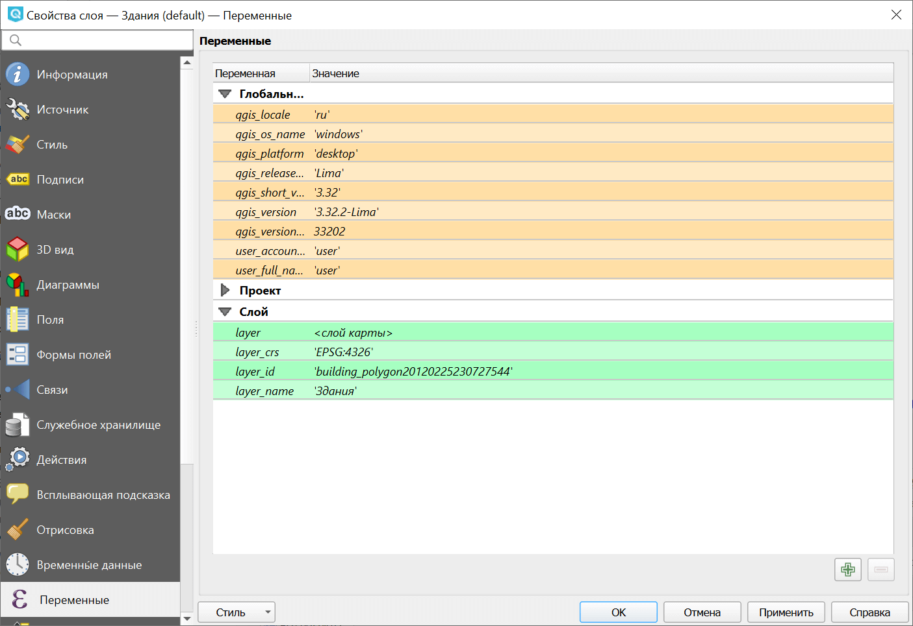

.. _elevation:

Высота
------

В этой вкладке настраиваются параметры обработки данных о высотах.

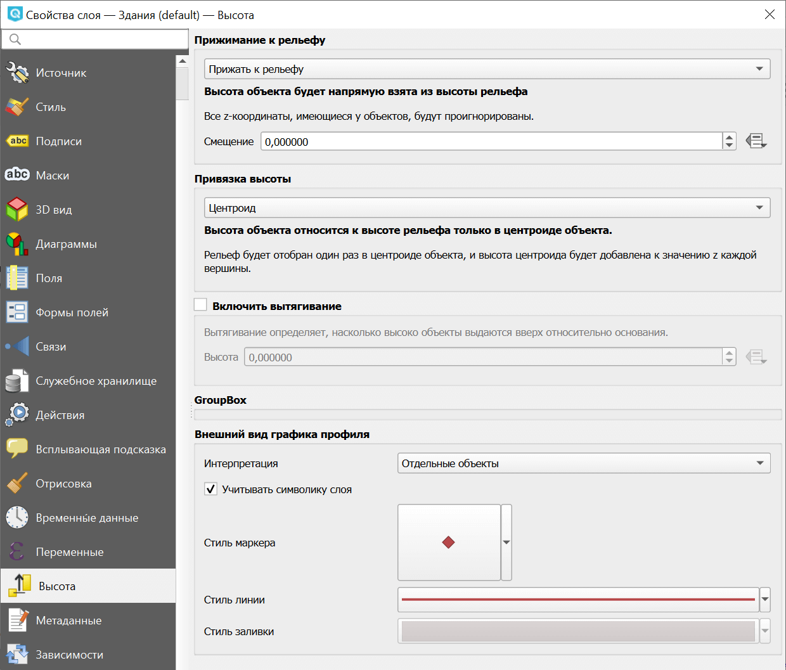

Прижимание к рельефу
~~~~~~~~~~~~~~~~~~~~~

Определяет правила обработки Z-координаты объекта:

* **Прижать к релеьфу** - высота объекта будет напрямую взята из высоты рельефа, значения Z-координаты будут проигнорированы. Можно задать единое **смещение**.
* **Абсолютное** - высота будет взята непосредственно из Z-координат объектов, а высота рельефа будет проигнорирована. Для этого режима можно задать **масштаб** и **базовую высоту**.

**Привязка высоты**: при выборе режима "Прижать к рельефу" рельеф может отбираться в **центроиде** объекта или **на каждой отдельной вершине**.

**Вытягивание** определяет, насколько высоко объекты выдаются вверх относительно основания.

Внешний вид графика профиля
~~~~~~~~~~~~~~~~~~~~~~~~~~~

* Интерпретация: отдельные объекты или непрерывная поверхность (контуры);
* Учитывать символику слоя;
* Стиль маркера;
* Стиль линии;
* Стиль заливки.

.. _metadata:

Метаданные
-----------

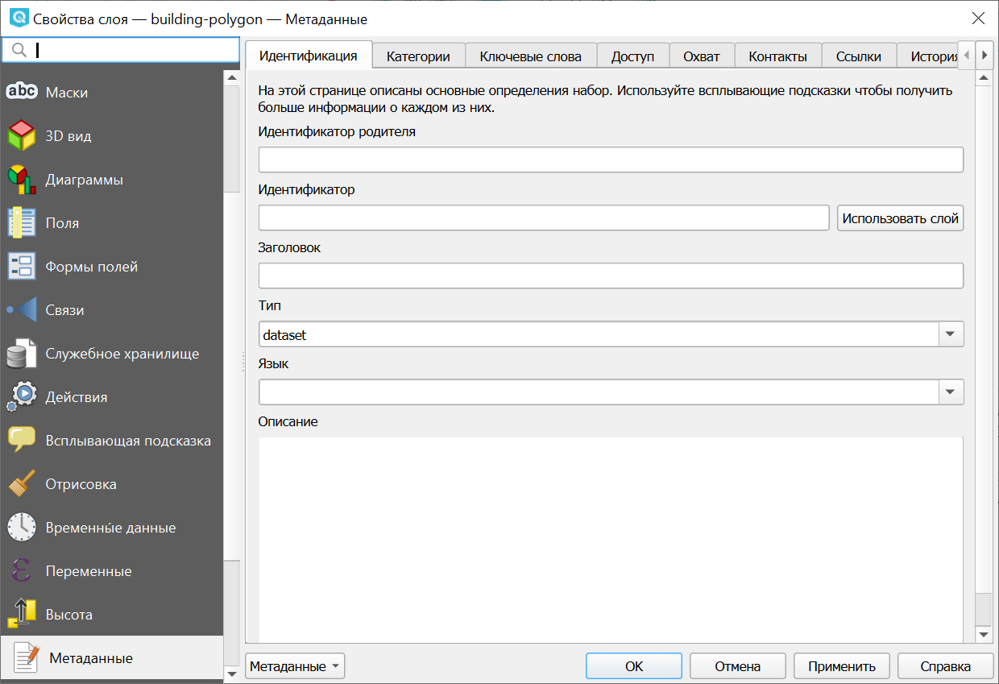

На этой вкладке можно настроить метаданные нескольких типов:

* Идентификация;
* Категории;
* Ключевые слова;
* Доступ;
* Охват;
* Контакты;
* Ссылки;
* История;
* Валидация - здесь можно проверить, корректно ли заполнены метаданные.

.. _depend:

Зависимости
-----------

Объекты слоя могут обновляться при изменении других слоёв проекта. Отметьте нужные слои галочками в списке.

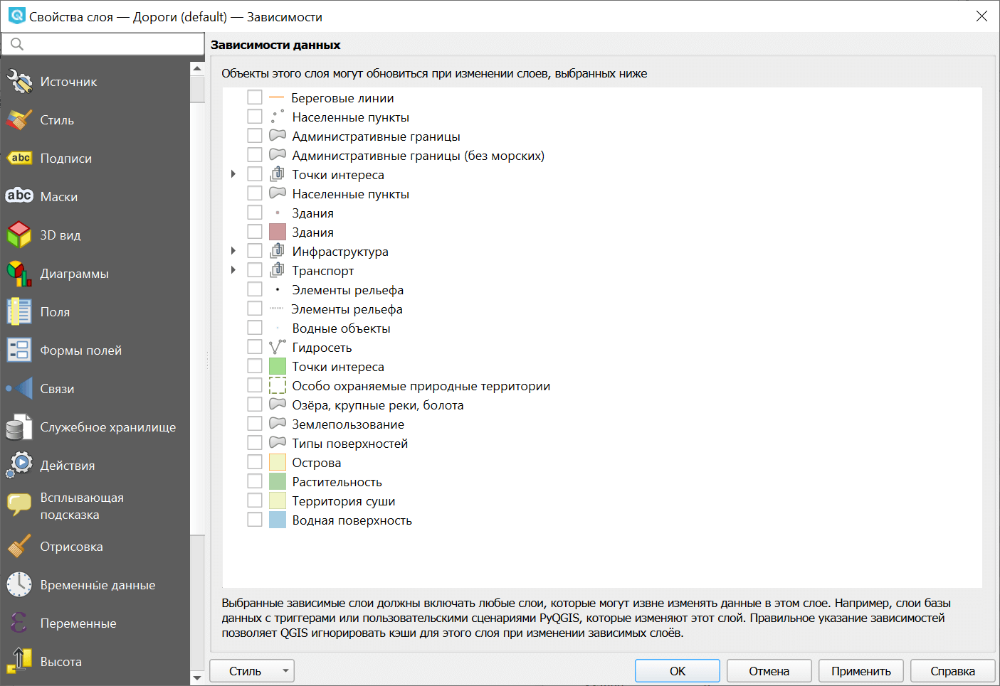

Выбранные зависимые слои должны включать любые слои, которые могут извне изменять данные в этом слое. Например, слои базы данных с триггерами или пользовательскими сценариями PyQGIS, которые изменяют этот слой. Правильное указание зависимостей позволяет QGIS игнорировать кэши для этого слоя при изменении зависимых слоёв.

.. _legend:

Легенда
-------

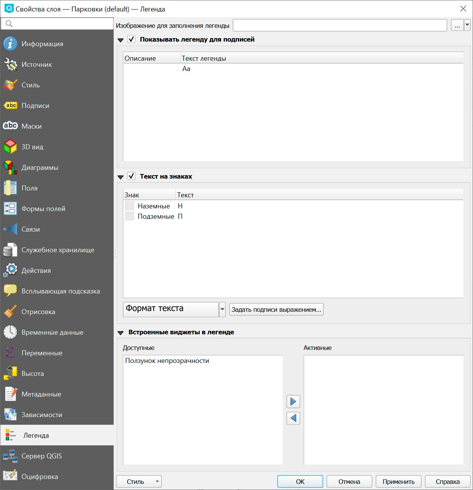

Доступны следующие настройки легенды:

* Можно задать **изображение для заполнения легенды**;
* Включить показ легенды для подписей;
* Включить текст на знаках - здесь задаётся текст, который отображается поверх знака в панели слоёв;
* Встроенные виджеты в легенде: можно добавить непосредственно в дерево слоёв **ползунок непрозрачности**.

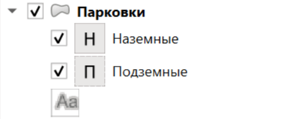

   Легенда с заданным текстом на знаке и отдельным отображением подписей

