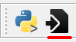
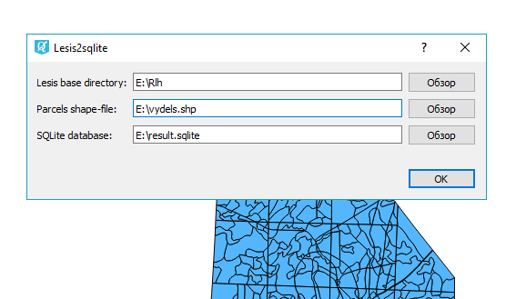

.. sectionauthor:: Александр Лисовенко <alexander.lisovenko@nextgis.ru>

.. _lesis2sqlite:

Lesis2SQLite
==============================

С помощью данного модуля расширения пользователь QGIS пользователь может импортировать в QGIS данные из ЛесИС (TopoL_L).
Подробности о ЛесИС (TopoL_L) можно найти тут: http://www.lesis.ru/doc/full.htm.

Модуль переносит данные из ЛесИС в базу данных SQLite, затем открывает ее как набор слоев в QGIS.

Для работы модулю необходимы следующие данные:

1. Shape файл границ выделов. Shape должен содержать следующие поля: NUMBER, NOMKVR, NOMVYD, PLSVYD, PLSPOL, NNN.
2. БД ЛесИС - каталоги баз данных образуют многоуровневую иерархическую структуру с одним корневым каталогом, 
   который может размещаться на диске. Уровни каталогов: федеральный, региональный, уровень лесхозов и уровень лесничеств.

Внутри иерархического дерева каталогов на разных уровнях могут встречаться каталоги со стандартизованными именами:

- N - каталог нормативно-справочной информации (НСИ);
- D - каталог таксационных и учетных баз данных;
- B - каталог блоков картографических баз данных.

Подробнее о БД ЛесИС: http://www.lesis.ru/doc/full.htm пункт 2.2.1

После установки расширения на панели инструментов QGIS появляется иконка:

   Иконка модуля lesis2sqlite.

После щелчка по иконке появится диалог импорта данных:

   Диалог импорта данных lesis2sqlite.

Возможные проблемы:

1. Не удается получить shape файл границ выделов с требуемыми полями.
   В наличии есть только поле NUMBER.
   Подробнее о векторных данных и поле NUMBER: http://www.lesis.ru/doc/full.htm пункт 2.5

   Существует таблица связи NUMBER и аттрибутами выдела.
   Ее место расположение: каталог блоков картографических баз данных уровня лесничества.
   Например:
   > 28\\05\\01\\B\\Vd.blk\\P7550.DBF

   Далее, используя в QGIS механизм связей, связываем данные shape файла и таблицы по значению NUMBER и сохраняем получившийся слой.
   Далее работаем с новым shape файлом.
