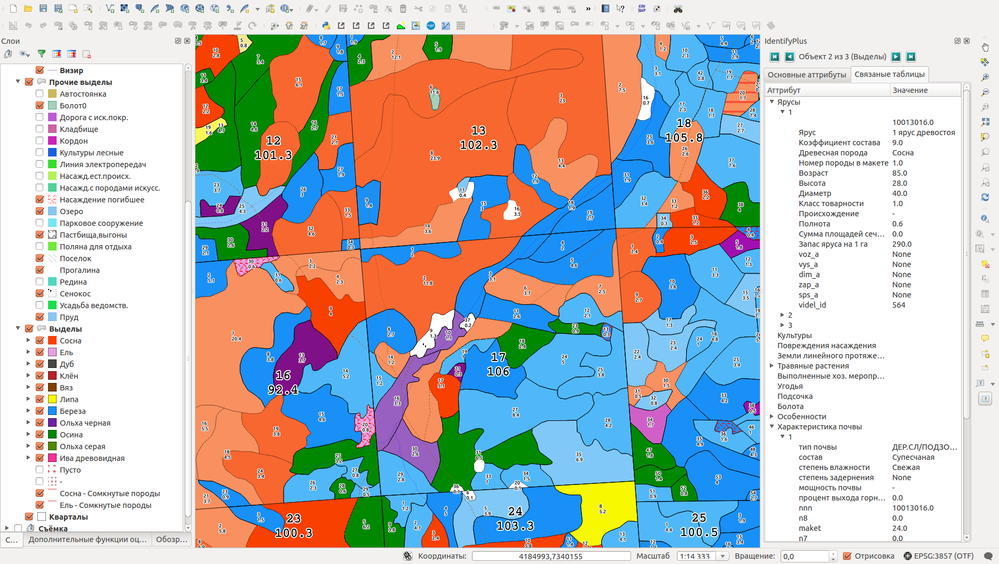

.. sectionauthor:: Александр Лисовенко <alexander.lisovenko@nextgis.ru>

.. _lesis2sqlite:

Lesis2SQLite
============

Организации, выполняющие лесоустройство, ведут его в специализированных программах, таких как ГИС TopoL (Lesis, подробнее: http://www.lesis.ru/doc/full.htm), настроенных под этот процесс. Формат хранения подобных ГИС плохо документирован и извлечь данные для использования в универсальных ГИС не так просто.

Организации лесопользователю часто необходимо обеспечить широкий доступ к лесоустроительной информации сотрудникам для совместного просмотра и обработки данных лесоустройства и другой пространственной информации. Но простой экспорт из ГИС TopoL приводит к потерям информации. Поэтому мы разработали ряд инструментов для эффективной конвертации данных в формат ГИС с сохранением максимального количества информации.

С помощью модуля расширения Lesis2SQLite пользователь QGIS пользователь может импортировать в QGIS данные из ЛесИС (TopoL_L).

Модуль переносит данные из ЛесИС в базу данных SQLite, затем открывает ее как набор слоев в QGIS.

Для работы модулю необходимы следующие данные:

1. Shape файл границ выделов. Shape должен содержать следующие поля: NUMBER, NOMKVR, NOMVYD, PLSVYD, PLSPOL, NNN. В зависимости от версии TopoL, экспорт в shape происходит так:

* TopoL для лесничества: Объект -> Экспорт -> Arcview Shapefile
* TopoL для лесхоза: Вкладка Блоки-редактор -> Меню блока -> Экспорт -> Arcview Shapefile (данные: по всем выделам, метод выбора: все видимые)

2. БД ЛесИС - каталоги баз данных образуют многоуровневую иерархическую структуру с одним корневым каталогом, 
   который может размещаться на диске. Уровни каталогов: федеральный, региональный, уровень лесхозов и уровень лесничеств.

Внутри иерархического дерева каталогов на разных уровнях могут встречаться каталоги со стандартизованными именами:

- N - каталог нормативно-справочной информации (НСИ);
- D - каталог таксационных и учетных баз данных;
- B - каталог блоков картографических баз данных.

Подробнее о БД ЛесИС: http://www.lesis.ru/doc/full.htm пункт 2.2.1

После установки расширения на панели инструментов QGIS появляется иконка:

.. figure:: _static/lesis2qgis/tool.png
   :align: center

   Иконка модуля lesis2sqlite.

После щелчка по иконке появится диалог импорта данных:

.. figure:: _static/lesis2qgis/dialog.png
   :align: center

   Диалог импорта данных lesis2sqlite.
, где:

1. в первой строке (Lesis base directory) следует указать корневой каталог БД ЛесИС. Необходимое, но не достаточное условие успешной выгрузки: корневой каталог должен содержать каталог нормативно-справочной информации ('n'), который должен содержать Fields.DBF, Makets.DBF и множество дополнительных dbf файлов, а каталог таксационных и учетных баз данных ('d') уровня лесничества должен содержать файлы Phl1.DBF, Phl2.DBF, Phl3.DBF;

2. в второй строке (Parcels shape-file) следует указать Shape файл границ выделов;

3. в третьей строке (SQLite database) - путь до файла с результатами выгрузки.

Результаты:

Если импорта произведен правильно и при наличие инструмента Identify+ результат будет выглядеть как изображено на иллюстрации.

Возможные проблемы:

1. Не удается получить shape файл границ выделов с требуемыми полями.
   В наличии есть только поле NUMBER.
   Подробнее о векторных данных и поле NUMBER: http://www.lesis.ru/doc/full.htm пункт 2.5

   Существует таблица связи NUMBER и аттрибутами выдела.
   Ее место расположение: каталог блоков картографических баз данных уровня лесничества.
   Например:
   > 28\\05\\01\\B\\Vd.blk\\P7550.DBF

   Далее, используя в QGIS механизм связей, связываем данные shape файла и таблицы по значению NUMBER и сохраняем получившийся слой.
   Далее работаем с новым shape файлом.
