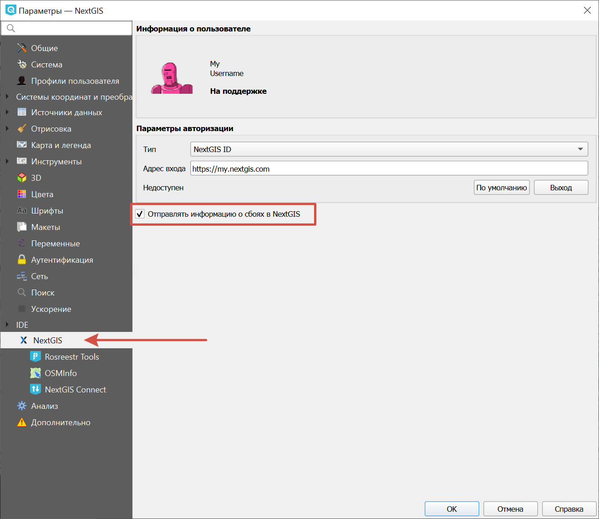
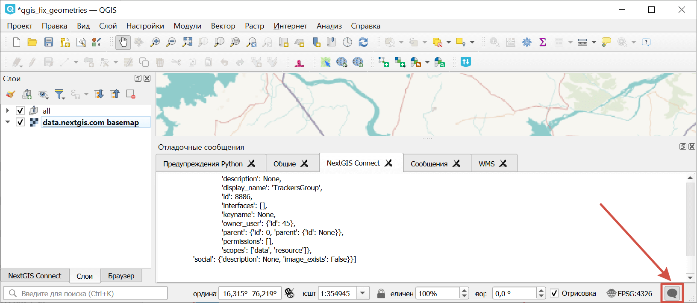
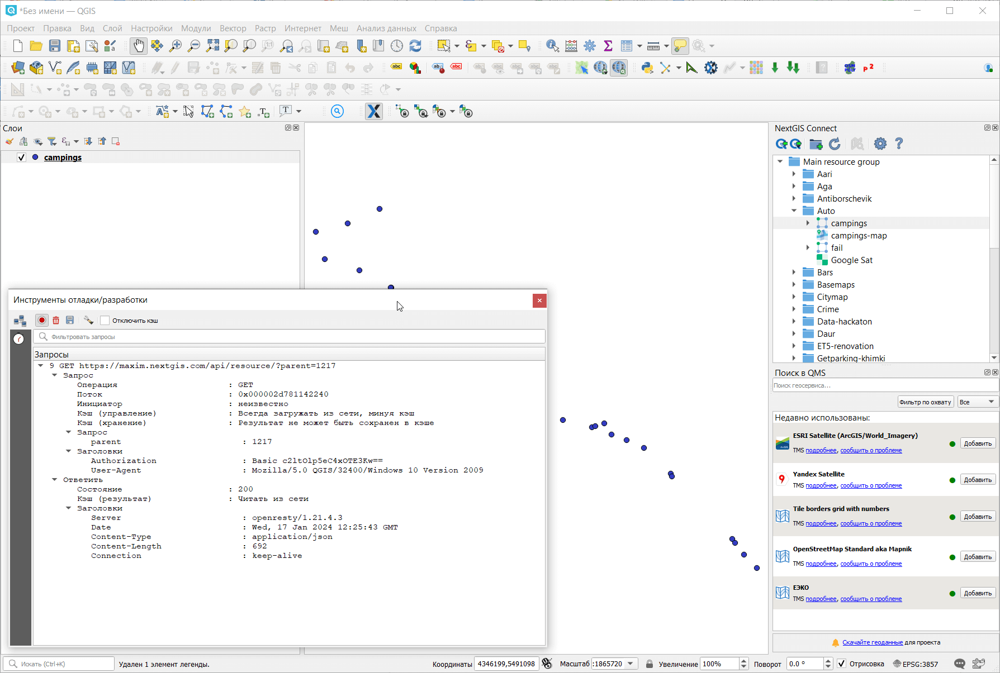
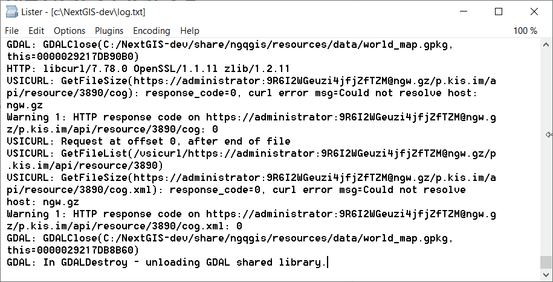

Сбор логов NextGIS QGIS
=========================

При возникновении проблем в работе приложения важно получить как можно более точную информацию о том, что в этот момент происходит. Для этого используются разного рода сообщения об ошибках и логи.

.. _send_crashes:

Отправка информации о сбоях программы
-------------------------------------

В верхнем меню выберите :menuselect:`Настройки ---> Параметры --> NextGIS ID` и установите флажок "Отправлять информацию о сбоях в NextGIS". 

   Включение отправки информации о сбоях

Отладочные сообщения
---------------------

Чтобы открыть панель отладочных сообщений, нажмите на значок |mMessageLog| в правом нижнем углу окна NextGIS QGIS. Она состоит из нескольких вкладок, в которых сгруппированы сообщения о работе программы в целом и отдельных модулей.

.. |mMessageLog| image:: _static/mMessageLog.png
   :width: 6mm
   :alt: серый овал с тремя точками

   Активирована панель отладочных сообщений

.. _debug_panel:

Перехват исходящих запросов в NextGIS QGIS
-------------------------------------------

.. |network_and_proxy| image:: _static/network_and_proxy.png
   :width: 6mm

.. |mActionRecord| image:: _static/mActionRecord.png
   :width: 6mm
   :alt: красный кружок

.. |mActionDeleteSelected| image:: _static/mActionDeleteSelected.png
   :width: 6mm
   :alt: красное мусорное ведро

.. |mActionFileSave| image:: _static/mActionFileSave.png
   :width: 6mm

Данная функциональность используется для отладки и выяснения причин ошибок доступа к веб-сервисам. Рассматривается на примере работы с модулем NextGIS Connect, может использоваться для любых ситуаций.

Целевое действие - конкретное действие вызывающее ошибку или некорректное поведение. Например, в NextGIS Connect это может быть момент нажатия на кнопку “Добавить в QGIS”. Для получения дополнительной отладочной информации:

#. Проверяем, что NextGIS QGIS и исследуемые модули обновлены до последней версии.
#. Запускаем NextGIS QGIS.
#. Включаем панель “Инструменты отладки”. Меню: Вид - Панели - Инструменты отладки/разработки.
#. Проверяем, что открыта вкладка "Сетевой регистратор" |network_and_proxy| и включаем запись в Журнал |mActionRecord|.
#. Открываем остальные нужные окна, панели инструментов и т.д.
#. Доходим до шага непосредственного перед целевым действием (см. определение), но не выполняем его.
#. В панели “Инструменты отладки” нажимаем очистить журнал |mActionDeleteSelected|.
#. Выполняем целевое действие, дожидаемся ошибки или другого проявления проблемы.
#. Сохраняем журнал |mActionFileSave| и отправляем его в поддержку: support@nextgis.ru. Если это первое письмо, то нужно сопроводить его подробным описанием проблемы.

   Перехват логов NextGIS QGIS

.. _gdal:

Перехват логов GDAL для NextGIS QGIS в Windows
----------------------------------------------

Некоторые логи - “логи GDAL” в самом QGIS с помощью встроенного перехватчика перехватить не удастся. Это можно сделать, если запускать NextGIS QGIS через консоль. 

Открываем терминал там, где ожидаем увидеть лог, например в папке установки NGQ. 

Для этого:

Win 11: правой кнопкой мыши в Проводнике на белом поле в нужной папке и Открыть терминал.

Win 10: Пуск, ``cmd``, ``cd c:\NextGIS-dev\`` (или нужную папку, где установлен NextGIS QGIS).

Далее:

#. ``ng``
#. ``set CPL_DEBUG=ON``
#. ``ngqgis 2>> log.txt``, если нужен полный лог ``ngqgis >> log.txt 2>&1``
#. Воспроизводим проблему в NextGIS QGIS.
#. Результат -> Информация для отладки записывается в **log.txt**

   Логи GDAL

