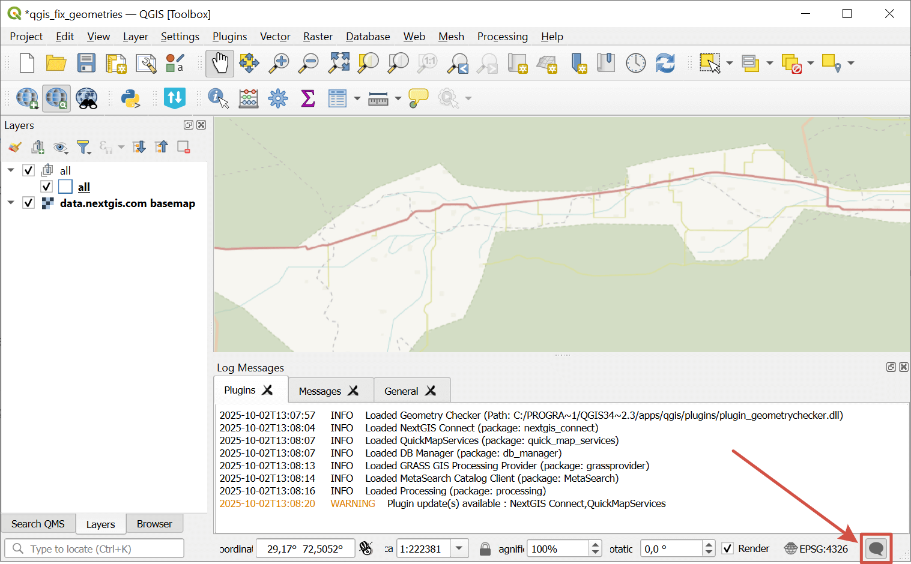
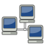
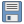
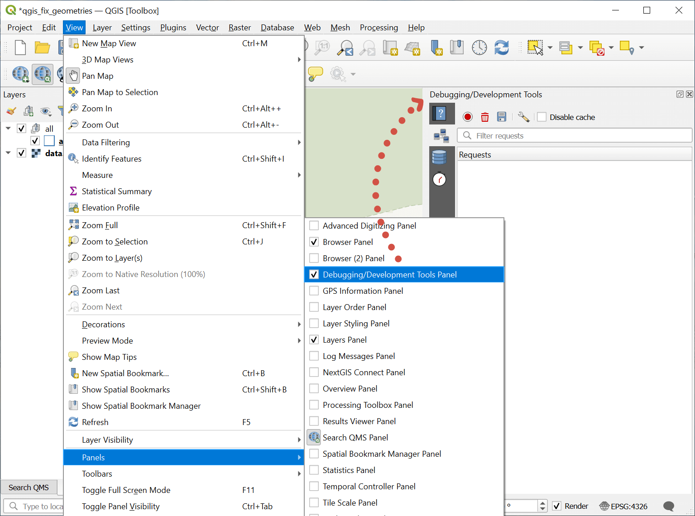
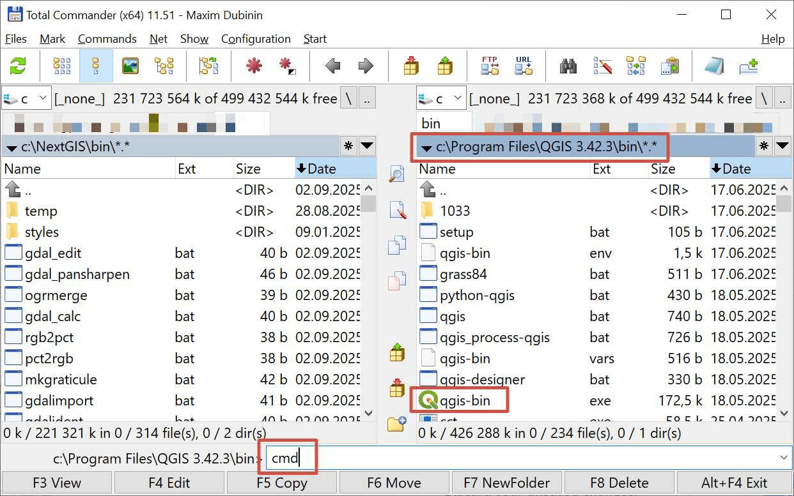
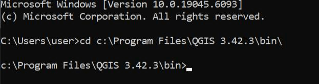

Gather logs in QGIS
=========================

If a problem occurs, it's important to have full information on what was going on in the program at the time. To provide the support team with this information you can use logs and debug messages.

Log messages
-------------

To view the Messages panel click on the  |mMessageLog| icon in the bottom right corner of the QGIS window. Messages are grouped into several tabs, some of them are general, others give more details about specific plugins.

   Messages panel is activated

.. _debug_panel:

Capture outgoing requests in QGIS
-----------------------------------

This functionality is used for debugging and in case of errors while working with Web services. 

The target action is the action that immediately precedes the error or incorrect app behavior. For example, in NextGIS Connect plugin it can be clicking on the "Add to QGIS" button. To get additional debug information:

#. Make sure that all related plugins are updated to the latest version and your app is updated to the latest LTR or higher.
#. Launch QGIS.
#. Activate "Debugging/Developpment Tools" panel. You can do it from the main menu: View --> Panels ---> Debugging/Developpment Tools.
#. Go to the |network_and_proxy| Nextwork Logger tab and click |mActionRecord| to turn on log recording.
#. Open the other tool panels that you need etc.
#. Reproduce the actions leading to the Target action (see above), but do not perform the Target action itself.
#. In the Debugging/Development Tools click |mActionDeleteSelected| to wipe the log clean.
#. Perform the Target action, wait for the error to reproduce.
#. Save the log by clicking |mActionFileSave| in the Debugging/Development Tools panel and send it to support@nextgis.com. If it's the first time you write about the problem, add detailed description (`How to make an efficient bug report <https://nextgis.com/bugreport/>`_).

   Capturing QGIS network logs

.. _gdal:

Capturing GDAL logs for QGIS on Windows
----------------------------------------------

Some logs, namely those of GDAL, cannot be recorded by the in-built debugging tools of QGIS. But you can record them if you run QGIS from the command prompt. 

1. Open the folder that has qgis-bin.exe in it. The path is something like ``c:\Program Files\QGIS 3.42.3\bin\qgis-bin.exe``.

2. In that folder open the Command Console.

If you're working in Total Commander, open the TC as administrator, find the folder, type cmd and press Enter.

   Opening Command Console from Total Commander

If you don't have Total Commander, go to **Start** - type ``cmd`` and select the **Command Prompt app - run as administrator**.

In the app, go to the QGIS bin folder by typing cd+the path, for example:

``cd c:\Program Files\QGIS 3.42.3\bin\``

   Navigating to the QGIS folder in Command Console

3. In the command prompt run:

``set CPL_DEBUG=ON
qgis-bin.exe >> log.txt 2>&1``

It creates a file log.txt

4. Open QGIS and reproduce the error.

5. Send the **log.txt** file to support@nextgis.com.
