.. sectionauthor:: Дмитрий Барышников <dmitry.baryshnikov@nextgis.ru>
.. sectionauthor:: Артём Светлов <artem.svetlov@nextgis.ru>

.. _ngqgis_map:

Создание карты
===============

Добавление геоданных
---------------------

:program:`NextGIS QGIS` предоставляет пользователю возможность добавлять:

* Векторные данные.
* Растровые данные.
* Использовать тайловые подложки из интернета.
* Добавлять растры по протоколу :term:`WMS` и :term:`TMS`.
* Работать по протоколу :term:`WFS`.
* Добавлять слои из Веб-ГИС NextGIS Web.
* Предоставляет возможность пользователю добавлять собственные данные.

.. _ngqgis_map_from_file:

Добавление растровых и векторных слоёв из файлов
^^^^^^^^^^^^^^^^^^^^^^^^^^^^^^^^^^^^^^^^^^^^^^^^

Геоданные бывают векторные и растровые. Векторные данные обычно хранятся как электронная 
таблица, где у каждой записи есть своя геометрия - то есть фигура, заданная координатами 
точек. Растровые данные обычно сохраняются как картинка, в которой указано, на какое 
место земного шара она ложится.

Существует множество форматов хранения геоданных и протоколов их передачи по сети. 
Они могут представлять собой файлы или находиться в базах данных. Преобразованием 
форматов занимаются утилиты :program:`GDAL` (растровые) и :program:`OGR` (векторные). 
Благодаря этим утилитам :program:`NextGIS QGIS` может читать и записывать разные 
форматы данных без сильных различий для пользователя. Разумеется, обычно используются 
только самые общеупотребительные форматы.

.. note::
   QGIS использует библиотеку OGR для чтения и записи векторных данных (работа с векторными
   данными GRASS и данными PostgreSQL реализована через отдельные модули поставщиков 
   данных), включая :term:`ESRI Shapefile` файлы, файлы MapInfo и Microstation, пространственные 
   базы :term:`PostGIS`, SpatiaLite, Oracle и многие другие. Кроме того, векторные данные могут 
   быть загруженны напрямую из архивов zip или gzip. С полным списком форматов векторных 
   данных можно ознакомиться по адресу: https://gdal.org/drivers/vector/index.html .

Понятие Слой будет часто встречаться в инструкции. Слой - это геоданные с определенным
составом и оформлением. Карта состоит из одного или нескольких слоев.

.. note:: Для открытия файлов векторных геоданных вам потребуется знать: место, где лежат файлы на диске, их кодировку.

Для добавления слоя выполните: ``Слой ‣ Добавить слой ‣ Добавить векторный слой`` или 
``Слой ‣ Добавить слой ‣ Добавить растровый слой`` соответственно.

Если слой растровый, то скорее всего он будет в формате :term:`GeoTIFF` (с расширением .tif).

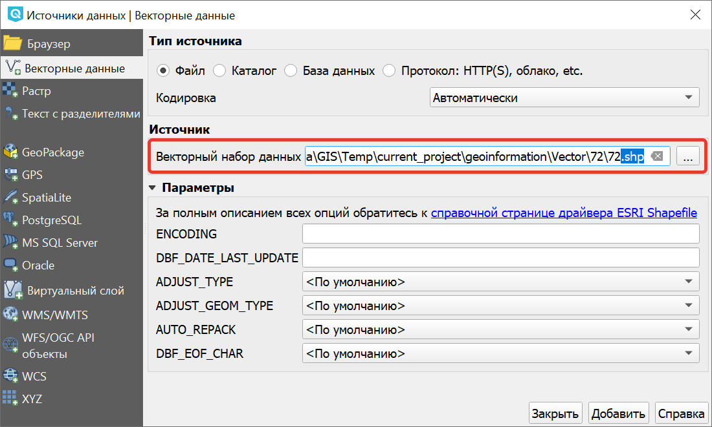

   Диалог открытия векторного файла
   
При открытии ESRI Shapefile в этом диалоге нужно выбирать файл с расширением .shp.

Также вам необходимо знать кодировку файлов: 

При работе в **Windows**:

* Если кодировка файлов - UTF-8, то при открытии векторных 
  файлов в поле ``Кодировка`` вместо System рекомендуется выбирать UTF-8.
* Если кодировка файлов - Windows-1251, то при открытии 
  векторных файлов кодировку менять *нет необходимости*.
  
При работе в **Linux**:
  
* Если кодировка файлов - UTF-8, то при открытии векторных 
  файлов кодировку менять *нет необходимости*.
* Если кодировка файлов - Windows-1251, то при открытии векторных 
  файлов в поле ``Кодировка`` вместо System выберите Windows-1251.

* Если в Shapefile нет файла cpg, то кодировка меняться не будет. В этом случае зайдите в настройки NextGIS QGIS: Установки --> Параметры --> Источники данных --> Источники данных --> Игнорировать обьявленную кодировку Shape-файлов.

.. note::
   На текущий момент принято, что все данные сохраняются в кодировке UTF-8. При 
   работе на ОС Windows при открытии и сохранении векторных данных нужно явно указывать 
   кодировку UTF-8. По умолчанию она может быть System - это значит Windows-1251. Если вы 
   открыли файл в неправильной кодировке, то русские буквы там будут нечитаемыми. 
   В этом случае нужно в свойствах слоя выставить кодировку UTF-8. Но лучше сразу 
   выставлять её при открытии файла, чтобы не забыть.

.. tip::
   Если в таблице атрибутов вы увидите нечитаемые символы, переключите кодировку 
   между UTF-8 и Windows-1251 в свойствах слоя, и переоткройте таблицу атрибутов.

.. _ngqgis_map_basemap:

Добавление базовых карт из Интернета
^^^^^^^^^^^^^^^^^^^^^^^^^^^^^^^^^^^^

Для добавление базовой карты (картографической подложки, картподложки) следует воспользоватся плагином QuickMapServices. 

Картографическая подложка часто выступает в качестве первого слоя, добавляемого для 
работы в проект. Подложка часто представлена в виде различных интернет-сервисов: 
TMS, WMS, WMTS, ESRI ArcGIS Service или просто в виде тайлов XYZ.

Но запомнить адреса Интернет-сервисов сложно, а процесс их ввода каждый раз при смене 
рабочего места отнимает достаточно много времени. Поэтому для оптимизации работы был разработан 
плагин QuickMapServices — расширение, которое 
позволяет быстро и удобно работать с базовыми картами, получаемыми из 
различных интернет-сервисов в проект QGIS. 

В QuickMapServices есть два хранилища для подложек: базовое и дополнительное. Подложки 
из базового набора устанавливаются и включаются вместе с модулем расширения.
Описание модуля находится в главе `QuickMapServices <https://docs.nextgis.ru/docs_ngqgis/source/qms.html#quickmapservices>`_.

.. _ngqgis_map_posgis_database:

Работа с базами данных PostGIS
^^^^^^^^^^^^^^^^^^^^^^^^^^^^^^

Вам потребуется знать :term:`URL` сервера PostGIS, название базы данных, имя пользователя 
и пароль.

Для добавления слоя PostGIS на карту нажмите ``Слой ‣ Добавить слой ‣ Добавить слой PostGIS``. 
Откроется следующее окно: 

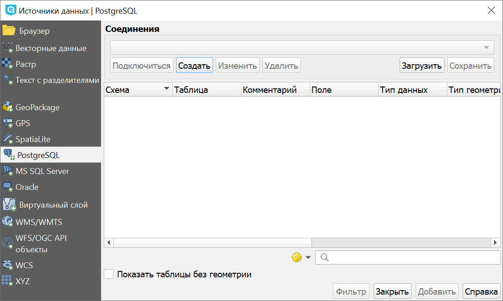

   Окно "Источники данных | PostgreSQL"

В списке Соединения выберите заранее сохранённое подключение или, если его нет, то нажмите **"Создать"** (соединение).
Откроется окно "Создание нового подключения к PostGIS". Введите туда известные вам 
параметры. Нажмите кнопку **"Проверить соединение"**. Если выведется сообщение 
об ошибке, значит вы либо ввели неправильные параметры, либо неправильно настроена 
база данных, либо неправильно настроена сеть. Если выведется сообщение об успешном 
подключении, то всё в порядке. 

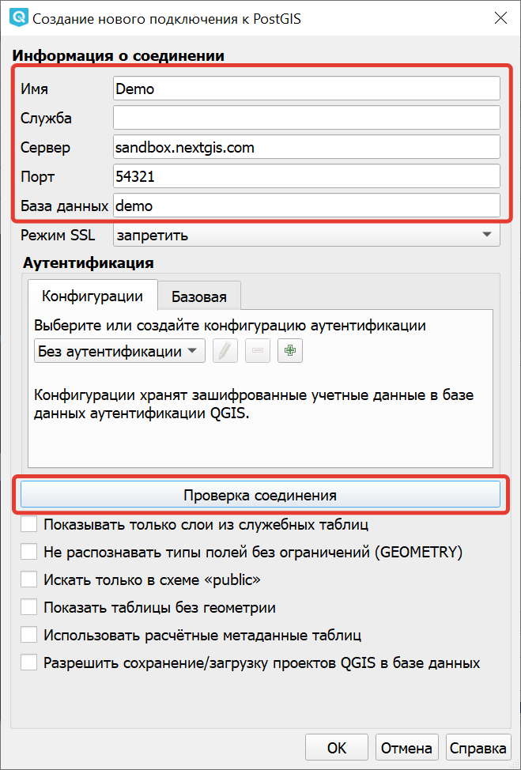
 
   Создание нового подключения к PostGIS
   
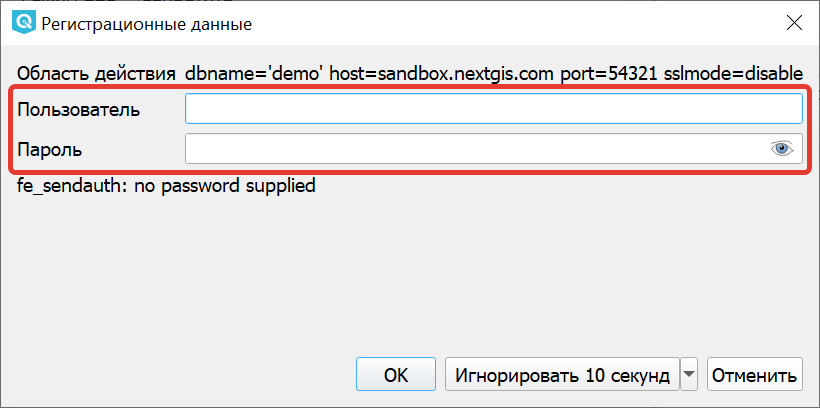
   
   Авторизация при создании подключения

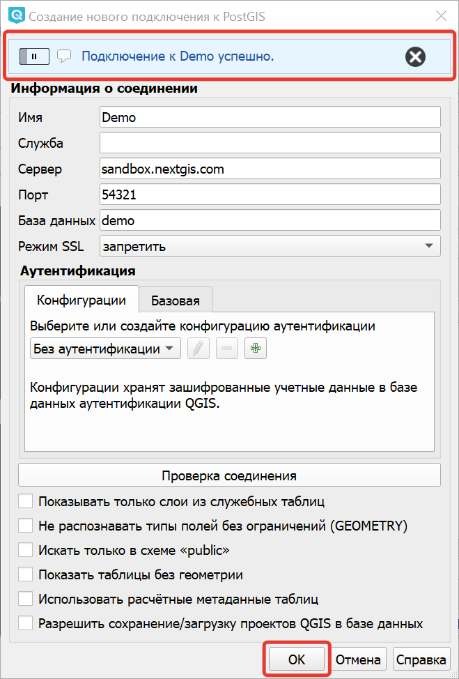
   
   Сообщение об успешном создании соединения.

Нажмите **ОК**.
Далее в окне "Источники данных" выберите в списке новое подключение, 
нажмите кнопку **"Подключиться"**.
В списке таблиц появится список таблиц и хранимых представлений PostGIS, которые 
видно в базе данных. Выберите одну или несколько таблиц и нажмите **"Добавить"**.

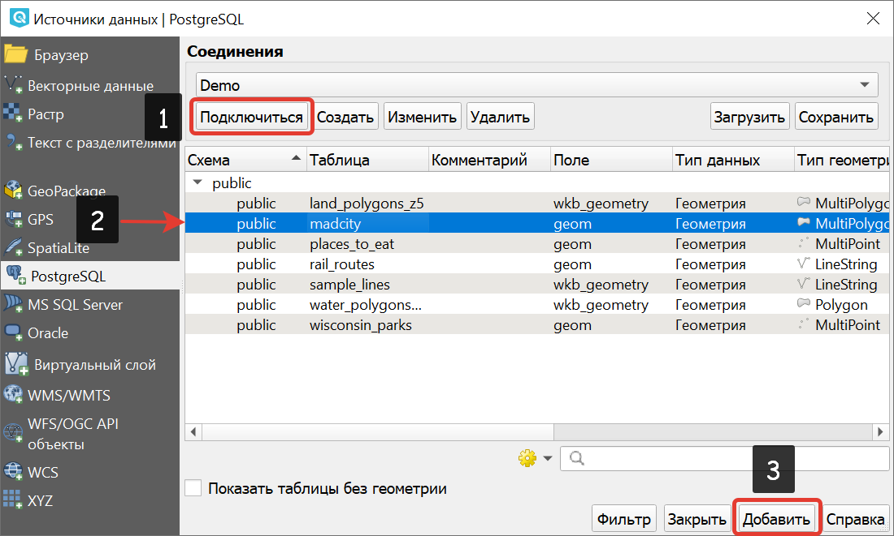

   Окно с таблицами PostGIS
 
Дальнейшая работа со слоями PostGIS осуществляется в :program:`NextGIS QGIS` точно 
так же, как с векторными слоями из файлов. 

.. _ngqgis_map_wms:

Работа по протоколу WMS
^^^^^^^^^^^^^^^^^^^^^^^

Вам потребуется знать URL сервиса WMS.

Для добавления слоя WMS на карту нажмите ``Слой ‣ Добавить слой ‣ Добавить слой WMS/WMTS``.
Откроется следующее окно: 

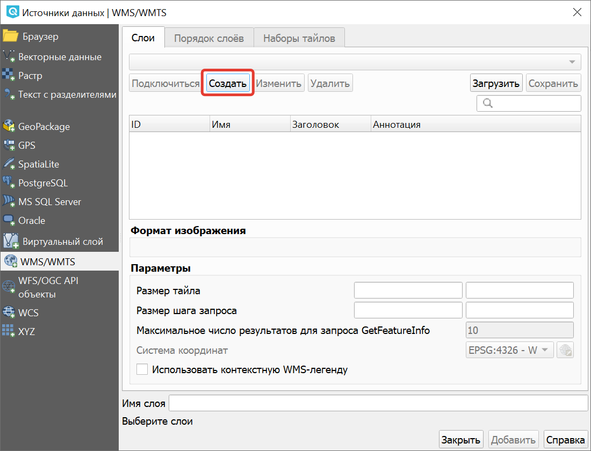

   Окно "Источники данных | WMS/WMTS"

В списке Соединения выберите заранее сохранённое подключение или, если его нет, нажмите **"Создать"** (соединение).
Откроется окно "Создать новое подключение WMS/WMTS". Введите туда известные 
вам параметры адреса и придумайте название.

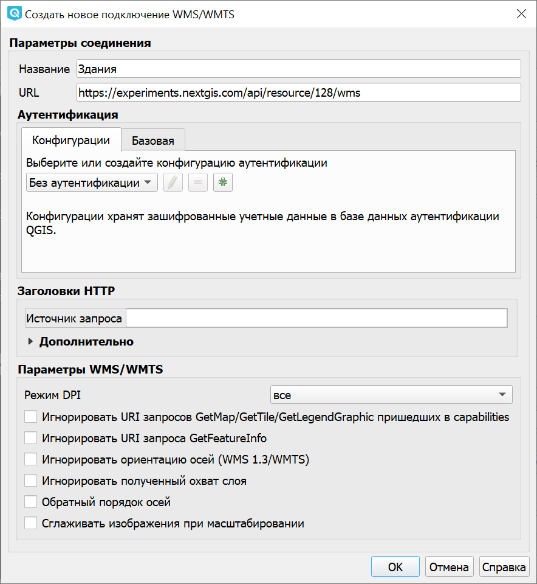
   
   Создание нового подключения WMS/WMTS"
   
Далее в окне "Добавить слой WMT(S)" выберите в списке новое подключение, 
нажмите кнопку **"Подключиться"**. При необходимости введите логин и пароль для доступа к сервису.

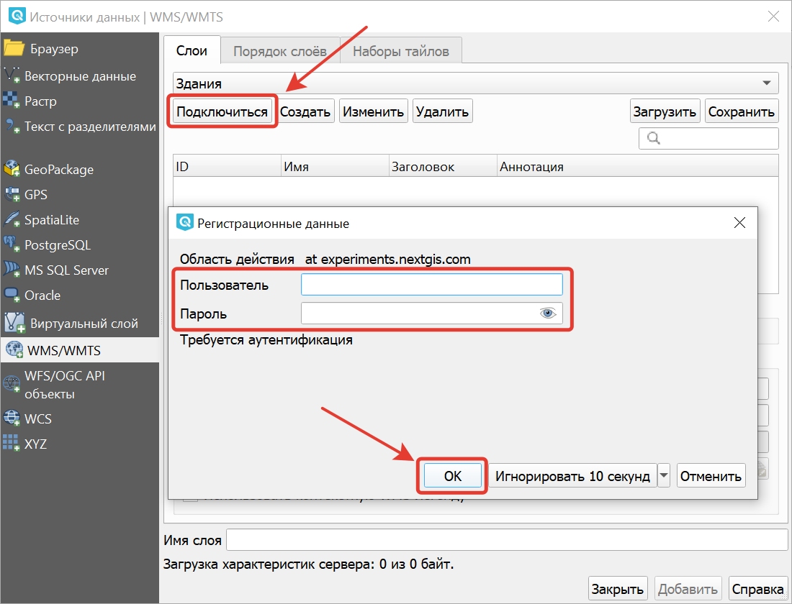
   
   Введение данных учетной записи для доступа к сервису
   
Выведется список слоёв, который видно в сервисе. Выберите один или несколько слоёв 
и нажмите **"Добавить"**. 

   Выбор слоя  

Можно добавлять слои по отдельности. В этом случае в :program:`NextGIS QGIS` слои 
будут видны как отдельные. Можно выделить несколько слоев, тогда они будут отдаваться 
с сервера как один слой. Дальнейшая работа со слоями WMS осуществляется в :program:`NextGIS QGIS` 
так же, как с растровыми слоями из файлов. 

.. _ngqgis_map_wfs:

Работа по протоколу WFS
^^^^^^^^^^^^^^^^^^^^^^^

Для этого шага вам необходимо знать:

1. URL WFS-сервиса.
2. Логин.
3. Пароль.

Заходим в меню ``Слой ‣ Добавить слой ‣ Добавить слой WFS``.

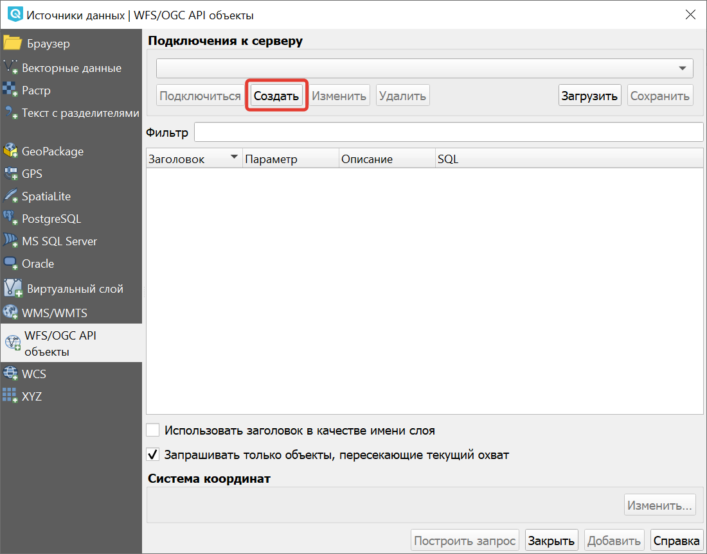
   
   Окно "Источники данных | WFS/OGC API объекты"

Нажимаем кнопку "Создать" и в открывшемся окне "Создание нового WFS-соединения" вводим параметры:

1. ``Название`` - вводим любое название.
2. ``URL`` - URL-адрес WFS-сервиса.

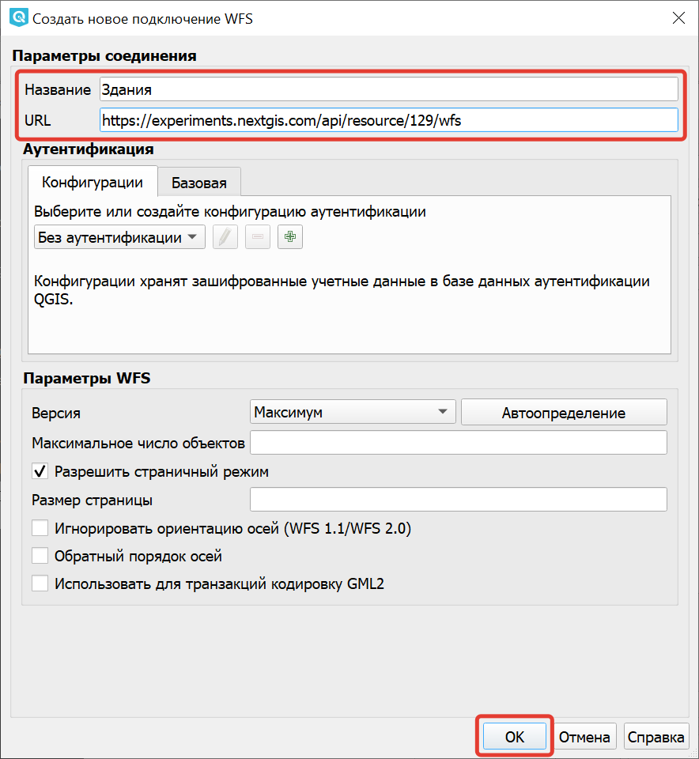
   
   Создание нового подключения WFS

Далее выбираем созданное подключение и нажимаем **"Подключиться"**.
Выбираем из списка необходимые слои (у нас он пока один).

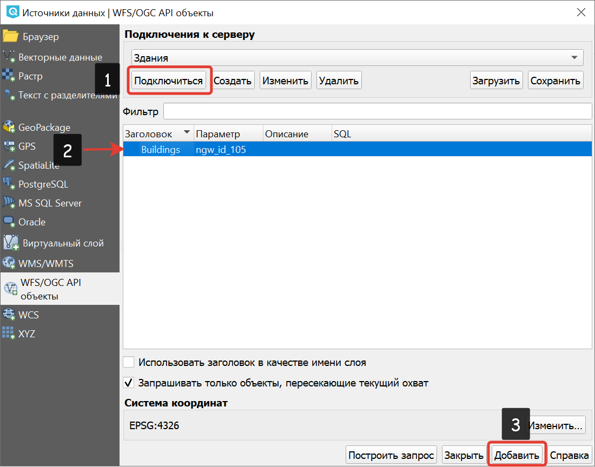
   
   Выбор слоя

.. _ngqgis_map_csv:

Добавление слоёв CSV
^^^^^^^^^^^^^^^^^^^^

Вам необходимо знать систему координат, в которой записаны координаты (Подробнее о `работе с системами координат <https://docs.nextgis.ru/docs_ngqgis/source/srs.html>_).

Для добавления слоя в формате на карту нажмите ``Слой ‣ Добавить слой ‣ Добавить слой из текста с разделителями``. 
Откроется следующее окно:

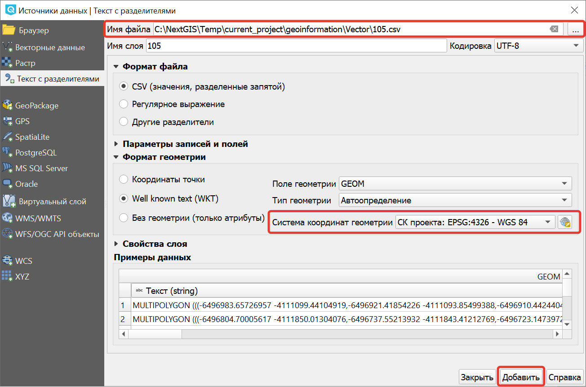

   Окно "Источники данных | Текст с разделителями"  

В разделе "Формат файла" необходимо выбрать разделитель колонок текстового файла так, чтобы столбцы были правильно разделены.

.. note::
   По умолчанию в качестве разделителя используется запятая. Также можно выбрать в качестве разделителя регулярное выражение или другой вариант (табуляция, точка с запятой, двоеточие и др.).

Затем необходимо выбрать формат геометрии и систему координат.

При выборе формата геометрии "Координаты точки" в полях ``X-координата`` и ``Y-координата`` необходимо указать, из каких полей будут браться координаты.

Переключатель "широта/долгота" должен быть активен только если ваши координаты записаны в формате "DD MM SS".

После открытия координат - включите подложку  OSM Mapnik, и проверьте, не сдвинут ли слой. 
Если слой не совпадает с подложкой, скорее всего перепутаны широта и долгота. Нужно импортировать слой заново, и задать поля ``X-координата`` и ``Y-координата`` по-другому.

Формат CSV слабо стандартизирован и может иметь различные написания:

* Десятичный формат (десятичные градусы): записи вида 37.677,55.677. Это предпочтительный формат, он требует минимум ручных настроек. Скорее всего система координат этого слоя - EPSG:4326.

.. code-block:: csv
   :caption: Пример CSV-файла с координатами в десятичном формате

   X,Y,name,routes
   37.498976596578487,55.818108414611515,"""Метро \""Войковская\""""","43к,57"
   37.511937669160822,55.737294006553164,"""Метро «Парк Победы»""",7
   37.51358652686482,55.678694577011598,"""улица Кравченко""",34к
   37.513861321510234,55.80268809185204,"""Метро \""Сокол\""""","19,59,61"
   37.516176549491988,55.884889270968166,"""Базовская улица""",56

* Координаты в метрах: записи вида 444556, 555544. Это похоже на местную систему координат. Технически вы можете открыть её, но должны знать для неё параметры системы координат. 

.. code-block:: csv
   :caption: Пример CSV-файла с координатами в МСК

   X,Y
   416386,75285
   416735,75318
   416943,75224
   416417,75119
   418105,75274

* WKT: записи вида "POLYGON((11 21,31 41, 21 11))".

.. code-block:: csv
   :caption: Пример CSV-файла с координатами в WKT

   WKT,routes_ref,
   "LINESTRING (4191295.66 7512782.48,4191300.86 7512785.6,4191307.97 7512786.73,4191315.91 7512785.11)",24>
   "LINESTRING (4191561.23 7512690.26,4191549.12 7512685.85)",24<
   "LINESTRING (4191231.01 7512625.63,4191286.55 7512761.42,4191290.63 7512771.38,4191295.66 7512782.48)",24>
   "LINESTRING (4191790.37 7512685.37,4191929.86 7512690.42,4191977.72 7512692.14)",24
   "LINESTRING (4191703.18 7512684.54,4191649.66 7512688.46,4191587.57 7512688.34,4191561.23 7512690.26)",24<
   "LINESTRING (4192733.59 7512710.92,4192749.47 7512710.92,4192829.78 7512710.15,4192946.34 7512709.49,4193040.41 7512708.56,4193196.01 7512704.19,4193205.31 7512703.52,4193325.58 7512699.48)",24
   "LINESTRING (4193367.88 7512698.49,4193391.35 7512698.37)",24

* HMS (градусы-минуты-секунды): записи вида 46°01’24 СШ, 11°13’47 ВД. Скорее всего этот слой откроется как EPSG:4326, но вам придётся самому изменить формат координат в исходном csv-файле.

Допустимые форматы записи координат с градусами:

.. code-block:: csv
   :caption: Пример CSV-файла с координатами в HMS

   LATITUDE;LONGITUDE
   46°01’24,7”;11°13’47,5”
   45°42’07,5”;10°55’11,3”
   46°01’37,6”;11°06’41,7”
   46°15’03,7”;11°11’00,1”

.. code-block:: csv
   :caption: Пример CSV-файла с координатами в HMS с пробелами

   n,y,x
   1, 78 16 42 N, 50 29 38 E
   2, 79 28 52 N, 53 00 00 E
   3, 79 28 52 N, 61 33 03 E

.. _ngqgis_map_ngweb:

Подключение к слоям NextGIS Web
^^^^^^^^^^^^^^^^^^^^^^^^^^^^^^^

Из :program:`NextGIS QGIS` можно работать с NextGIS Web напрямую. Можно смотреть 
и редактировать данные - перемещать, удалять, добавлять новые объекты в слой. Это 
осуществляется при помощи плагина "NextGIS Connect", работа с ним описана в  `этой главе <https://docs.nextgis.ru/docs_ngconnect/source/toc.html#nextgis-connect-qgis>`_.

.. _ngq_create_new_layer:

Создание новых слоёв
-----------------------------

Перейдите в меню ``Слой ‣ Создать слой`` и выберите нужный вариант:

1. Создать слой **GeoPackage**. Необходимо выбрать или создать новый файл, задать имя таблицы и выбрать тип геометрии и `систему координат <https://docs.nextgis.ru/docs_ngqgis/source/srs.html>`_. Затем нужно добавить в таблицу атрибуты.
2. Создать слой **Shapefile**. Следует задать тип геометрии и набор атрибутов, указать путь сохранения файла. Слой добавляется, а затем добавляете туда геометрию.
3. Создать слой **SpatiaLite**. Подсоединитесь к базе данных SpatiaLite, уже добавленной в NG QGIS, выбрав её в выпадающем меню, или создайте новую из файла с расширением ``.sqlite``.
4. Создать **временный слой**. Задатся тип геометрии, слой добавляется, затем туда добавляется геометрия и атрибуты. Затем сохраняете его как Shape-файл или в другом необходимом вам формате.
5. Создать **меш-слой**. Создаётся пустой слой с заданной системой координат, в который затем можно добавлять наборы данных.
6. Создать слой **GPX**. Нужно задать имя файла и выбрать папку, где разместить его. В результате будет создано три слоя: для треков (tracks), запланированных маршрутов  (routes) и точек на местности (waypoints).
7. Создать **виртуальный слой**. Это особый вид векторного слоя, определяемый результато SQL-запроса на основе других векторных слоёв. Виртуальный слой сам по себе не содержит данных.

.. note::
   В ESRI Shapefile, GeoPackage и во временный слой можно добавлять и удалять атрибуты и после создания.

.. note::
   **Ограничения формата ESRI Shapefile**

   Имя атрибута должно быть написано латинскими буквами, но не более 12 символов. 
   Текстовое поле не может хранить данные длиннее 255 символов. 

.. _attributes_types:

У атрибутов могут быть разные типы данных: 

* строковый, 
* целочисленный, 
* дробный, 
* дата. 

Разные форматы файлов геоданных поддерживают разный состав типов атрибутов, но большинство поддерживает вышеперечисленные.
При добавлении атрибута нужно указать его тип и размер поля. 
При добавлении целочисленного атрибута нужно указать максимальное количество цифр в числе.
При добавлении десятичного числа нужно в поле ``длина`` указать общее число цифр в числе, 
в поле точность - количество цифр после запятой. Например, для хранения чисел формата 123,45 нужно указывать 5,3. 
Для 123456,7890 - 10,4.

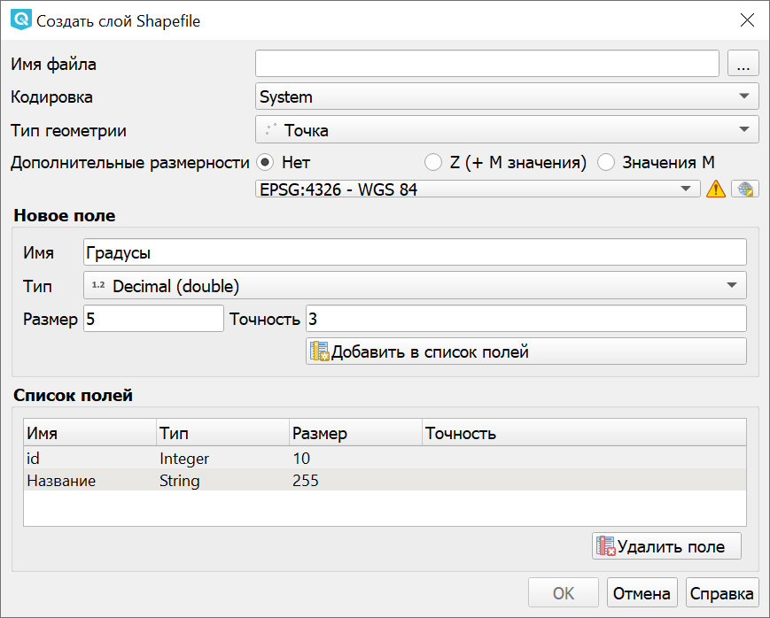

   Добавление атрибута

.. _ngqgis_map_save_vector:

Сохранение векторных слоёв
---------------------------

Векторный слой можно сохранить в новый файл командой ``Слой ‣ Сохранить как``. 

.. note::
   Если вы торопитесь, то выберите формат GeoPackage, укажите имя файла и нажмите Ok. Если вы не знаете точно, какой формат вам нужен, то этот способ подойдёт вам в 80% случаев. 

Этой же командой можно 

* Изменить формат файла векторного слоя
* Изменить кодировку векторного слоя
* Изменить `систему координат <https://docs.nextgis.ru/docs_ngqgis/source/srs.html>`_ векторного слоя
* Обрезать векторный слой по экрану

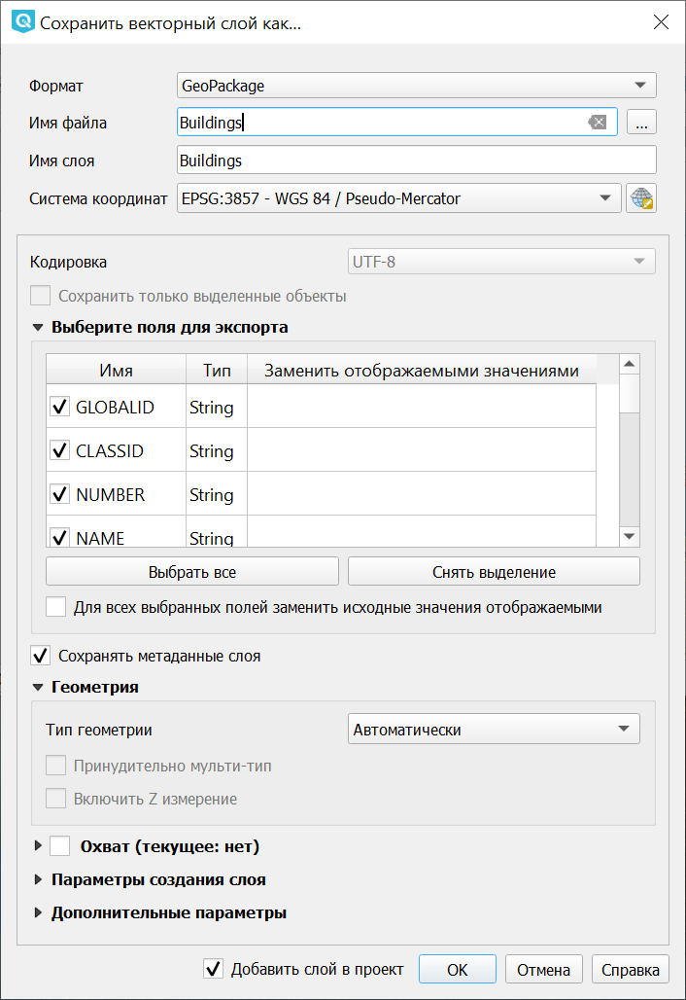

   Диалог сохранения векторного слоя

.. _ngqgis_map_file_format:

Выбор формата файла
^^^^^^^^^^^^^^^^^^^^^^

NextGIS QGIS позволяет сохранять векторные слои в файлах основных распространёных форматов, которые открываются разными программами. 

Для некоторых форматов файлов (например ESTI Shapefile) нужно указать кодировку.
Набор остальных параметров сохранения меняется в зависимости от выбора формата. Детальное описание параметров приведено на https://www.gdal.org/ogr_formats.html

.. _ngqgis_map_save_raster:

Сохранение растровых слоёв
---------------------------

Растровый слой можно сохранить в новый файл командой ``Слой ‣ Сохранить как``. Этой же командой можно 

* Изменить формат файла растрового слоя
* Изменить `систему координат <https://docs.nextgis.ru/docs_ngqgis/source/srs.html>`_ растрового слоя
* Обрезать растровый слой по экрану

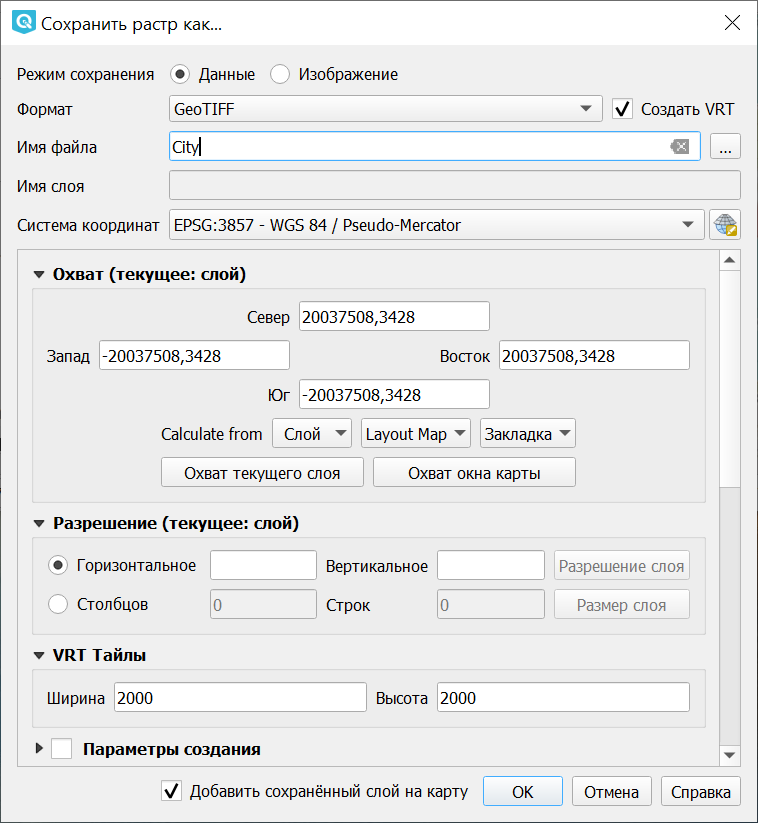
   
   Диалог сохранения растрового слоя

При сохранении растрового слоя, нужно выбрать **режим сохранения** - "данные" или "изображение". Это означает выбор битности. В режиме "Изображение" слой конвертируется в RGB или RGBA, и рендерится в файл с использованием настроек растрового стиля, то есть со всеми изменениями цвета. В режиме "Данные" слой сохраняется "как есть" - с такими же значениями пикселов, как в нём и есть, без изменений раскраски.

Во время сохранения файла можно настроить ряд параметров, в частности:

* В поле **Система координат** можно менять систему координат. В этом случае файл будет перепроецирован.
* В разделе **Охват** можно обрезать слой по окну карты или заданным значениям.
* В разделе **Разрешение** показывается разрешение в пикселах, или в единицах измерения слоя. Например, если система координат слоя - UTM, то она будет писаться в метрах на пиксел.
* В разделе **VRT Тайлы** задаются настройки тайлов виртуального растра. 
* В разделе **Параметры создания** можно выбрать предустановленные настройки. Они отличаются для разных форматов файла. Подробнее их значения описаны на https://www.gdal.org/formats_list.html

NextGIS QGIS позволяет сохранять растровые слои в файлах основных распространёных форматов, которые открываются разными программами. 
