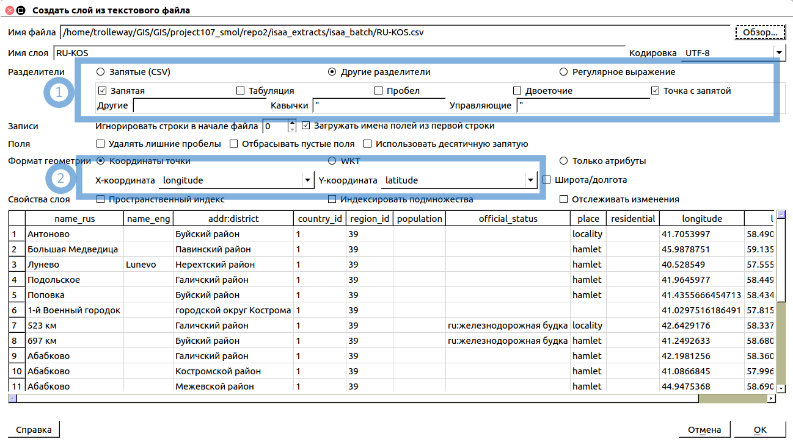
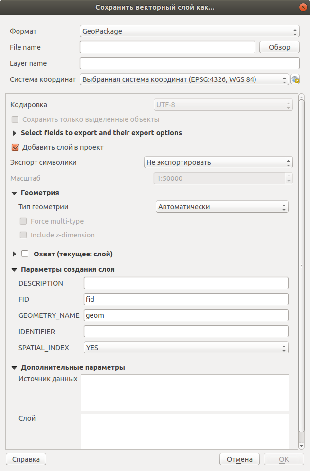
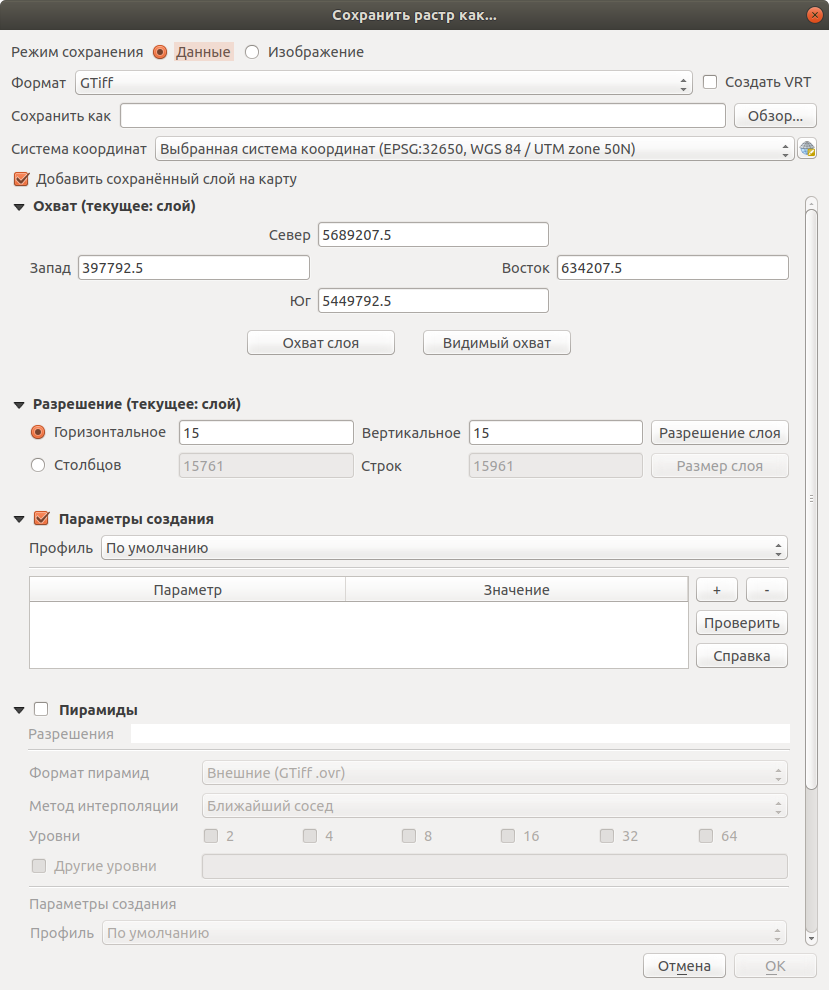

.. sectionauthor:: Дмитрий Барышников <dmitry.baryshnikov@nextgis.ru>
.. sectionauthor:: Артём Светлов <artem.svetlov@nextgis.ru>

.. _ngqgis_map:

Создание карты
===============

Добавление геоданных
---------------------

:program:`NextGIS QGIS` предоставляет пользователю возможность добавлять:

* Векторные данные.
* Растровые данные.
* Использовать тайловые подложки из интернета.
* Добавлять растры по протоколу :term:`WMS` и :term:`TMS`.
* Работать по протоколу :term:`WFS`.
* Добавлять слои из Веб-ГИС NextGIS Web.
* Предоставляет возможность пользователю добавлять собственные данные.

Добавление растровых и векторных слоёв из файлов
^^^^^^^^^^^^^^^^^^^^^^^^^^^^^^^^^^^^^^^^^^^^^^^^

Геоданные бывают векторные и растровые. Векторные данные обычно хранятся как электронная 
таблица, где у каждой записи есть своя геометрия - то есть фигура, заданная координатами 
точек. Растровые данные обычно сохраняются как картинка, в которой указано, на какое 
место земного шара она ложится.

Существует множество форматов хранения геоданных и протоколов их передачи по сети. 
Они могут представлять собой файлы или находиться в базах данных. Преобразованием 
форматов занимаются утилиты :program:`GDAL` (растровые) и :program:`OGR` (векторные). 
Благодаря этим утилитам :program:`NextGIS QGIS` может читать и записывать разные 
форматы данных без сильных различий для пользователя. Разумеется, обычно используются 
только самые общеупотребительные форматы.

.. note::
   QGIS использует библиотеку OGR для чтения и записи векторных данных (работа с векторными
   данными GRASS и данными PostgreSQL реализована через отдельные модули поставщиков 
   данных), включая :term:`ESRI Shapefile` файлы, файлы MapInfo и Microstation, пространственные 
   базы :term:`PostGIS`, SpatiaLite, Oracle и многие другие. Кроме того, векторные данные могут 
   быть загруженны напрямую из архивов zip или gzip. С полным списком форматов векторных 
   данных можно ознакомиться по адресу: http://www.gdal.org/ogr/ogr_formats.html .

Понятие Слой будет часто встречаться в инструкции. Слой - это геоданные с определенным
составом и оформлением. Карта состоит из одного или нескольких слоев.

.. note:: Для открытия файлов векторных геоданных вам потребуется знать: место, где лежат файлы на диске, их кодировку.

Для добавления слоя выполните: ``Слой ‣ Добавить слой ‣ Добавить векторный слой`` или 
``Слой ‣ Добавить слой ‣ Добавить растровый слой`` соответственно.

Если слой растровый, то скорее всего он будет в формате :term:`GeoTIFF` (с расширением .tif).

.. figure:: _static/open_vector_layer_window.png
   :align: center
   :width: 16cm

   Диалог открытия векторного файла.
   
При открытии ESRI Shapefile в этом диалоге нужно выбирать файл с расширением .shp.

Также вам необходимо знать кодировку файлов: 

* Если кодировка файлов - UTF-8 и вы работаете в Windows, то при открытии векторных 
  файлов в поле ``Кодировка`` вместо System рекомендуется выбирать UTF-8.
* Если кодировка файлов - Windows-1251 и вы работаете в Windows, то при открытии 
  векторных файлов кодировку менять нет необходимости.
* Если кодировка файлов - UTF-8 и вы работаете в Linux, то при открытии векторных 
  файлов кодировку менять нет необходимости.
* Если кодировка файлов - Windows-1251 и вы работаете в Linux, то при открытии векторных 
  файлов в поле ``Кодировка`` вместо System выберите Windows-1251.
* Если в Shapefile нет файла cpg, то кодировка меняться не будет. В этом случае зайдите в настройки NextGIS QGIS: Установки --> Параметры --> Источники данных --> Источники данных --> Игнорировать обьявленную кодировку Shape-файлов.

.. note::
   На текущий момент принято, что все данные сохраняются в кодировке UTF-8. При 
   работе на ОС Windows при открытии и сохранении векторных данных нужно явно указывать 
   кодировку UTF-8. По умолчанию она может быть System - это значит Windows-1251. Если вы 
   открыли файл в неправильной кодировке, то русские буквы там будут нечитаемыми. 
   В этом случае нужно в свойствах слоя выставить кодировку UTF-8. Но лучше сразу 
   выставлять её при открытии файла, чтобы не забыть.

.. note::
   Если в таблице атрибутов вы увидите нечитаемые символы, переключите кодировку 
   между UTF-8 и Windows-1251 в свойствах слоя, и переоткройте таблицу атрибутов.

Добавление базовых карт из Интернета
^^^^^^^^^^^^^^^^^^^^^^^^^^^^^^^^^^^^^^^^^^^^^^^^^^^^^^^^^^^^

Для добавление базовой карты (картографической подложки, картподложки) следует воспользоватся плагином QuickMapServices. 

Картографическая подложка часто выступает в качестве первого слоя, добавляемого для 
работы в проект. Подложка часто представлена в виде различных интернет-сервисов: 
TMS, WMS, WMTS, ESRI ArcGIS Service или просто в виде тайлов XYZ.

Но запомнить адреса Интернет-сервисов сложно, а процесс их ввода каждый раз при смене 
рабочего места отнимает достаточно много времени. Поэтому для оптимизации работы был разработан 
плагин QuickMapServices — расширение, которое 
позволяет быстро и удобно работать с базовыми картами, получаемыми из 
различных интернет-сервисов в проект QGIS. 

В QuickMapServices есть два хранилища для подложек: базовое и дополнительное. Подложки 
из базового набора устанавливаются и включаются вместе с модулем расширения.
Описание модуля находится в главе :ref:`_QuickMapServices`.

Работа с базами данных PostGIS
^^^^^^^^^^^^^^^^^^^^^^^^^^^^^^

Вам потребуется знать :term:`URL` сервера PostGIS, название базы данных, имя пользователя 
и пароль.

Для добавления слоя PostGIS на карту нажмите ``Слой ‣ Добавить слой ‣ Добавить слой PostGIS``. 
Откроется окно "Добавить таблицы PostGIS". 

.. figure:: _static/table_postgis.png
   :align: center
   :width: 16cm

   Окно "Добавить таблицы PostGIS".

В списке Соединения выберите заранее сохранённое подключение или, если его нет, то нажмите "Создать" (соединение).
Откроется окно "Новое PostGIS-соединение". Введите туда известные вам 
параметры. Нажмите кнопку "Проверить соединение". Если выведется сообщение 
об ошибке, значит вы либо ввели неправильные параметры, либо неправильно настроена 
база данных, либо неправильно настроена сеть. Если выведется сообщение об успешном 
подключении, то всё в порядке. 

.. note::
   Для удобства в работе установите флажки напротив полей "Сохранить пользователя" и 
   "Сохранить пароль". 

.. figure:: _static/new_compound_postgis.png
   :align: center
   :width: 16cm
 
   Окно "Новое PostGIS-соединение".

Далее в окне "Добавить таблицы PostGIS" выберите в списке новое подключение, 
нажмите кнопку "Подключиться".
В списке таблиц появится список таблиц и хранимых представлений PostGIS, которые 
видно в базе данных. Выберите одну или несколько таблиц и нажмите "Добавить".

.. figure:: _static/add_table_postgis.png
   :align: center
   :width: 16cm

   Окно с таблицами PostGIS. 
 
Дальнейшая работа со слоями PostGIS осуществляется в :program:`NextGIS QGIS` точно 
так же, как с векторными слоями из файлов. 

Работа по протоколу WMS
^^^^^^^^^^^^^^^^^^^^^^^

Вам потребуется знать URL сервиса WMS.

Для добавления слоя WMS на карту нажмите ``Слой ‣ Добавить слой ‣ Добавить слой WMS/WMTS``.
Откроется окно "Добавить слой WMT(S)". 

.. figure:: _static/add_layer_wms.png
   :align: center
   :width: 16cm

   Окно "Добавить слой WMT(S)".

В списке Соединения выберите заранее сохранённое подключение или, если его нет, нажмите "Создать" (соединение).
Откроется окно "Создание нового соединения WMS". Введите туда известные 
вам параметры адреса и придумайте название.
Далее в окне "Добавить слой WMT(S)" выберите в списке новое подключение, 
нажмите кнопку "Подключиться".
Выведется список слоёв, который видно в сервисе. Выберите один или несколько слоёв 
и нажмите "Добавить". 

.. figure:: _static/add_layer_table_wms.png
   :align: center
   :width: 16cm

   Окно таблицы "Добавить слой WMT(S)".  

Можно добавлять слои по отдельности. В этом случае в :program:`NextGIS QGIS` слои 
будут видны как отдельные. Можно выделить несколько слоев, тогда они будут отдаваться 
с сервера как один слой. Дальнейшая работа со слоями WMS осуществляется в :program:`NextGIS QGIS` 
так же, как с растровыми слоями из файлов. 

Работа по протоколу WFS
^^^^^^^^^^^^^^^^^^^^^^^

Для этого шага вам необходимо знать:

1. URL WFS-сервиса.
2. Логин.
3. Пароль.

Заходим в меню ``Слой ‣ Добавить слой ‣ Добавить слой WFS``.

.. figure:: _static/MapWFS01.png
   :align: center
   :width: 12cm

В открывшемся окне "Добавить слой WFS" нажимаем кнопку "Создать".

.. figure:: _static/MapWFS02.png
   :align: center
   :width: 12cm

В открывшемся окне "Создание нового WFS-соединения" вводим параметры:

1. ``Название`` - вводим любое название.
2. ``Адрес`` - URL WFS-сервиса.
3. ``Пользователь`` - при наличии.
4. ``Адрес`` - при наличии.

.. figure:: _static/MapWFS03.png
   :align: center
   :width: 12cm

5. Далее выбираем созданное подключение и нажимаем "Подключиться".
6. Выбираем из списка необходимые слои (у нас он пока один).

Добавление слоёв CSV
^^^^^^^^^^^^^^^^^^^^

Вам необходимо знать систему координат, в которой записаны координаты.

Для добавления слоя в формате на карту нажмите ``Слой ‣ Добавить слой ‣ Добавить слой CSV``. 
Откроется окно "Создать слой из текстового файла".

   Окно открытия CSV. 1 - выбор разделителя. 2 - выбор полей координат.  

В окне необходимо выбрать разделитель колонок текстового файла так, чтобы столбцы были правильно разделены.

.. note::
   Если колонки разделяются запятой, то выберите разделитель "Запятая". Если колонки разделяются точкой с запятой, то выберите разделитель "Точка с запятой". 

В полях ``X-координата`` и ``Y-координата`` необходимо указать, из каких полей будут браться координаты.

После нажатия кнопки "OK" вам нужно будет указать систему координат, в которой записаны координаты. 

После открытия координат - подложите Mapnik, и проверьте, в правильное ли место попали координаты. 
Если они попали в другое место, скорее всего перепутаны широта и долгота. Нужно импортировать слой заново,
и задать поля ``X-координата`` и ``Y-координата`` по-другому.

Формат CSV слабо стандартизирован и может иметь различные написания:

* Десятичный формат (десятичные градусы): записи вида 37.677,55.677. Это предпочтительный формат, он требует минимум ручных настроек. Скорее всего система координат этого слоя - EPSG:4326.

.. code-block:: csv
   :caption: Пример CSV-файла с координатами в десятичном формате

   X,Y,name,routes
   37.498976596578487,55.818108414611515,"""Метро \""Войковская\""""","43к,57"
   37.511937669160822,55.737294006553164,"""Метро «Парк Победы»""",7
   37.51358652686482,55.678694577011598,"""улица Кравченко""",34к
   37.513861321510234,55.80268809185204,"""Метро \""Сокол\""""","19,59,61"
   37.516176549491988,55.884889270968166,"""Базовская улица""",56

* Координаты в метрах: записи вида 444556, 555544. Это похоже на местную систему координат. Технически вы можете открыть её, но должны знать для неё параметры системы координат. 

.. code-block:: csv
   :caption: Пример CSV-файла с координатами в МСК

   X,Y
   416386,75285
   416735,75318
   416943,75224
   416417,75119
   418105,75274

* WKT: записи вида "POLYGON((11 21,31 41, 21 11))".

.. code-block:: csv
   :caption: Пример CSV-файла с координатами в WKT

   WKT,routes_ref,
   "LINESTRING (4191295.66 7512782.48,4191300.86 7512785.6,4191307.97 7512786.73,4191315.91 7512785.11)",24>
   "LINESTRING (4191561.23 7512690.26,4191549.12 7512685.85)",24<
   "LINESTRING (4191231.01 7512625.63,4191286.55 7512761.42,4191290.63 7512771.38,4191295.66 7512782.48)",24>
   "LINESTRING (4191790.37 7512685.37,4191929.86 7512690.42,4191977.72 7512692.14)",24
   "LINESTRING (4191703.18 7512684.54,4191649.66 7512688.46,4191587.57 7512688.34,4191561.23 7512690.26)",24<
   "LINESTRING (4192733.59 7512710.92,4192749.47 7512710.92,4192829.78 7512710.15,4192946.34 7512709.49,4193040.41 7512708.56,4193196.01 7512704.19,4193205.31 7512703.52,4193325.58 7512699.48)",24
   "LINESTRING (4193367.88 7512698.49,4193391.35 7512698.37)",24

* HMS (градусы-минуты-секунды): записи вида 46°01’24 СШ, 11°13’47 ВД. Скорее всего этот слой откроется как EPSG:4326, но вам придётся самому изменить формат координат в исходном csv-файле.

Допустимые форматы записи координат с градусами:

.. code-block:: csv
   :caption: Пример CSV-файла с координатами в HMS

   LATITUDE;LONGITUDE
   46°01’24,7”;11°13’47,5”
   45°42’07,5”;10°55’11,3”
   46°01’37,6”;11°06’41,7”
   46°15’03,7”;11°11’00,1”

.. code-block:: csv
   :caption: Пример CSV-файла с координатами в HMS с пробелами

   n,y,x
   1, 78 16 42 N, 50 29 38 E
   2, 79 28 52 N, 53 00 00 E
   3, 79 28 52 N, 61 33 03 E

Подключение к слоям NextGIS Web
^^^^^^^^^^^^^^^^^^^^^^^^^^^^^^^

Из :program:`NextGIS QGIS` можно работать с NextGIS Web напрямую. Можно смотреть 
и редактировать данные - перемещать, удалять, добавлять новые объекты в слой. Это 
осуществляется при помощи плагина "NextGIS Connect". Описание находится в главе :ref:`ng_connect`.

.. _ngq_create_new_layer:

Создание новых слоёв
-----------------------------

Есть 2 способа создания новых слоев:

1. ``Слой ‣ Создать слой ‣ Создать Shape-файл``. Следует задать 
   тип геометрии и набор атрибутов, указать путь сохранения файла. Слой добавляется, 
   а затем добавляете туда геометрию.
2. ``Слой ‣ Создать слой ‣ Создать временный слой``. Задать тип 
   геометрии, слой добавляется, затем добавляете туда геометрию и атрибуты. Затем 
   сохраняете его как Shape-файл или в другом необходимом вам формате.

.. note::
   В ESRI Shapefile и во временный слой можно добавлять и удалять атрибуты и после создания.

.. note::
   **Ограничения формата ESRI Shapefile**

   Имя атрибута должно быть написано латинскими буквами, но не более 12 символов. 
   Текстовое поле не может хранить данные длиннее 255 символов. 

.. _attributes_types:

У атрибутов могут быть разные типы данных: 

* строковый, 
* целочисленный, 
* дробный, 
* дата. 

Разные форматы файлов геоданных поддерживают разный состав типов атрибутов, но большинство поддерживает вышеперечисленные.
При добавлении атрибута нужно указать его тип и размер поля. 
При добавлении целочисленного атрибута нужно указать максимальное количество цифр в числе.
При добавлении десятичного числа нужно в поле длина указать общее число цифр в числе, 
в поле точность - количество цифр после запятой. Например, для хранения чисел формата 123,45 нужно указывать 5,3. 
Для 123456,7890 - 10,4.

.. figure:: _static/add_attribute_real.png
   :name: add_attribute_real
   :align: center
   :width: 16cm

   Добавление атрибута. 

.. _ngq_projections:

Проекции
-----------------------------

В :program:`NextGIS QGIS` реализована возможность работы с проекциями. Проекция 
может быть установлена как глобально, т.е. её параметры будут применены к любому 
векторному слою, не содержащему информации о проекции, так и отдельно для проекта. 
Кроме того, существует возможность создания собственных проекций, а также реализована 
поддержка перепроецирования "на лету" для векторных и растровых слоёв. Все эти функции 
позволяют корректно отображать одновременно несколько слоёв, находящихся в различных 
проекциях.

Все проекции в :program:`NextGIS QGIS` основаны на базе идентификаторов European Petroleum Group (:term:`ESPG`) и Institut Geographique National of France (IGNF). EPSG-коды хранятся в базе данных 
и могут быть использованы для определения проекции.

Для корректной работы перепроецирования "на лету" слой должен содержать информацию о 
проекции, в которой хранятся данные, либо она должна быть определена самостоятельно 
на уровне слоя или проекта. Для слоёв PostGIS :program:`NextGIS QGIS` использует 
идентификатор проекции, определяемый в момент создания слоя. Для данных, хранящихся 
в форматах, поддерживаемых GDAL, информация о проекции должна быть представлена в 
соответствующем файле, структура которого определяется форматом. В случае ESRI Shapefile - 
это файл, содержащий описание проекции в формате :abbr:`WKT (Well Known Text)` и имеющий 
то же имя, что и ESRI Shapefile, но с расширением .prj. Например, для файла ``alaska.shp`` 
файлом описания проекции будет ``alaska.prj``.

Всякий раз, когда происходит выбор новой проекции, используемые единицы слоя автоматически
изменяются.

Почти всегда в NextGIS QGIS используется функция "преобразования 
координат на лету": слои хранятся в разных системах координат, а в составе карты они выводятся в одной. 

Систем координат очень много, однако для работы одновременно используется всего несколько. Наиболее популярные следующие системы координат:  

* WGS 84 (EPSG:4326) - в ней обычно хранятся векторные данные. Единица измерения
  - градусы. Новые векторные файлы сохраняйте в ней. Если отобразить геоданные в этой системе координат  
  без перепроецирования, то картинка будет сплющенной.
  
.. figure:: _static/projections_4326.png
   :name: projections_4326
   :align: center
   :width: 8cm

   Данные выведены на экран в EPSG:4326. 
   
* Pseudo Mercator (EPSG:3857) - используется для отображения. Включайте "перепроецирование
  на лету" в 3857, и карта будет отображаться более правильно.
    
.. figure:: _static/projections_3857.png
   :name: projections_3857
   :align: center
   :width: 8cm

   Данные выведены на экран в EPSG:3857. 
   
* WGS 84 / UTM Zone X (EPSG:32610..32709) - используется для измерения расстояний. 
  Данные хранятся в метрах. Некоторые инструменты требуют её для корректной работы. 
  Так же в ней могут храниться космоснимки. Земной шар разделён на 60 зон, для 
  каждой определена своя проекция - свой код EPSG. 
      
.. figure:: _static/projections_32637.png
   :name: projections_32637
   :align: center
   :width: 8cm

   Данные выведены на экран в EPSG:32637. Все зоны кроме 37-й искажены. 
  
* Pulkovo 1942 / Gauss-Kruger zone X (EPSG:28401..28432 и соседние) - устроена 
  так же как UTM, в ней хранятся привязанные листы советских топокарт (изданных 
  в последние годы). Так же разделена на зоны. 
  
* Asia_North_Equidistant_Conic (EPSG:102026) - для вывода на экран карты России  
* North_Pole_Azimuthal_Equidistant (EPSG:102016) - для вывода на экран карты северного полюса    

Основные операции с проекциями:
^^^^^^^^^^^^^^^^^^^^^^^^^^^^^^^

1. **Как узнать систему координат слоя**
 
``Слой ‣ Свойства ‣ Вкладка Общие ‣ Система координат``. 
Это значение можно менять. Систему координат сохранёную в слое можно узнать  
``Слой ‣ Свойства ‣ Вкладка Метаданные ‣ строка Система координат слоя``.

2. **Открытие окна преобразования координат**

В правом-нижнем углу карты нажмите вторую справа кнопку. Если на ней написано ``OTF``, 
значит преобразование на лету включёно.

3. **Если картинка на карте сплющена по вертикали**

Если вы добавили геоданные на карту, и картинка сплющенная, то включите "Преобразование 
коодинат на лету" в EPSG:3857. Это значит, что ваши геоданные были в градусах.

4. **Если данные из разных слоёв не попадают друг на друга, хотя они должны быть в одном месте**

Включите "Преобразование коодинат на лету".

5. **Пересохранение слоёв в другую систему координат**

Для некоторых операций требуется пересохранить слои в другую систему 
координат. В этом случае выберите ``Слой ‣ Сохранить как``, и выберите 
систему координат в диалоге сохранения. 

6. **Как узнать номер зоны UTM или Gauss-Kruger**

В окне поиска QMS ввести запрос "utm". В результатах будет слой "UTM and Gauss Krueger 6 degree zones" - это разграфка на весь мир в формате GeoJSON.

Установка проекции
^^^^^^^^^^^^^^^^^^

:program:`NextGIS QGIS` создаёт новые проекты с использованием системы координат 
по умолчанию. Изначально используется система координат EPSG:4326 - WGS 84. Это 
значение можно изменить, нажав кнопку "Выбрать" в первой группе настроек во вкладке 
"Система координат" (см. рисунок :numref:`ngmobile_coordinate_systemc_configuration_pic`). 
Указанное значение будет использоваться по всех последующих сеансах работы.

Окно Параментры сети представлено на рисунке см. :numref:`ngmobile_coordinate_systemc_configuration_pic`:

.. figure:: _static/coordinate_systemc_configuration.png
   :name: ngmobile_coordinate_systemc_configuration_pic
   :align: center
   :height: 14cm
   
   Настройки системы координат. 

При загрузке в проект слоёв, не содержащих информации о проекции, необходимо иметь 
возможность контролировать и определять проекции таких слоёв. Проекции могут быть 
установлены глобально или на уровне проекта. Для выполнения этой операции перейдите 
во вкладку "Система координат" в диалоге "Параметры".

На рисунке :numref:`ngmobile_coordinate_systemc_configuration_pic` показаны 
возможные варианты:

1. Запрашивать систему координат.
2. Использовать систему координат проекта.
3. Использовать указанную систему координат.

Если необходимо задать проекцию для слоя, в котором информация о ней отсутствует, 
то это можно сделать во вкладке "Общие" окна свойств растрового или 
векторного слоя.
 
Контекстное меню слоя содержит два элемента для работы с системой координат. 
Пункт меню "Изменить систему координат" вызывает диалог "Выбор системы координат" 
(см. рисунок :numref:`ngmobile_coordinate_systemc_configuration_pic`). 
А пункт "Выбрать систему координат слоя для проекта" устанавливает систему координат 
проекта, равной системе координат слоя.

NextGIS QGIS поддерживает перепроецирование растровых и векторных слоёв "на лету" (активация 
возможности перепроецирования на лету устанавливается в диалоге "Параметры"). 
Для активации перепроецирования "на лету" необходимо установить флажок 
"Включить преобразование координат "на лету" на вкладке "Система координат" диалогового 
окна "Свойства проекта".
 
Существует три способа доступа к указанной вкладке:

1. Выберите пункт "Свойства проекта" в меню "Проекты".
2. Нажмите кнопку "Преобразование координат", расположенную в правом нижнем углу 
   строки состояния.
3. Включить преобразование координат "на лету" по умолчанию на вкладке "Система координат"
   диалога Параметры, активировав флажок "Включить преобразование координат "на лету".

Если имеется загруженный в проект слой и вы желаете включить перепроецирование "на лету", 
то откройте вкладку "Система координат" диалогового окна "Свойства проекта", выберите 
проекцию и отметьте пункт 2Включить преобразование координат "на лету" (см. 
:numref:`ngmobile_reprojection_on_the_fly_pic`). Значок "Преобразование координат" 
станет активным и все последующие загружаемые слои будут автоматически перепроецироваться 
в выбранную проекцию.

.. figure:: _static/reprojection_on_the_fly.png
   :name: ngmobile_reprojection_on_the_fly_pic
   :align: center
   :height: 14cm

   Перепроецирование "на лету". 

Вкладка "Система координат" диалогового окна "Свойства проекта" содержит пять важных 
компонентов, показанных на рисунке :numref:`ngmobile_reprojection_on_the_fly_pic` 
и описанных ниже.

1. Включить преобразование координат "на лету". Данный пункт используется для включения 
   или отключения преобразования координат "на лету". Если он отключен, то каждый слой 
   отрисовывается в соответствии с проекцией, указанной в источнике данных, и элементы,
   описанные ниже, будут неактивными. Если данный пункт отключен, то координаты слоя 
   перепроецируются в проекцию карты.
2. Система координат - список проекций, поддерживаемых NextGIS QGIS, включая географические,
   прямоугольные и пользовательские. Для выбора проекции выделите её имя в списке, 
   предварительно развернув нужный узел. Текущая проекция выделена цветом.
3. Proj4 - текстовое представление проекции в формате PROJ.4. Данный текст доступен 
   только для чтения и используется в качестве справочной информации.
4. Поиск - если вам известен код EPSG, идентификатор или имя проекции, то можно 
   воспользоваться поиском. Введите идентификатор и нажмите кнопку "Найти". Отметьте
   "Скрыть устаревшие системы координат", чтобы показывать только используемые в настоящее 
   время проекции.
5. Недавно использованные системы координат - если имеются определённые наиболее 
   часто используемые в проектах проекции, то они будут доступны в таблице, расположенной 
   в верхней части диалога Выбор системы координат. Нажмите на одну из строк, чтобы 
   выбрать эту систему координат.

Если открыть "Свойства проекта" из меню "Проекты", то для доступа к настройкам проекций нужно перейти 
во вкладку "Система координат". Если же воспользоваться кнопкой "Преобразование координат", то вкладка 
"Система координат" откроется автоматически.

.. _ngq_custom_projections:

**Добавление пользовательской СК (или местной системы координат)**

Если вы не нашли в списке проекций нужной проекции, то вы можете задать собственную. Это может понадобиться, например, если вы работаете в РФ с местными системами координат (МСК). В таком случае, у вас вероятно есть геоданные с координатами, которые при открытии в NextGIS QGIS не ложатся на другие слои, или же NextGIS QGIS спрашивает систему координат при открытии.

Для добавления пользовательской системы координат вам сначала нужно получить описание в формате PROJ.4. После того как это сделано, выберите пункт "Ввод системы координат" меню "Установки".

.. note::
   Для создания собственной проекции необходимо хорошо разбираться в синтаксисе библиотеки 
   поддержки картографических проекций PROJ.4. Рекомендуется ознакомиться с документом 
   "Cartographic Projection Procedures for the UNIX Environment - A User’s Manual"
   (Gerald I. Evenden, U.S. Geological Survey Open-File Report 90-284, 1990), доступным 
   по адресу ftp://ftp.remotesensing.org/proj/OF90-284.pdf.
   Данное руководство описывает использование proj.4 и связанных утилит командной строки. 
   Картографические параметры, используемые в proj.4, описаны в руководстве и совпадают 
   с используемыми в NextGIS QGIS.

В диалоговом окне "Определение пользовательской системы координат" требуется всего 
два параметра для определения собственной проекции:

1. Имя проекции.
2. Картографические параметры в формате PROJ.4.

Для создания новой системы координат нажмите кнопку "Новая", укажите имя и введите 
необходимые параметры. После чего созданную проекцию можно сохранить, нажав кнопку
"Сохранить".
Значение поля "Параметры" создаваемой проекции должно начинаться со строки +proj=.
Создаваемую проекцию можно проверить. Для этого вставьте параметры создаваемой 
проекции в поле "Параметры" раздела "Проверка". Затем введите значения широты и долготы 
WGS-84 в поля ``Север`` и ``Восток`` соответственно. Нажмите кнопку "Рассчитать" и сравните 
результат с известными значениями вашей проекции :numref:`ngmobile_user_coordinate_system_pic`).

.. figure:: _static/user_coordinate_system.png
   :name: ngmobile_user_coordinate_system_pic
   :align: center
   :height: 16cm

   Пользовательская система координат.

Сохранение векторных слоёв
---------------------------

Векторный слой можно сохранить в новый файл командой ``Слой ‣ Сохранить как``. 

.. note::
   Если вы торопитесь, то выберите формат GeoPackage, укажите имя файла и нажмите Ok. Если вы не знаете точно, какой формат вам нужен, то этот способ подойдёт вам в 80% случаев. 

Этой же командой можно 

* Изменить формат файла векторного слоя
* Изменить кодировку векторного слоя
* Изменить систему координат векторного слоя
* Обрезать векторный слой по экрану

   Диалог сохранения слоя

Выбор формата файла
^^^^^^^^^^^^^^^^^^^^^^

NextGIS QGIS позволяет сохранять векторные слои в файлах основных распространёных форматов, которые открываются разными программами. 

Для некоторых форматов файлов (например ESTI Shapefile) нужно указать кодировку.
Набор остальных параметров сохранения меняется в зависимости от выбора формата. Детальное описание параметров приведено на https://www.gdal.org/ogr_formats.html

Сохранение растровых слоёв
---------------------------

Растровый слой можно сохранить в новый файл командой ``Слой ‣ Сохранить как``. Этой же командой можно 

* Изменить формат файла растрового слоя
* Изменить систему координат растрового слоя
* Обрезать растрового слой по экрану

   Диалог сохранения слоя

При сохранении растрового слоя, нужно выбрать режим сохранения - "данные" или "изображение". Это означает выбор битности. В режиме "Изображение" слой конвертируется в RGB или RGBA, и рендрится в файл с использованием настроек растрового стиля, то есть со всеми изменениями цвета. В режиме "Данные" слой сохраняется "как есть" - с такими же значениями пикселов, как в нём и есть, без изменений раскраски.

В поле "Система координат" можно менять систему координат. В этом случае файл будет перепроецирован.
В поле "Разрешение" показывается разрешение в пикселах, или в единицах измерения слоя. Например, если система координат слоя - UTM, то она будет писаться в метрах на пиксел.
В поле "Параметры создания" можно выбрать предустановленные настройки. Они отличаются для разных форматов файла. Подробнее их значения описаны на https://www.gdal.org/formats_list.html

NextGIS QGIS позволяет сохранять растровые слои в файлах основных распространёных форматов, которые открываются разными программами. 
