.. sectionauthor:: Дмитрий Барышников <dmitry.baryshnikov@nextgis.ru>

.. _ngqgis_map:

Создание карты
===============

Добавление геоданных
---------------------

NextGIS QGIS предоставляет пользователю возможность добавлять:

* Векторные данные.
* Растровые данные.
* Использовать тайловые подложки из интернета.
* Добавлять растры по протоколу WMS и TMS.
* Работать по протоколу WFS.
* Добавлять слои из веб-гис NextGIS WEB.
* Предоставляет возможность пользователю добавлять собственные данные.

Добавление растровых и векторных слоёв из файлов
^^^^^^^^^^^^^^^^^^^^^^^^^^^^^^^^^^^^^^^^^^^^^^^^^^^^^^^^^^^^^^^^^^^^^^^^^^^^^^^^^^^^^^^^^^^^

Геоданные бывают векторные и растровые. Векторные данные обычно хранятся как электронная 
таблица, где у каждой записи есть своя геометрия - то есть фигура, заданная координатами 
точек. Растровые данные обычно сохраняются как картинка, в которой указано, на какое 
место земного шара она ложится.

Существует множество форматов хранения геоданных и протоколов их передачи по сети. 
Они могут представлять собой файлы или находиться в базах данных. Преобразованием 
форматов занимаются утилиты :program:`GDAL` (растровые) и :program:`OGR` (векторные). 
Благодаря этим утилитам :program:`NextGIS QGIS` может читать и записывать разные 
форматы данных без сильных различий для пользователя. Разумеется, обычно используются 
только самые общеупотребительные форматы.

.. note::
   QGIS использует библиотеку OGR для чтения и записи векторных данных (работа с векторными
   данными GRASS и данными PostgreSQL реализована через отдельные модули поставщиков 
   данных), включая ESRI shape-файлы, файлы MapInfo и Microstation, пространственные 
   базы PostGIS, SpatiaLite, Oracle и многие другие. Кроме того, векторные данные могут 
   быть загруженны напрямую из архивов zip или gzip. С полным списком форматов векторных 
   данных можно ознакомиться по адресу: http://www.gdal.org/ogr/ogr_formats.html .

Понятие Слой будет часто встречаться в инструкции. Слой - это геоданные с определенным
составом и оформлением. Карта состоит из одного или нескольких слоев.

Для открытия файлов геоданных вам потребуется знать: место, где лежат файлы на диске, их кодировку.

Выполните: 

:menuselection:`Слой --> Добавить слой --> Добавить векторный слой` или
:menuselection:`Слой --> Добавить слой --> Добавить растровый слой` соответственно.

Если слой растровый, то скорее всего он будет в формате GeoTIFF (с расширением .tif).

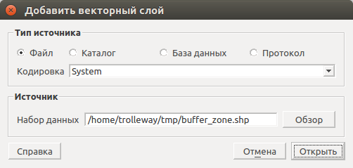

   Диалог открытия векторного файла.
   
При открытии ESRI Shapefile в этом диалоге нужно выбирать файл с расширением .shp.

Также вам необходимо знать кодировку файлов: 

* Если кодировка файлов - UTF-8 и вы работаете в Windows, то при открытии векторных 
  файлов в поле :guilabel:`Кодировка` вместо System рекомендуется выбирать UTF-8.
* Если кодировка файлов - Windows-1251 и вы работаете в Windows, то при открытии 
  векторных файлов кодировку менять нет необходимости.
* Если кодировка файлов - UTF-8 и вы работаете в Linux, то при открытии векторных 
  файлов кодировку менять нет необходимости.
* Если кодировка файлов - Windows-1251 и вы работаете в Linux, то при открытии векторных 
  файлов в поле :guilabel:`Кодировка` вместо System выберите Windows-1251.

.. note::
   В середине 2010-х годов принято, что все данные сохраняются в кодировке UTF-8. При 
   работе на ОС Windows при открытии и сохранении векторных данных нужно явно указывать 
   кодировку UTF-8. По умолчанию она может быть System - это значит CP1251. Если вы 
   открыли файл в неправильной кодировке, то русские буквы там будут нечитаемыми. 
   В этом случае нужно в свойствах слоя выставить кодировку UTF-8. Но лучше сразу 
   выставлять её при открытии файла, чтобы не забыть.

.. note::
   Если в таблице атрибутов вы увидите нечитаемые символы, переключите кодировку 
   между UTF-8 и Win-1251 в свойствах слоя.

Добавление картоподложки из интернета
^^^^^^^^^^^^^^^^^^^^^^^^^^^^^^^^^^^^^^^^^^^^^^^^^^^^^^^^^^^^

Осуществляется плагином QuickMapServices. 

Картографическая подложка часто выступает в качестве первого слоя, добавляемого для 
работы в проект. Подложка часто представлена в виде различных интернет-сервисов: 
TMS, WMS, WMTS, ESRI ArcGIS Service или просто в виде тайлов XYZ.

Но запомнить адреса интернет-сервисов сложно, а процесс их ввода каждый раз при смене 
рабочего места отнимает достаточно много времени.

Поэтому для оптимизации работы мы в NextGIS разработали QuickMapServices — расширение, которое 
позволяет быстро и удобно работать с базовыми картами (подложками), получаемыми из 
различных интернет-сервисов в проект QGIS. 

В QuickMapServices есть два хранилища для подложек: базовое и дополнительное. Подложки 
из базового набора устанавливаются и включаются вместе с модулем расширения.
Описание модуля находится в главе :ref:`_QuickMapServices`.

Работа с базами данных PostGIS
^^^^^^^^^^^^^^^^^^^^^^^^^^^^^^^^^^^^^^^^^^^^^^^^^^^^^^^^^^^^^

Вам потребуется знать URL сервера PostGIS, название базы данных, имя пользователя 
и пароль.

Для добавления слоя PostGIS на карту нажмите :menuselection:`Слой --> Добавить слой --> Добавить слой PostGIS`. 
Откроется окно :guilabel:`Добавить таблицы PostGIS`. 

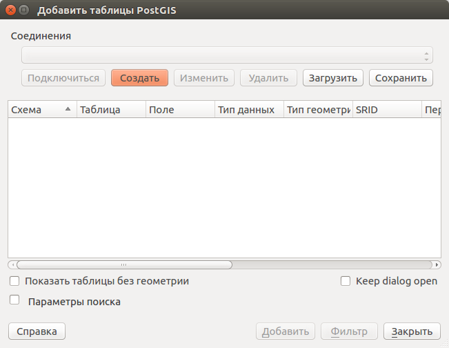

   Окно "Добавить таблицы PostGIS".

В списке Соединения выберите заранее сохранёное подключение или, если его нет, то нажмите :guilabel:`Создать` (соединение).
Откроется окно :guilabel:`Новое PostGIS-соединение`. Введите туда известные вам 
параметры. Нажмите кнопку :guilabel:`Проверить соединение`. Если выведется сообщение 
об ошибке, значит вы либо ввели неправильные параметры, либо неправильно настроена 
база данных, либо неправильно настроена сеть. Если выведется сообщение об успешном 
подключении, то всё в порядке. 

.. note::
   Для удобства в работе установите флажки напротив полей "Сохранить пользователя" и 
   "Сохранить пароль". 

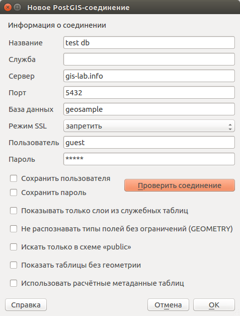
 
   Окно "Новое PostGIS-соединение".

Далее в окне :guilabel:`Добавить таблицы PostGIS` выберите в списке новое подключение, 
нажмите кнопку :guilabel:`Подключиться`.
В списке таблиц появится список таблиц и хранимых представлений PostGIS, которые 
видно в базе данных. Выберите одну или несколько таблиц и нажмите :guilabel:`Добавить`.

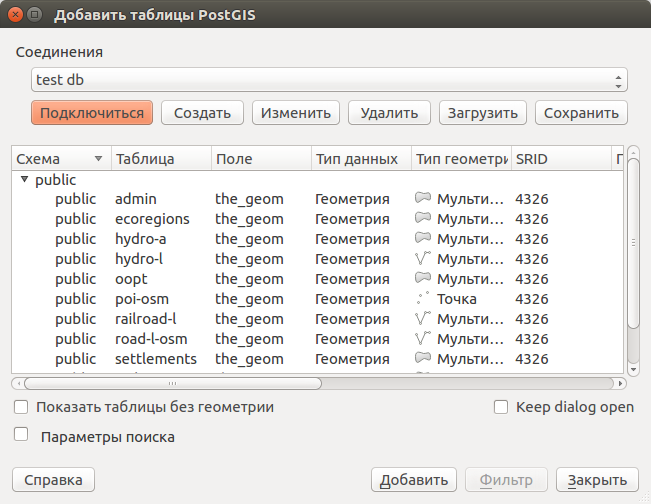

   Окно с таблицами PostGIS. 
 
Дальнейшая работа со слоями PostGIS осуществляется в :program:`NextGIS QGIS` точно 
так же, как с векторными слоями из файлов. 

Работа по протоколу WMS
^^^^^^^^^^^^^^^^^^^^^^^^^^^^^^^^^^^^^^^^^^^^^^^^^^^^^^^^^^^^^

Вам потребуется знать URL сервиса WMS.

Для добавления слоя WMS на карту нажмите :menuselection:`Слой --> Добавить слой --> Добавить слой WMS/WMTS`.
Откроется окно :guilabel:`Добавить слой WMT(S)`. 

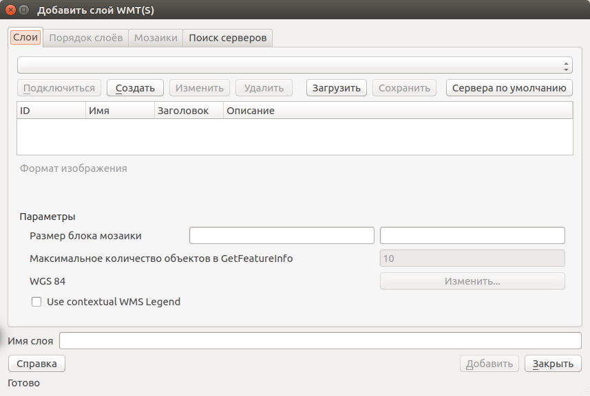

   Окно "Добавить слой WMT(S)".

В списке Соединения выберите заранее сохранёное подключение или, если его нет, нажмите :guilabel:`Создать` (соединение).
Откроется окно :guilabel:`Создание нового соединения WMS`. Введите туда известные 
вам параметры адреса и придумайте название.
Далее в окне :guilabel:`Добавить слой WMT(S)` выберите в списке новое подключение, 
нажмите кнопку :guilabel:`Подключиться`.
Выведется список слоёв, который видно в сервисе. Выберите один или несколько слоёв 
и нажмите :guilabel:`Добавить`. 

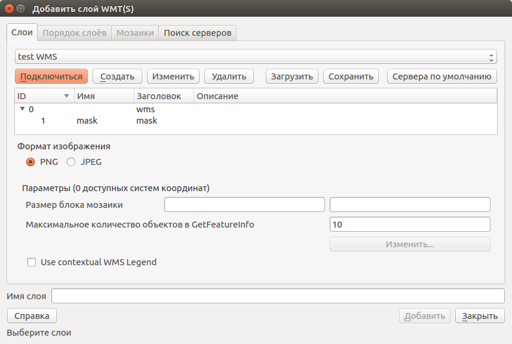

   Окно таблицы "Добавить слой WMT(S)".  

Можно добавлять слои по отдельности. В этом случае в :program:`NextGIS QGIS` слои 
будут видны как отдельные. Можно выделить несколько слоев, тогда они будут отдаваться 
с сервера как один слой. Дальнейшая работа со слоями WMS осуществляется в :program:`NextGIS QGIS` 
так же, как с растровыми слоями из файлов. 

Работа по протоколу WFS
^^^^^^^^^^^^^^^^^^^^^^^^^^^^^^^^^^^^^^^^^^^^^^^^^^^^^^^^^^^^^

Для этого шага вам необходимо знать:

1. URL WFS-сервиса.
2. Логин.
3. Пароль.

Заходим в меню :menuselection:`Слой --> Добавить слой --> Добавить слой WFS`.

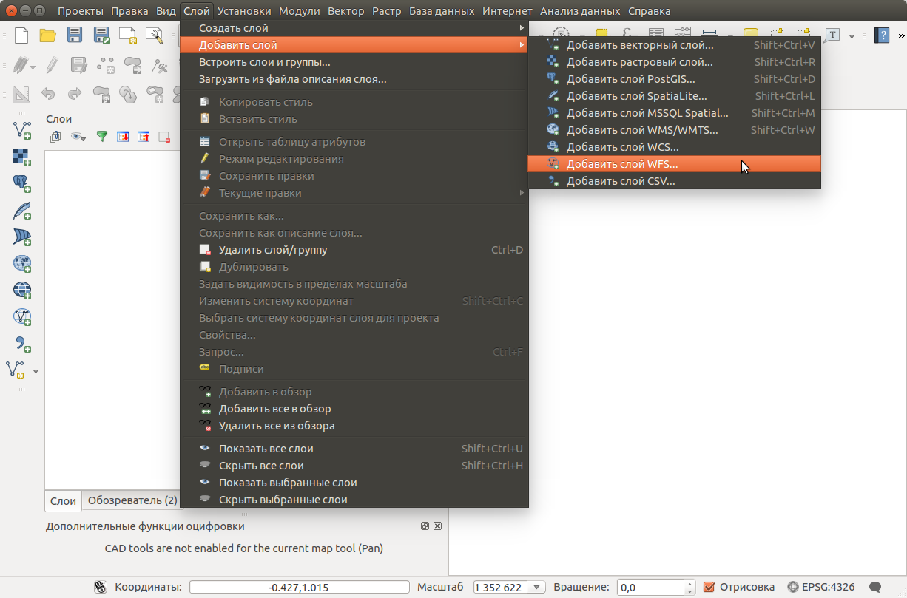

В открывшемся окне :guilabel:`Добавить слой WFS` нажимаем кнопку :guilabel:`Создать`.

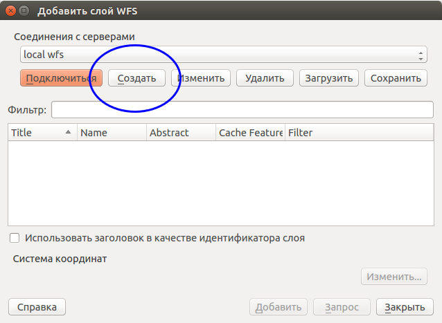

В открывшемся окне :guilabel:`Создание нового WFS-соединения` вводим параметры:

1. :guilabel:`Название` - вводим любое название.
2. :guilabel:`Адрес` - URL WFS-сервиса.
3. :guilabel:`Пользователь` - при наличии.
4. :guilabel:`Адрес` - при наличии.

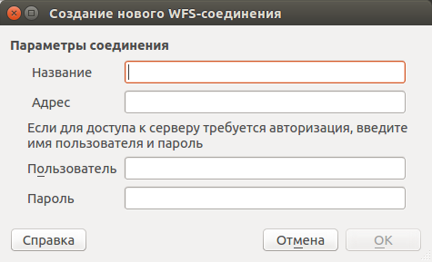

5. Далее выбираем созданное подключение и нажимаем "Подключиться".
6. Выбираем из списка необходимые слои (у нас он пока один).

Добавление слоёв CSV
^^^^^^^^^^^^^^^^^^^^^^^^^^^^^^^^^^^^^^^^^^^^^^^^^^^^^^^^^^^^^

Вам необходимо знать систему координат, в которой записаны координаты.

Для добавления слоя в формате на карту нажмите :menuselection:`Слой --> Добавить слой --> Добавить слой CSV`. 
Откроется окно :guilabel:`Создать слой из текстового файла`.

В окне необходимо выбрать разделитель колонок текстового файла так, чтобы столбцы были правильно разделены.

.. note::
   Если колонки разделяются запятой, то выберите разделитель "Запятая". Если колонки разделяются точкой с запятой, то выберите разделитель "Точка с запятой". 

.. 
   Почему-то эту операцию никто не понимает.

В полях :guilabel:`X-координата` и :guilabel:`Y-координата` необходимо указать, из каких полей будут браться координаты.

После нажатия кнопки :guilabel:`Ok` вам нужно будет указать систему координат, в которой записаны координаты. 

После открытия координат - подложите Mapnik, и проверьте, в правильное ли место земного шара попали координаты. 
Если они попали в другое место - значит вы перепутали широту и долготу. Нужно импортировать слой заново,
и задать поля :guilabel:`X-координата` и :guilabel:`Y-координата` по-другому.

Принимаемые форматы записи координат файлов csv
:::::::::::::::::::::::::::::::::::::::::::::::::::::::::::::

* Десятичный формат (десятичные градусы): записи вида 37.677,55.677. Это предпочтительный формат, он требует минимум ручных настроек. Скорее всего система координат этого слоя - EPSG:4326.

.. code-block:: csv
   :caption: Пример CSV-файла с координатами в десятичном формате

   X,Y,name,routes
   37.498976596578487,55.818108414611515,"""Метро \""Войковская\""""","43к,57"
   37.511937669160822,55.737294006553164,"""Метро «Парк Победы»""",7
   37.51358652686482,55.678694577011598,"""улица Кравченко""",34к
   37.513861321510234,55.80268809185204,"""Метро \""Сокол\""""","19,59,61"
   37.516176549491988,55.884889270968166,"""Базовская улица""",56

* Координаты в метрах: записи вида 444556, 555544. Это похоже на местную систему координат. Технически вы можете открыть её, но должны знать для неё параметры системы координат. В РФ как правило эти параметры под гифом ДСП.

.. code-block:: csv
   :caption: Пример CSV-файла с координатами в МСК

   X,Y
   416386,75285
   416735,75318
   416943,75224
   416417,75119
   418105,75274

* WKT: записи вида "POLYGON((11 21,31 41, 21 11))".

.. code-block:: csv
   :caption: Пример CSV-файла с координатами в WKT

   WKT,routes_ref,
   "LINESTRING (4191295.66 7512782.48,4191300.86 7512785.6,4191307.97 7512786.73,4191315.91 7512785.11)",24>
   "LINESTRING (4191561.23 7512690.26,4191549.12 7512685.85)",24<
   "LINESTRING (4191231.01 7512625.63,4191286.55 7512761.42,4191290.63 7512771.38,4191295.66 7512782.48)",24>
   "LINESTRING (4191790.37 7512685.37,4191929.86 7512690.42,4191977.72 7512692.14)",24
   "LINESTRING (4191703.18 7512684.54,4191649.66 7512688.46,4191587.57 7512688.34,4191561.23 7512690.26)",24<
   "LINESTRING (4192733.59 7512710.92,4192749.47 7512710.92,4192829.78 7512710.15,4192946.34 7512709.49,4193040.41 7512708.56,4193196.01 7512704.19,4193205.31 7512703.52,4193325.58 7512699.48)",24
   "LINESTRING (4193367.88 7512698.49,4193391.35 7512698.37)",24

* HMS (градусы-минуты-секунды): записи вида 46°01’24 СШ, 11°13’47 ВД. Скорее всего этот слой откроется как EPSG:4326, но вам придётся самому изменить формат координат в исходном csv-файле.

Допустимые форматы записи координат с градусами:

.. code-block:: csv
   :caption: Пример CSV-файла с координатами в HMS

   LATITUDINE;LONGITUDINE
   46°01’24,7”;11°13’47,5”
   45°42’07,5”;10°55’11,3”
   46°01’37,6”;11°06’41,7”
   46°15’03,7”;11°11’00,1”

.. code-block:: csv
   :caption: Пример CSV-файла с координатами в HMS с пробелами

   n,y,x
   1, 78 16 42 N, 50 29 38 E
   2, 79 28 52 N, 53 00 00 E
   3, 79 28 52 N, 61 33 03 E

Подключение к слоям NGW
^^^^^^^^^^^^^^^^^^^^^^^^^^^^^^^^^^^^^^^^^^^^^^^^^^^^^^^^^^^^^

Из :program:`NextGIS QGIS` можно работать с NextGIS Web напрямую. Можно смотреть 
и редактировать данные - перемещать, удалять, добавлять новые объекты в слой. Это 
осуществляется плагином NGW Connect. Описание модуля находится в главе :ref:`ng_connect`.

Создание новых слоёв
-----------------------------

Есть 2 способа создания новых слоев:

1. :menuselection:`Слой --> Создать слой --> Создать Shape-файл`. Следует задать 
   тип геометрии и набор атрибутов, указать путь сохранения файла. Слой добавляется, 
   а затем добавляете туда геометрию.
 
2. :menuselection:`Слой --> Создать слой --> Создать временный слой`. Задать тип 
   геометрии, слой добавляется, затем добавляете туда геометрию и атрибуты. Затем 
   сохраняете его как Shape-файл или в другом необходимом вам формате.

.. note::
   В Shape-файл и во временный слой можно добавлять и удалять атрибуты и после создания.

Ограничения формата ESRI Shapefile
^^^^^^^^^^^^^^^^^^^^^^^^^^^^^^^^^^^^^^

Имя атрибута должно быть написано латинскими буквами, но не более 12 символов. 
Текстовое поле не может хранить данные длиннее 255 символов. 

.. _attributes_types:

Типы данных в атрибутах
^^^^^^^^^^^^^^^^^^^^^^^^^^^^^^^^^^^^^^

У атрибутов могут быть разные типы: строковый, целочисленный, дробный, дата. Разные 
форматы файлов геоданных поддерживают разные типы атрибутов, но в принципе все варианты одинаковы.
При добавлении атрибута нужно указать его тип, и размер поля. 
При добавлении целочисленного атрибута нужно указать максимальное количество цифр в числе.
При добавлении десятичного числа нужно в поле длина указать общее число цифр в числе, 
в поле точность - количество цифр после запятой. Например, для хранения чисел формата 123,45 нужно указывать 5,3. 
Для 123456,7890 - 10,4.

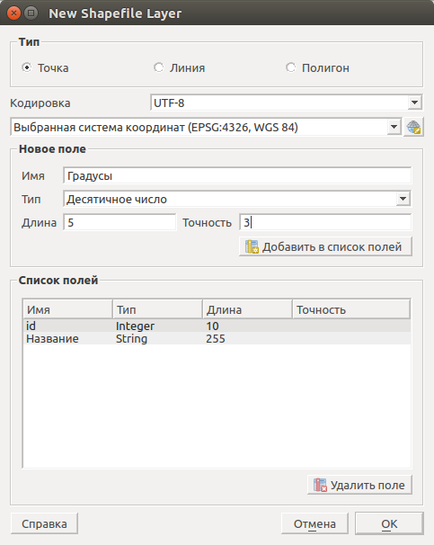

   Добавление атрибута. 

.. _ngq_projections:

Проекции
-----------------------------

Краткая инструкция по работе с проекциями
^^^^^^^^^^^^^^^^^^^^^^^^^^^^^^^^^^^^^^^^^^^^^^^^

В :program:`NextGIS QGIS` есть возможность работы с проекциями. У каждого слоя данных 
есть своя система координат (в которой хранятся данные), как правило она записана 
в самом файле. Почти всегда в :program:`NextGIS QGIS` используется функция "преобразования 
координат на лету": слои хранятся в разных системах координат, а на экран они выводятся в одной. 

Систем координат очень много, однако для работы одновременно используется всего 2-4 штуки, 
их можно запомнить. 

* WGS 84 (EPSG:4326) - в ней обычно хранятся векторные данные. Единица измерения
  - градусы. Новые векторные файлы сохраняйте в ней. Если вывести данные из неё 
  без перепроецирования, то картинка будет сплющенной.
* Pseudo Mercator (EPSG:3857) - используется для отображения. Включайте "перепроецирование
  на лету" в 3857, и карта будет отображаться более правильно.
* WGS 84 / UTM Zone X (EPSG:32610..32709) - используется для измерения расстояний. 
  Данные хранятся в метрах. Некоторые инструменты требуют её для корректной работы. 
  Так же в ней могут храниться космоснимки. Земной шар разделён на 30 зон, для 
  каждой определена своя проекция - свой код EPSG. 
* Pulkovo 1942 / Gauss-Kruger zone X (EPSG:28401..28432 и соседние) - устроена 
  так же как UTM, в ней хранятся привязанные листы советских топокарт (изданных 
  в последние годы). Так же разделена на зоны, но с другими номерами. 

.. todo::
   возможно сверстать в таблицу

Основные операции с проекциями, которые нужно знать для работы:
^^^^^^^^^^^^^^^^^^^^^^^^^^^^^^^^^^^^^^^^^^^^^^^^^^^^^^^^^^^^^^^^^^^^^

Как узнать систему координат слоя
""""""""""""""""""""""""""""""""""""""""""""""""""""""""""""""""""""

:menuselection:`Слой --> Свойства --> Вкладка Общие --> Система координат`. 
Это значение можно менять. Систему координат сохранёную в слое можно узнать  
:menuselection:`Слой --> Свойства --> Вкладка Метаданные --> строка "Система 
координат слоя"`.

Открытие окна преобразования координат
""""""""""""""""""""""""""""""""""""""""""""""""""""""""""""""""""""

В правом-нижнем углу карты нажмите вторую справа кнопку. Если на ней написано OTF, 
значит преобразование на лету включёно.

Если картинка на карте сплющена по вертикали
""""""""""""""""""""""""""""""""""""""""""""""""""""""""""""""""""""

Если вы добавили геоданные на карту, и картинка сплющенная, то включите "Преобразование 
коодинат на лету" в EPSG:3857. Это значит, что ваши геоданные были в градусах.

Если данные из разных слоёв не попадают друг на друга, хотя они в одном месте
""""""""""""""""""""""""""""""""""""""""""""""""""""""""""""""""""""""""""""""""""""""""""""""""""""""

Включите "Преобразование коодинат на лету".

Пересохранение слоёв в другую систему координат
""""""""""""""""""""""""""""""""""""""""""""""""""""""""""""""""""""

Для некоторых операций в инструкции потребуется пересохранить слои в другую систему 
координат. В этом случае выберите :menuselection:`Слой --> Сохранить как`, и выберите 
систему координат в диалоге сохранения. 

Проекции - подробная теория
^^^^^^^^^^^^^^^^^^^^^^^^^^^^^^^^

В :program:`NextGIS QGIS` реализована возможность работы с проекциями. Проекция 
может быть установлена как глобально, т.е. её параметры будут применены к любому 
векторному слою, не содержащему информации о проекции, так и отдельно для проекта. 
Кроме того, существует возможность создания собственных проекций, а также реализована 
поддержка перепроецирования "на лету" для векторных и растровых слоёв. Все эти функции 
позволяют корректно отображать одновременно несколько слоёв, находящихся в различных 
проекциях.

Все проекции в :program:`NextGIS QGIS` основаны на базе идентификаторов European Petroleum Group (ESPG) и Institut Geographique National of France (IGNF) и в значительной степени абстрагированы 
от таблицы spatial_references в PostGIS версии 1.x. EPSG-коды хранятся в базе данных 
и могут быть использованы для определения проекции.

Для корректной работы перепроецирования "на лету" слой должен содержать информацию о 
проекции, в которой хранятся данные, либо она должна быть определена самостоятельно 
на уровне слоя или проекта. Для слоёв PostGIS :program:`NextGIS QGIS` использует 
идентификатор проекции, определяемый в момент создания слоя. Для данных, хранящихся 
в форматах, поддерживаемых OGR, информация о проекции должна быть представлена в 
соответствующем файле, структура которого определяется форматом. В случае shape-файлов - 
это файл, содержащий описание проекции в формате Well Known Text (WKT) и имеющий 
то же имя, что и shape-файл, но с расширением .prj. Например, для файла alaska.shp 
файлом описания проекции будет alaska.prj.

Всякий раз, когда происходит выбор новой проекции, используемые единицы слоя автоматически
изменяются, что можно увидеть, перейдя во вкладку Общие диалогового окна - Свойства проекта,
открываемого по нажатию кнопки Редактировать (Gnome, OS X) или Настройки (KDE, Windows)

Установка проекции
^^^^^^^^^^^^^^^^^^^^^^^^^^^^^^^^^^

:program:`NextGIS QGIS` создаёт новые проекты с использованием системы координат 
по умолчанию. Изначально используется система координат EPSG:4326 - WGS 84. Это 
значение можно изменить, нажав кнопку "Выбрать" в первой группе настроек во вкладке 
"Система координат" (см. рисунок :numref:`ngmobile_coordinate_systemc_configuration_pic`). 
Указанное значение будет использоваться по всех последующих сеансах работы.

Окно Параментры сети представлено на рисунке см. :numref:`ngmobile_coordinate_systemc_configuration_pic`:

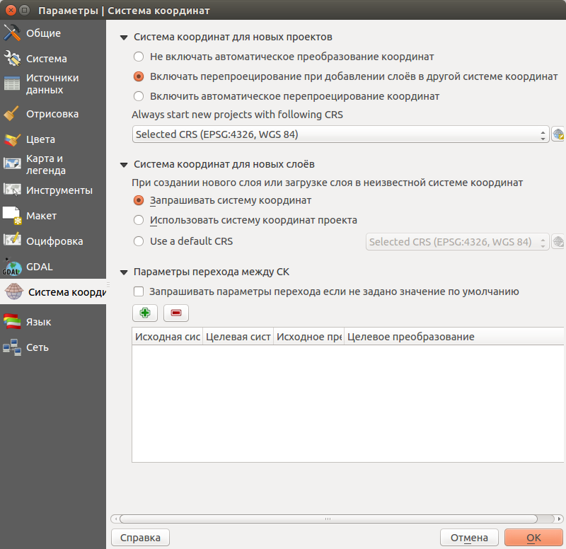
   
   Настройки системы координат. 

При загрузке в проект слоёв, не содержащих информации о проекции, необходимо иметь 
возможность контролировать и определять проекции таких слоёв. Проекции могут быть 
установлены глобально или на уровне проекта. Для выполнения этой операции перейдите 
во вкладку "Система координат окна", открываемого через Редактирование - Параметры 
(Gnome, OS X) или Установки - Параметры (KDE, Windows).

На рисунке :numref:`ngmobile_coordinate_systemc_configuration_pic` показаны 
возможные варианты:

1. Запрашивать систему координат.
2. Использовать систему координат проекта.
3. Использовать указанную систему координат.

Если необходимо задать проекцию для слоя, в котором информация о ней отсутствует, 
то это можно сделать во вкладке Общие окна свойств растрового (см. Общие) или 
векторного (см. Общие) слоя. Если слой уже содержит информацию о проекции, то вкладка 
будет выглядеть как показано на рисунке Vector Layer Properties Dialog (рис.11.6).
 
Контекстное меню слоя содержит два элемента для работы с системой координат. 
Пункт меню Изменить систему координат вызывает диалог Выбор системы координат 
(см. рисунок :numref:`ngmobile_coordinate_systemc_configuration_pic`). 
А пункт Выбрать систему координат слоя для проекта устанавливает систему координат 
проекта равной системе координат слоя.

QGIS поддерживает перепроецирование растровых и векторных слоёв "на лету", но по 
умолчанию эта возможность отключена. Для её активации необходимо установить флажок 
"Включить преобразование координат "на лету" на вкладке "Система координат" диалогового 
окна "Свойства проекта".
 
Существует три способа доступа к указанной вкладке:

1. Выберите пункт "Свойства проекта" в меню Редактирование (Gnome, OS X) или Установки
   (KDE, Windows).

2. Нажмите кнопку "Преобразование координат", расположенную в правом нижнем углу 
   строки состояния.

3. Включить преобразование координат "на лету" по умолчанию на вкладке "Система координат"
   диалога Параметры, активировав флажок "Включить преобразование координат "на лету".

Если имеется загруженный в проект слой и вы желаете включить перепроецирование "на лету", 
то откройте вкладку Система координат диалогового окна Свойства проекта, выберите 
проекцию и отметьте пункт Включить преобразование координат "на лету" (см. рисунок
:numref:`ngmobile_reprojection_on_the_fly_pic`). Значок Преобразование координат 
станет активным и все последующие загружаемые слои будут автоматически перепроецироваться 
в выбранную проекцию.

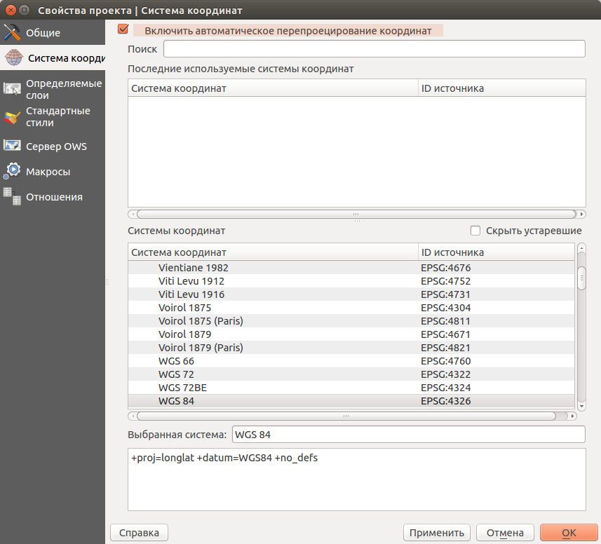

   Перепроецирование "на лету". 

Вкладка Система координат диалогового окна Свойства проекта содержит пять важных 
компонентов, показанных на рисунке :numref:`ngmobile_reprojection_on_the_fly_pic` 
и описанных ниже.

1. Включить преобразование координат "на лету". Данный пункт используется для включения 
или отключения преобразования координат "на лету". Если он отключен, то каждый слой 
отрисовывается в соответствии с проекцией, указанной в источнике данных, и элементы,
описанные ниже, будут неактивными. Если данный пункт отключен, то координаты слоя 
перепроецируются в проекцию карты.

2. Система координат - список проекций, поддерживаемых QGIS, включая географические,
прямоугольные и пользовательские. Для выбора проекции выделите её имя в списке, 
предварительно развернув нужный узел. Текущая проекция выделена цветом.

3. Proj4 - текстовое представление проекции в формате PROJ.4. Данный текст доступен 
только для чтения и используется в качестве справочной информации.

4. Поиск - если вам известен EPSG-код, идентификатор или имя проекции, то можно 
воспользоваться поиском. Введите идентификатор и нажмите кнопку Найти. Отметьте
Скрыть устаревшие системы координат, чтобы показывать только используемые в настоящее 
время проекции.

5. Недавно использованные системы координат - если имеются определённые наиболее 
часто используемые в проектах проекции, то они будут доступны в таблице, расположенной 
в верхней части диалога Выбор системы координат. Нажмите на одну из строк, чтобы 
выбрать эту систему координат.

Если открыть Свойства проекта из меню Редактирование (Gnome, OS X) или Установки 
(KDE, Windows), то для доступа к настройкам проекций нужно перейти во вкладку Система 
координат. Если же воспользоваться кнопкой Преобразование координат, то вкладка 
Система координат откроется автоматически.

Если вы не нашли нужной проекции, то можно определить собственную. Для этого выберите 
пункт Ввод системы координат меню Редактирование (Gnome, OS X) или Установки (KDE, Windows).
Пользовательские проекции хранятся в пользовательской базе данных. Помимо собственных 
проекций эта база содержит пространственные закладки и прочую информацию.

Для создания собственной проекции необходимо хорошо разбираться в синтаксисе библиотеки 
поддержки картографических проекций PROJ.4. Рекомендуется ознакомиться с документом 
"Cartographic Projection Procedures for the UNIX Environment - A User’s Manual"
(Gerald I. Evenden, U.S. Geological Survey Open-File Report 90-284, 1990), доступным 
по адресу ftp://ftp.remotesensing.org/proj/OF90-284.pdf.
Данное руководство описывает использование proj.4 и связанных утилит командной строки. 
Картографические параметры, используемые в proj.4, описаны в руководстве и совпадают 
с используемыми в NextGIS QGIS.

В диалоговом окне Определение пользовательской системы координат требуется всего 
два параметра для определения собственной проекции:

1. Имя проекции.

2. Картографические параметры в формате PROJ.4.

Для создания новой системы координат нажмите кнопку Новая, укажите имя и введите 
необходимые параметры. После чего созданную проекцию можно сохранить, нажав кнопку
Сохранить.
Значение поля Параметры создаваемой проекции должно начинаться со строки +proj=.
Создаваемую проекцию можно проверить. Для этого вставьте параметры создаваемой 
проекции в поле Параметры раздела Проверка. Затем введите значения широты и долготы 
WGS-84 в поля Север и Восток соответственно. Нажмите кнопку Рассчитать и сравните 
результат с известными значениями вашей проекции :numref:`ngmobile_user_coordinate_system_pic`).

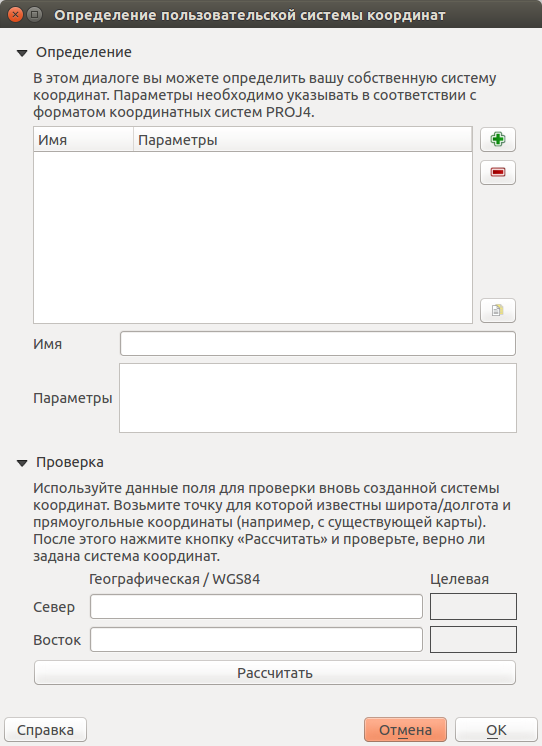

   Пользовательская система координат.

Настройка стилей
-----------------

Картостиль - это описание цветов, текстур, значков, толщины линий, подписей и прочих 
особенностей отображения слоёв на экране. Эти настройки хранятся отдельно от географических 
данных, их можно сохранять в отдельные файлы и копировать между слоями. Настройка 
осуществляется через :menuselection:`Слой --> Свойства слоя --> Оформление` 
или :menuselection:`Слой --> Свойства слоя --> Подписи`. Для каждого слоя задаётся 
отдельное оформление.

.. _ngq_vector_styles:

Настройка оформления векторных слоёв
^^^^^^^^^^^^^^^^^^^^^^^^^^^^^^^^^^^^^^^^^^^^^^^^^^^^^^^^^^^^^

В описании об оформлении векторного слоя используется 3 типа символов: 

1. Тип символов.
2. Тип символьного слоя.
3. Тип классификации. 

* **Тип символа** - символы различаются по типу: для точечных, линейных и полигональных 
слоёв символы различаются. Это не изменяется. Сами символы могут состоять из одного или 
нескольких символьных слоёв. 

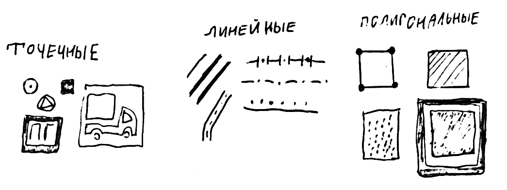

   Примеры символов для точечных, линейных и полигональных слоёв.

.. todo::
   Отрендрить картинку на компьютере.

* **Тип символьного слоя** - задаёт способ заливки: цветом, штриховкой, SVG, маркерами, 
  или способ рисования линии: пунктирная линия, линия из маркеров.

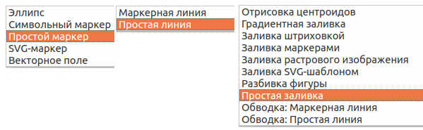

   Варианты типов символьного слоя доступные для точечных, линейных и полигональных слоёв.

* **Тип классификации** - задаёт способ, как рисовать разные символы для разных объектов 
  в одном слое: все одинаково или по-разному. 

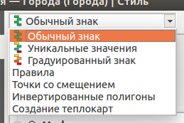

   Варианты типов классификации.
    

Для настройки стиля выделите нужный стиль в списке слоёв, и откройте окно настройки стиля: :menuselection:`Слой --> Свойства слоя --> вкладка Оформление`.

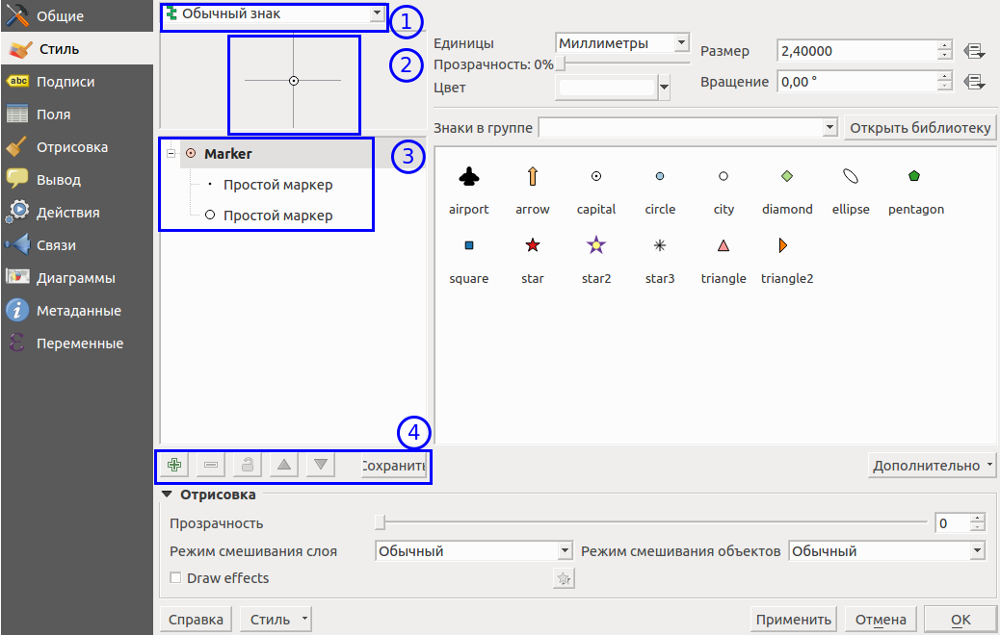

   Окно настройки стиля в режиме классификации Обычный знак, которое открывается по умолчанию.

   1. Список типов классификации.
   2. Изображение знака.
   3. Список символьных слоёв в текущем символе.
   4. Кнопки добавления-удаления символьных слоёв.

Если в списке символьных слоёв выбрать один слой, то появится окно настроек символа.
Его вид будет разным в зависимости от выбранного типа символьного слоя.

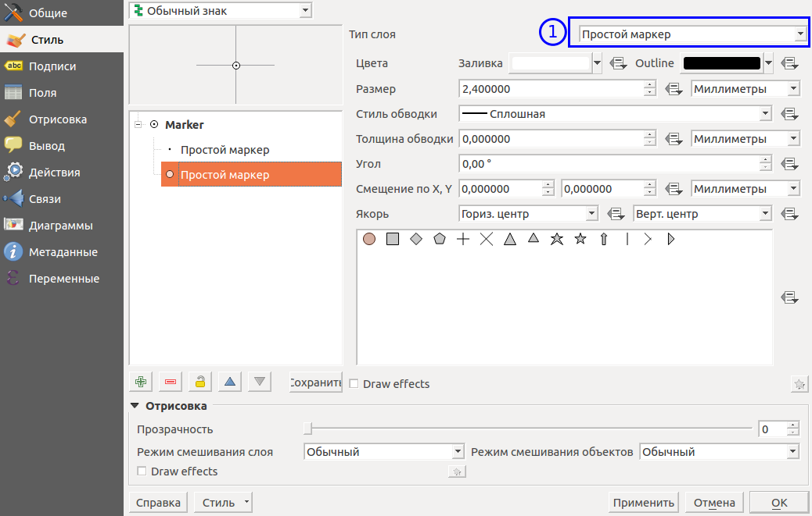

   Окно настроек символа.

   1 - список типов символьных слоёв.

См. так же http://www.qgistutorials.com/ru/docs/basic_vector_styling.html.

Доступные типы символьных слоёв
^^^^^^^^^^^^^^^^^^^^^^^^^^^^^^^^^^^^^^^^^^^^^^^^^^^^^^^

* Для точечных слоёв:

  * **Символьный маркер**: отрисовка с использованием определенного символа заданного 
    шрифта.

  * **Простой маркер**: отрисовка с использованием одного из предустановленных маркеров.

  * **SVG маркер**: отрисовка с использованием SVG изображения.

  * **Эллипс**: отрисовка с использованием геометрических примитивов (эллипс, прямоугольник, 
    треугольник, перекрестие).

  * **Векторное поле**: отрисовка векторным полем с использованием значений атрибутивной 
    таблицы.

* Для линейных слоёв:

  * **Обрамление линии**: добавляет элементы оформления, например, стрелку для указания 
    направления линии.

  * **Маркерная линия**: отрисовка линии повторением маркерного символа.

  * **Простая линия**: обычная отрисовка линии (с указанными шириной, цветом и стилем).

* Для полигональных слоёв:

  * **Отрисовка центроидов**: отрисовка центроида полигона при помощи одного из 
    предустановленных маркеров.

  * **Заливка SVG-шаблоном**: Заливка полигона SVG изображением.

  * **Простая заливка**: обычная отрисовка полигона (с определенным цветом заливки, 
    шаблоном заливки и контуром).

  * **Заливка штриховкой**: заливка полигона линейной штриховкой.

  * **Заливка маркерами**: заливка полигона заданным маркером.

  * **Обводка: обрамление линии**: добавляет элементы оформления (например, кружки) 
    к контуру полигона.

  * **Обводка: маркерная линия**: контур отрисовывается путем повторения маркерного 
    символа.

  * **Обводка: простая линия**: обычная отрисовка линии (с указанными шириной, цветом 
    и стилем).

Доступные типы классификации слоев
^^^^^^^^^^^^^^^^^^^^^^^^^^^^^^^^^^^^^^^^^^^^^^^^^^^^^^^

Возможно выбрать один из пяти типов: 

1. Обычный знак.
2. Уникальные значения.
3. Градуированный знак.
4. Правила.
5. Точки со смещением.

Обычный знак
"""""""""""""""""""""""""""""""""""""""""""

Используется для отрисовки всех элементов слоя с использованием одного, определенного 
пользователем, символа. Свойства, которые можно задать во вкладке Стиль, частично 
зависят от типа слоя.

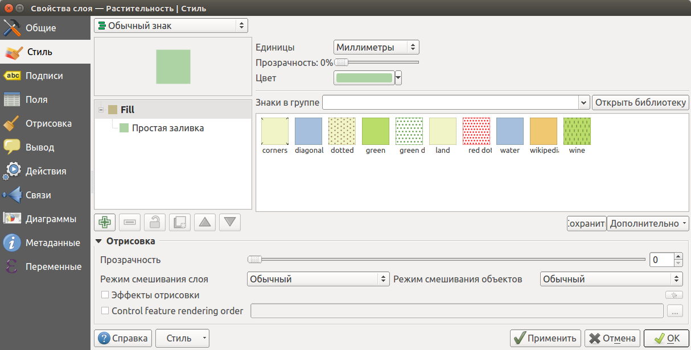

   Диалог отрисовки обычным знаком.

Уникальные значения
"""""""""""""""""""""""""""""""""""""""""""

Объекты с разным значением какого-нибудь атрибута рисуются разными цветами.

Отрисовка уникальными значениями используется для отрисовки всех элементов слоя 
единым, определенным пользователем, символом, цвет которого отражает значение выбранного 
атрибута элемента. Вкладка Стиль позволяет выбрать:

1. Поле (в списке полей).
2. Знак (в диалоге Выбор условного знака).
3. Градиент (в списке цветовых шкал).

Кнопка Дополнительно в нижнем левом углу окна позволяет указать поля с 
информацией о вращении и масштабе. Для удобства список в нижней части вкладки 
показывает значения всех заданных на данный момент атрибутов, включая символы, к 
которым в будущем будет применена отрисовка.
Рисунок :numref:`ngmobile_dialogue_rendering_unique_values_pic` иллюстрирует 
диалог отрисовки уникальными значениями из демонстрационного набора данных QGIS:

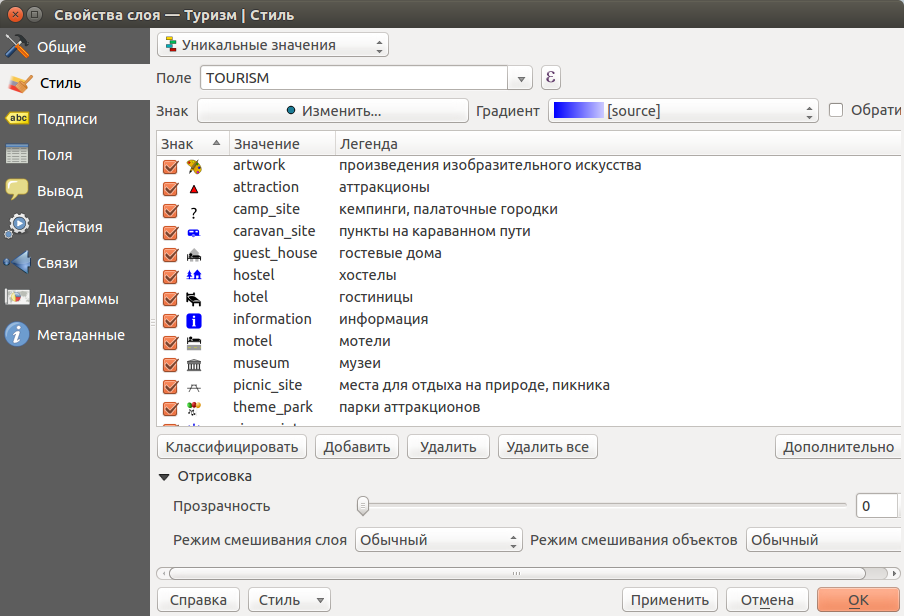

   Диалог отрисовки уникальными значениями.

Можно создавать свои градиенты, выбрав Новый градиент из выпадающего списка Градиент.
В появившемся окне можно выбрать тип градиента: "Градиент", "Случайный" или
"ColorBrewer", для каждого из которых можно задать желаемое количество цветов. 

Градуированый знак
"""""""""""""""""""""""""""""""""""""""""""

Цвет будет плавно изменяться в зависимости от числового значения какого-либо атрибута.
 
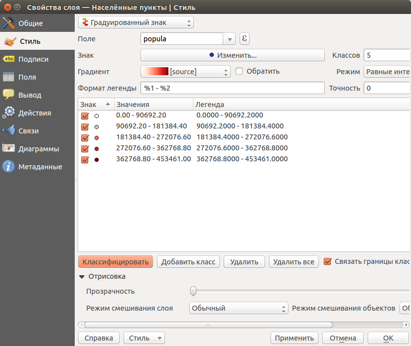

   Фрагмент диалога свойств слоя - Градуированный знак. 

Правила
"""""""""""""""""""""""""""""""""""""""""""

Используется для отрисовки всех элементов слоя с помощью символов, базирующихся на 
определенных правилах. Задаётся несколько выражений/правил. Каждое выражение выдаёт 
несколько записей и оформляется по-своему. Может быть разным не только цвет, но и 
другие параметры.

Точки со смещением
"""""""""""""""""""""""""""""""""""""""""""

Только для точечных слоёв - рисуются кластеры. В данном стиле при задании значения Порога расстояния 
между точками (вкладка Свойства слоя - Стиль) точки группируются с учетом значения 
Порога расстояния между точками. Далее при отображении на карте внутри группы точек 
выбирается точка, вокруг которой выстраиваются остальные точки по кругу с радиусом, 
соответствующим значению Порога расстояния между точками.

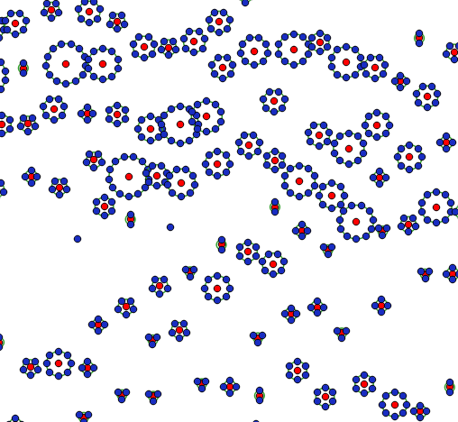

   Фрагмент карты после применения стиля "Точки со смещением". 

Инвертированные полигоны
"""""""""""""""""""""""""""""""""""""""""""

Только для полигональных слоёв. При использовании данного стиля (вкладка Свойства слоя - Стиль) 
происходит заливка цветом областей за пределами полигона (снаружи полигона), сам 
полигон остается прозрачным. 

.. figure:: _static/styles_inverted_polygons.png
   :name: ngqgis_styles_inverted_polygons_pic
   :align: center
   :width: 12cm

   Фрагмент карты До и После применения стиля "Инвертированные полигоны".

Создание теплокарт
"""""""""""""""""""""""""""""""""""""""""""

Вся карта заливается фоновым цветом (можно сделать прозрачным). Вокруг каждой точки 
рисуется размытый круг, если рядом много точек, то круг более насыщенный.

В настройках градиента можно выбрать прозрачный цвет. 
Качество отрисовки обозначает размер пикселей.

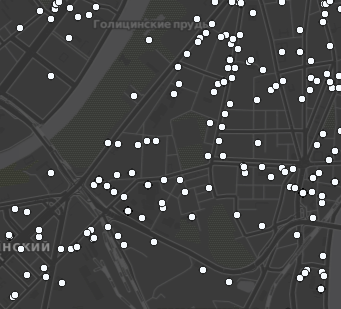

   Исходные точки.

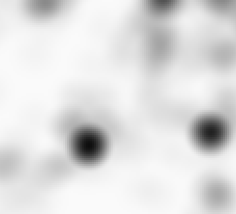

   Теплокарта с настройками по умолчанию.

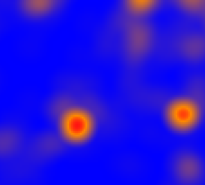

   Свой градиент.

.. figure:: _static/styles_heatmap_03_gradienttransparent.png

   Градиент, начинающийся с прозрачного цвета.

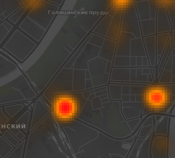

   Самый быстрый.

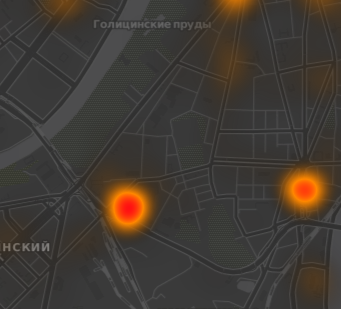

   Самый качественный.

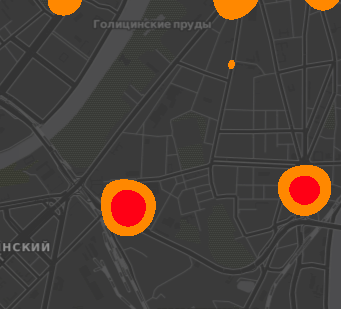

   Дискретный градиент - качественный.

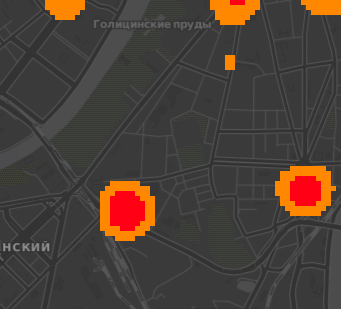

   Дискретный градиент - быстрый.

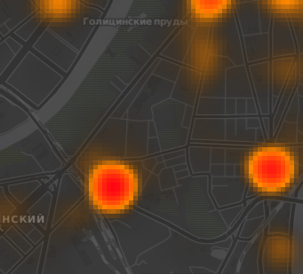

   Средний радиус.

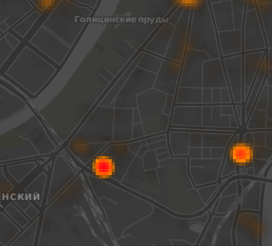

   Занизить радиус.

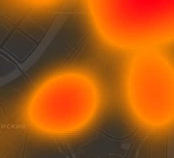

   Завысить радиус.

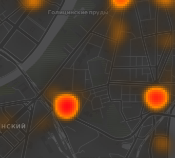

   Максимальное значение - авто.

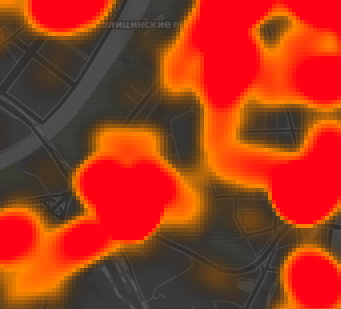

   Максимальное значение - занизить.

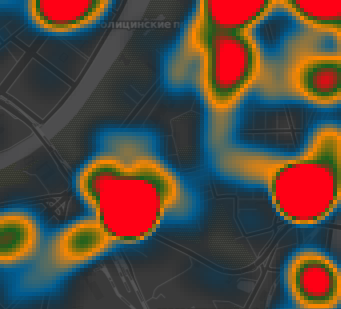

   Сложный градиент с промежуточными цветами.
 

   Взвешивание - автоматическое. Интенсивность обозначает концентрацию точек.

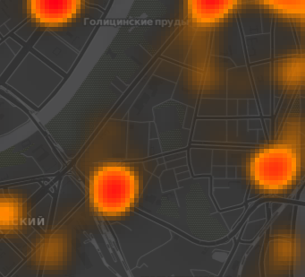

   Взвешивение - по атрибуту (количество мест). Интенсивность обозначает 
   суммарное количество мест в заведениях.

Эффекты отрисовки
^^^^^^^^^^^^^^^^^^^^^^^^^^^^^^^^^^^^^^^^^^^^^^^^^^^^^^^^^^^^^

Для всех режимов отображения можно задать эффекты отрисовки слоя - как например 
тень, свечение, внешнюю или внутреннюю линию.

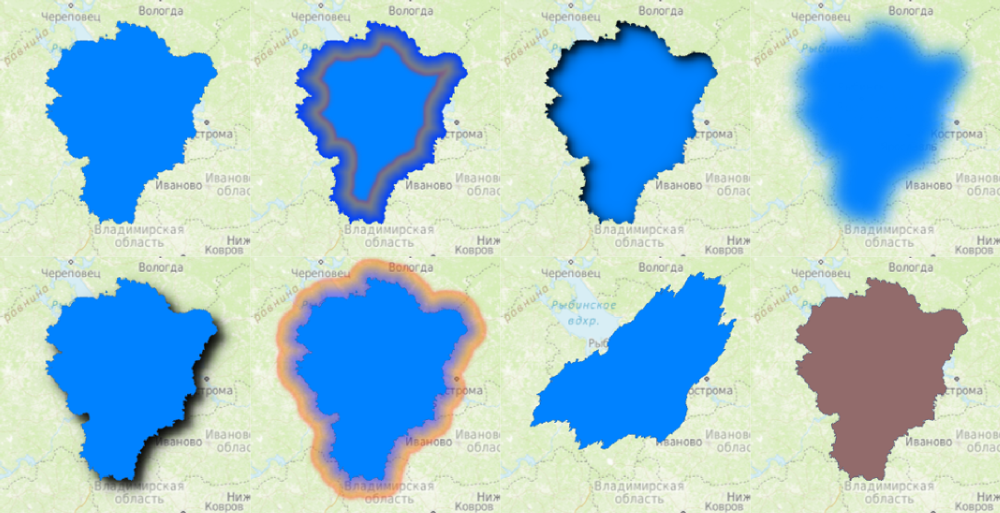

   Фрагмент карты с различными отрисовками.

Оформление растровых слоёв
^^^^^^^^^^^^^^^^^^^^^^^^^^^^^^^^^^^^^^^^^^^^^^^^^^^^^^^^^^^^^

Для растровых слоёв существует 4 разных способа визуализации: два - для одноканальных 
растров, два - для многоканальных. 

.. note::
   Настройки оформления различаются для разных форматов. Большее количество 
   настроек оформления существует для формата GeoTIFF, а для слоёв WMS и TMS 
   настроек оформления меньше.

Многоканальное цветное
"""""""""""""""""""""""""""""""""""""""""""

Используйте этот способ оформления, если у вас многоканальный растр, например - 
цветной космоснимок или скан карты в RGB. 

Индексированое
"""""""""""""""""""""""""""""""""""""""""""

Картинка рисуется по данным из одного выбранного канала растра. Каждое значение 
растра рисуется отдельно заданным цветом. 

Одноканальное серое
"""""""""""""""""""""""""""""""""""""""""""

Картинка рисуется по данным из одного выбранного канала растра, чёрно-белой.

Рассмотрим настройки растрового стиля на самом простом примере - цифровой модели рельефа. Это - GeoTIFF, пикселы которого имеют только одно значение (одноканальный) - высоты в метрах. Если бы это была фотография - то пикселы имели бы 3 значения - количества красного, зелёного и синего цвета (трёхканальный).

Высота меняется в диапазоне до нескольких тысяч метров. Для хранения значения из такого диапазона нужно 16 бит. Если значения изменяются в диапазоне от 0 до 255 - то они укладываются в 8 бит, и формат такого растра называется RGB.

После открытия растрового слоя, в окне настроек растрового стиля, в полях Мин и Макс выводятся крайние значения, которые встречаются в пикселах этого растра. Градиент заливки распределяется между ними. Если их поменять вручную, то градиент заливки изменится. Если нажать Охват Текущий и кнопку Загрузить, то рассчитаются значения Мин и Макс для текущего охвата карты. 
   
Одноканальное псевдоцветное
"""""""""""""""""""""""""""""""""""""""""""

Картинка рисуется по данным из одного выбранного канала растра, по цветному градиенту. Используйте этот способ оформления, если у вас одноканальный растр, например - цифровая модель рельефа (DEM).

В полях Мин и Макс выводятся крайние значения, которые встречаются в пикселах этого растра. Градиент заливки распределяется между ними. Если их поменять вручную, то градиент заливки изменится. Если нажать Охват Текущий и кнопку Загрузить, то рассчитаются значения Мин и Макс для текущего охвата карты. 
   
При всех способах визуализации можно задавать прозрачность, яркость, контрастность 
и тонирование в цвет. 

.. _ngq_save_style:

Сохранение стиля
^^^^^^^^^^^^^^^^^^^^^^^^^^^^^^^^^^^^^^^^^^^^^^^^^^^^^^^^^^^^^

Стиль можно сохранить в файл. В нём сохранится настройки оформления и настройки подписей. 

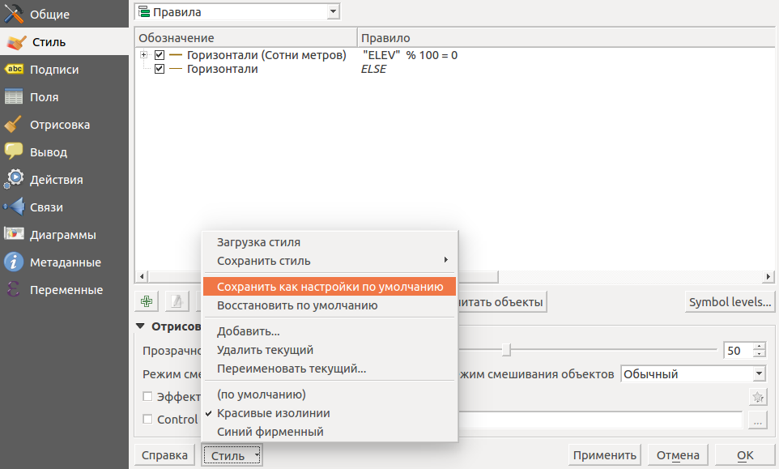

   Диалог сохранения стиля.

В окне свойства стиля нажмите на кнопку :guilabel:`Стиль` (см. :numref:`ngqgis_styles_save`). 

По нажатию на кнопку :guilabel:`Сохранить настройки по умолчанию` стиль сохранится в 
формате qml в каталоге, где лежит стиль, и с тем же названием. Теперь, если вы будете 
добавлять этот слой как новый, то QGIS подхватит и его стиль тоже.

Пункт :guilabel:`Сохранить стиль` - позволяет сохранить его в другой файл, а так же в формат sld.

.. _ngq_composer:

Настройка подписей
-----------------

Подписи можно выводить у объектов векторных слоёв. Текст подписи можно брать либо из атрибута, 
либо рассчитывать выражением из значений нескольких атрибутов. Остальные свойства 
подписи - цвет, размер, положение, поворот - тоже можно брать из атрибутов.

Для настройки стиля выделите нужный стиль в списке слоёв и откройте окно настройки 
стиля: :menuselection:`Слой --> Свойства слоя --> вкладка Подписи`.

В открывшемся окне в списке режима подписей выберите Показывать подписи для этого 
слоя. Затем в списке :guilabel:`Подписывать значениями` выберите поле, из которого будет браться надпись.

Настройки подписей можно сохранить в файл стиля QGIS (в формат qml), вместе с оформлением.

Вкладка "Текст"
^^^^^^^^^^^^^^^^^^^^^^^^^^^^^^^

На вкладке "Текст" вы можете выбрать гарнитуру шрифта, размер букв, использовать изменение регистра символов.

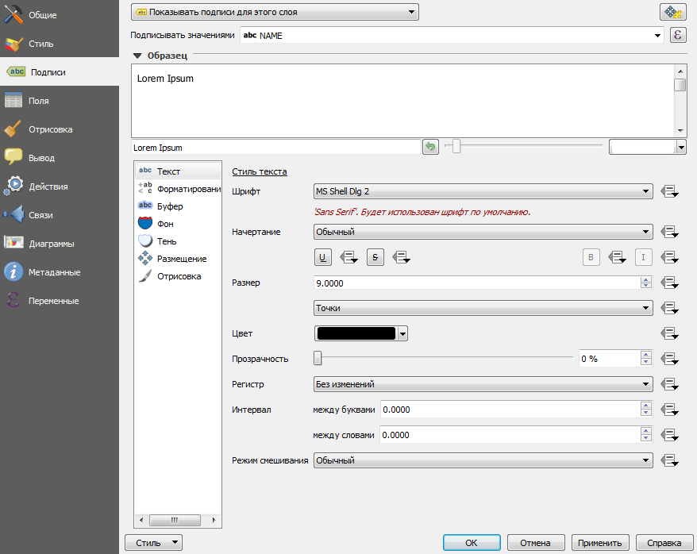

   Окно свойств подписей, вкладка "Текст".

Вкладка "Форматирование"
^^^^^^^^^^^^^^^^^^^^^^^^^^^^^^^

На вкладке "Форматирование" можно настроить количество знаков после запятой, выводимых из полей типа Real, 
и выравнивание многострочных подписей.

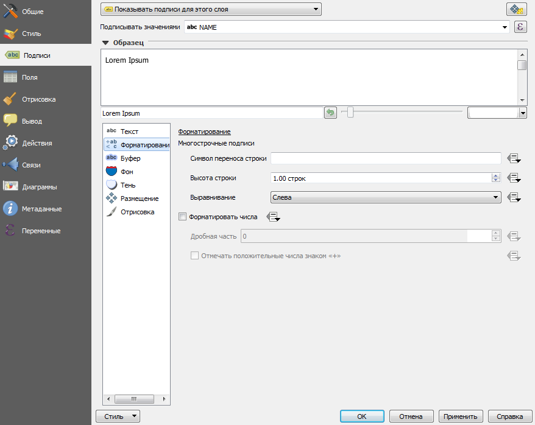

   Окно свойств подписей, вкладка "Форматирование". 

Перенос текста в подписях
""""""""""""""""""""""""""""""

   Если вы хотите переносить длинные подписи, рекомендуется в поле "Подписывать значениями" ввести формулу wordwrap(NAME,15,' ') - подпись будет браться из атрибута NAME, и делиться на куски не менее 15 символов разделённые пробелами. Это более гибкий способ. См. labels_settings_worldwrap

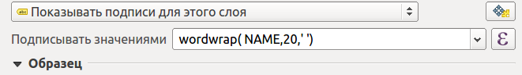

   Окно свойств подписей, настройка переноса текста.

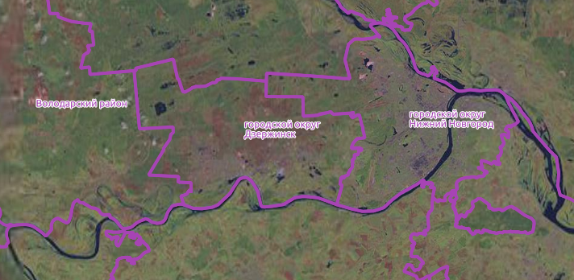

   Пример переноса текста.

Вкладка "Буфер"
^^^^^^^^^^^^^^^^^^^^^^^^^^^^^^^

На вкладке "Буфер" можно настроить рисование закрашеной области вокруг букв. 
В этом режиме они будут видны на любом фоне. 

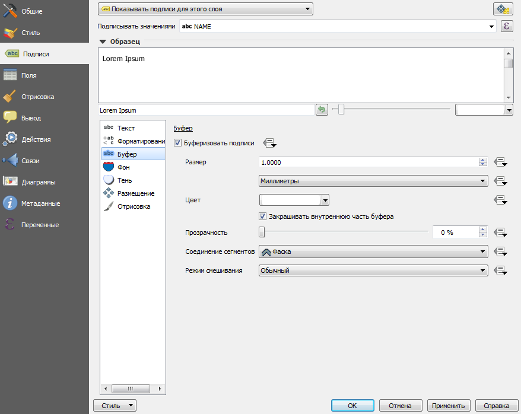

   Окно свойств подписей, вкладка "Буфер".

.. figure:: _static/labels_demo_buffer.png
   :name: labels_demo_buffer
   :align: center
   :width: 16cm

   Пример подписи без буфера и с буфером.

Вкладка "Фон"
^^^^^^^^^^^^^^^^^^^^^^^^^^^^^^^

На вкладке "Фон" можно настроить рисование прямоугольного фона под надписями. 
В этом режиме карта начинает выглядеть более угловато и старомодно.

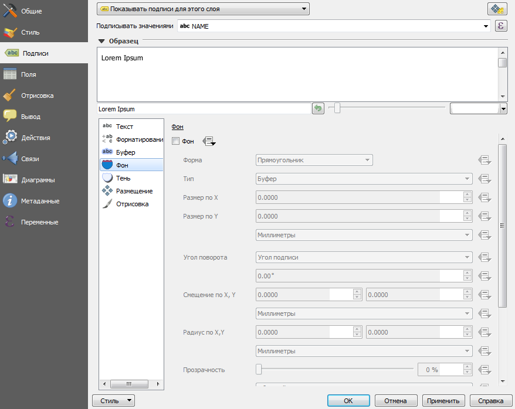

   Окно свойств подписей, вкладка "Фон".

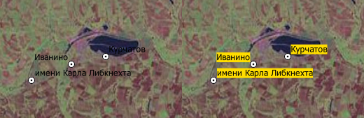

   Пример подписи без фона и с фоном.

Вкладка "Тень"
^^^^^^^^^^^^^^^^^^^^^^^^^^^^^^^

На вкладке "Тень" можно настроить рисование тени под надписями. В этом режиме карта начинает выглядеть более сложно.

.. figure:: _static/labels_settings_shadows.png
   :name: labels_settings_shadows
   :align: center
   :width: 16cm

   Окно свойств подписей, вкладка "Тень".

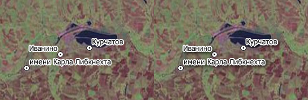

   Пример подписи без тени и с тенью.

Вкладка "Размещение"
^^^^^^^^^^^^^^^^^^^^^^^^^^^^^^^

На вкладке "Размещение" можно настроить алгоритм, по которому подписи раздвигаются, 
что бы не накладываться друг на друга. 

Так же имеется возможность передвигать вручную и поворачивать отдельные подписи, смотрите далее. 

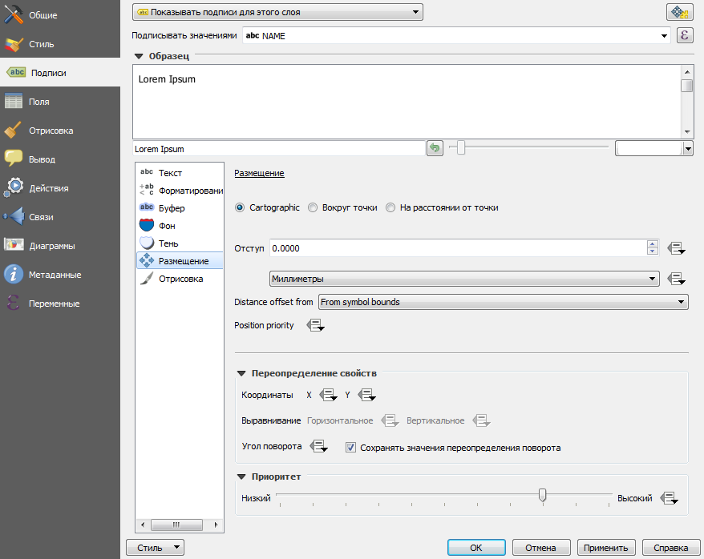

   Окно свойств подписей, вкладка "Размещение".

Разные варианты автоматического размещения подписей
^^^^^^^^^^^^^^^^^^^^^^^^^^^^^^^^^^^^^^^^^^^^^^^^^^^^^^^^^^^^^^^^^^^^^^

При создании карт значительное время занимает подбор расположения подписей на карте. 
Оно влияет на читаемость карты, и необходимый размер или масштаб. NextGIS QGIS обладает 
большими возможностями по автоматическому раздвиганию подписей. В зависимости от настроек 
зритель может быстрее и точнее считывать карту. 

Для точечных слоёв
""""""""""""""""""""""""""""""""""""""

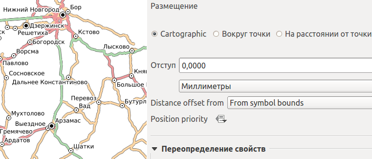

   Пример размещения точечных подписей в режиме Сartografic. Для точечных подписей 
   это рекомендуемый алгоритм. Он делает как написано в учебниках: пытается сначала 
   поставить подпись в правую-верхнюю сторону от точки.   

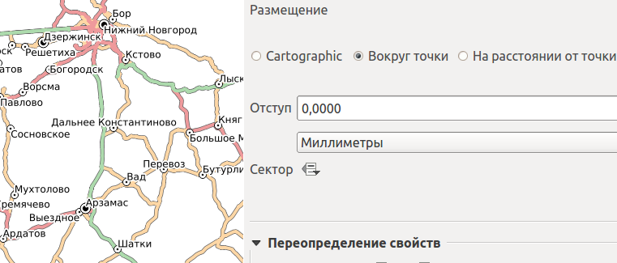

   Пример размещения точечных подписей в режиме "Вокруг точки". Это старый алгоритм, 
   который был до Cartografic.

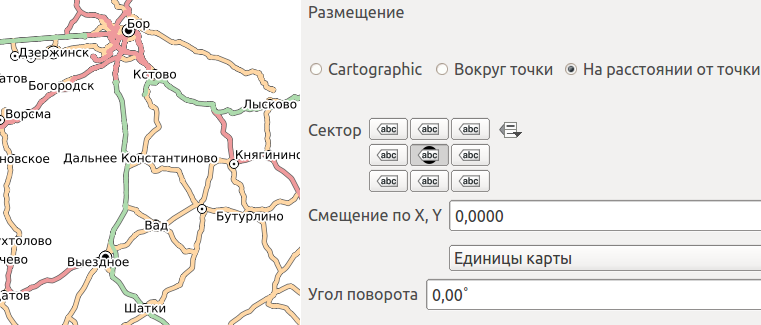

   Пример размещения точечных подписей в режиме "На расстоянии от точки" без смещения. 
   Подписи закрывают точки. Видно, что шоссе проходят прямо через Бутурлино.

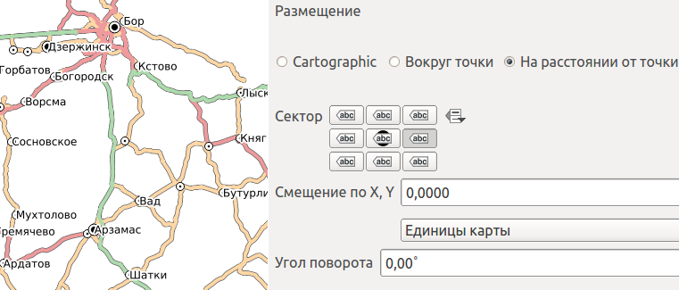

   Пример размещения точечных подписей в режиме "На расстоянии от точки" со смещением. 
   Все точки подписаны справа.

Для линейных слоёв
""""""""""""""""""""""""""""""""""""""

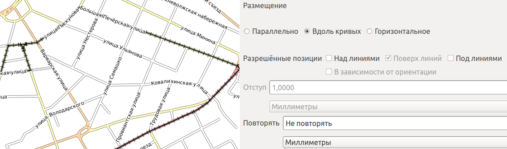

   Пример размещения линейных подписей в режиме "Поверх линий".

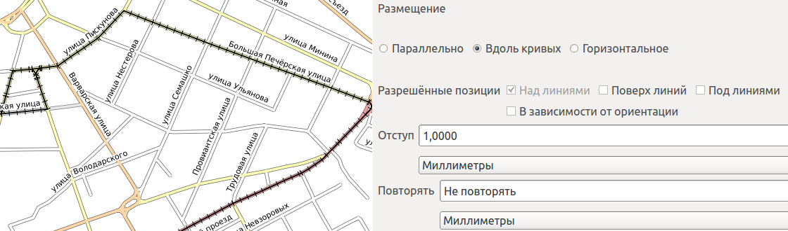

   Пример размещения линейных подписей в режиме "Над линиями". 
   Обратите внимание, что такие надписи не загораживают трамвайные линии на улицах.

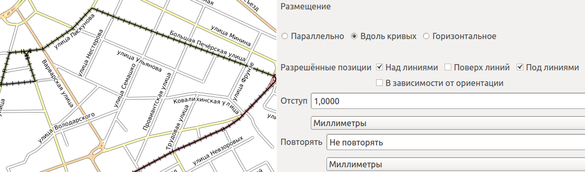

   Пример размещения линейных подписей в режиме "Над линиями" и "Под линиями". 
   Так нарисовалось больше надписей. 

Для полигональных слоёв
""""""""""""""""""""""""""""""""""""""

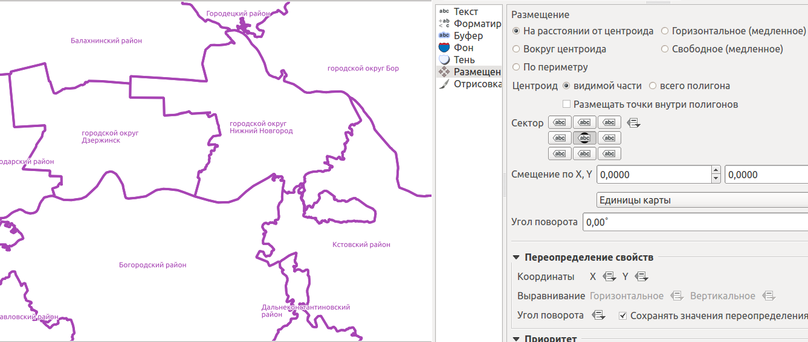

   Пример размещения линейных подписей в режиме "На расстоянии от центроида".

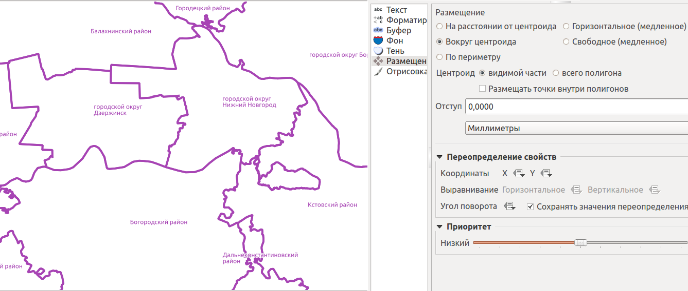

   Пример размещения линейных подписей в режиме "Вокруг центроида".

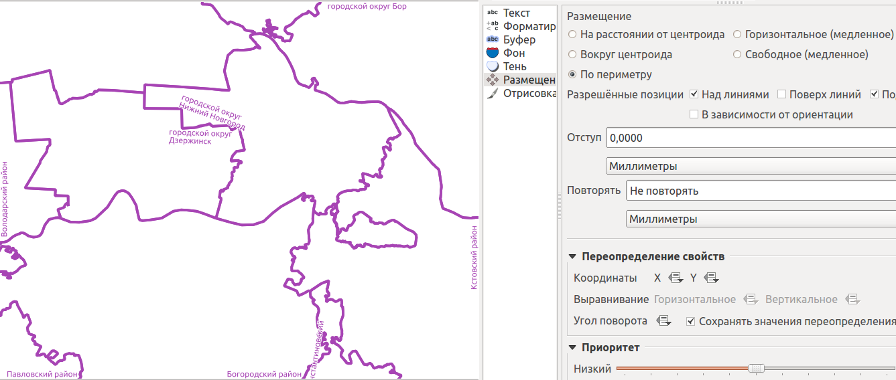

   Пример размещения линейных подписей в режиме "По периметру".

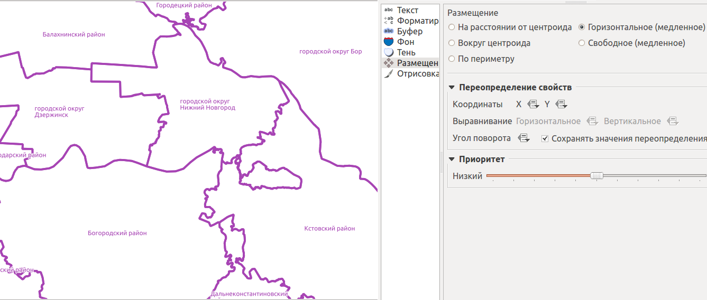

   Пример размещения линейных подписей в режиме "Горизонтальное".
   

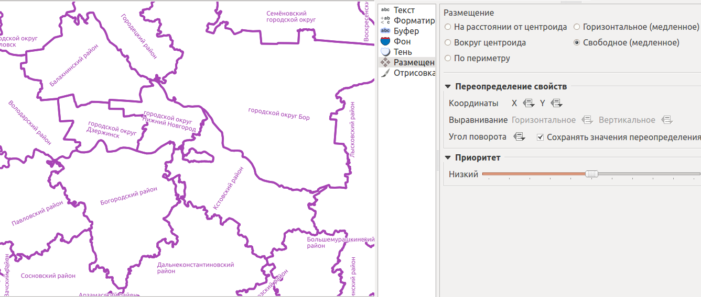

   Пример размещения линейных подписей в режиме "Свободное".

Вкладка "Отрисовка"
^^^^^^^^^^^^^^^^^^^^^^^^^^^^^^^

На вкладке "Отрисовка" можно настроить алгоритм, по которому некоторые подписи скрываются, 
что бы не накладываться друг на друга.

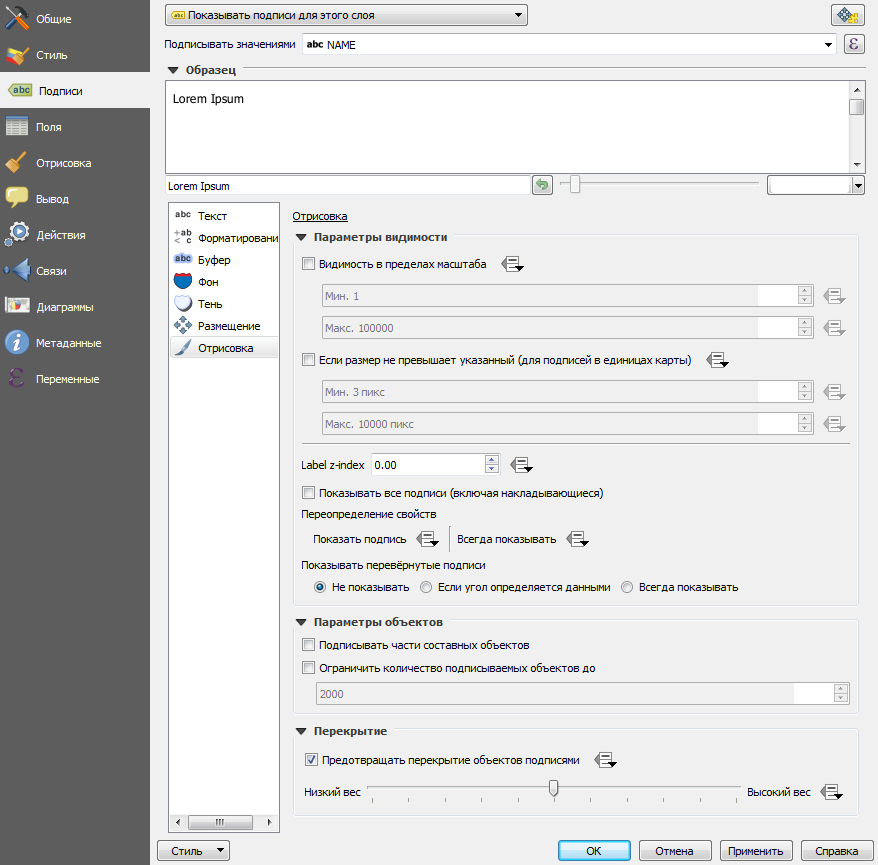

   Окно свойств подписей, вкладка "Отрисовка".

Перемещение подписей
^^^^^^^^^^^^^^^^^^^^^^^^^^^^^^^^^^^^^^^^^^^^^^^^^^^^^^^^^^^^^

Если вам нужно управлять размещением подписей, то в QGIS это можно делать 3 способами:

1. Простой способ: подобрать настройки в окне Свойства стиля --> Подписи --> Размещение. 
Имеется несколько разных алгоритмов, которые раздвигают подписи так, что бы они не загораживали друг друга.

2. Старый способ: сделать отдельный точечный или линейный слой. Указать ему прозрачные 
цвета заливки и обводки, и выводить подписи из него. Но так работать нелогично.

3. Рекомендуемый способ: Добавить в слой через "Калькулятор полей" 2 поля с названием lx, ly, 
тип - дробный, размер 10, точность 8. В настройках подписей найти свойства X, Y, 
связать их с этими атрибутами, в основном окне QGIS включить "Панель подписей", 
включить режим редактирования слоя, двигать отдельные подписи кнопкой "Переместить подпись".

Экспорт карты в статические картинки
---------------------------------------

Компоновщик карты используется для оформления и подготовки макета карты и атласа, 
которые можно распечатать, сохранить как PDF-файл, изображение или SVG-файл. Это 
способ для распространения географической информации, созданной в :program:`NextGIS QGIS`, 
которую можно распространять как статическую картинку.
Если же вам нужно показывать интерактивную карту в интернете, то воспользуйтесь плагином NextGIS Connect. 
http://docs.nextgis.ru/docs_ngcom/source/ngqgis_connect.html

.. todo::
   Поставить гиперссылку.

Компоновщик карты предоставляет возможности вёрстки (размещения карт легенд и других 
объектов на листе) и печати. Он позволяет добавлять такие элементы:

1. Карты.
2. Подписи.
3. Картинки.
4. Список условных обозначений.
5. Масштабные линейки.
6. Сетки на карте.
7. Фигуры.
8. Стрелки.
9. Таблицы данных.
10. HTML-фреймы. 

Вы можете масштабировать, группировать, перемещать и поворачивать каждый элемент. 
Макет может состоять из нескольких страниц. Макет можно сохранять в проекте. Так же 
макет может быть использован для генерации атласа - сборника из нескольких карт. 

Открытие компоновщика карты
^^^^^^^^^^^^^^^^^^^^^^^^^^^^^^^^^^

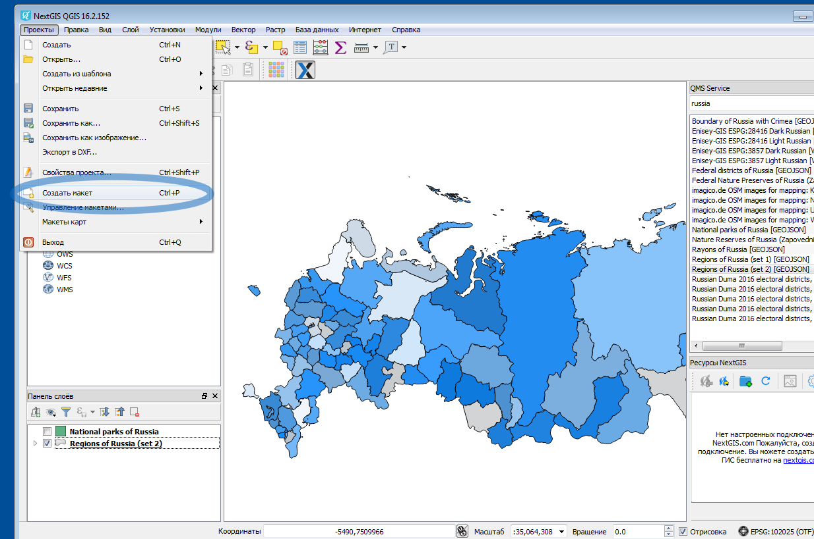

   Запуск компоновщика карты через меню.

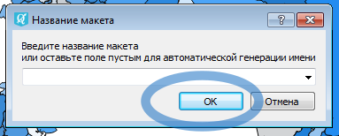

   При запуске композера нажмите Ок.

Перед началом работы в компоновщике карты нужно добавить в :program:`NextGIS QGIS` 
нужные слои и настроить их оформление соответственно вашим потребностям. Когда в 
основном окне карта отображается так, как вам нужно, нажмите :menuselection:`Проекты --> Создать макет`.
В диалоге вам предлагается ввести имя для нового макета карты. Его можно оставить пустым. 

.. todo::
   Найти точное название кнопки

Обзор окна Компоновщика карты
^^^^^^^^^^^^^^^^^^^^^^^^^^^^^^^^^^^

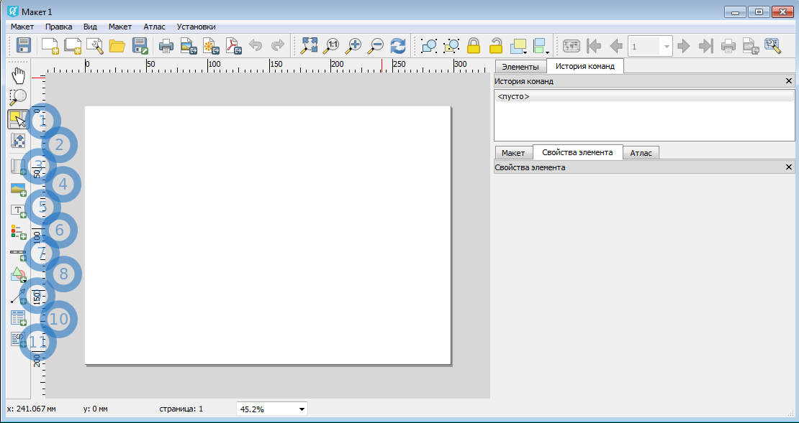

   Основные кнопки в компоновщике: 1. Выбирать объекты на листе. 2. Перемещать объект по листу. 
   3. Добавить карту на лист. 4. Добавить картинку. 5. Добавить надпись. 6. Добавить условные обозначения (легенду).
   7. Добавить масштабную линейку. 8. Добавить фигуру. 9. Добавить стрелку. 10. Добавить таблицу данных.
   11. Добавить HTML-документ.

При открытии нового окна Компоновщика карты в нём будет белая область компоновки карты,
изображающая лист бумаги. В левой части окна находится панель кнопок, которые добавляют 
объекты в область компоновки: текущую карту из :program:`NextGIS QGIS`, надписи, 
картинки, легенду, масштабные линейки, стрелки, таблицы атрибутов и HTML-фреймы. 
Так же в этой панели находятся кнопки перемещения по области компоновки. 
Это начальный вид окна Компоновщика карты без добавления каких-либо элементов 
и выполненных команд. 

Справа посредине находится панель c 3 вкладками: :guilabel:`Макет`, :guilabel:`Свойства Элемента` и :guilabel:`Атлас`.

На вкладке Макет задаются параметры бумаги: формат и соотношение сторон. 
Регулятором Количество страниц можно добавить страницы в макет: их можно сверстать по-разному. 
Регулятором Разрешение задаётся разрешение изображения в dpi. 

.. todo::
   картинка: карта с 2 страницами (или не нужно? Спросить)

Содержимое вкладки :guilabel:`Свойства Элемента` бывает разное для каждого выделенного 
элемента в области компоновки карты. Выделите в ней карту или масштабную линейку 
инструментом (стрелка) - содержимое вкладки будет другим.

На вкладке :guilabel:`Атлас` можно указать слой, по содержимому которого будет разрезаться 
карта на отдельные страницы атласа. 

Вкладка История команд отображает историю всех изменений, сделаных в макете. Здесь
можно как отменить сделанные изменения, так и повторить ранее отмененные действия.

Макет сохраняется внутри файла проекта. Макетов может быть несколько.

Как подготовить карту к экспорту 
^^^^^^^^^^^^^^^^^^^^^^^^^^^^^^^^^^^^^

1. Нажмите кнопку :guilabel:`Добавить карту`.

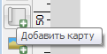

   Кнопка "Добавить карту".

2. Начертите прямоугольник в области карты.
3. Выделите карту в области компоновки: щёлкните на неё инструментом :guilabel:`Выделить/переместить элемент` и 
   проверьте, рисуются ли квадратики по бокам элемента. 

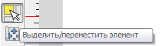

   Кнопка "Выделить/переместить элемент".

4. Откройте вкладку :guilabel:`Свойства элемента`. 
5. Настройте :term:`охват` карты с масштабом и набор слоёв. 

Подбор охвата карты
"""""""""""""""""""""""""""""""""""""""""""

Для перемещения по карте - выделите карту инструментом :guilabel:`Выделить/переместить элемент`, 
затем выберите инструмент :guilabel:`Переместить содержимое элемента`.
Нажмите и ведите по карте мышкой - карта будет сдвигаться. 

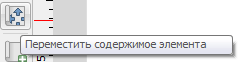

   Кнопка "Переместить содержимое элемента".

Для изменения масштаба карты вращайте колесо мыши. Если вращать с нажатой клавишей kbd:`Control`. - 
масштаб будет меняться с меньшим шагом. 

На вкладке :guilabel:`Свойства элемента` можно ввести точное значение масштаба с клавиатуры в поле :guilabel:`Масштаб`.
 
По нажатию кнопки :guilabel:`Текущий охват` - охват выставится такой же, как у основного окна :program:`NextGIS QGIS`. 
По нажатию кнопки :guilabel:`Установить охват для основной карты` - охват основной карты выставится 
такой же, как у карты из макета. 

Охват сохраняется в макете, и изменения в основном окне :program:`NextGIS QGIS` 
на него не влияют: вы можете в основном окне двигать карту, а в макете она останется такой же. 

Добавление координатной сетки
"""""""""""""""""""""""""""""""""""""""""""

В свойствах карты найдите галочку :guilabel:`Сетка`, нажмите там :guilabel:`+`.
Выберите систему координат, в которой будет рисоваться сетка. Если не знаете, какую выбрать - используйте EPSG:4326

Добавление разных других элементов
"""""""""""""""""""""""""""""""""""""""""""

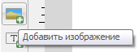

   Кнопка "Добавить изображение".

Добавление названия карты
"""""""""""""""""""""""""""""""""""""""""""

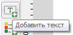

   Кнопка "Добавить текст".

.. note::
   При экспорте карты нужно добавить текст с ссылками на источники картографических данных, иначе их правообладатели могут вас найти и заставить переделать.

Добавление условных обозначений (легенды)
"""""""""""""""""""""""""""""""""""""""""""

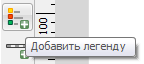

   Кнопка "Добавить легенду".

Легенда по умолчанию обновляется автоматически. В свойствах легенды можно выключить 
автоматическое обновление и переименовать или убрать из неё ненужные слои самому.

Комбинация и порядок слоёв, а так же стили по умолчанию не сохраняются: если вы 
их переставите в основном окне, то в макете они поменяются. Но их изменение можно 
заблокировать кнопками :guilabel:`Заблокировать слои для этой карты` и :guilabel:`Lock layer styles for map item`.

Добавление масштабной линейки
"""""""""""""""""""""""""""""""""""""""""""

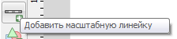

   Кнопка "Добавить масштабную линейку".

При добавлении масштабной линейки необходимо проверить в свойствах проекта выбор элипсоида для вычислений. 
Если вы не знаете, какой должен быть - укажите там WGS 84.

.. todo::
   Дописать про многостраничный pdf и пачку jpg.

Генерация атласа
^^^^^^^^^^^^^^^^^^^^^^^^^^^^^^^^^^^

Эта функция создаёт набор картинок с одинаковым макетом, но с картами разных мест. 
Она использует слой охвата, который содержит геометрии и поля. Для каждой геометрии 
в слое охвата будет создана страница, и охват карты на ней будет будет такой, что 
охватит геометрию слоя. Поля могут быть использованы для подписей. 

Выберите в макете карту. В её свойствах включите галку "Использовать для атласа".
Во вкладке :guilabel:`Атлас` выберите слой нарезки.
В окне компоновщика воспользуйтесь командами :menuselection:`Атлас --> Экспорт атласа`.

.. todo::
   можно сделать атлас районов области, можете нагенерить регулярную сетку с номерами. 

.. todo::
   Написать про кнопки, потому что запускается из другого меню.

