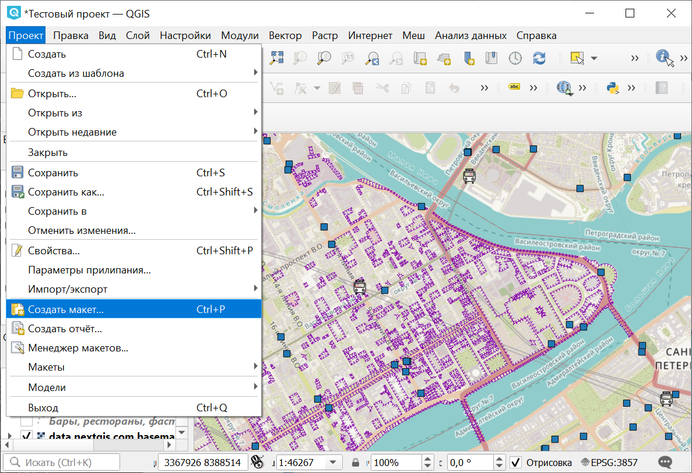
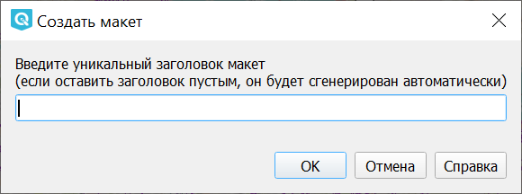
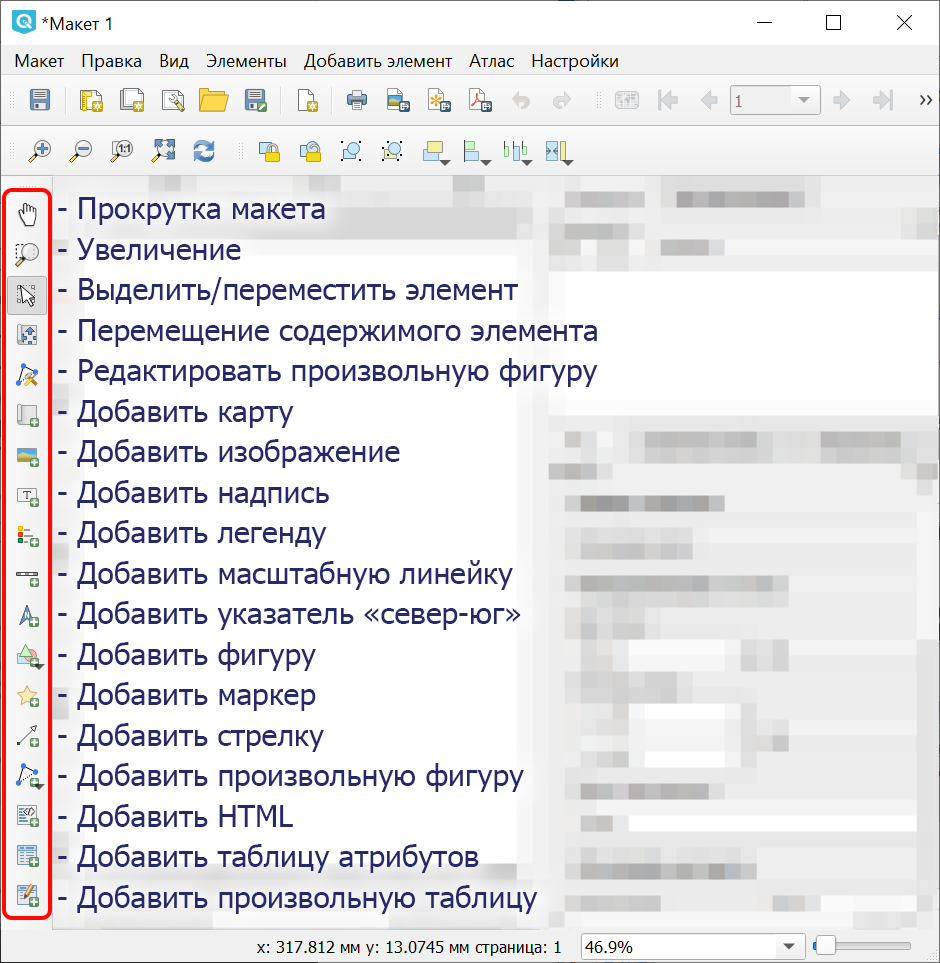
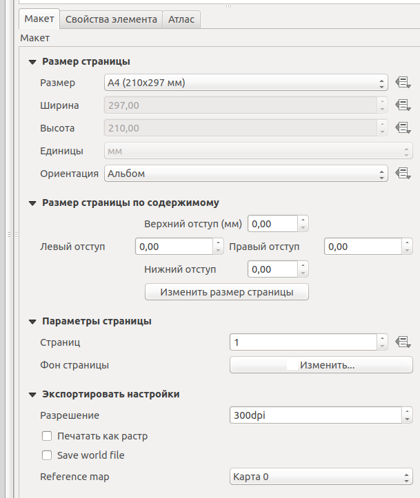
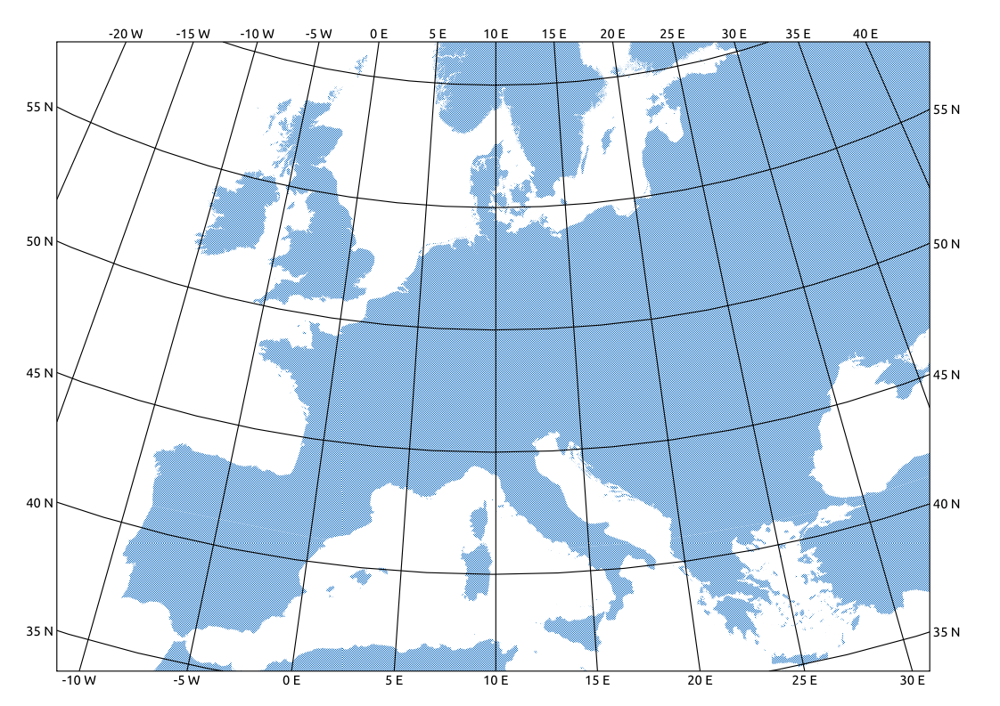
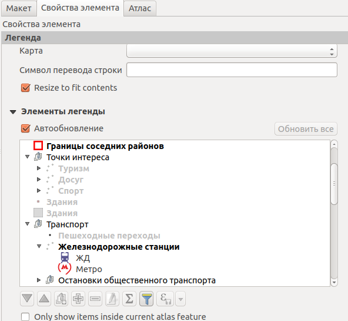

.. sectionauthor:: Дмитрий Барышников <dmitry.baryshnikov@nextgis.ru>
.. sectionauthor:: Артём Светлов <artem.svetlov@nextgis.ru>

.. _ngqgis_map_composer:

Экспорт карты в растровое изображение (Компоновщик карты)
===============================================================

Компоновщик карты используется для оформления и подготовки макета карты или атласа, 
которые можно распечатать, сохранить как PDF-файл, изображение или SVG-файл. Это 
способ для распространения географической информации, созданной в :program:`NextGIS QGIS`, 
которую можно распространять как статическое изображение.

.. tip::
   Если же вам нужно показывать интерактивную карту в Интернете, то воспользуйтесь плагином `NextGIS Connect <https://docs.nextgis.ru/docs_ngcom/source/ngqgis_connect.html>`_. 
   

Компоновщик карты предоставляет возможности вёрстки (размещения карт легенд и других 
объектов на листе) и печати. Он позволяет добавлять такие элементы:

1. Карты.
2. Подписи.
3. Картинки.
4. Список условных обозначений.
5. Масштабные линейки.
6. Сетки на карте.
7. Фигуры.
8. Стрелки.
9. Таблицы данных.
10. HTML-фреймы. 

Вы можете масштабировать, группировать, перемещать и поворачивать каждый элемент. 
Макет может состоять из нескольких страниц. Макет можно сохранять в проекте. Так же 
макет может быть использован для генерации атласа - сборника из нескольких карт. 

Открытие компоновщика карты
^^^^^^^^^^^^^^^^^^^^^^^^^^^^^^^^^^

   Запуск компоновщика карты через меню

   При запуске композера нажмите "ОK"

Перед началом работы в компоновщике карты нужно добавить в :program:`NextGIS QGIS` 
нужные слои и настроить их оформление. Когда в 
основном окне карта отображается так, как вам нужно, нажмите ``Проекты ‣ Создать макет``.
В диалоге вам предлагается ввести имя для нового макета карты. Его можно оставить пустым. 

Обзор окна Компоновщика карты
^^^^^^^^^^^^^^^^^^^^^^^^^^^^^^^^^^^

   
   Окно компоновщика карты

Основные кнопки в компоновщике:

- Прокрутка макета
- Увеличение
- Выделить/переместить элемент
- Перемещение элемента по листу
- Редактировать произвольную фигуру
- Добавить карту
- Добавить изображение
- Добавить надпись
- Добавить легенду
- Добавить масштабную линейку
- Добавить указатель «север-юг»
- Добавить фигуру
- Добавить маркер
- Добавить стрелку
- Добавить произвольную фигуру
- Добавить HTML
- Добавить таблицу атрибутов
- Добавить произвольную таблицу

При открытии нового окна "Компоновщика карты" в нём будет белая область компоновки карты,
изображающая лист бумаги. В левой части окна находится панель кнопок, которые добавляют 
объекты в область компоновки: текущую карту из NextGIS QGIS, надписи, 
картинки, легенду, масштабные линейки, стрелки, таблицы атрибутов и HTML-фреймы. 
Так же в этой панели находятся кнопки перемещения по области компоновки. 
Это начальный вид окна Компоновщика карты без добавления каких-либо элементов 
и выполненных команд. 

Справа посредине находится панель c 3 вкладками: "Макет", "Свойства Элемента" и "Атлас".

   Вкладка "Макет".
   
На вкладке Макет задаются параметры бумаги: формат и соотношение сторон. 
Регулятором Количество страниц можно добавить страницы в макет: их можно сверстать по-разному. 
Регулятором Разрешение задаётся разрешение изображения в :abbr:`dpi (dot per inch)`. 

Содержимое вкладки "Свойства Элемента" бывает разное для каждого выделенного 
элемента в области компоновки карты. Выделите в ней карту или масштабную линейку 
инструментом (стрелка) - содержимое вкладки будет другим.

На вкладке "Атлас" можно указать слой, по содержимому которого будет разрезаться 
карта на отдельные страницы атласа. 

Вкладка "История команд" отображает историю всех изменений, сделаных в макете. Здесь
можно как отменить сделанные изменения, так и повторить ранее отмененные действия.

Макет сохраняется внутри файла проекта. Макетов может быть несколько.

Как подготовить карту к экспорту 
^^^^^^^^^^^^^^^^^^^^^^^^^^^^^^^^^^^^^

1. Нажмите кнопку "Добавить карту".

.. figure:: _static/composer_button_addmap.png
   :name: composer_button_addmap
   :align: center

   Кнопка "Добавить карту".

2. Начертите прямоугольник в области карты.
3. Выделите карту в области компоновки: щёлкните на неё инструментом "Выделить/переместить элемент" и 
   проверьте, рисуются ли квадратики по бокам элемента. 

.. figure:: _static/composer_button_select.png
   :name: composer_button_select
   :align: center

   Кнопка "Выделить/переместить элемент".

4. Откройте вкладку "Свойства элемента". 
5. Настройте :term:`охват` карты с масштабом и набор слоёв. 

Для сдвига охвата - выделите карту инструментом "Выделить/переместить элемент", 
затем выберите инструмент "Переместить содержимое элемента".
Нажмите и ведите по карте мышкой - карта будет сдвигаться. 

.. figure:: _static/composer_button_movemap.png
   :name: composer_button_movemap
   :align: center

   Кнопка "Переместить содержимое элемента".

Для изменения масштаба карты вращайте колесо мыши. Если вращать с нажатой клавишей ``Control``. - 
масштаб будет меняться с меньшим шагом. 

На вкладке "Свойства элемента" можно ввести точное значение масштаба с клавиатуры в поле ``Масштаб``.
 
По нажатию кнопки "Текущий охват" - охват выставится такой же, как у основного окна NextGIS QGIS. 
По нажатию кнопки "Установить охват для основной карты" - охват основной карты выставится 
такой же, как у карты из макета. 

Охват сохраняется в макете, и изменения в основном окне NextGIS QGIS 
на него не влияют: вы можете в основном окне двигать карту, а в макете она останется такой же. 

.. figure:: _static/composer_main_window.png
   :name: composer_main_window
   :align: center
   :width: 16cm
   
   Окно компоновщика карты.
   

**Добавление координатной сетки**

В свойствах карты найдите галочку ``Сетка``, нажмите там ``+``.
Выберите систему координат, в которой будет рисоваться сетка. Если не знаете, какую выбрать - 
используйте EPSG:4326

Подписи координатной сетки

Содержимое подписей можно генерировать выражением. 

Сетка с подписями широты и долготы.

.. code-block:: sql

   CASE 
   WHEN @grid_axis = 'x' AND  @grid_number < 0 THEN concat( @grid_number, '° з. ш. ') 
   WHEN @grid_axis = 'x' AND  @grid_number >= 0 THEN concat( @grid_number, '° в. ш. ') 
   
   WHEN @grid_axis = 'y' AND  @grid_number < 0 THEN concat( @grid_number, '° ю. д. ') 
   WHEN @grid_axis = 'y' AND  @grid_number >= 0 THEN concat( @grid_number, '° с. д. ') 
   
   END

.. code-block:: sql

   CASE 
   WHEN @grid_axis = 'x' AND  @grid_number < 0 THEN concat(@grid_number, ' W')  
   WHEN @grid_axis = 'x' AND  @grid_number >= 0 THEN concat(@grid_number, ' E') 
   
   WHEN @grid_axis = 'y' AND  @grid_number < 0 THEN concat( @grid_number, ' S') 
   WHEN @grid_axis = 'y' AND  @grid_number >= 0 THEN concat( @grid_number, ' N') 
   
   END

   
   
   
**Добавление разных других элементов**

.. figure:: _static/composer_button_addpicture.png
   :name: composer_button_addpicture
   :align: center

   Кнопка "Добавить изображение".

**Добавление названия карты**

.. figure:: _static/composer_button_addtext.png
   :name: composer_button_addtext
   :align: center

   Кнопка "Добавить текст".

.. warning::
   При экспорте карты принято добавлять текст с ссылками на источники картографических данных.

**Добавление условных обозначений (легенды)**

.. figure:: _static/composer_button_addlegend.png
   :name: composer_button_addlegend
   :align: center

   Кнопка "Добавить легенду".

Легенда по умолчанию обновляется автоматически. В свойствах легенды можно выключить 
автоматическое обновление и переименовать или убрать из неё ненужные слои самому.

Комбинация и порядок слоёв, а так же стили по умолчанию не сохраняются: если вы 
их переставите в основном окне, то в макете они поменяются. Но их изменение можно 
заблокировать кнопками "Заблокировать слои для этой карты" и "Заблокировать стили слоев для этой карты".

**Добавление масштабной линейки**

.. figure:: _static/composer_button_addscale.png
   :name: composer_button_addscale
   :align: center

   Кнопка "Добавить масштабную линейку".

При добавлении масштабной линейки необходимо проверить в свойствах проекта выбор эллипсоида для вычислений. 
Если вы не знаете, какой должен быть - укажите там WGS 84.

Генерация атласа
^^^^^^^^^^^^^^^^^^^^^^^^^^^^^^^^^^^

Эта функция создаёт набор картинок с одинаковым макетом, но с разными участками карты. 
Функция использует векторный слой охвата, который содержит геометрии и поля, например слой границ районов города. Функция нагенерирует много страниц, на каждой странице будет карта с каждым объектом слоя охвата. 

Выберите в макете карту и активируйте флажок "Использовать для атласа".
Во вкладке "Атлас" выберите слой нарезки.
В окне компоновщика воспользуйтесь командами ``Атлас ‣ Экспорт атласа``.

Функция генерации атласа может создать кучу изображений в одной папке, кучу pdf в одной папке, или один многостраничный pdf.

Более продвинутый вариант использования: 
Поля слоя охвата могут быть использованы в выражениях фильтра слоя или в выражении в стилях. Например, можно нагенерировать атлас районов города, где подписи улиц будут печататься только в том районе, который показан на странице. 

.. todo::
   можно сделать атлас районов области, можете нагенерить регулярную сетку с номерами. 

