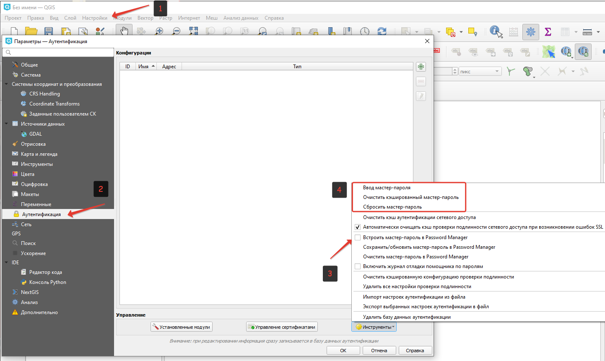
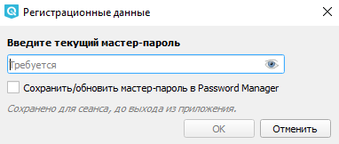
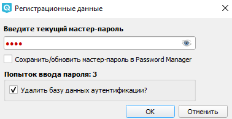
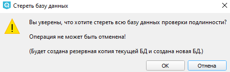

.. sectionauthor:: Роман Гайнуллов <roman.gainullov@nextgis.com>

Мастер-пароль
=============

Для хранения или доступа к информации в базе данных пользователь должен определить мастер-пароль,
который запрашивается и проверяется при первоначальном сохранении любых зашифрованных данных в БД.
Мастер-пароль кэшируется на один рабочий сеанс (пока приложение не будет закрыто),
если пользователь вручную не выберет действие для очистки его кэшированного значения.

.. _ngq_master_pass_settings:

Настройки
----------

.. note::

   Настройка мастер-пароля рассмотрена при **выключенной** опции ``Встроить мастер-пароль в Password Manager``

   Настройки аутентификации. Мастер-пароль

В меню «Параметры» (``Настройки ‣ Параметры``) на вкладке «Аутентификация» есть несколько служебных функций для управления базой данных аутентификации: 

* **Ввод мастер-пароля** — открывает диалоговое окно ввода мастер-пароля
* **Очистить кэшированный мастер-пароль**: отменяет основной пароль, если он был установлен в диалоговом окне ввода. 
* **Сбросить мастер-пароль** —заменяет текущий мастер-пароль на новый. Текущий мастер-пароль потребуется перед сбросом, и можно сделать резервную копию базы данных.
* **Удалить базу данных аутентификации** — выполняет  резервное копирование текущей базы данных и полное перестроение структуры таблицы базы данных. Эти действия планируются на более позднее время, чтобы другие операции, такие как загрузка проекта, не прерывали операцию и не вызывали ошибок из-за временного отсутствия базы данных

   Окно ввода мастер-пароля

.. _ngq_master_pass_forgot:

Забыл мастер-пароль. Что делать?
--------------------------------

В данном случае придется стереть всю базу данных аутентификации. Это можно сделать двумя способами:

* Непосредственно с помощью функции ``Удалить базу данных аутентификации``
* Ввести трижды неверный пароль в окне при его запросе. Тогда будет также предложено удалить всю БД.

   Удаление БД после трех попыток неудачных ввода мастер-пароля
   

   Предупреждение об удалении базы данных аутентификации

После этого можно установить новый мастер-пароль.

