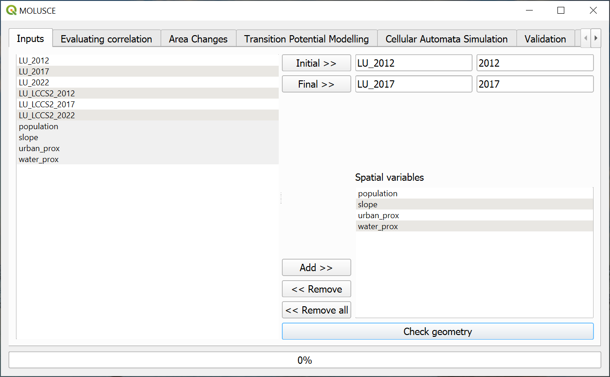
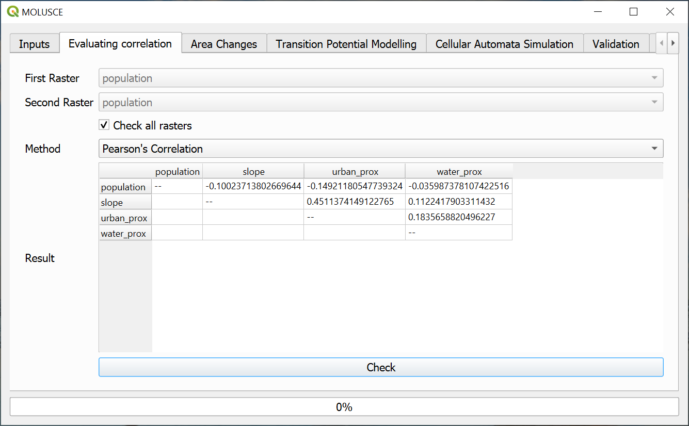
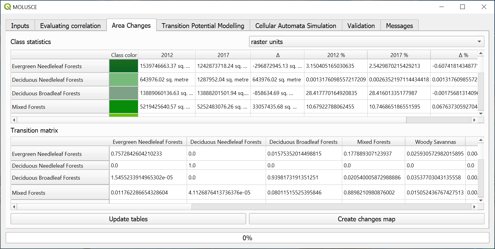
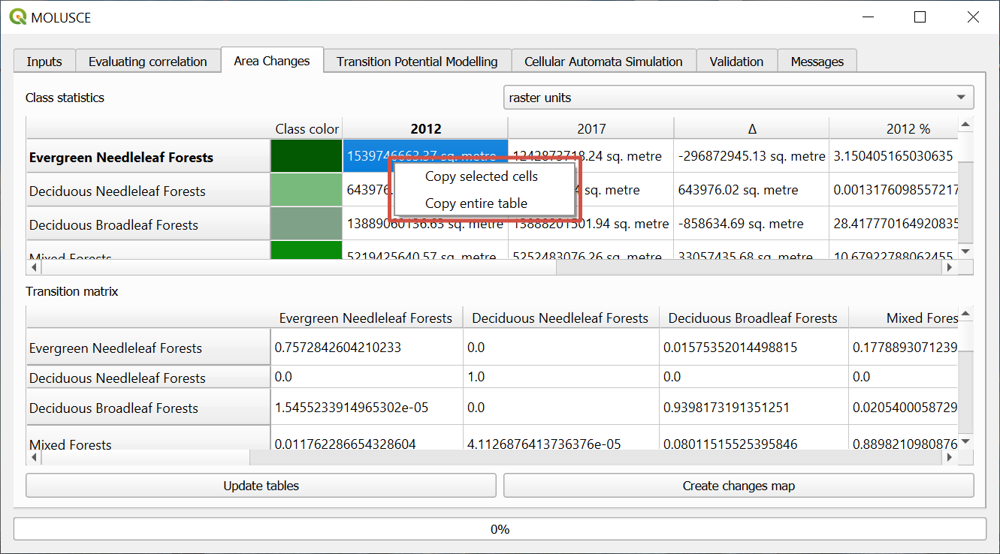
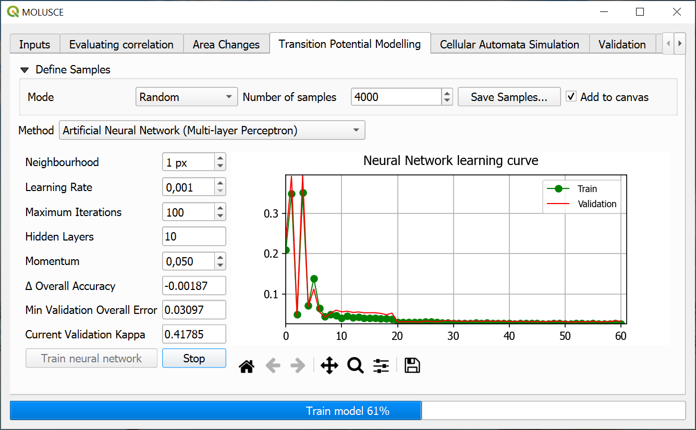
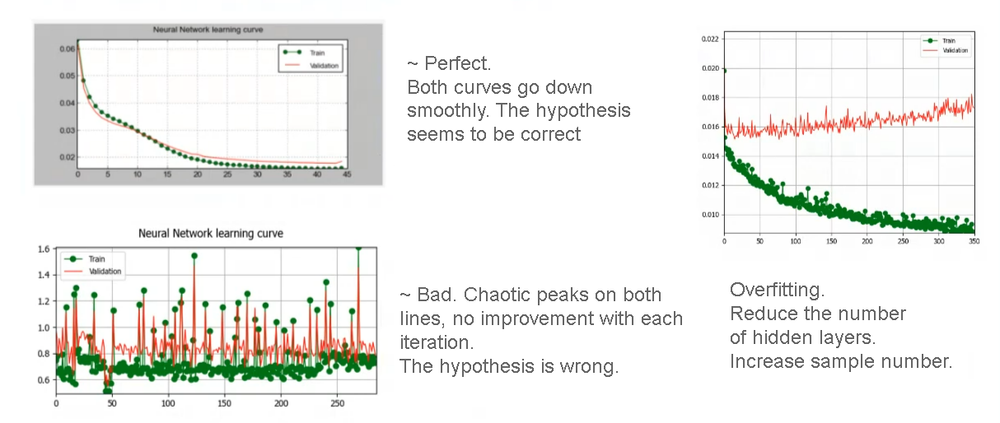
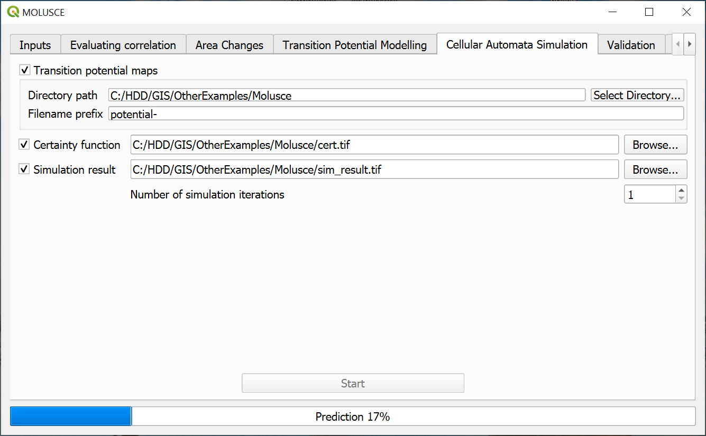
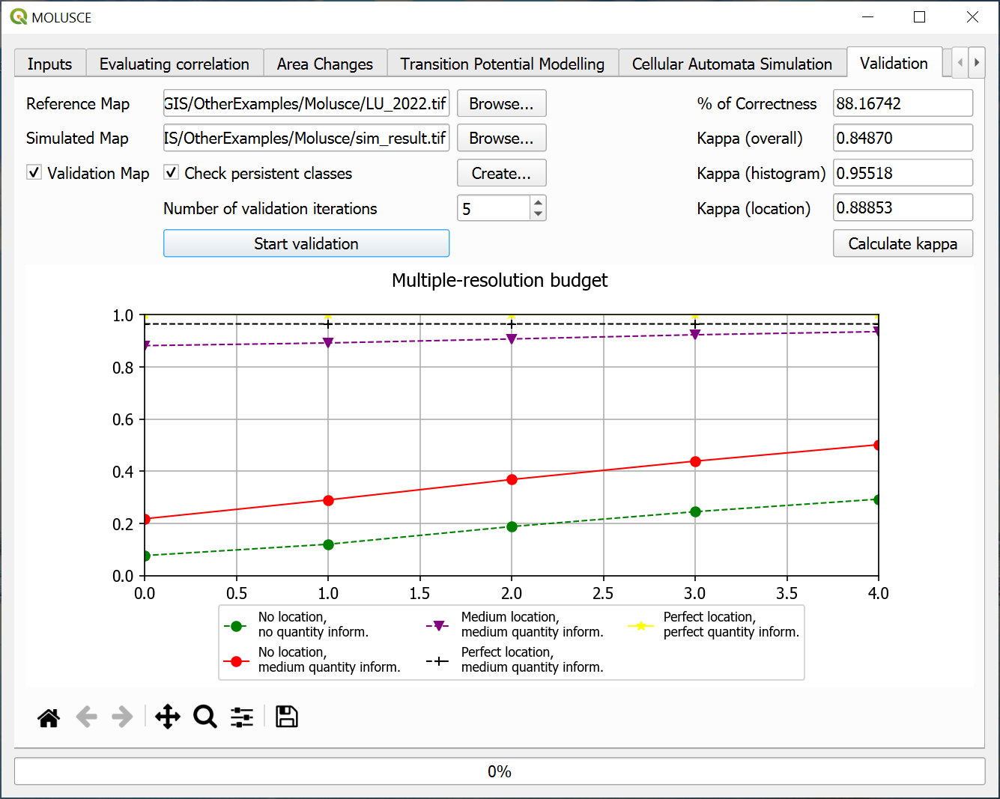

.. sectionauthor:: Юлия Григоренко <grigorenko.j@gmail.com>

.. _molusce:

MOLUSCE 4.0 documentation
=========================

MOLUSCE (Modules for Land Use Change Evaluation) is a plugin for QGIS designed to analyse land use and forest cover changes between different time periods, model land use/cover transition potential and simulate future land use and cover changes. The plugin incorporates several well-known algorithms, including Artificial Neural Networks. 

MOLUSCE is available for download in the QGIS plugin manager. After installation the plugin is added to the Raster menu.

.. _molusce_prepare:

How to prepare input data
----------------------------------------------

Input data used by the plugin:

Initial and final land use/cover maps. These are raster images where pixel values correspond to codes of land use/cover (e.g. 1=forest, 2=cropland, 3=urban etc). 

Minimum:

1. Initial state map (initial_date)
2. final step map (initial_date+N) 
3. validation map (initial_date+2N). It is recommended to use a third map to validate the simulated forecast.

N stands for Forecast depth, i.e. the time between land states, measured in days, weeks, years etc depending on the task at hand.

Maps of spacial variables that affect the land use. The researcher hypothesizes what factors may have influenced the observed changes and inputs intensity maps of these factors. For example, if a researcher is working on the problem of forest extinction, such factors might be: soil types (each soil type is coded with a number), distances from roads (the pixels of the map contain a number - the shortest distance from the point associated with that pixel to the road), population density, etc.

All input rasters must have the same:

* resolution
* extent
* size in pixels

We recommend creating a raster attribute table from current symbology for each of the layers. This way you can view class names using Identify tool.
Also we recommend setting the style to Paletted/Unique values. Each class will be marked on the map by an individual color.

.. _molusce_learn:

Loading data and model training
---------------------------------------------------------

Plugin has several tabs that are used one after the other.

Inputs
^^^^^^^^^^^^^^

On the left there is a list of all raster layers in the project. From that list select the initial state map and final state map. Then add spacial variables in the bottom right part of the tab. Press **Check geometry**. After a successful geometry check other tabs become available.

   Uploading input data

Evaluating correlation
^^^^^^^^^^^^

In this tab you can, if necessary, calculate the extent to which the influence factors are related to each other. If the correlation between two factors is strong, it may be sufficient to use just one of them.
For continuous variables, you can calculate the Pearson's correlation, and for nominal variables, the Cramer coefficient or JIU (joint information uncertainty). Select two factors from dropdown menu or check the option "Check all rasters".

   Calculating correlations

Area changes
^^^^^^^^^^^^^^^^^^^^^

On the "Area changes" tab press **Update tables**.

Two tables will be created: "Class statistics" and "Transition matrix" (shows the proportions of pixels changing from one land use/cover to another). This information can be used on its own for certain tasks.

Next press **Create change map** button and select a path and a name for the new raster.
Each transition class will be marked on the map by a specific color. We recommend creating a raster attribute table for that layer too.

   Area change tables

If you want to save the tables, left-click on any cell to activate context menu and copy selected cells or the entire table with row and column titles.

   Table context menu

Transition potential modelling
^^^^^^^^^^^^^^^^^^^^^^^^^^^^^^^^^^^^^^^^^^^^^^^^^^^^^^^^^^^^^^^^^^^

Four methods are available:

* Artificial Neural Network (ANN),
* Weights of Evidence (WoE) 
* Multi Criteria Evaluation (MCE),
* Logistic Regression (LR)

   Training neural network

First, configure the following parameters of the sampling:

**Sampling mode:**

* all - uses all the pixels and takes a lot of time;
* random - most common, fast method, but may overlook some transition types;
* stratified - useful in ensuring that every subgroup is adequately represented in the sample.

You can also configure the **number of samples**. It affects both the accuracy of the model and the speed of learning.

Next, customize the ANN modelling:

* Neighbourhood defines the count of neighbour pixels around current pixel (usually 1 or 0 values are used);
* Learning rate (lower values make for a more careful model);
* Max iterations number - number of learning cycles. If the value is too high, it might result in overfitting;
* Hidden layers - defines the complexity of the model.

Press **Train neural network**. On the graph you'll see the learning curve and the error curve. If you notice that the training is not going well, you can press **Stop** and modify the parameters.

If training is successful, both curves go down smoothly and the Current Validation Kappa is about 0.8 or above.

   Typical learning curves

After training the model you can save the samples as a separate layer. This allows to check if all types of transition have been sampled for training.

.. _molusce_simulate:

Cellular Automata Simulation
----------------------------------------------------------

After the model is trained it can be used to create a forecast.

In the "Cellular Automata Simulation" tab set up the number of simulation iterations, i.e. number of time periods for which the forecast is made (1 by default), and a path for the created files. To begin simulation press **Start**.

Besides the simulated land use/cover map you can also generate:

* Transition potential map shows the probability or potential to change from one land use/cover class to another. Values range from 0 (low potential) to 100 (high transition potential).
* Certainty function shows the degree of forecast certainty. Values range from 0 (low certainty) to 100 (hight certainty). Low certainty likely means that a particular type of transition was not sampled.

   Simulation settings

.. _molusce_validate:

Validation
-----------------------------------

Validation can be performed if you have a reference map with actual data for the period. 
Also on this tab you can calculate kappa.

A map of errors can be created. It contains three types of pixels: 

* Persistent (class of the pixel has not changed since initial date and the forecast was accurate about it)
* Empty (correct prediction)
* Error (prediction does not match real data)

