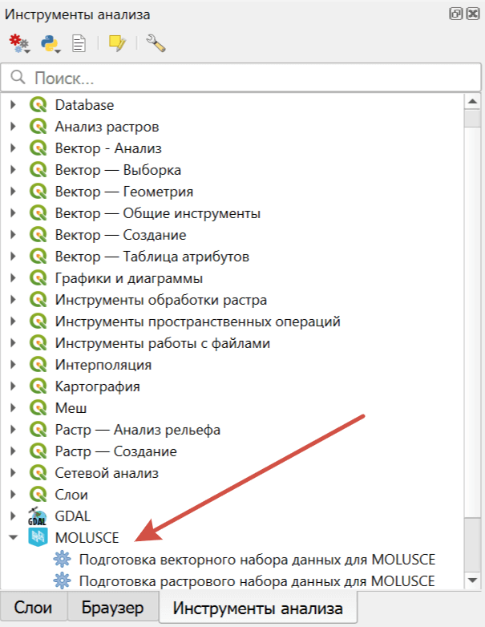
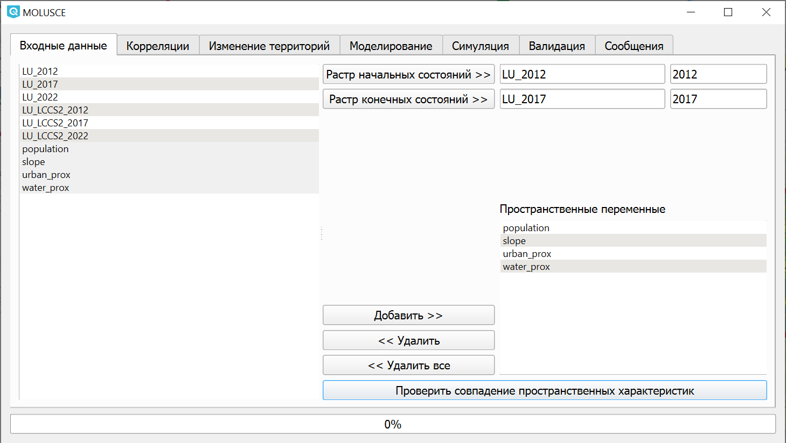
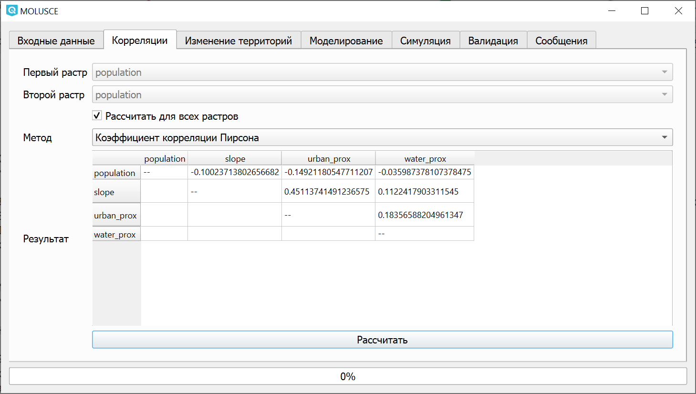
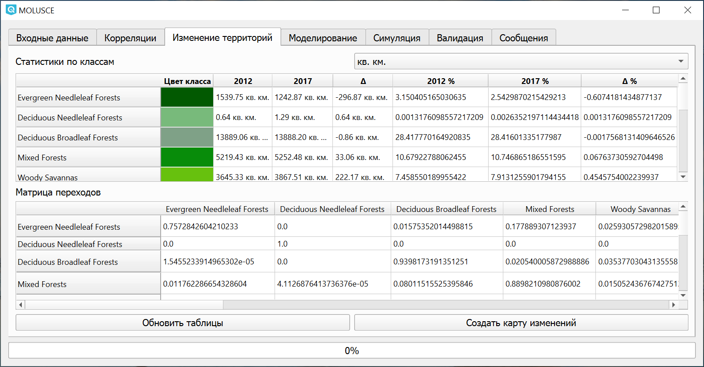
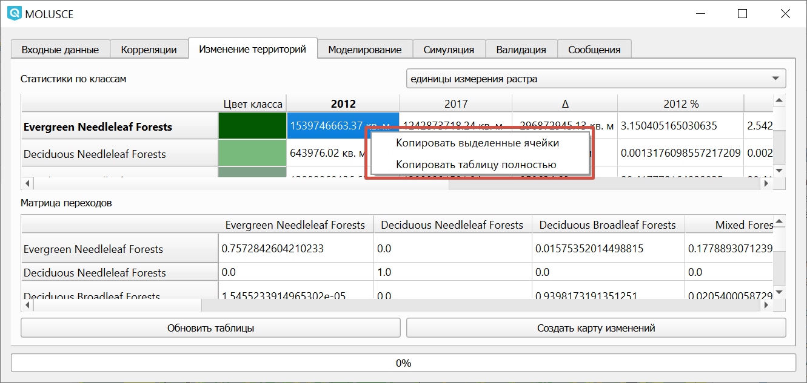
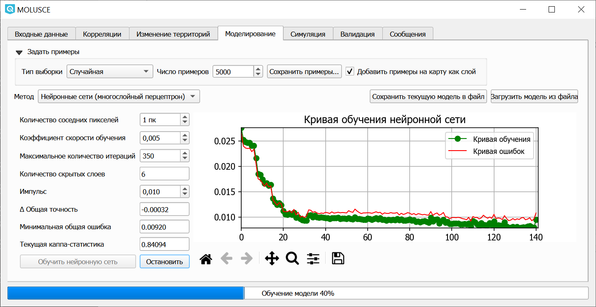
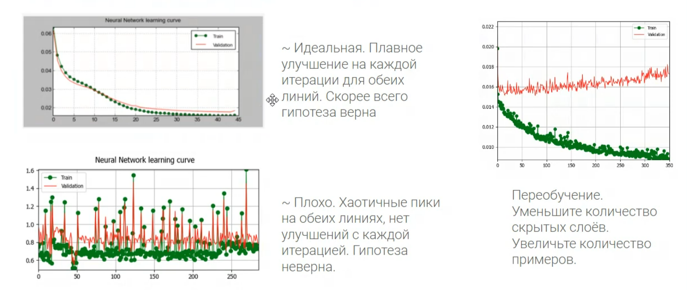
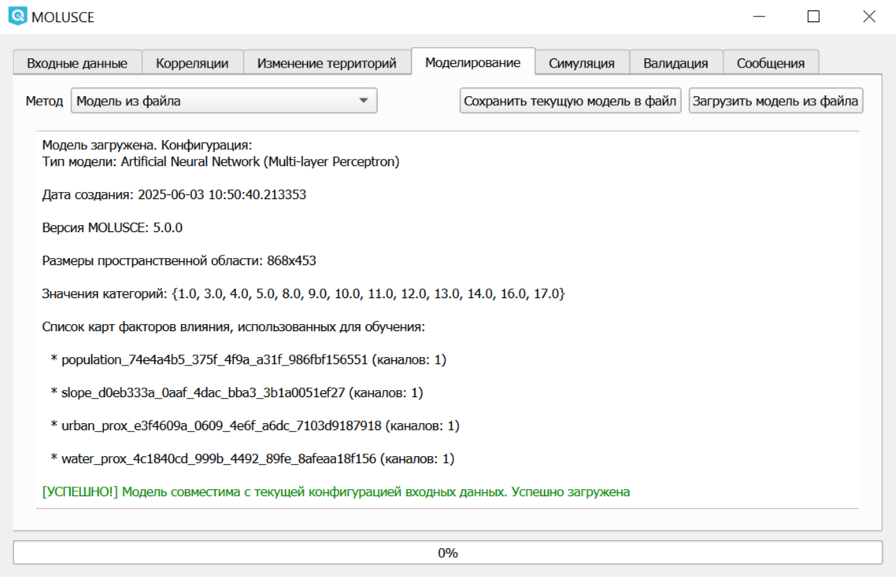
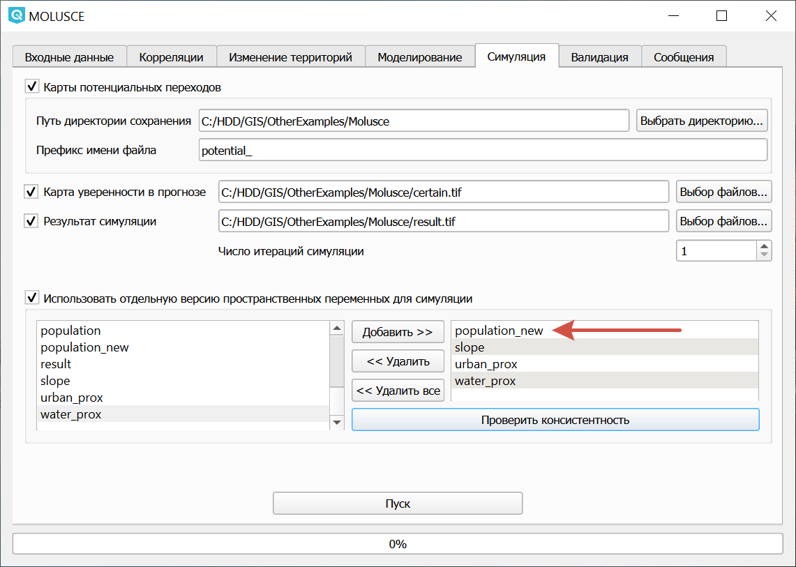
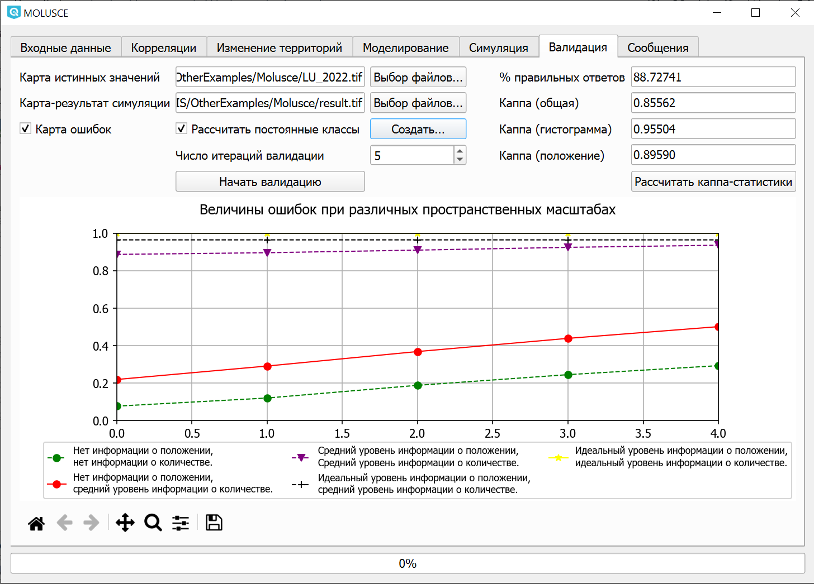

.. _molusce:

MOLUSCE
========

.. note:: Модуль поддерживает Qt6

MOLUSCE, акроним от Modules for Land Use Change Simulations, представляет собой расширение (plug-in) для геоинформационной системы QGIS, предназначенное для анализа динамики состояния территорий двух временных срезов и прогноза развития территорий. В работе модуля могут задействоваться несколько алгоритмов, в том числе на основе нейросетей. 

Расширение доступно для установки из менеджера плагинов QGIS. После установки появляется в меню "Растр".

.. _molusce_prepare:

Подготовка исходных данных
----------------------------------------------

В качестве входных данных расширению требутся:

Карты начальных и конечных состояний территории. Это растровые изображения, в пикселях которых закодированы номера состояний территории (например, 1=лес, 2=поле, 3=городская застройка и т.п.). 

Минимум:

1. карта исходного состояния (Начальная_дата),
2. карта конечного состояния (Начальная_дата+N). 
3. карта для валидации (Начальная_дата + 2N). Для оценки качества построенной модели прогноза рекомендуется использование еще третьей карты, с которой будет сравниваться прогнозное значение.

N - глубина прогноза, которая измеряется в зависимости от задачи в днях, неделях, месяцах, годах и т.д.

Карты факторов, влияющих на изменение территории. Исследователь строит гипотезы о том, какие факторы могли повлиять на наблюдаемые изменения, и предоставляет расширению карты интенсивностей данных факторов. Например, если исследователь работает над проблемой изчезновения лесов, такими факторами могут быть: карта почв (каждый тип почвы закодирован своим числом), карта расстояний от дорог (пиксели карты содержат число -- кратчайшее расстояние от точки, связанной с данным пикселем, до дороги), карта плотности населения и т.п.

Если есть данные об изменении этих факторов, можно добавить в проект две версии каждого слоя, отражающие состояние факторов в разный период: для обучения модели и для симуляции.

У всех входных растров должны совпадать:

* разрешение
* охват
* размер в пикселях

Рекомендуем создать для растров таблицу атрибутов из текущей символики. Это даст возможность видеть название классов при идентификации пикселей.
Также рекомендуем в настройках стиля выбрать "Палитра - уникальные значения", когда каждый класс будет отмечен на карте соответствующим цветом.

Привести исходные слои в соответствие можно при помощи инструментов, доступных в панели |processing| Инструменты анализа:

.. |processing| image:: _static/processingAlgorithm.png
   :width: 6mm
   :alt: синяя шестерёнка

* Подготовка векторного набора данных для MOLUSCE
* Подготовка растрового набора данных для MOLUSCE

   Инструменты подготовки данных для MOLUSCE

Для начала выберите опорный слой, охват и другие параметры которого будут взяты за образец.

.. _molusce_prepare_raster:

Подготовка растрового набора данных
~~~~~~~~~~~~~~~~~~~~~~~~~~~~~~~~~~~~

Необходимо указать:

* Подготавливаемый растровый слой - выберите слой, который хотите привести в соответствие с опорным;
* Опорный растровый слой - слой с необходимым охватом и параметрами;
* Алгоритм ресэмплинга (`подробнее об алгоритмах передискретизации <https://docs.nextgis.ru/docs_ngqgis/source/transformations.html#transform-resample>`_ и выборе подходящего в зависимости от типа растра).

Дополнительно можно задать значение NoData для выходного растра. Оставьте это поле пустым, чтобы скопировать из входного растра.

.. _molusce_prepare_vector:

Подготовка векторного набора данных для MOLUSCE
~~~~~~~~~~~~~~~~~~~~~~~~~~~~~~~~~~~~~~~~~~~~~~~

* Обрабатываемый векторный слой - выберите слой, который хотите привести в соответствие с опорным;
* Опорный растровый слой - слой с необходимым охватом и параметрами;
* Режим обработки: присутствие (растеризация объектов) или близость (градиент расстояния до объектов);
* Числовое поле для значений растра - только для режима "Присутствие", если оставить пустым, для каждого объекта запишется значение 1;
* Размер буферной зоны в единицах карты - если буфер не требуется, оставьте пустым;
* Единицы измерения близости - только для режима "Близость", геопространственные единицы или пиксели.

.. _molusce_learn:

Загрузка данных и обучение модели
-----------------------------------

Интерфейс модуля содержит несколько вкладок, которые используются последовательно.

.. _molusce_learn_input:

Входные данные
~~~~~~~~~~~~~~

Слева списком представлены все растровые слои. Из них нужно выбрать растр начальных состояний и растр конечных состояний. Ниже задать пространственные переменные. Затем нажмите **Проверить совпадение пространственных характеристик**. После успешной проверки станут доступными остальные вкладки.

   Загрузка выходных данных

.. _molusce_learn_corr:

Корреляции
~~~~~~~~~~~~

В этой вкладке можно при необходимости рассчитать насколько исследуемые факторы влияния связаны между собой. Если корреляция между двумя факторами высокая, может быть достаточно использовать один из них.
Для непрерывных величин пользователь может рассчитать коэффициент корреляции, а для номинальных -- коэффициент Крамера или коэффициент JIU (joint information uncertainty).

Выберите два фактора в выпадающих меню или отметьте "Рассчитать для всех растров".

   Расчет корреляции

.. _molusce_learn_change:

Изменение территорий
~~~~~~~~~~~~~~~~~~~~~

На вкладке "Изменение территорий" нажмите **Обновить таблицы**.

Будет создано несколько таблиц: "Статистика по классам", "Матрица переходов" (показывает, из каких классов в какие были трансформации и сколько). Эта информация уже быть использована сама по себе для решения ряда задач.

Далее нажмите **Создать карту изменений** и задайте путь и имя для создаваемого растра.
Каждый тип изменения на карте будет помечен определенным цветом. Рекомендуется для этого слоя также создать таблицу атрибутов растра.

   Таблицы изменений

Полученные таблицы можно сохранить отдельно. Вызовите контекстное меню с любой ячейки таблицы и скопируйте выделенные ячейки или таблицу целиком с заголовками строк и столбцов.

   Копирование таблицы

.. _molusce_learn_model:

Моделирование: Обучение модели для предсказания будущих изменений
~~~~~~~~~~~~~~~~~~~~~~~~~~~~~~~~~~~~~~~~~~~~~~~~~~~~~~~~~~~~~~~~~~~

Доступны четыре типа модели:

* Нейронные сети (многослойный перцептрон) - используется чаще всего
* Значимость признака
* Многокритериальная оценка
* Логистическая регрессия

   Обучение модели

Далее настраивается выборка, которая будет использоваться для обучения модели.

**Тип выборки:**

* полная - все доступные данные, занимает много времени;
* случайная  - используется чаще всего, работает гораздо быстрее, но может не включать примеры каких-то типов переходов;
* стратифицированная - стремится равномерно охватить все сценарии перехода.

Также можно настроить **количество примеров**, входящих в выборку, это влияет как на точность модели, так и на скорость обучения.

Параметры обучения модели:

* Количество соседних пикселей, которые учитываются при анализе (обычно используется значение 1 или 0)
* Коэффициент скорости обучения (чем меньше значение, тем модель осторожнее)
* Максимальное количество итераций - количество циклов обучения. Слишком высокое значение может привести к переобучению модели.
* Количество скрытых слоёв - уровень сложности модели.

Нажмите **Обучить нейросеть**. На графике будут отображаться кривая обучения и кривая ошибок. Если в процессе видно, что обучение идёт плохо, можно нажать **Остановить** и изменить параметры.

При успешном обучении обе кривые плавно идут вниз и параметр "Текущая каппа-статистика" составляет около 0,8 и более.

   Типичный вид кривых обучения

После обучения модели можно сохранить выборку примеров как отдельный слой. Это позволяет проверить, все ли виды переходов были учтены при обучении модели. При нажатии на кнопку **Сохранить выборку** создаётся временный слой, который затем можно экспортировать в нужный формат.

Обученную модель также можно сохранить в файл и затем загрузить и использовать снова, даже после закрытия программы.

При загрузке модели будет проведена проверка совместимости. Модель можно использовать только для растров с теми же характеристиками и при том же порядке факторов.

   Модель загружена из файла

.. _molusce_simulate:

Симуляция состояния территории на заданное время вперёд
----------------------------------------------------------

После обучения можно применить модель для построения прогноза.

На вкладке "Симуляция" необходимо задать количество итераций симуляции, т.е. количество периодов, на которые строится прогноз (по умолчанию это значение равно 1) и путь для создаваемых файлов.

Для симуляции можно учесть изменившиеся пространственные факторы. Растровые слои со значениями пемеренных для периода симуляции должны быть добавлены в проект.

Отметьте пункт "Использовать отдельную версию пространственных переменных для симуляции" и выберите из списка слоёв нужные в том же порядке, что на вкладке "Входные данные", только вместо слоя, использовавшегося при обучении модели, добавьте его новый вариант. Чтобы убедиться, что порядок и размерные характеристики слоёв совпадают, нажмите **Проверить консистентность**.

Для запуска симуляции нажмите **Пуск**.

   Настройки симуляции, стрелочкой показан фактор, актуальный для периода симуляции

Помимо собственно результата симуляции также можно сгенерировать:

* Карту потенциальных переходов (для каждого из переходов создается растр со значениями от 0 до 100%, показывающими степень вероятности такого перехода в указанный период)
* Карту уверенности в прогнозе (значения от 0 до 100%, где 0 - низкая уверенность, скорее всего это переходы, которые не попали в выборку для обучения модели)

.. _molusce_validate:

Валидация результатов
-----------------------------------

Валидацию можно провести, если есть карта истинных значений для периода, на который был построен прогноз. 
Также на этой вкладке можно расчитать каппа-статистику.

При валидации можно создать карту ошибок. Она содержит три типа пикселей: 

* Постоянный (класс пикселя не изменился за всю его жизнь, и прогноз это предсказал)
* Пустой (правильные предсказания модели)
* Ошибка (прогноз не совпал с истинным значением)

Посмотрите запись нашего `вебинара <https://events.nextgis.ru/event/24303>`_ о работе плагина на `youtube <https://youtu.be/ipmoB7UzpLo>`_, `rutube <https://rutube.ru/video/3890f2274335fd408fbab5ae9a04c780/>`_.
