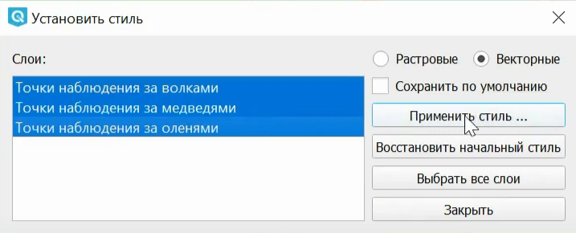

MultiQML
============

Модуль MultiQML для QGIS – это быстрый способ присвоить единый стиль группе векторных или растровых слоёв.

После установки модуль появится на панели инструментов в панели подключаемых подулей: |button_multiqml|.

В окне модуля вам нужно:

* выбрать тип данных – растровые или векторные;
* выбрать из списка слои, которым нужно задать единый стиль;
* загрузить QML-файл стиля.

   Окно модуля MultiQML

Вы можете сохранить новый стиль для этих слоёв, заменив им старые, прямо из окна модуля. Для этого поставьте галочку в пункте "Сохранить по умолчанию". Появится окно с сообщением "Включение приведет к перезаписи существующих файлов QML". Нажмите **Да**.
