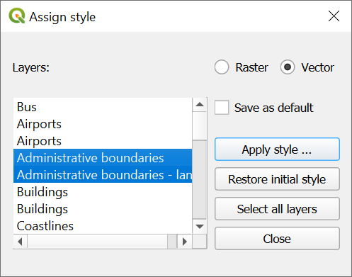

MultiQML
============

MultiQML plugin for QGIS provides a fast way to apply one style to multiple vector or raster layers.

After installation the plugin will appear in the Plugins toolbar: |button_multiqml|.

In the plugin dialog:

* select data type - raster or vector;
* from the list on the left select layers to which you want to apply a common style;
* upload QML file of the style.

   MultiQML dialog

You can save a new style for the layers and replace the existing styles directly from the plugin window. To do that, tick "Save as default". A message will pop up: "Enabling this option will cause overwriting of any existing QML files. Are you sure?" Press **Yes**.

See the plugin at work in our video:

.. raw:: html

   <iframe width="560" height="315" src="https://www.youtube.com/embed/jtEl1ToyGC0?si=0WU-tbHKY51RCRw1" title="YouTube video player" frameborder="0" allow="accelerometer; autoplay; clipboard-write; encrypted-media; gyroscope; picture-in-picture; web-share" referrerpolicy="strict-origin-when-cross-origin" allowfullscreen></iframe>

Watch on `youtube <https://youtu.be/jtEl1ToyGC0?si=_5i2SyniizDtCxOL>`_.
