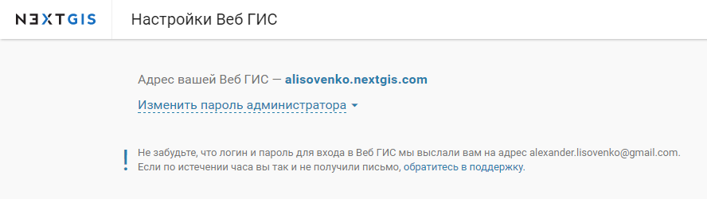
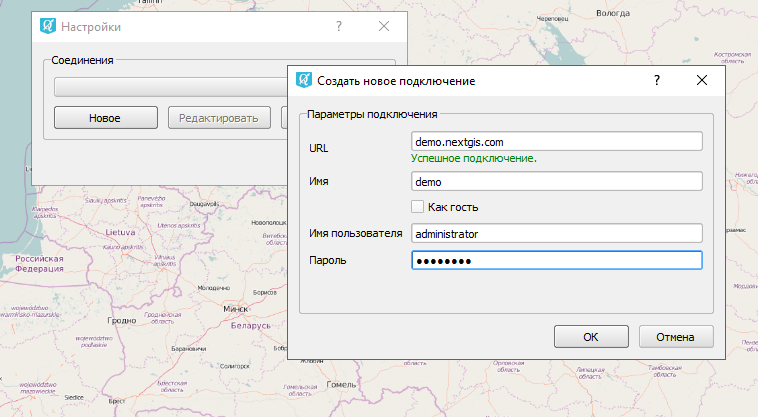

.. sectionauthor:: Дмитрий Барышников <dmitry.baryshnikov@nextgis.ru>

.. _ng_connect:
    
NextGIS Connect
===============

С помощью данного модуля расширения пользователь QGIS получает возможность обмениваться ресурсами с Веб ГИС или NextGIS Web (далее будет использоваться только термин "Веб ГИС") непосредственно из интерфейса QGIS:

1. переносить слои из QGIS в Веб ГИС;
2. переносить QGIS проекты в Веб ГИС целиком;
3. переносить слои из Веб ГИС в QGIS.

После установки модуля на панели инструментов появится иконка: 

.. figure:: _static/nextgis_connect/logo.png
   :align: center
   :alt: Иконка модуля расширения NextGIS Connect.

При нажатии на иконку появится панель управления ресурсами Веб ГИС.

.. figure:: _static/nextgis_connect/panel.png
   :align: center
   :alt: Панель модуля расширения NextGIS Connect

Если на данный момент не настроено ни одно подключение, вы увидите сообщение с предложением создать свою Веб ГИС.

.. figure:: _static/nextgis_connect/panel-no-connections.png
   :align: center
   :alt: Панель модуля расширения NextGIS Connect при отсутствии подключения

**Создание подключения**

Для создания подключения вам необходимо знать адрес интересующей вас Веб ГИС.
Например, если вы создали свою Веб ГИС, ее адрес вы можете узнать на странице:
https://my.nextgis.com/webgis

Нажмите кнопку "Настройки" на панели модуля расширения NextGIS Connect.

.. figure:: _static/nextgis_connect/call_settings.png
   :align: center
   :alt: Вызов диалога настроек

В открывшемся окне нажмите кнопку "Новое" и заполните поля:

1. URL - адрес интересующей вас Веб ГИС
2. Имя - идентификатор подключения для быстрого поиска в списке подключений

Снимите галку "Как гость" и заполните поля "Имя пользователя" и "Пароль",
если вам необходимо выполнять действия, на которые требуется специальное разрешение,
которым не обладает неавторизованный пользователь (Гость).

Например, для того чтобы получить возможность создавать/удалять ресурсы, 
обычно эти действия недоступны неавторизованным пользователям. 

Нажмите кнопку "ОК". В выпадающем списке диалога "Настройки" выбираете подключение, которое станет активным 
после закрытия диалога.

**Доступные операции**

*Добавить в QGIS*

.. figure:: _static/nextgis_connect/add_to_qgis.png
   :align: center
   :alt: Добавить в QGIS

Операция доступна, если в дереве ресурсов NextGIS выбран один из следующих видов ресурсов:

- Векторный слой (NGW Vector Layer) |resource_vector| - в QGIS будет создан векторный слой GeoJSON.
- WFS Сервис (NGW WFS Service) |resource_wfs| - в QGIS будет создан WFS слой, источником данных для которого будет выбранный WFS Сервис.

.. |resource_vector| image:: _static/nextgis_connect/resource_vector.png

.. |resource_wfs| image:: _static/nextgis_connect/resource_wfs.png

*Добавить в Веб ГИС*

.. figure:: _static/nextgis_connect/add_to_ngw.png
   :align: center
   :alt: Добавтить в Веб ГИС

Операция "Импортировать выбранный слой" доступна, если в панели слоев QGIS выбран один из следующих видов ресурсов:

- Векторный слой - в Веб ГИС будет создан векторный слой и стиль, аналогичный стилю выбранного слоя в QGIS, который можно добавить на веб-карту в Веб ГИС.
- Растровый слой - в Веб ГИС будет создан растровый слой со стилем по умолчанию, который можно добавить на веб-карту в Веб ГИС.

Операция "Импортировать текущий проект" доступна всегда. В Веб ГИС будут добавлены все слои, для которых доступна
операция "Импортировать выбранный слой", и все группы в соответствии с иерархией в панели слоёв QGIS.
Также будет создана веб-карта, на которую будут добавлены все импортируемые слои с учетом иерархии и видимости в панели слоёв QGIS.
При выполнение импорта проекта вам необходимо ввести название новой группы, которая будет создана в Веб ГИС 
для размещения всех ресурсов, импортируемых в рамках данной операции.

Добавление ресурсов в Веб ГИС производится в выбранную на панели ресурсов Веб ГИС группу.

- Если выбрана не группа, а другой тип ресурса - в ближайшую родительскую группу выбранного ресурса.
- Если не выбран ресурс - в корневую группу.

*Создать группу ресурсов в Веб ГИС*

.. figure:: _static/nextgis_connect/create_group.png
   :align: center
   :alt: Создать новую группу ресурсов

Операция доступна всегда. В Веб ГИС будет создана новая группа ресурсов.
Новая группа будет создана в группе ресурсов:

- которая выбрана в дереве ресурсорв Веб ГИС;
- которая является ближайшей родительской группой для выбранного ресурса, если он не является группой ресурсов;
- в основной группе ресурсов, если не выбран ни один ресурс в дереве ресурсорв Веб ГИС.

*Обновить дерево ресурсов*

.. figure:: _static/nextgis_connect/reload.png
   :align: center
   :alt: Обновить дерево ресурсов

Операция обновит все дерево ресурсов.

*Открыть веб-карту в браузере*

.. figure:: _static/nextgis_connect/open_webmap.png
   :align: center
   :alt: Открыть веб-карту в браузере

Операция доступна, если в дереве ресурсов выбран ресурс веб-карта (NGW Web Map) |resource_webmap|. Открывает карту в новой вкладке браузера,
который установлен по-умолчанию.

