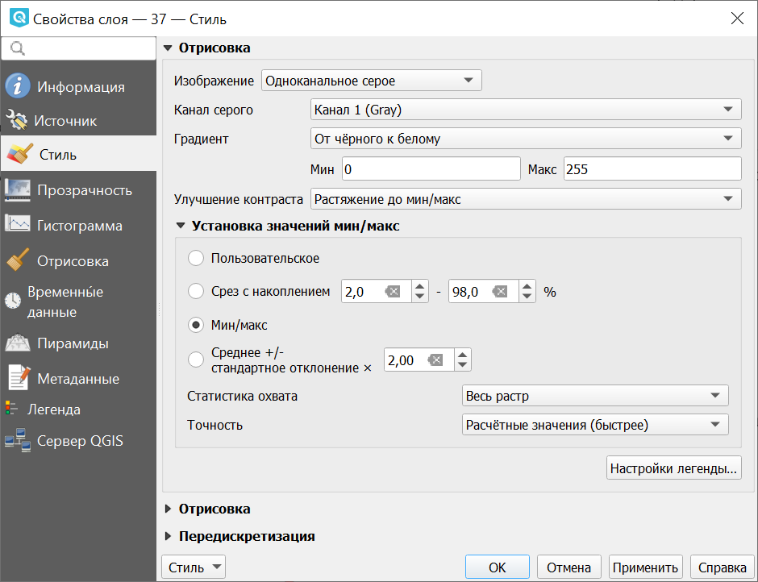
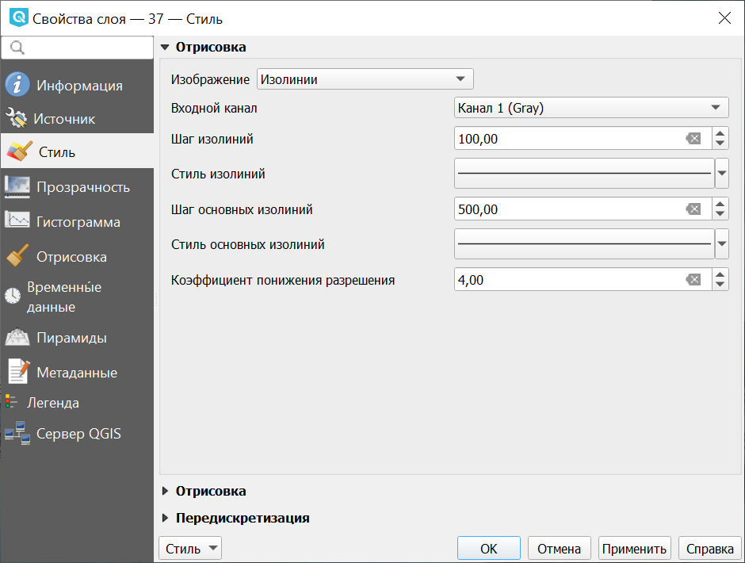

.. sectionauthor:: Дмитрий Барышников <dmitry.baryshnikov@nextgis.ru>
.. sectionauthor:: Артём Светлов <artem.svetlov@nextgis.ru>
.. sectionauthor:: Юлия Григоренко <grigorenko.j@gmail.com>

.. _ngq_raster_styles:

Оформление растровых слоёв
---------------------------------

Для растровых слоёв существует 6 разных способов визуализации.

* Многоканальное цветное
* Палитра - уникальные значения
* Одноканальное серое
* Одноканальное псевдоцветное
* Теневой рельеф
* Изолинии

При всех способах визуализации можно задавать прозрачность, яркость, контрастность 
и тонирование в цвет. 

.. note::
   Настройки оформления различаются для разных форматов. Большее количество 
   настроек оформления существует для формата GeoTIFF, а для слоёв WMS и TMS 
   настроек оформления меньше.

Многоканальное цветное
^^^^^^^^^^^^^^^^^^^

Используйте этот способ оформления, если у вас многоканальный растр, например - 
цветной космоснимок или скан карты в RGB. 

.. figure:: _static/bandrander_multiband_settings_ru.png
   :name: bandrander_multiband_settings_pic
   :align: center
   :width: 20cm
   
   Настройки многоканального оформления растрового слоя

Палитра - уникальные значения
^^^^^^^^^^^^^^^^^^^^^^^^^^^

Картинка рисуется по данным из одного выбранного канала растра. Каждое значение 
растра рисуется отдельно заданным цветом. Этот формат встречается редко. Если вы откроете растр в формате gif, то по умолчанию выставится этот режим.

Одноканальное серое
^^^^^^^^^^^^^^^

Картинка рисуется по данным из одного выбранного канала растра, чёрно-белой.

Рассмотрим настройки растрового стиля на самом простом примере - цифровой модели рельефа. 
Это - GeoTIFF, пикселы которого имеют только одно значение (одноканальный) - высоты в метрах. 
Если бы это была фотография - то пикселы имели бы 3 значения - количества красного, зелёного и 
синего цвета (трёхканальный).

Высота меняется в диапазоне до нескольких тысяч метров. Для хранения значения из такого диапазона 
нужно 16 бит. Если значения изменяются в диапазоне от 0 до 255 - то они укладываются в 8 бит
и формат такого растра называется RGB.

После открытия растрового слоя, в окне настроек растрового стиля, в полях ``Мин`` и ``Макс``
выводятся крайние значения, которые встречаются в пикселах этого растра. Градиент заливки 
распределяется между ними. Если их поменять вручную, то градиент заливки изменится. 
Если нажать "Охват Текущий" и кнопку "Загрузить", то рассчитаются значения ``Мин`` и ``Макс``
для текущего охвата карты. 

Можно выбрать направление градиента - от черного к белому (по умолчанию) или наоборот.

   
   Настройки одноканальной визуализации растра
   
   
Одноканальное псевдоцветное
^^^^^^^^^^^^^^^^^^

Картинка рисуется по данным из одного выбранного канала растра, по цветному градиенту. 
Используйте этот способ оформления, если у вас одноканальный растр, например - цифровая 
модель рельефа (:abbr:`DEM (Digital elevation model)`).

В полях ``Мин`` и ``Макс`` выводятся крайние значения, которые встречаются в пикселах этого растра. 
Градиент заливки распределяется между ними. Если их поменять вручную, то градиент заливки изменится. 
Если нажать "Охват Текущий" и кнопку "Загрузить", то рассчитаются значения ``Мин`` и ``Макс`` 
для текущего охвата карты. 

   
   Настройки псевдоцветного отображения растрового слоя
   
Теневой рельеф
^^^^^^^

Техника, применяемая для визуального отображения рельефа через тени, обозначающие перепады высоты, а не соответствующие абсолютному её значению.

   
   Настройки теневого рельефа
   

Изолинии
^^^^^^^^^^^^

Картинка рисуется по данным из одного выбранного канала растра, например, содержащего данные о высоте рельефа. Точки, имеющие одинаковое значение, объединяются в линию. Можно выбрать стиль изолиний и шаг между ними. 

   
   Настройки изолиний для растрового слоя
   
