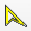
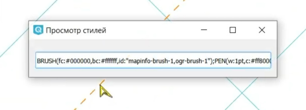

NextGIS OGRStyle
=================

Некоторые форматы, такие как MapInfo TAB или MIF/MID, имеют свои условные обозначения, которые подхватываются QGIS. Но увидеть описание этих стилей в QGIS нигде нельзя.

Модуль NextGIS OGRStyle по одному клику выводит описание внедрённого стиля слоя.

Это описание можно использовать для удобной отладки отображения таких данных в ваших проектах.

После установки модуля он появится в панели подключаемых модулей: |button_ogrstyle|.

Выделите нужный слой в панели своёв QGIS. Кликните на любом объекте слоя. Во всплывающем окне "Просмотр стилей" вы увидите описание стиля в строковой форме.

   Всплывающее окно с описанием стиля
