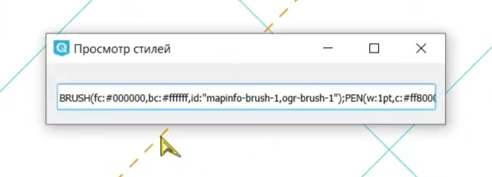

NextGIS OGRStyle
=================

Некоторые форматы, такие как MapInfo TAB или MIF/MID, имеют свои условные обозначения, которые подхватываются QGIS. Но увидеть описание этих стилей в QGIS нигде нельзя.

Модуль NextGIS OGRStyle по одному клику выводит описание внедрённого стиля слоя.

Это описание можно использовать для удобной отладки отображения таких данных в ваших проектах.

После установки модуля он появится в панели подключаемых модулей: |button_ogrstyle|.

.. |button_ogrstyle| image:: _static/button_ogrstyle.png
   :width: 6mm

Выделите нужный слой в панели своёв QGIS. Кликните на любом объекте слоя. Во всплывающем окне "Просмотр стилей" вы увидите описание стиля в строковой форме.

   Всплывающее окно с описанием стиля

Процесс работы с модулем также показан в видео:

.. raw:: html

   <iframe width="560" height="315" src="https://rutube.ru/play/embed/276d03cbabc3a93236ef815f7fcc2f40/" frameBorder="0" allow="clipboard-write; autoplay" webkitAllowFullScreen mozallowfullscreen allowFullScreen></iframe>

Посмотреть видео на `youtube <https://www.youtube.com/watch?v=fmxLAunlmYk>`_, `rutube <https://rutube.ru/video/276d03cbabc3a93236ef815f7fcc2f40/>`_.
