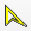
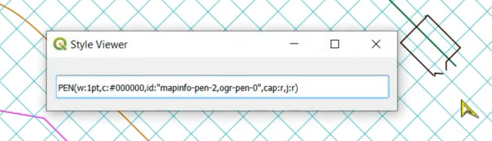

NextGIS OGRStyle
=================

Some formats, such as MapInfo TAB or MIF/MID, have their own symbology that is processed by QGIS. However, it is not possible to view the description of these styles in QGIS.

NextGIS OGRStyle allows to view the description of the embedded style in one click.

This description makes it easier to configure data visualization in your projects.

After installation you'll find the plugin in the Plugins toolbar: |button_ogrstyle|.

Select the layer in the Layers panel of QGIS. Click on any feature of the layer. In the pop-up window "Style viewer" you'll see a string description of the style.

   Pop-up window with style description

See how the plugin works in our video: <>
