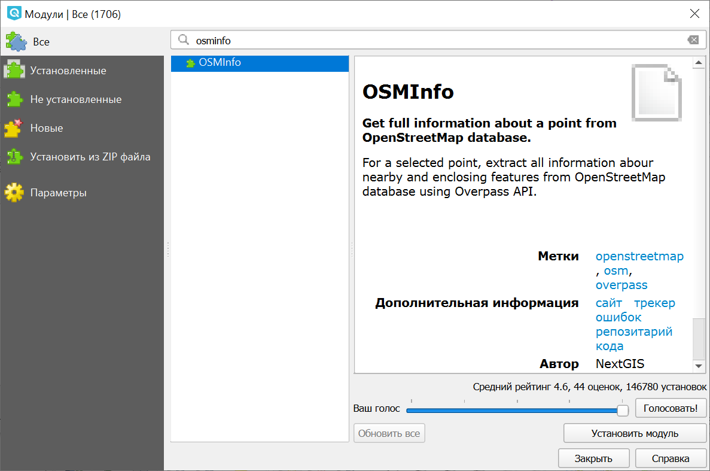
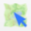
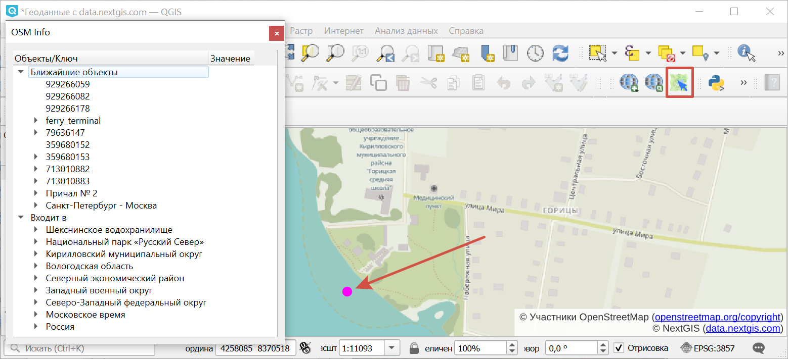
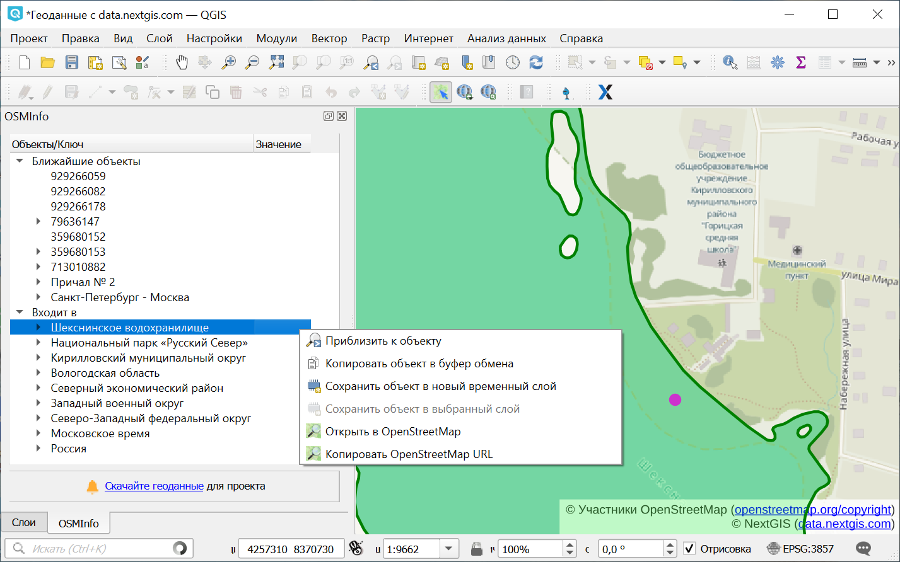
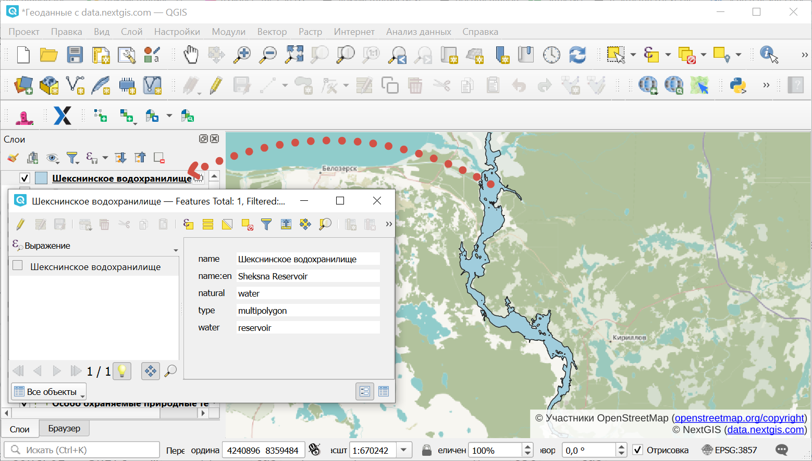
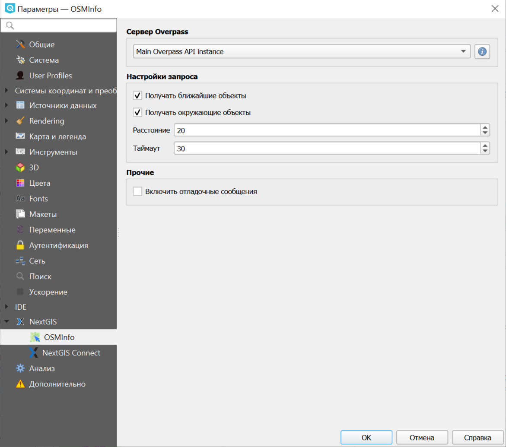

.. sectionauthor:: Юлия Григоренко <grigorenko.j@gmail.com>

.. _osminfo:

OSMInfo
=========================

С помощью модуля для QGIS OSMInfo у вас есть возможность получить всю информацию по любой точке без подгрузки каких бы то ни было дополнительных слоёв.

Это избавляет от необходимости доставать оригинальные данные, чтобы понять, какой номер у этого дома или как называется озеро на космоснимке.

Доступны все объекты из OSM, в том числе:

* АТД и границы;
* ООПТ и водоёмы;
* вся дорожная инфраструктура;
* здания, городская инфраструктура;
* точки интереса.

.. _osminfo_install:

Установка
----------

   
   Установка модуля OSMInfo

На панели инструментов появится кнопка |button_osminfo|. Также модуль доступен через меню "Интернет" в верхней панели.

.. _osminfo_identify:

Идентификация объектов
-----------------------

Активируйте инструмент |button_osminfo| и затем кликните на точке карты, по которой хотите получить информацию.

   
   Информация о точке в окне OSMInfo

Результат запроса складывается в две группы: ближайшие объекты и объекты, в границы которых попадает ваша точка.

Выбранный в списке объект подсвечивается зелёным.

.. _osminfo_context:

Контекстное меню объекта
-------------------------

Любой объект можно сохранить локально.

При клике правой кнопкой мыши по объекту из списка появляется контекстное меню, в котором доступны следующие действия:

* Приблизить - устанавливает охват окна карты по выбранному объекту;
* Сохранить объект в новый временный слой;
* Сохранить объект в выбранный слой;
* Копировать в буфер обмена.

   
   Контекстное меню объекта

При сохранении слоя сохраняется и структура данных.

   
   Значения атрибутов объекта, добавленного в новый временный слой

.. raw:: html

   <iframe width="560" height="315" src="https://rutube.ru/play/embed/5b0a57611a033d523fdd3887e9cf808b/" frameBorder="0" allow="clipboard-write; autoplay" webkitAllowFullScreen mozallowfullscreen allowFullScreen></iframe>

   Добавляем объекты из OSM на веб-карту

Посмотреть видео на `youtube <https://youtu.be/TOXhKjWKs-o>`_, `rutube <https://rutube.ru/video/5b0a57611a033d523fdd3887e9cf808b/>`_.

.. _osminfo_settings:

Настройки модуля
-----------------

Вы можете настроить радиус, в рамках которого осуществляется поиск ближайших объектов, а также отключить ближайшие или охватывающие объекты из результатов поиска. Для этого в Параметрах QGIS зайдите в раздел NextGIS ‣ OSMInfo.

   Настройки модуля

Также в настройках можно выбрать нужный сервер Overpass и включить отладочные сообщения.
