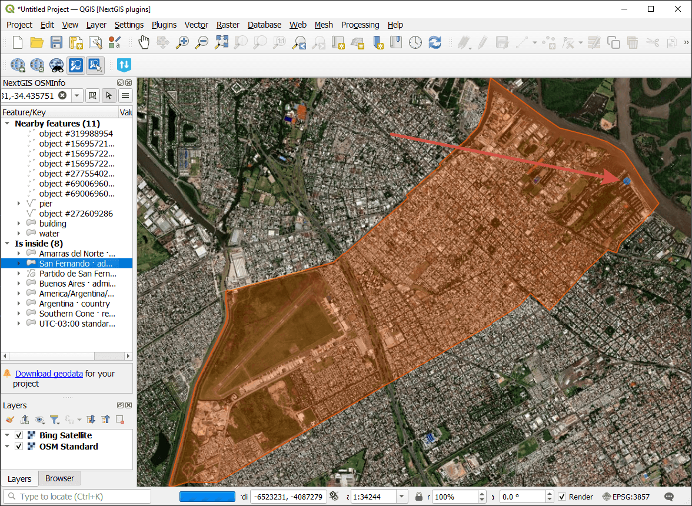
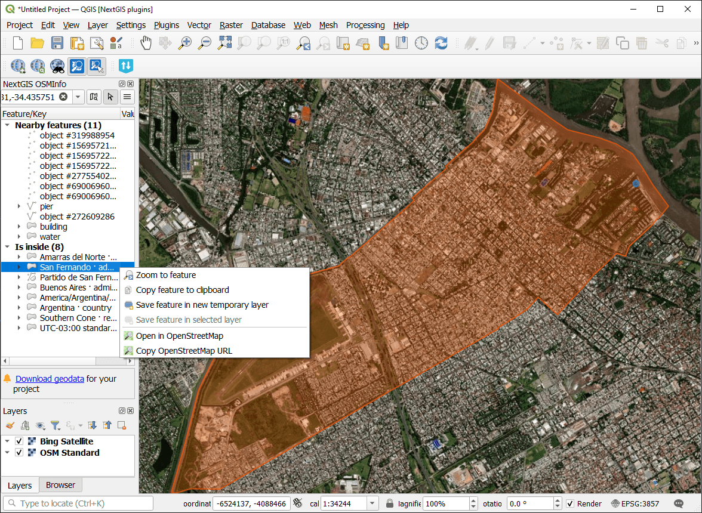
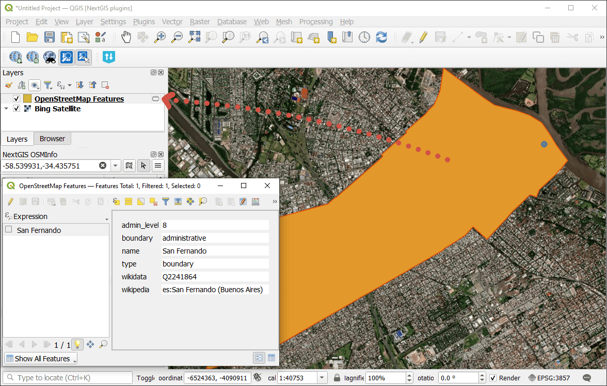
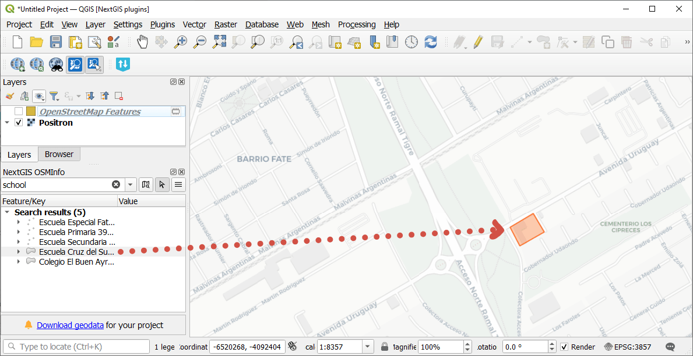
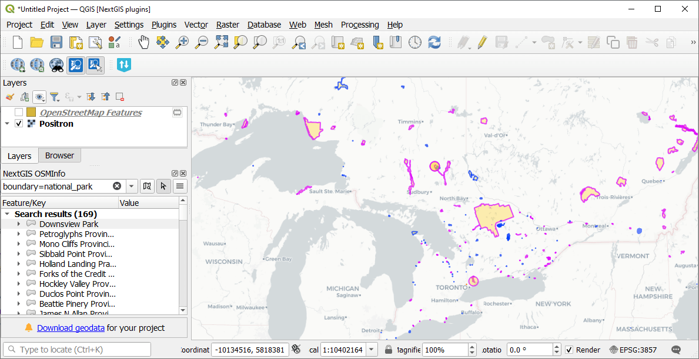
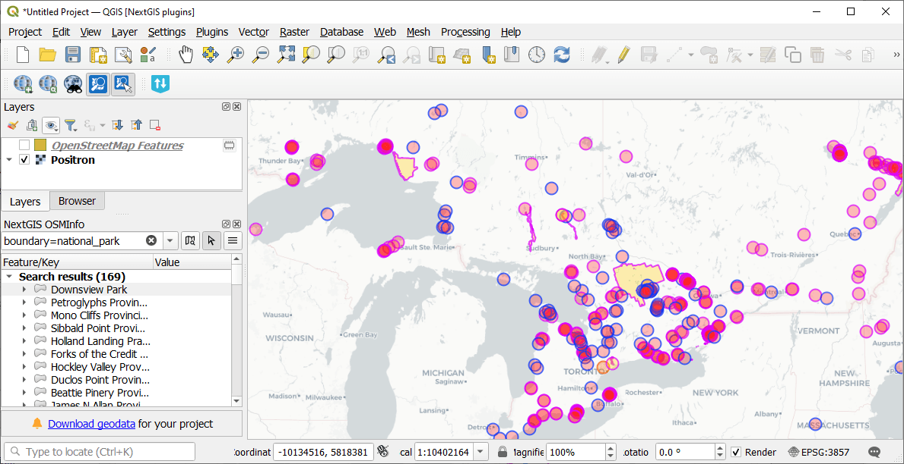
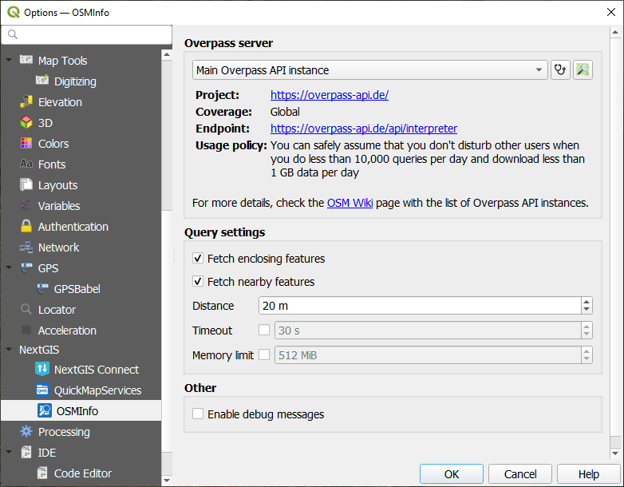

.. _osminfo:

OSMInfo
========

QGIS plugin NextGIS OSMInfo allows you to get all the information for any point without loading any additional layers.

No need to load the original data to check a house number or learn the name of a lake on a satellite image.

All OSM features are available, including:

* administrative boundaries;
* bodies of water and protected areas;
* road infrastructure;
* buildings, city infrastructure;
* points of interest.

When the plugin is installed, its icon appears in the toolbar: 

* |button_osminfo_activate| - show/hide OSMInfo panel
* |button_osminfo_ident| - identify OpenStreetMap feature

Also the plugin is available in the Internet menu of the Menu bar.

.. |button_osminfo_activate| image:: _static/button_osminfo_activate.png
   :width: 8mm

.. |button_osminfo_ident| image:: _static/button_osminfo_ident.png
   :width: 8mm

.. _osminfo_identify:

Feature identification
-----------------------

Activate |button_osminfo_ident| tool and click on your point of interest on the map.

   
   Point information in OSMInfo window

Results are divided into two groups: 

* nearby features;
* enclosing features.

The feature selected in the panel is highlighted in orange.

.. _osminfo_context:

Feature context menu
-------------------------

Any feature can be saved to your device.

Right-click the feature in the search result list to open the context menu. From the context menu you can:

* Zoom to feature - sets the extent of the map by the selected feature;
* Copy to clipboard;
* Save feature in new temporary layer;
* Save feature in selected layer;
* Open in OpenStreetMap;
* Copy OpenStreetMap URL.

   
   Feature context menu

Saved feature keeps its data structure.

   
   Attribute values of the feature saved to a new temporary layer

See how to add a feature from OSM to a Web Map in our video:

.. raw:: html

   <iframe width="560" height="315" src="https://www.youtube.com/embed/uEzXfHyPjX4?si=1fgCNcyLfE8MQWRF" title="YouTube video player" frameborder="0" allow="accelerometer; autoplay; clipboard-write; encrypted-media; gyroscope; picture-in-picture; web-share" referrerpolicy="strict-origin-when-cross-origin" allowfullscreen></iframe>

Watch on `youtube <https://youtu.be/uEzXfHyPjX4?si=uZD1Y-4rpWv9a4Z1>`_.

.. _search:

Search OpenStreetMap features
-----------------------------

You can also search for features in OpenStreetMap database using NextGIS OSMInfo plugin. In the plugin panel activate |button_osminfo_search| search mode.

.. |button_osminfo_search| image:: _static/button_osminfo_search.png
   :width: 6mm

Enter feature ID, name or other query, then select a feature from the list of search results.

   Search results for "school"

Three query formats are supported:

- coordinates;
- freeform (as in the Wizard, but also includes type:closed_way);
- overpassql.

You can enter the feature type in English on in one of the supported languages of the plugin interface, e.g. in Portuguese.

Query examples::

   Drinking water
   amenity=drinking_water and type:node
   "Drinking Water" in London
   (highway=primary or highway=secondary) and type:way
   tourism=hotel
   tourism=museum in Bratislava
   musée in Marseille

More on the query syntax `on the OpenStreetMap wiki <https://wiki.openstreetmap.org/wiki/Overpass_turbo/Wizard>`_.

To return to the identification mode, click the button with the cursor on the plugin panel or in the toolbar.

.. _osminfo_settings:

Plugin settings
-----------------

To open the plugin menu, click  |button_osminfo_menu|.

.. |button_osminfo_menu| image:: _static/button_osminfo_menu.png
   :width: 6mm

In this menu you can:

* Enable or disable highlighting all found features. By default only the first feature in the list is highlighed so as not to overload your device.
* Enable or disable showing small featues as points.
* Open Settings dialog.

   All features are displayed as polygons, some are tiny at the current scale

   Features that are too small for the current scale are shown as points

To open the plugin settings you can use the plugin panel menu or go Settings ‣ Options ‣ NextGIS ‣ OSMInfo.

   Plugin settings

In the Query settings section you can set up what plugin does when you click on the map:

* Remove nearby or enclosing features from the search results.
* Set up the radius in which the nearby features are searched.
* Set up request timeout.
* Set up a limit for memory usage.

In the plugin settings you can also select Overpass instance and enable debug messages.

.. note:: Plugin is supported in QGIS 4
