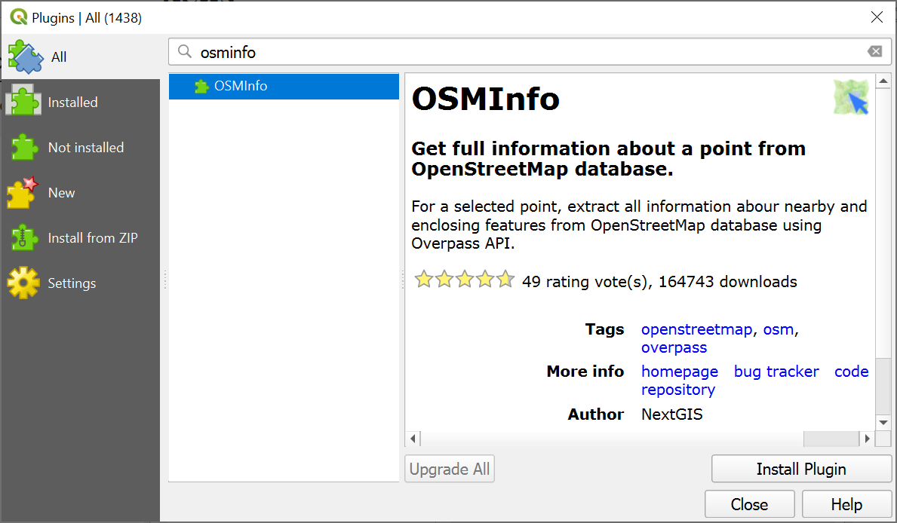
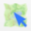
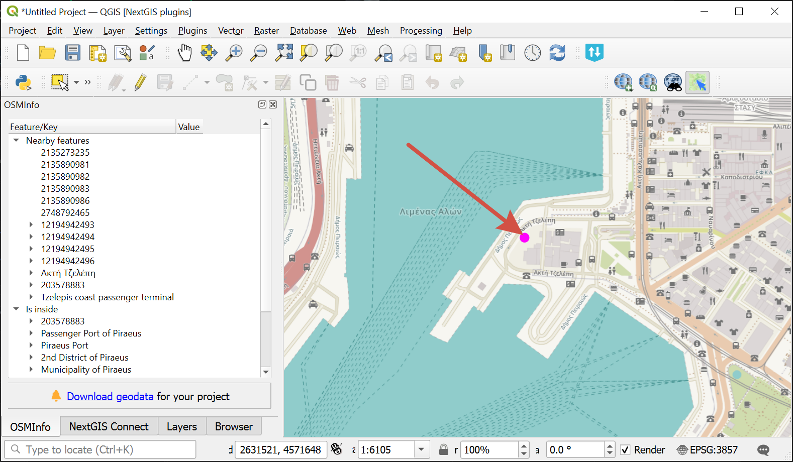
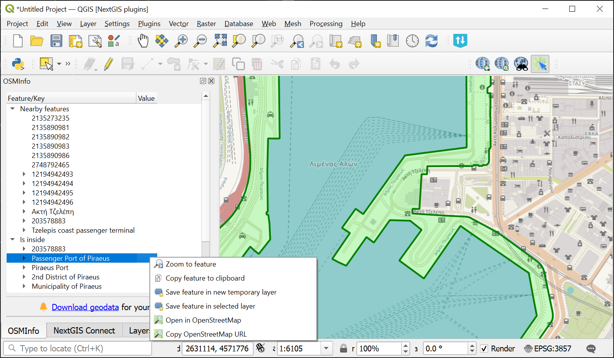
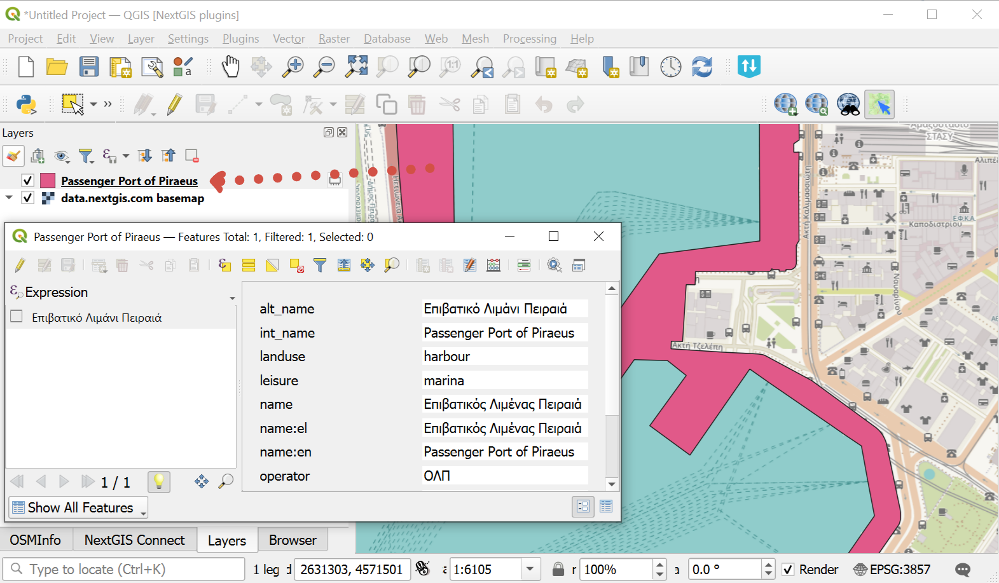

.. _osminfo:

OSMInfo
=========================

Plugin QGIS OSMInfo allows you to get all the information for any point without loading any additional layers.

No need to load the original data to check a house number or learn the name of a lake on a satellite image.

All OSM features are available, including:

* administrative boundaries;
* bodies of water and protected areas;
* road infrastructure;
* buildings, city infrastructure;
* points of interest.

.. _osminfo_install:

Installation
-------------

   
   Installing OSMInfo plugin

After installation the |button_osminfo| button will be added to the Web toolbar. Also the plugin is available in the Web menu of the Menu bar.

.. _osminfo_identify:

Feature identification
-----------------------

Activate |button_osminfo| tool and click on your point of interest on the map.

   
   Point information in OSMInfo window

The results are divided in two groups: nearby features and enclosing features.

The feature selected in the panel is highlighted in green.

.. _osminfo_context:

Feature context menu
-------------------------

Any feature can be saved to your device.

Right-click the feature in the search result list to open the context menu. From the context menu you can:

* Zoom to feature - sets the extent of the map by the selected feature;
* Save feature in new temporary layer;
* Save feature in selected layer;
* Copy to clipboard.

   
   Feature context menu

Saved feature keeps its data structure.

   
   Attribute values of the feature saved to a new temporary layer

See how to add a feature from OSM to a Web Map in our video:

.. raw:: html

   <iframe width="560" height="315" src="https://www.youtube.com/embed/uEzXfHyPjX4?si=1fgCNcyLfE8MQWRF" title="YouTube video player" frameborder="0" allow="accelerometer; autoplay; clipboard-write; encrypted-media; gyroscope; picture-in-picture; web-share" referrerpolicy="strict-origin-when-cross-origin" allowfullscreen></iframe>

Watch on `youtube <https://youtu.be/uEzXfHyPjX4?si=uZD1Y-4rpWv9a4Z1>`_.

.. _osminfo_settings:

Plugin settings
-----------------

You can configure radius of the search area for the nearby features and exclude nearby or enclosing features from search results. To modify plugin settings go to :menuselection:`Settings ‣ Options ‣ NextGIS ‣ OSMInfo`.

.. to do:: _static/osminfo_plugin_settings_en.png
   :name: osminfo_plugin_settings_pic
   :align: center
   :width: 18cm

   Plugin settings

In the plugin settings you can also select Overpass instance and enable debug messages.
